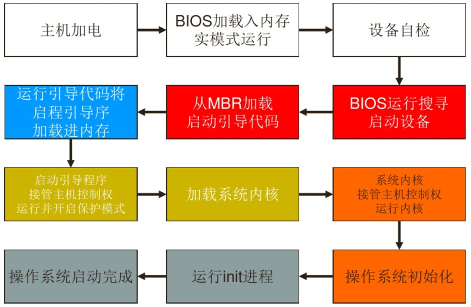

## 1 计算机的软硬件系统

### 1.1 硬件系统

### 1.2 冯·诺依曼结构

### 1.3 软件系统

## 2 操作系统的历史与发展

- 联机I/O（单道批处理系统）
  特征：自动性、顺序性、单道性  缺点：CPU和I/O设备忙闲不均，系统的利用率不高

- 多道批处理系统
  宏观同时，微观串行，适时等待。系统内存中同时驻留多个作业，且共享处理机和外设。优点：提高CPU利用率，提高内存和I/O设备利用率，提高了系统吞吐量  缺点：用户交互性差，作业平均周转时间长（批处理系统的缺点：用户交互性差）

- 分时系统
  把CPU运行时间分成很短的时间片，按时间片轮流把处理机分配给各联机用户作业使用。 适应用户需求：人机交互性、共享主机、方便用户上机；特征：多路性、独立性、交互性、及时性
- 实时系统
  系统能**及时**响应外部事件的处理，在**规定时间**内进行处理。应用：实时控制、实时信息处理。按任务执行是否周期性来划分：周期性实时任务、非周期性实时任务；按截止时间来划分：硬实时任务(HRT)-控制、软实时任务(SRT)-信息处理

>通常把具有分时、实时和多道批处理之中两种以上功能的操作系统称作通用操作系统。

总结：推动OS发展的主要动力有

1. 不断提高计算机资源利用率
2. 方便用户
3. 硬件的不断更新换代
4. 计算机体系结构的不断发展
5. 不断的提出的新的应用需求

## 3 操作系统的概念

### 3.1 四个层次

系统层次（是扩充裸机的第一层软件），系统组成（最重要最核心的系统软件），服务用户（人-机接口），资源管理（系统软硬件的资源管理者）

### 3.2 基本特征：并发、共享、虚拟、异步

#### 并发（Concurrence）

并发指两或多个事件在**同一时间间隔**内发生，而并行是指两或多个事件在**同一时刻**发生。在多道程序环境中，并发性是指在系统中存在多个程序同时运行。
进程（Process）：系统中能独立运行并作为资源分配的基本单位，由一组机器指令、数据和堆栈等组成，是一个能独立活动的实体。进程和并发是OS中最基本的概念，是OS运行的基础。

#### 共享（Sharing）

指系统中资源可供内存中多个并发执行的进程共同使用。分为互斥共享（一段时间只允许一个进程访问该资源）、同时共享（“同时”是在宏观上，微观上仍互斥，交替访问）。并发和共享是多用户多任务OS的两个最基本的特征。

#### 虚拟（Virtual）

通过某种技术把一个物理实体变为若干个逻辑上的对应物。分为时分复用、空分复用

>若 n 是某一物理设备所对应的虚拟的逻辑设备数，则虚拟设备的速度必然 <= 物理设备速度的 1/n。

#### 异步（Asynchronism）

在多道、单处理器环境中，程序运行进度不可预知：进程的执行是以“走走停停”的方式运行，也称不确定性。

## 4 操作系统的运行环境

### 4.1 硬件支持

PC系统引导过程

### 4.2 操作系统内核

内核是OS核心，是基于硬件的第一层软件扩充，提供OS最基本的功能，负责管理进程、内存、设备驱动程序、文件和网络系统，决定着系统的性能和稳定性。

- 支撑功能 中断处理、时钟管理、原语操作
- 资源管理功能 进程管理、存储器管理、设备管理

### 4.3 处理机的态

又称处理机的特权级，当前处理机正在执行哪类程序。
分为管态（特权态，系统态或核心态，CPU在管态下可以执行指令系统的全集，可使用全部系统资源，通常，OS在管态下运行）和目态（用户态，常态，只能执行非特权指令，只允许用户程序访问自己的存储区域）

>用户程序只能在目态下运行，如果用户程序在目态下执行特权指令，硬件将发生中断。

### 4.4 状态切换

状态位(Mode bit)：内核态（0），用户态（1）
当中断或错误出现，硬件切换至内核态

### 4.5 中断与异常

中断是指某个事件（例如电源掉电、定点加法溢出或I/O传输结束等）发生时，系统中止现行程序的运行、引出事件处理程序对该事件进行处理，处理完成后返回断点继续执行的过程。

中断处理流程：中断请求、保护现场、中断处理、恢复现场、返回

### 4.6 中断类型

#### 按中断功能分类

- 输入输出中断 I/O传输出错等

- 外中断 时钟中断、通信中断等
- 机器故障中断 电源故障等
- 程序性中断 用户态下用核态指令等非法中断
- 访管中断 对操作系统提出某种需求时所发生的中断

#### 按中断来源分类

- 中断：由处理机**外部事件**引起的中断

- 异常：由处理机**内部事件**引起的中断

## 5 操作系统的主要功能

1. **处理机管理**：进程控制（创建、撤销进程、状态转换）、进程同步（信号量机制）、进程通信（直接/间接通信）、调度（作业调度、进程调度）
2. **存储器管理**：内存分配和回收、内存保护、地址映射（逻辑→物理）、内存扩充（虚拟存储技术）
3. **设备管理**：缓冲管理、设备分配、设备处理（设备驱动程序）
4. **文件管理**：文件存储空间的管理、目录管理、文件的读/写管理和保护
5. **用户接口**
6. 现代OS新功能：系统安全、网络、多媒体等

## 6 操作系统的结构设计

### 设计的目标

- 有效性：提高系统资源利用率、系统吞吐量
- 方便性
- 可扩充性
- 开放性

## 7 系统调用

### 7.1 基本概念

系统调用概念：应用程序请求OS内核完成某功能时的一种过程调用；用户与内核的接口

### 7.2 与一般过程调用的区别

(1)运行在不同的系统状态
(2)状态的转换：目态、管态的转换
(3)返回问题
(4)嵌套调用

### 7.3 系统调用类型

- 进程控制类 创建和终止进程、获得和设置进程属性、等待某事件出现的系统调用
- 进程通信类 用于进程之间通信的系统调用
- 文件操纵类 打开和关闭文件、创建和删除文件、读写文件的系统调用
- 设备管理类 申请设备、释放设备、设备I/O重定向、获得和设置设备属性等系统调用
- 信息维护类 获得包括有关系统和文件的时间信息、OS版本、当前用户、空闲内存、磁盘等

## 问题

#### 1. 什么是微内核OS？

- 微内核操作系统就是将操作系统划分为两大部分，微内核和多个服务器。在操作系统中只留下一些最基本的功能，而将其他服务尽可能的从内核分离出去。
- 四个特点：足够小的内核、基于客户/服务器模式、应用机制和策略分离原理、采用面向对象技术。

#### 2. 多道程序设计的特征与优点？

多道程序设计是在计算机内存中同时存放几道相互独立的程序，使它们在管理程序的控制下，相互穿插的运行。两个或多个程序在计算机系统中同时处于开始到结束之间的状态。这就称为多道程序设计。

>多道程序设计运行的特征：
>1.**多道**：计算机主存中同时存放几道相互独立的程序。
>2.**宏观上并行**：同时进入系统的几道程序都处于运行过程中，即他们都开始运行，但都未运行完毕。
>3.**微观上串行**：微观上看，主存中的多道程序轮流或分时地占有处理机，交替运行。

>多道程序设计的优点：
>1.**提高CPU的利用率**。在多道程序环境下，多个程序共享计算机资源。当某个程序等待I/O操作时，CPU可以执行其他程序，大大提高CPU的利用率。
>2.**提高设备的利用率**。在多道环境程序下，多个程序共享系统的设备，大大提高了系统设备的利用率。
>3.**提高系统的吞吐量**。在多道程序环境下，减少了程序的等待时间，提高了系统的吞吐量。

单道批处理系统是在解决人机矛盾和CPU与I/O设备速度不匹配的矛盾中发展起来的。

在主机控制下进行的I/O操作称为**联机I/O**操作。

在分时和批处理系统结合的操作系统中引入了“前台”和“后台”作业的概念，其目的是**改善系统能力，提高处理能力**。