## 1 前驱图和程序执行

### 1.1 前驱图

有向无循环图

### 1.2 程序执行

#### 单道系统的顺序程序执行的特征

- 运行过程的顺序性
- 运行环境的封闭性（独占资源，不受影响）
- 运行结果的可再现性：初始状态相同，结果相同

#### 多道系统-程序的并发执行的特征

- 运行环境失去封闭性：共享资源引起
- 运行过程间断性：并发程序之间形成了相互制约的关系“执行-暂停-执行”
- 运行结果不可再现性

## 2 进程的描述

引入进程的原因：为了程序的并发执行，并且对并发执行的程序加以描述和控制。

### 2.1 进程的定义

进程是程序的一个运行过程，是系统进行**资源分配和调度**的一个独立单位。

### 2.2 进程的特性

- 动态性：由创建而产生，由调度而执行，由得不到资源而阻塞，由撤消而消亡。是进程最基本特性。
- 并发性：只有建立了进程，才能并发执行。
- 独立性：独立运行，独立获得资源，独立接受调度。
- 异步性：间断性，不可预知的速度向前推进。

### 2.3 程序和进程的联系与区别

| 程序                                 | 进程                                               |
| ------------------------------------ | -------------------------------------------------- |
| 一组有序指令的集合                   | 由程序、数据和PCB构成                              |
| 静态性，存放在介质中，没有运动的含义 | 动态性，是进程实体的一次执行过程，有一定的生命周期 |
| 不可以并发执行                       | 并发执行                                           |
| 程序不是竞争资源的基本单位           | 进程是竞争资源的基本单位（运行，分配资源）         |

>进程和程序不是一一对应的，一个程序可以对应多个进程，一个进程可以执行一个或几个程序！

### 2.4 进程的三种基本状态

- 就绪态(ready)
- 执行态(running)：进程占据并运行在CPU上
- 阻塞态(blocked)：也称等待态(wait)，引起原因：I/O请求，申请缓冲空间等

#### 2.4.1  进程三状态转换图（重要）

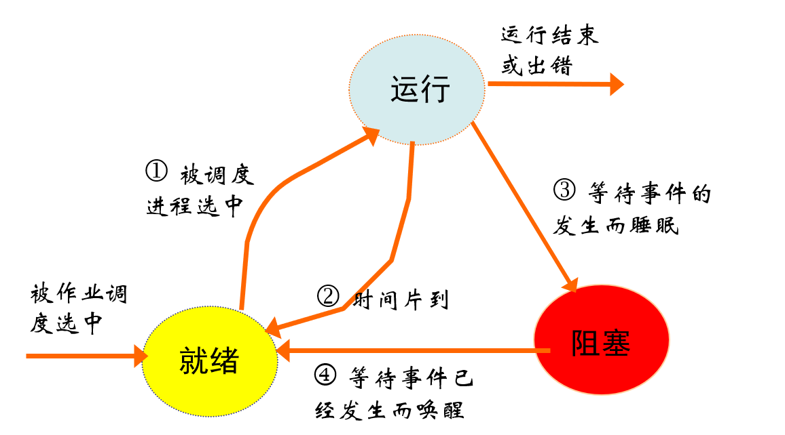

#### 2.4.2 进程五状态转换图

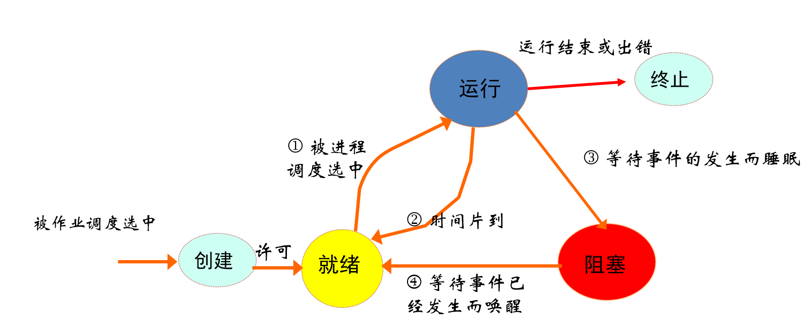

### 2.6 进程的结构

 进程=程序+数据+PCB

#### 2.6.1 PCB

PCB：进程控制块(process control block)是进程的一部分，是OS中最重要的记录型数据结构，**是进程存在的唯一标志**，**常驻内存**。PCB描述进程与其他进程、系统资源的关系以及进程在各个不同时期的状态。

PCB记录了OS所需的、用于描述进程情况及控制进程运行所需的全部信息，使一个在多道程序环境下不能独立运行的程序成为一个能与其他进程并发执行的进程。
PCB结构类似于结构体。

#### 2.6.2 PCB的作用

1. 作为独立运行基本单元的标志
2. 能实现间断性运行方式
3. 提供进程管理所需要的信息
4. 提供进程调度所需要的信息
5. 实现与其他进程的同步与通信

#### 2.6.3 PCB的组织方式

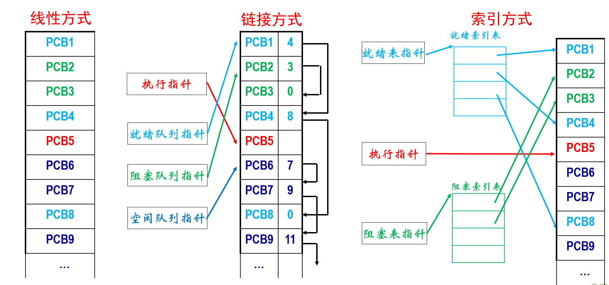

- 线性方式
- 链接方式（执行指针、就绪队列指针、阻塞队列指针、空闲队列指针）
- 索引方式（就绪索引表(就绪表指针)、阻塞索引表(阻塞表指针)、执行指针）

>1. 进程和程序的一个本质区别是：前者是动态的，而后者为静态的。
>2. 进程所请求的一次打印输出结束后，将使进程状态从(D)
>   &emsp;A.运行态变为就绪态
>   &emsp;B.运行态变为等待态
>   &emsp;C.就绪态变为运行态
>   &emsp;D.等待态变为就绪态
>3. 下列进程状态的转换中，不正确的是(B)
>   &emsp;A.运行态→就绪态
>   &emsp;B.就绪态→等待态
>   &emsp;C.就绪态→运行态
>   &emsp;D.阻塞态→就绪态

## 3 进程控制

### 3.1 概述

进程控制是进程管理最基本的功能，一般由OS内核中的原语实现；
进程控制包括：进程创建、进程终止、进程阻塞与唤醒、进程挂起与激活

### 3.2 进程创建

父进程(parent process)：创建进程的进程
子进程(progeny process)：被创建的进程

父进程创建子进程，子进程可继承父资源，撤销时应归还给父进程，父的撤销会撤销所有子进程。

引起进程创建的事件：用户登录、作业调度、提供服务、应用请求

进程创建过程：申请空白PCB→分配所需资源→初始化PCB→插入就绪队列

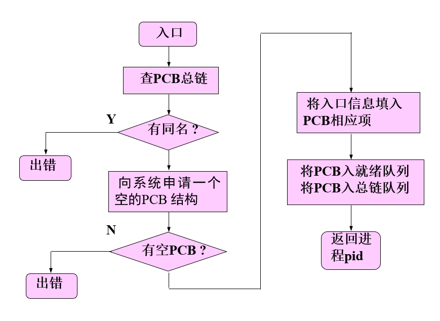

### 3.3 进程终止

引起进程终止的事件：正常结束、异常结束、外界干预

### 3.4 进程阻塞(等待)

引起进程阻塞的事件：

- 向系统请求共享资源失败
- 等待某种操作的完成
- 新数据尚未到达
- 等待新任务的到达

进程阻塞原语的形式：当进程需要等待某一事件完成时，它可以调用等待原语挂起自己。

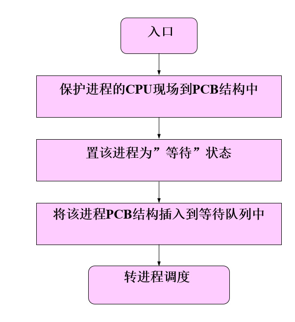

`block(chan)`:参数chan表示进程等待的原因。

### 3.5 进程唤醒

进程唤醒原语的形式：当处于等待状态的进程所期待的事件来到时，由发现者进程使用唤醒原语唤醒它。
`wakeup(chan)`：参数chan表示进程等待的原因。

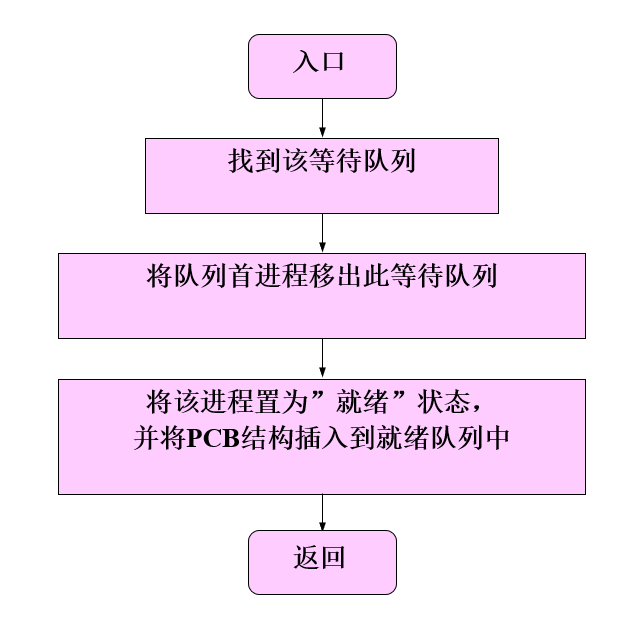

### 3.6 挂起的引入

由于进程的不断创建，主存资源已不能满足所有进程运行的要求。OS将某些进程**挂起**，放到**磁盘对换区**，暂时不参加调度，以平衡系统负载。

**挂起**(Suspend)：把一个进程从内存转到外存，有以下三种情况：

- **阻塞→阻塞挂起**：当**就绪进程**要求更多内存资源时，将阻塞进程移至外存，以提交新进程或运行就绪进程。
- **就绪→就绪挂起**：当有**高优先级阻塞**（系统认为会很快就绪的）进程和低优先级就绪进程时，系统会将低优先级就绪进程移至外存。
- **运行→就绪挂起**：对**抢占式**系统，当有**高优先级**阻塞挂起进程因事件发生而进入就绪挂起时，系统可能会把运行进程转到就绪挂起状态。

**激活**(Activate)：把一个进程从外存转到内存，可能有以下几种情况：

- **就绪挂起→就绪**：**没有就绪进程**，或**挂起就绪进程优先级高**于就绪进程时，将就绪挂起进程移至内存。
- **阻塞挂起→阻塞**：当一个进程**释放足够内存**时，系统会把一个高优先级阻塞挂起（系统认为会很快出现所等待的事件）进程移至内存等待。

>注意：阻塞、挂起一般由OS实现，而唤醒与激活可由用户干预。

### 3.7 进程七状态转换图

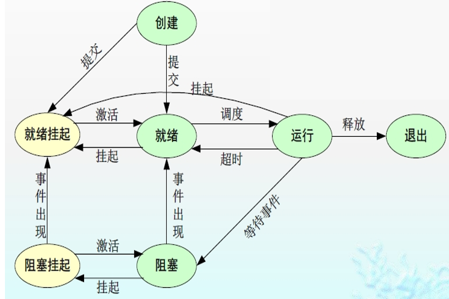

## 4 进程通信

### 4.1 概念

**进程通信**：进程间的信息交换。
**低级进程通信**：进程的同步和互斥，效率低（每次只能操作一个消息），通信对用户不透明（程序员干预）。
**高级进程通信**：效率高（可传递大量信息）、对用户透明

### 4.2 进程通信类型

#### 4.2.1 共享存储器系统(shared-memory system)

- 基于**共享数据结构**的通信方式（少量传送数据，效率低，属于低级进程通信）
- 基于**共享存储区**的通信方式（大量传送数据，效率高，属于高级进程通信）。基于共享内存的通信方式，向系统申请一个或多个分区，获得分区后即可读/写。特点：高效、适于大量传输。

#### 4.2.2 消息传递系统

消息传递系统是当前应用最广的一种进程间的通信机制。信息单位是消息Message（报文）。

**通信方式**：

- 直接消息传递通信
  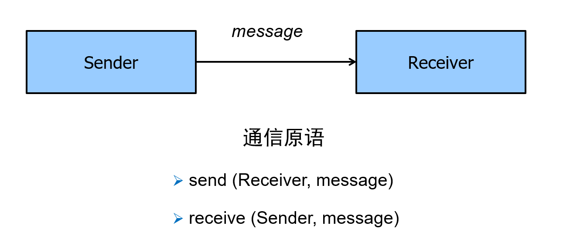

- 信箱通信（间接通信）
  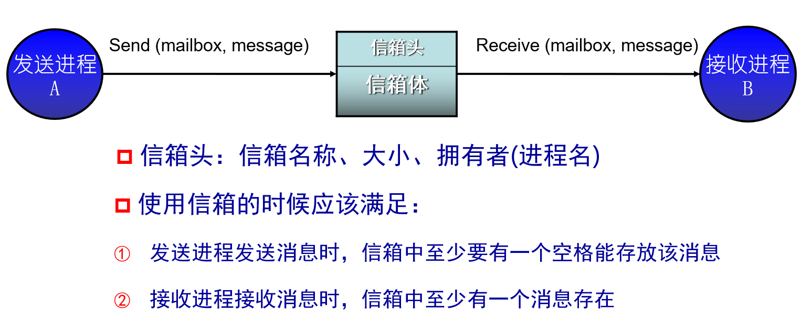

#### 4.2.3 管道通信系统

管道（pipe）：用于连接一个读进程和一个写进程以实现它们之间通信的一个**共享文件**，又名pipe文件。
管道机制的协调能力：对方是否存在、互斥、同步

#### 4.2.4 客户机-服务器系统

套接字（Socket）
远程过程调用（RPC）
远程方法调用（RMI，Java）

>Linux进程通信方式：管道、信号、信号量、共享内存、消息队列、套接字。

## 5 线程的基本概念

引入进程的目的：使多个程序并发执行，提高资源利用率及系统吞吐量
引入线程的目的：减少程序在并发执行时所付出的时空开销，使OS具有更好的并发性，适用于SMP结构的计算机系统。

>对称多处理（Symmetrical Multi-Processing）技术，是指在一个计算机上汇集了一组多处理器（多CPU），各CPU之间共享内存子系统以及总线结构。

### 5.1 线程的定义

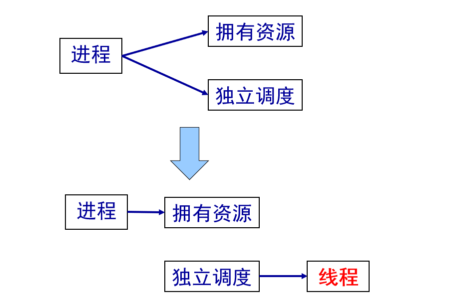

线程是进程内的一个相对独立的可调度的执行单元，一个进程可包含多个线程，它们可并发执行，共享进程的全部资源。

### 5.2 线程的属性

（1）轻型实体
（2）独立调度和分派的基本单位
（3）可并发实体
（4）共享进程资源

### 5.3 线程控制块

线程控制块TCB(thread control block)组成：线程标识符、一组寄存器、线程运行状态、优先级、线程专有存储区、信号屏蔽、堆栈指针
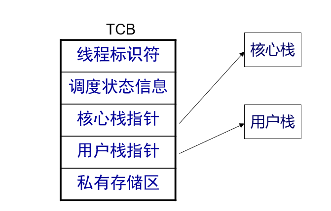

### 5.4 进程与线程比较

| &emsp;       | 进程                     | 线程                       |
| ------------ | ------------------------ | -------------------------- |
| 调度性       | **资源拥有**的基本单位   | **调度和分派**的基本单位   |
| 并发性       | 有并发性                 | 更好的并发性               |
| 拥有资源     | 拥有系统资源             | 只有少量必要的寄存器等资源 |
| 独立性       | 高                       | 低                         |
| 系统开销     | 大                       | 小                         |
| 支持多处理机 | 一个进程运行在一个处理机 | 多线程分配到多个处理机上   |

### 5.5 多线程中的进程

引入线程后，进程作为资源分配的单位，可包括多个线程，但不再是一个可执行的实体。

### 5.4 线程的状态变迁

线程状态：执行态、就绪态、阻塞态；线程状态转换与进程状态转换一样。

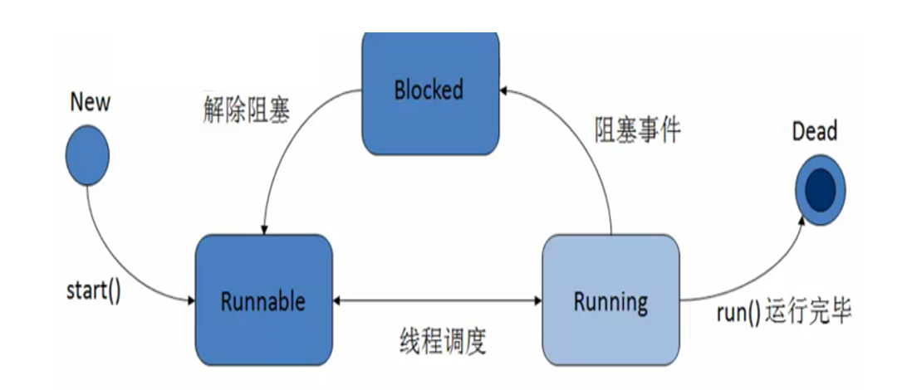

## 6 线程的实现

线程的类型：KST、ULT、组合方式

### 6.1 内核支持线程KST(kernel support threads)

需要内核的参与，由内核完成线程的调度。其依赖于操作系统核心，由内核的内部需求进行创建和撤销。

#### KST优点

线程切换不需要转换到内核空间；调度算法可以是进程专用的
线程的实现与OS平台无关

#### KST缺点

系统调用的阻塞问题
多线程应用不能利用多处理机进行多重处理的优点。

### 6.2 用户级线程ULT(User Level threads)

指不需要内核支持而在用户程序中实现的线程，其不依赖于操作系统核心，应用进程利用线程库提供创建、同步、调度和管理线程的函数来控制用户线程。

#### ULT优点

在多处理机系统中，内核可同时调度同一进程的多个线程；
如一个线程阻塞了，内核可调度其他线程（同一或其他进程）；
线程的切换比较快，开销小；
内核本身可采用多线程技术，提高执行速度和效率。

#### ULT缺点

对用户线程切换，开销较大

### 组合方式

组合方式结合了内核支持线程 (KST) 和用户级线程 (ULT) 的优点，试图克服各自的缺点。它通常采用一种多对多的映射关系：多个用户级线程映射到多个内核级线程。 这种模型中，用户空间的线程库负责管理用户级线程，而内核负责管理内核级线程。 用户级线程库可以将多个用户级线程映射到可用的内核级线程上，从而实现更高的并发性和效率。

#### 组合方式的优点
**高并发性:** 可以充分利用多处理器系统的优势，多个内核级线程可以在多个处理器上并行执行。

**高效的线程切换:** 用户级线程的切换在用户空间完成，速度快，开销小。
避免阻塞: 如果一个用户级线程阻塞了系统调用，其他的用户级线程仍然可以继续执行，因为它们可能映射到不同的内核级线程上。

**可扩展性:** 可以根据需要创建任意数量的用户级线程，而无需受限于内核级线程的数量。

#### 组合方式的缺点
**复杂性: **实现组合方式比单纯的KST或ULT更加复杂，需要设计和实现一个高效的用户级线程库和内核级线程管理机制。

**性能开销:** 虽然用户级线程切换快，但用户级线程和内核级线程之间的映射和调度仍然会带来一定的性能开销。

**实现难度:** 需要对操作系统内核和用户级线程库都有深入的理解，才能正确地实现和管理这种混合模型。