## 1 处理机调度概述

处理机调度问题就是指对处理机如何分配的问题

### 1.1 调度层次

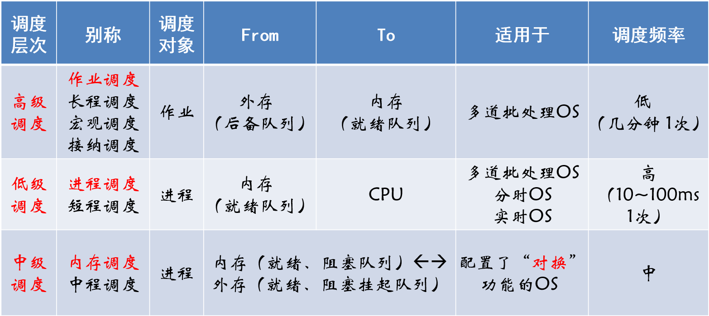

### 1.2 作业

**作业**(Job)=程序+数据+作业说明书

**作业步**(Job step)：作业加工的步骤

**作业控制块JCB**(Job control block)：作业标识、用户名称、作业类型、作业状态、调度信息、资源需求等

>为管理和调度作业，在多道批处理系统中，为每个作业设置了一个作业控制块JCB，它是作业在系统中存在的标志，其中保存了系统对作业进行管理和调度所需的全部信息。通常在JCB中包含的内容有：作业标识、用户名称、用户账号、作业类型（CPU繁忙型、I/O繁忙型、批量型、终端型）、作业状态、调度信息（优先级、作业运行时间）、资源需求（预计运行时间、要求内存大小等）、资源使用情况等。

**作业三阶段/三状态**：收容/后备、运行、完成

作业调度又称为接纳调度(Admission Scheduling)，接纳度表示接纳多少个作业，调度算法决定接纳哪些作业。

### 1.3 进程调度

#### 1.3.1 进程的调度任务

**保护**处理机的现场信息、按某种算法**选取**进程、把处理器**分配**给进程。

#### 1.3.2 进程调度机制

- 排队器：用于将就绪进程插入相应的就绪队列
- 分派器：用于将选定的进程移出就绪队列
- 上下文切换器：进行新旧进程之间的上下文切换

#### 1.3.3 进程调度方式

- **抢占式**：允许调度程序根据某种原则，去**暂停某个正在执行的进程**，将已分配给该进程的**处理机重新分配**给另一进程。（现代OS广泛采用）
  （1）**优先权原则**：允许优先权高的新进程抢占当前进程的CPU
  （2）**短作业优先原则**：短作业可以抢占当前较长作业的处理机
  （3）**时间片原则**：各进程按时间片运行，当一个时间片用完后，重新进行调度。
- **非抢占式**：一旦把处理机分配给某进程后，便让该进程一直执行，直至该进程完成或发生某事件而被阻塞时，才再把处理机分配给其他进程，**决不允许某进程抢占已经分配出去的处理机**。

#### 1.3.4 调度队列模型

单级调度队列模型：进程调度

二级调度队列模型：进程调度+作业调度

三级调度队列模型：进程调度+作业调度+内存调度

#### 1.3.5 对调度算法的分析

处理机调度算法的共同目标：资源利用率（CPU利用率=CPU有效工作时间 / (CPU有效工作时间+CPU空闲时间)）、公平性、平衡性、策略强制执行

**批处理系统的目标**：平均周转时间短（周转时间、平均周转时间、带权周转时间、平均带权周转时间）、系统吞吐率要高

>周转时间T~i~：是指作业提交给系统开始，到作业完成为止的这段时间间隔。即：T~i~ = 完成时间 - 提交时间
>平均周转时间：$T=\frac{1}{n}{}\sum_{i=1}^{n}T_i$
>带权周转时间：$W_i=T_i/T_s$  (周转时间/运行时间)
>平均带权周转时间：$W=\frac{1}{n}\sum_{i=1}^nW_i=\frac{1}{n}\sum_{i=1}^{n}\frac{T_i}{T_s}$

分时系统的目标：响应时间快、均衡性

实时系统的目标：保证截止时间、保证

## 2 调度算法

### 2.1 概述

**作业调度算法**：先来先服务调度算法(FCFS)、短作业优先调度算法(SJF)、优先权调度算法(PR)、高响应比优先调度算法(HRRN)

**进程调度算法**：先来先服务调度算法(FCFS)、短作业优先调度算法(SJF)、优先权调度算法(PR)、时间片轮转调度算法(RR)、多级队列调度算法、多级反馈队列调度算法、基于公平原则的调度算法

### 2.2 先来先服务调度算法FCFS

是最简单的一种调度算法，即可用于作业调度，也可以用于进程调度。

算法特征：

- 按照作业提交/进程就绪的**先后次序**，分派CPU；
- 当前作业占用CPU，直到执行完或阻塞才出让CPU；
- 在作业或进程唤醒后（如I/O完成），并不立即恢复执行，通常等到当前作业或进程出让CPU。
- 最简单的算法，有利于长作业和CPU繁忙的作业，很少单独使用。常作为一种辅助调度算法与其他算法配合使用较多。

### 2.3 最短作业优先SJF

按作业估计**运行时间长短**来组织后备作业调度，优先分派处理机。但通常后来的短作业会抢占正在执行的作业。

- 优点：比FCFS降低了**周转时间**，缩短作业的等待时间；提高系统的**吞吐量**

- 缺点：**对长作业不利**；未能考虑作业的**紧迫程度**；**难以准确**估计作业的执行时间。

### 2.4 优先级调度算法PR

基于作业/进程的**紧迫程度**，由外部赋予作业相应的优先级，调度算法根据优先级进行调度。每个进程都有一个优先数（整数），小的优先数具有高优先级。是目前主流的操作系统调度算法。

优先级类型分为两种：
**静态优先级**：创建进程时确定优先级，在进程的整个运行期间保持不变，简单易行，系统开销小。不够精确，可能会出现优先级低的进程长期没有被调度的情况。
**动态优先级**：创建进程时先赋予优先级，随**进程推进或等待时间**增加而改变。

>高响应比优先调度算法(HRRN)是一种优先级调度算法，用于作业调度。

### 2.5 高响应比优先调度算法HRRN

这里的优先权是响应比R~p~

$R_p=\frac{等待时间+要求服务时间}{要求服务时间}=\frac{响应时间}{要求服务时间}=1+\frac{等待时间}{要求服务时间}$

HRRN是FCFS和SJF两种算法的一种折中算法，比较好的满足了短作业用户和长作业用户的要求。但吞吐量比SJF小，计算 R~p~ 会增加系统开销。

### 作业调度算法实例1

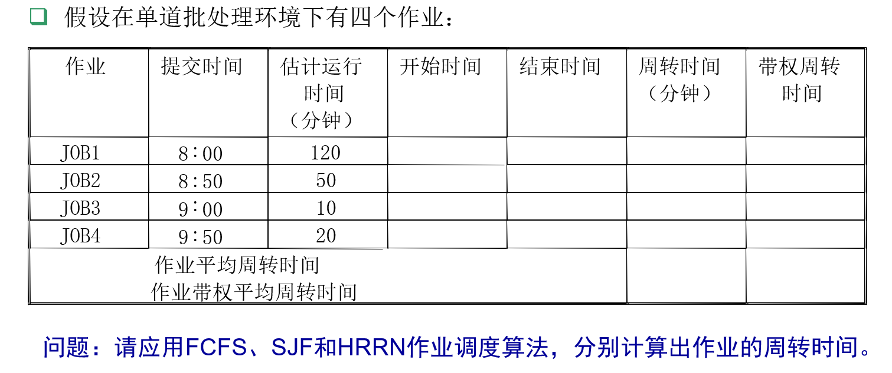

FCFS调度算法结果:
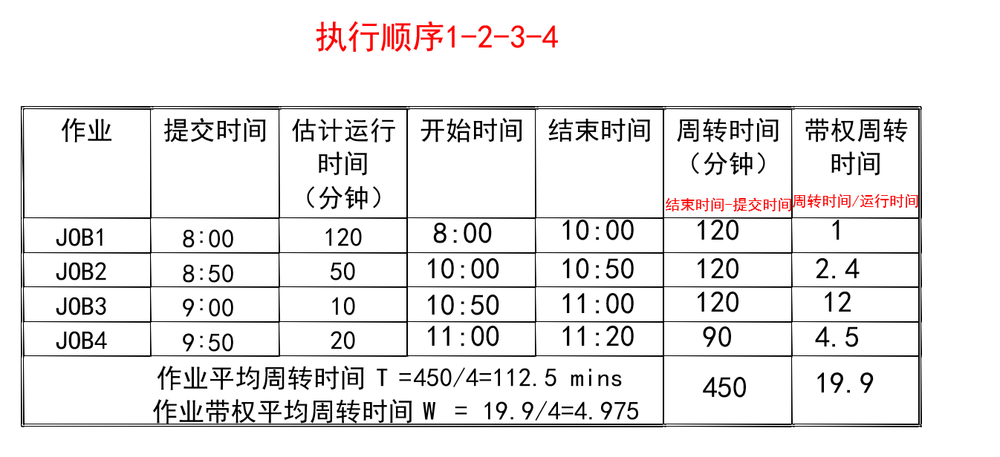

SJF调度算法结果：
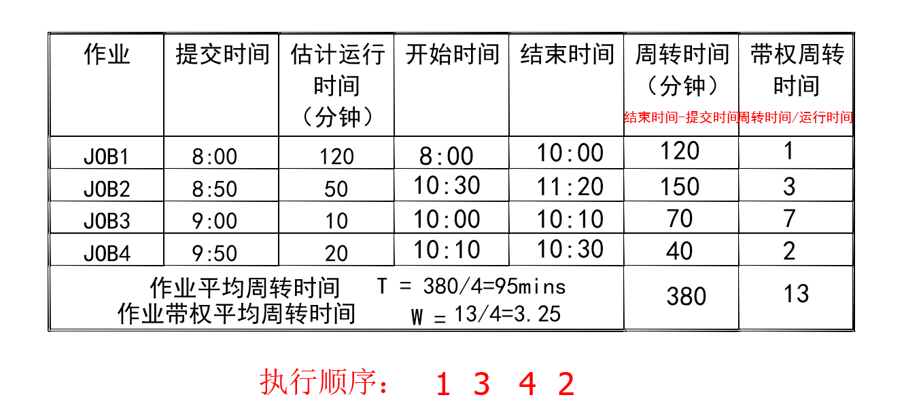

HRRN调度算法计算结果：
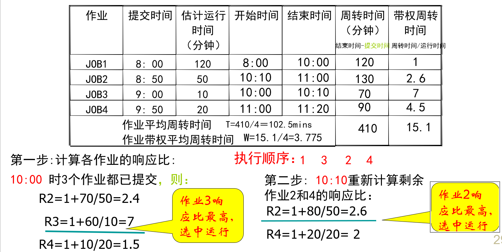

三种算法的比较：

| 算法 | 平均周转时间 | 带权平均周转时间 |
| ---- | ------------ | ---------------- |
| FCFS | 112.5        | 4.975            |
| SJF  | 95           | 3.25             |
| HRRN | 102.5        | 3.775            |

分析：SJF算法平均周转时间最短，但可能使长时间长作业等待；HRRN算法，既考虑时间长短，又考虑等待时间，在长、短作业之间进行了适当的均衡，其平均周转时间介于FCFS和SJF之间。

### 作业调度算法实例2

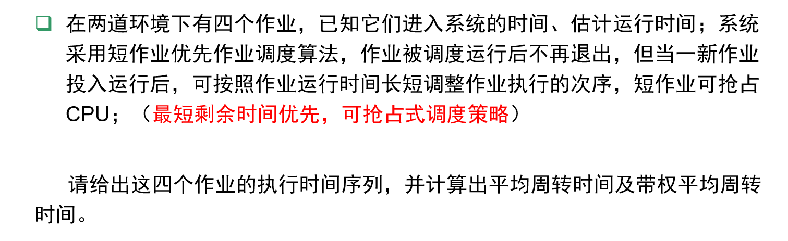

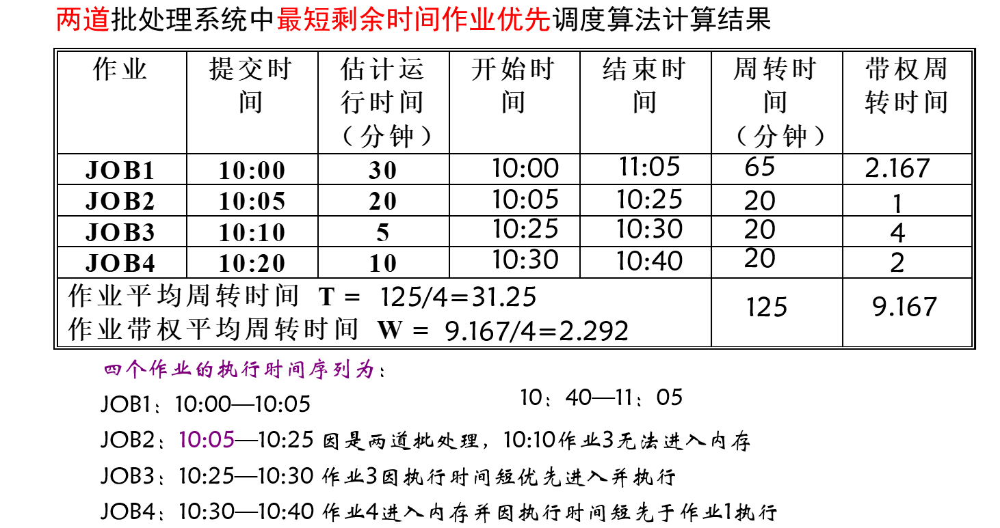

### 2.6 时间片轮转调度算法

把CPU划分成若干时间片，并且按顺序赋给就绪队列中的每一个进程，进程**轮流占用CPU**。通过时间片轮转，提高进程并发性和响应时间特性，从而提高资源利用率。

时间片选择问题：固定时间片、可变时间片

简单循环轮转调度算法：时间片：$q=t/n$ ( t为响应时间，n为系统进程数目)

时间片大小从几个ms~几百ms

时间片轮转调度算法实例（时间片=1）

时间片轮转调度算法实例（时间片=5）
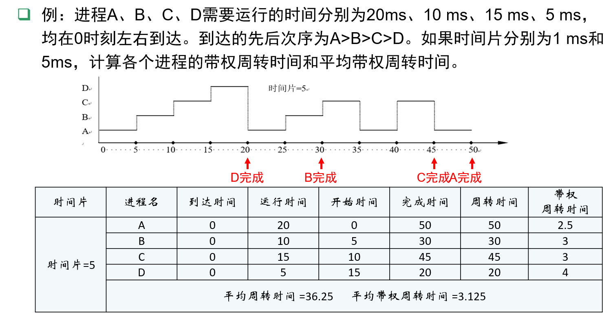

### 2.7 多级反馈队列调度算法

多级反馈队列算法是**时间片轮转算法**和**优先级算法**的总和和发展。

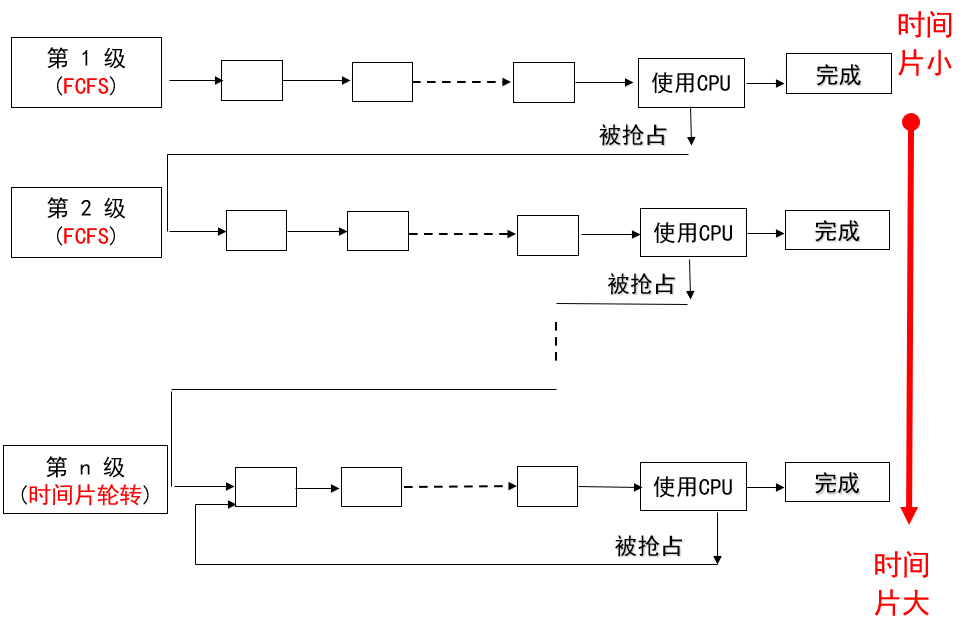

设置多个就绪队列：每个就绪队列分配给不同时间片，优先级高的为第一级队列，时间片最小，随队列级别的降低，时间片加大；当第一级队列空时，就调度第二级队列，如此类推；各个队列按照先进先出调度算法，最后一级采用时间片轮转。一个新进程就绪后进入第一级队列，进程由于等待而放弃CPU后，进入等待队列，一旦等待的事件发生，则回到原来的就绪队列；当时间片到后，进程放弃CPU，进入下一级队列；当有一个优先级更高的进程就绪时，可以抢占CPU，被抢占的进程回到原来一级的就绪队列末尾。

优点：**照顾短进程、照顾I/O型进程、不必估计进程的执行时间**

## 3 实时调度

### 3.1 实时调度算法分类

根据实时任务性质：HRT调度算法、SRT调度算法

根据调度方式：非抢占式调度算法、抢占式调度算法

### 3.2 调度算法

#### 3.2.1 非抢占式

##### 非抢占式轮转调度算法

响应时间：数秒至数十秒
要求不太严格的实时系统

##### 非抢占式优先调度算法

响应时间：数秒至数百毫秒
对时间有一定要求的实时系统

#### 3.2.2 抢占式

##### 基于时钟中断的抢占式优先级调度

响应时间：几十毫秒至几毫秒
可用于大多数实时系统

##### 立即抢占的优先级调度

响应时间：几毫秒至几百微秒
有严格时间要求的实时系统

### 3.3 最早截止时间优先（EDF）调度算法

EDF根据任务的截止时间确定优先级，截止时间越早，优先级越高；既可用于抢占式调度（周期实时任务），也可用于非抢占式调度（用于非周期实时任务）。

### 3.4 最低松弛度优先LLF算法

根据任务的紧急程度（松弛度）确定任务优先级，紧急程度越高（松弛度越低），优先级越高；松弛度=必须完成时间-其本身的运行时间-当前时间

主要用在抢占式调度方式中。

### 优先级倒置现象

采用优先级调度和抢占方式，可能产生优先级倒置。现象：高优先级进程被低优先级进程延迟或阻塞。

解决办法：制定一些规定，如规定低优先级进程执行后，其所占用的处理机不允许被抢占；建立动态优先级继承。

## 4 Linux进程调度

默认调度算法：完全公平调度CFS算法。

基于调度器类：允许不同的可动态添加的调度算法并存，每个类都有一个特定的优先级。

- 总调度器：根据调度器类的优先顺序，依次对调度器类中的进程进行调度。
- 调度器类：使用所选的调度器类算法（调度策略）进行内部的调度。
- 调度器类的默认优先级顺序为：Stop_Task > Real_Time > Fair > Idle_Task

普通进程调度：

- 采用SCHED_NORMAL调度策略
- 分配优先级、挑选进程并允许、计算使其运行多久
- CPU运行时间与友好值（-20~+19）有关，数值越低优先级越高。

实时进程调度：

- 实时调度的进程比普通进程具有更高的优先级。
- SCHED_FIFO：进程若处于可执行的状态，就会一直执行，直到它自己被阻塞或者主动放弃CPU。
- SCHED_RR：与SCHED_FIFO大致相同，只是进程在耗尽其时间片后，不能再执行，而是需要接受CPU的调度。

## 5 死锁概述

引起死锁的原因：

- 竞争不可抢占资源引起死锁
- 竞争可消耗资源引起死锁
- 进程推进不当引起的死锁

### 5.1 死锁的定义

一组并发进程彼此**无休止地等待**对方占用的资源，从而造成不能继续向前推进的状态，称为进程**死锁(Deadlock)**，这一组进程就称为**死锁进程**。

分析：

- 参与死锁的进程至少有两个，即两个以上的进程才会出现死锁
- 参与死锁的进程至少有两个已经占有资源
- 参与死锁的所有进程都在等待资源
- 参与死锁的进程是当前系统中所有进程的子集

注：死锁发生，会浪费大量资源，甚至导致系统崩溃。

### 5.2 产生死锁的四个必要条件

- 互斥条件
- 不可抢占(不可剥夺)条件
- 请求和保持条件
- 循环等待条件

说明：上述四个条件只要有一个不满足，就可排除死锁。但必要条件成立，系统未必一定发生死锁。

### 5.3 处理死锁的基本方法

- 确保系统永远不会进入死锁状态（死锁预防、死锁避免）
- 允许系统进入死锁状态，然后恢复系统（死锁检测、死锁恢复）
- 忽略这个问题，假装不会出现死锁，这个方法被大部分OS采用。

#### 5.3.1 预防死锁

破坏死锁的四个必要条件中的一个或几个。

1. 互斥：互斥条件是共享资源必须的，不仅不能改变，还应加以保证
2. 请求和保持：必须保证进程申请资源的时候没有占有其他资源。

- 要求进程在执行前一次性申请全部的资源，只有没有占有资源时才可以分配资源
- 资源利用率低，可能出现饥饿
- 改进：进程只获得运行初期所需的资源后，便开始运行；其后在运行过程中逐步释放已分配的且用毕的全部资源，然后再请求新资源。

3. 非抢占：如果一个进程的申请没有实现，它要释放所有占有的资源；先占的资源放入进程等待资源列表中；进程在重新得到旧的资源的时候可以重新开始。
4. 循环等待：对所有的资源类型进行线性排序，并赋予不同的序号，要求进程按照递增顺序申请资源。

- 如何规定每种资源的序号是十分重要的
- 限制新类型设备的增加
- 作业使用资源的顺序与系统规定的顺序不同
- 限制用户简单、自主的编程

#### 5.3.2 避免死锁

在资源动态分配时，防止系统进入不安全状态。

方法：
设一个简单而有效的模型，要求每一个进程**声明它所需要的资源的最大数**；**死锁避免算法**动态检查资源分配状态以确保不会出现循环等待的情况；资源分配状态定义为可用的与**已分配的资源数**，和**进程所需的最大资源量**。

##### 系统的安全状态

在“避免死锁”的方法中的判断条件。
安全状态：按某种顺序所有进程都能达到获得最大资源而顺序完成的序列为**安全序列**，能找到安全序列的状态为**安全状态**。
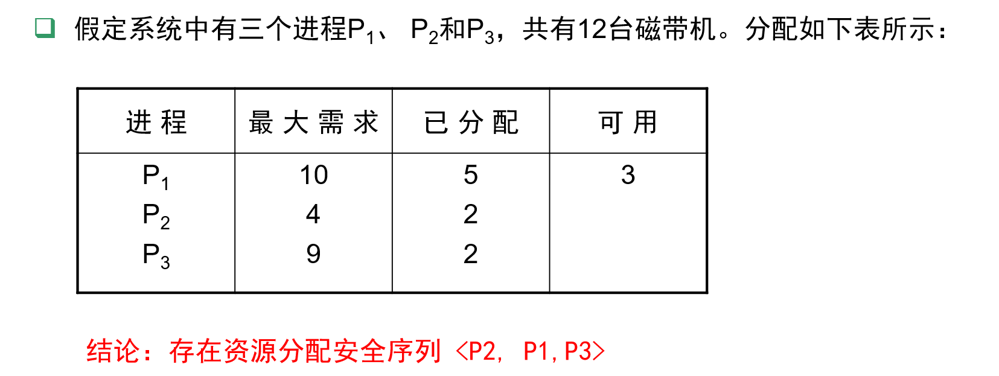

##### 著名避免死锁算法-银行家算法

由Dijkstra于1965年首先提出并解决。
问题：如何将其总数一定的现金，安全地借给若干个顾客，使这些顾客既能满足对资金的要求，又能完成其交易，也使银行家可以收回自己的全部现金而不至于破产。这类似于OS中的资源分配问题：在若干个并发进程间分配单位数量一定的某共享资源。

1. 单资源银行家算法
   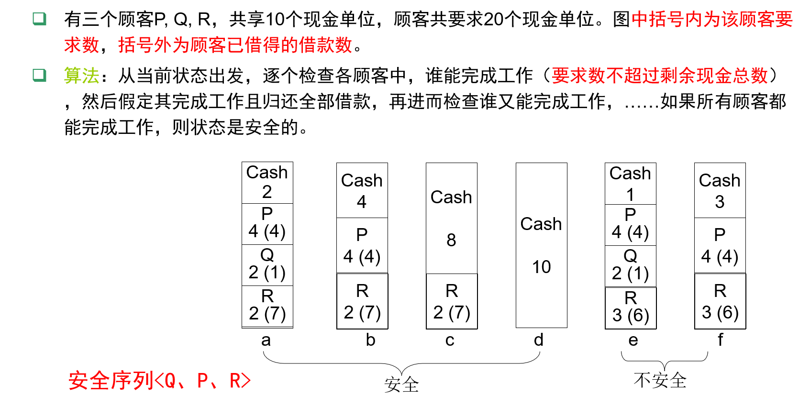

2. 多资源银行家算法数据结构
   假定系统中有n个进程P1，...，Pn，m类资源R1，...，Rm

- 系统资源向量R=(R1，...，Rm)表示系统中拥有每类资源的数量；

- 可用资源向量Available=（V1，V2，…，Vm）表示系统中尚未分给进程的每类资源的数量；
- 最大需求矩阵Max是一个n×m矩阵，表示系统中n个进程对m类资源的最大需求。
- 需求矩阵Need，是一个n×m矩阵，表示每一个进程还需要的各类资源数目。
- 资源分配矩阵Allocate，是一个n×m矩阵，A[i][j]表示进程i已分得j类资源的数量。

##### 实例

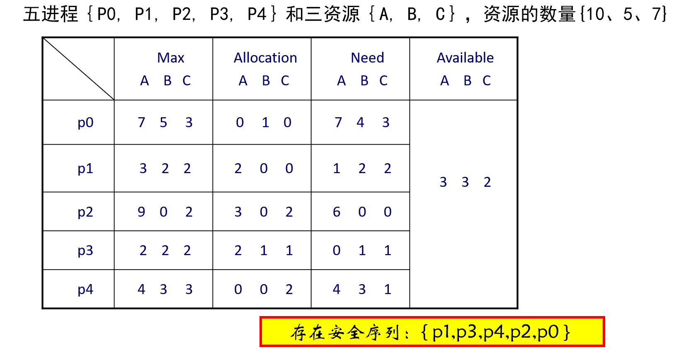

#### 5.3.3 死锁的检测与解除

**检测死锁**：事先不采取任何措施，允许死锁发生，但及时检测死锁发生。

**解除死锁**：检测到死锁发生时，采取相应措施，将进程从死锁状态中解脱出来。
死锁的预防策略是非常保守的，通过**限制访问资源和在进程上强加约束**来解决死锁问题。

死锁检测（deadlock detection)策略则完全相反，不限制资源访问或约束进程行为，OS周期性地执行一个算法检测死锁发生的四个必要条件。即：允许死锁发生，OS不断监视系统进展情况，判断并以最小的代价恢复操作系统运行。

##### 资源分配图

(1)节点

- 资源类：用方框表示（资源实例：用方框中的黑圆点表示）
- 进程：用圆圈中加进程名表示

(2)边

- 分配边：资源实例→进程
- 申请边：进程→资源类
  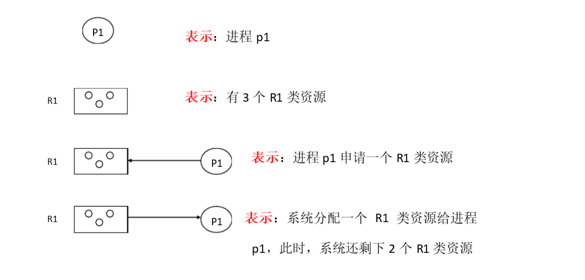

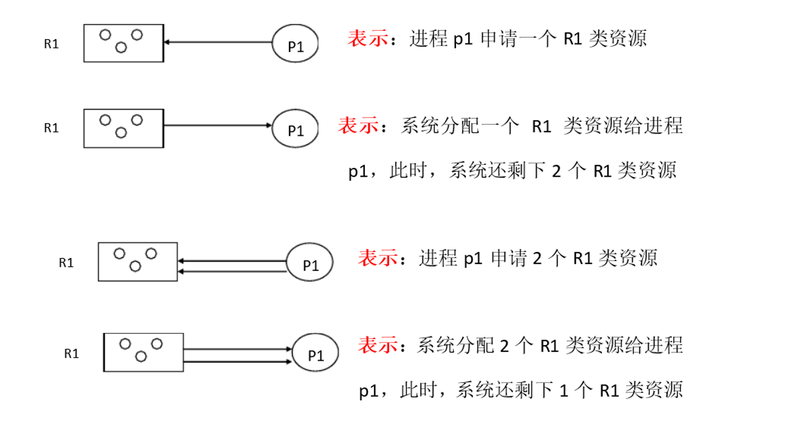

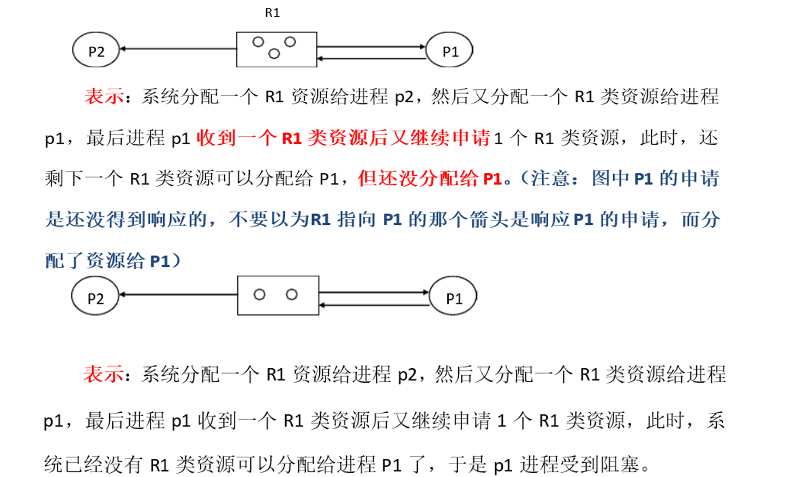

##### 资源分配图化简

在一个资源分配图中，若某进程的资源申请都能被满足，完成任务，释放所占有的全部资源，则称该图可以被该进程化简。若该图可被其所有进程化简，则称**该图是可化简的**。

资源分配图化简方法：
（1）找到一个既**非阻塞又非孤立**的进程节点Pi，去掉请求边和分配边，将其变为孤立节点；
（2）把Pi释放的资源分配给申请等待该资源的进程，即将某进程的申请边变为分配边。
（3）重复1，2，直到找不到符合条件的进程节点。经过简化后，若能消去图的所有边，使**所有进程都成为孤立点**，则该图是可完全化简的。
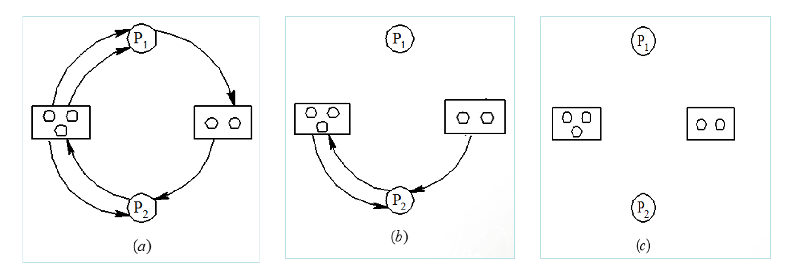

##### 死锁定理

如果**资源分配图中没有环路，则系统中没有死锁**，如果图中存在环路则系统中**可能**存在死锁。如果每个资源类中只包含一个资源实例，则环路是死锁存在的充分必要条件。

**死锁定理**：死锁状态的充分条件，是资源分配图不可完全化简。

##### 死锁解除

（1）**重新启动**

（2）**进程回退**：将死锁进程退回到前一个检查点，并重新从该检查点启动这些进程（需系统提供检查点和重新启动机制）。有可能使原来的死锁再次发生，但由于并发处理系统的不确定性，通常死锁有可能不发生。

（3）**剥夺资源**：使用挂起/激活机制挂起一些进程，剥夺他们占有的资源给死锁进程，以解除死锁，待以后条件满足时再激活被挂起的进程。

（4）**撤销进程**：撤销死锁进程，将它们占有的资源分配给另一些死锁进程，直到死锁解除。