## 1 存储器的层次结构

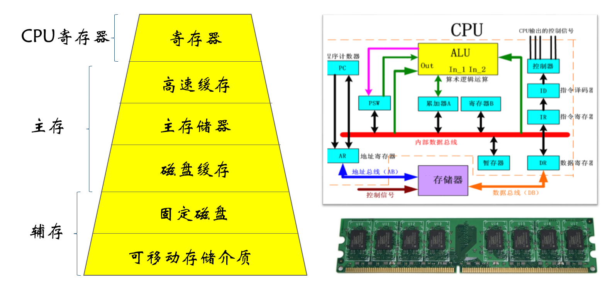

层次越高，访问速度越快，价格也越高，存储容量也越小。

寄存器和主存掉电后存储的信息不再存在，辅存的信息长期存在。

可执行存储器--CPU内部中暂存数据、地址以及指令信息。

寄存器的长度一般以字（word）为单位。寄存器的数目，对于微机系统和大中型机，可能有几十个甚至上百个；而嵌入式系统一般仅有几个到十几个。

## 2 程序的装入和链接

### 2.1 程序的运行步骤

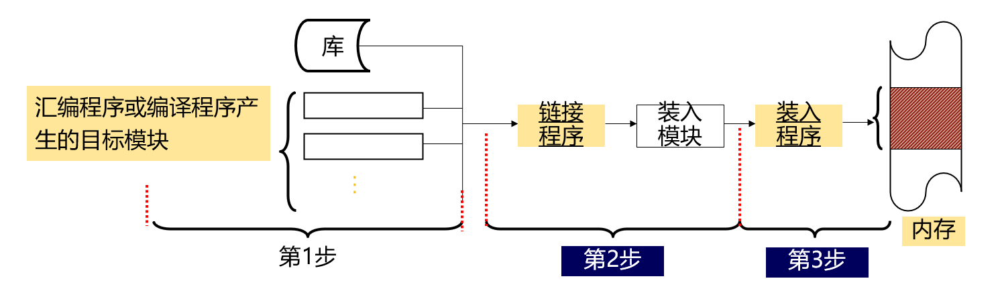

编译：由编译程序（Compiler）对源程序进行编译，形成若干个目标模块。

链接：由链接程序（Linker）将目标模块和它们所需要的库函数链接在一起，形成一个完整的装入模块。

装入：由装入程序（Loader）将装入模块装入内存。

### 2.2 物理地址和逻辑地址

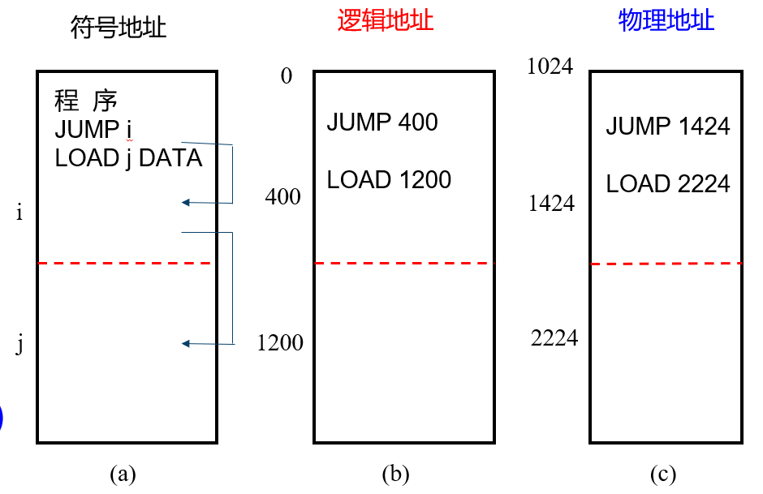

逻辑地址（相对地址）：由CPU产生的地址，即程序编译后使用的相对于0字节的地址，由程序所生成的所有逻辑地址的集合叫逻辑地址空间。

物理地址（绝对地址）：物理内存地址，以字节为单位编址；所有物理地址的集合叫物理地址空间。

地址映射（地址重定位）：逻辑地址 → 物理地址，即将程序地址空间中使用的逻辑地址变换成主存中的物理地址的过程。

### 2.3 内存保护

##### 内存保护的目的

- 保护OS不被用户访问
- 保护用户进程不会相互影响

##### 内存保护的实现：硬件

- 基地址寄存器：保存最小的合法物理内存地址（基地址）
- 界限寄存器：保存合法的地址范围大小（界限地址）
- 判断地址是否越界：基地址 ≤ 物理地址 ＜ 基地址 + 界限地址

### 2.4 程序的装入

- 绝对装入方式：编译时产生绝对地址
- 可重定位装入方式：编译时产生相对地址，在装入时，完成重定位（静态重定位）
- 动态运行时装入方式：编译时产生相对地址，在运行时，完成重定位（动态重定位）

### 2.5 程序的链接

静态链接：在程序运行前链接

装入时动态链接：边装入边链接。便于修改和更新，便于实现对目标模块共享

运行时动态链接：将某些目标模块链接推迟到执行时；加快装入过程，节省大量的内存空间。

## 3 对换与覆盖

### 3.1 对换（Swapping）

在多道程序环境下：

- 一方面，在内存中的某些进程由于某事件尚未发生而被阻塞运行，但它占用了大量的内存空间，甚至有时可能出现在内存中所有进程都被阻塞而迫使CPU停下来等待的情况；
- 另一方面，却又有着许多作业在外存上等待，因无内存而不能进入内存运行的情况。浪费资源，降低了系统吞吐量。

#### 3.1.1 对换的概念

对换：把内存中暂时不能运行的进程或者暂时不用的程序和数据，调出到外存上，以便腾出足够的内存空间，再把已具备运行条件的进程或进程所需的程序或数据，调入内存。

**对换是提高内存利用率的有效措施，广泛应用于OS中。**

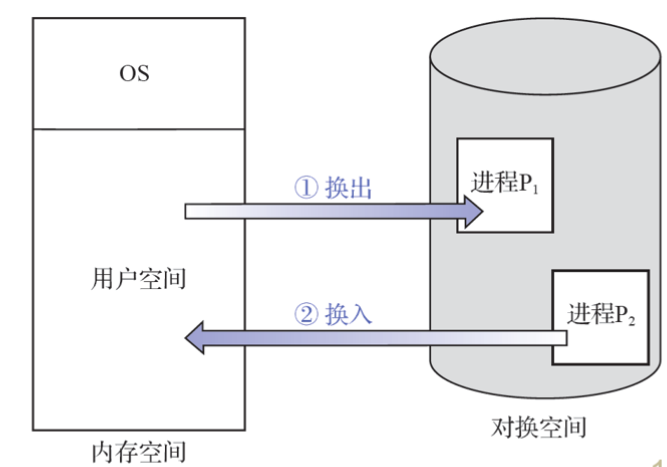

#### 3.1.2 对换的类型

- **整体对换**：对换以整个进程为单位，也称为进程对换。被广泛应用于多道程序系统，并作为处理机中级调度。为实现进程对换，系统必须能实现三方面的功能：（1）对换空间的管理。（2）进程的换入。（3）进程的换出。

- **页面（分段）对换**：对换是以页/段为单位，又统称为“部分对换”。目的是为了支持虚拟存储系统。

### 3.2 覆盖（Overlaying）

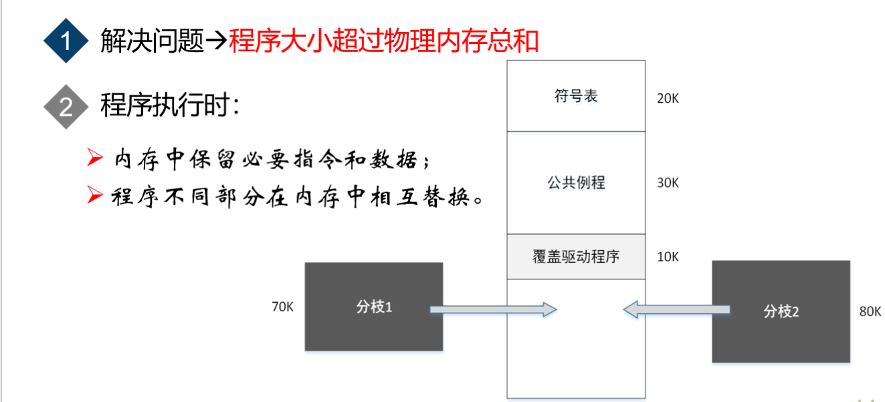

## 4 连续分配存储管理模式*

连续分配方式：为一个用户程序分配一个**连续的内存空间**。

### 4.1 单一连续分配

单道程序环境

- 内存分配管理简单
- 内存利用率低
- 用于单用户、单任务OS

### 4.2 固定分区分配

把内存划分为若干个**大小固定**的连续分区，每个程序占用一个分区，用于**多道程序**环境。

缺点：分区大小固定，缺乏灵活性

- 程序太小，会造成存储空间的浪费（内碎片）
- 程序太大，会造成无法装入运行

### 4.3 动态分区分配（可变分区）

#### 4.3.1 动态分区分配

动态分区分配：作业运行不建立分区，在装入程序时按其初始要求分配。

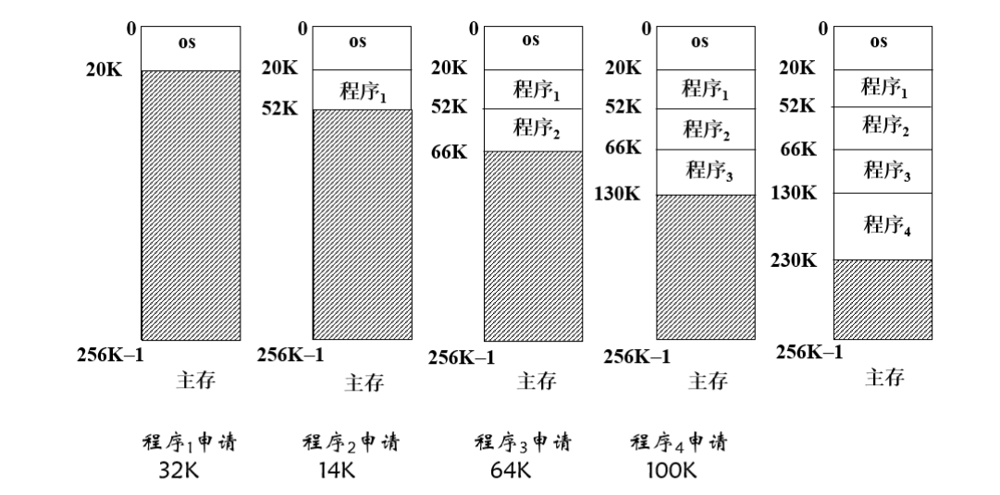

#### 4.3.2 动态分区回收

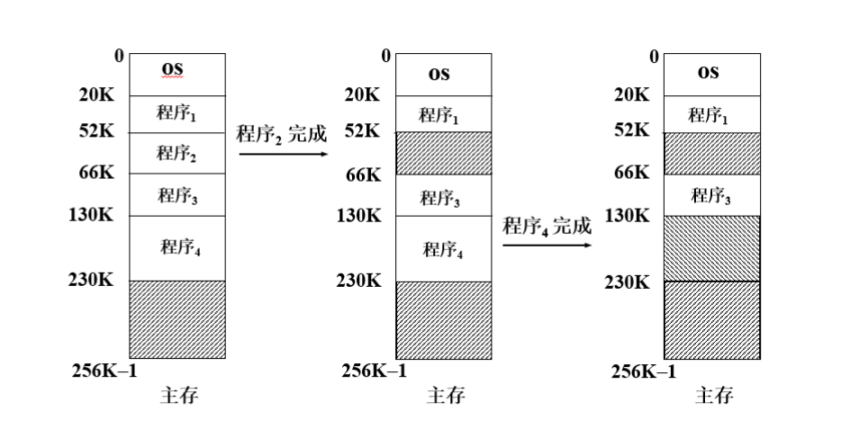

#### 4.3.3 动态分区分配--数据结构

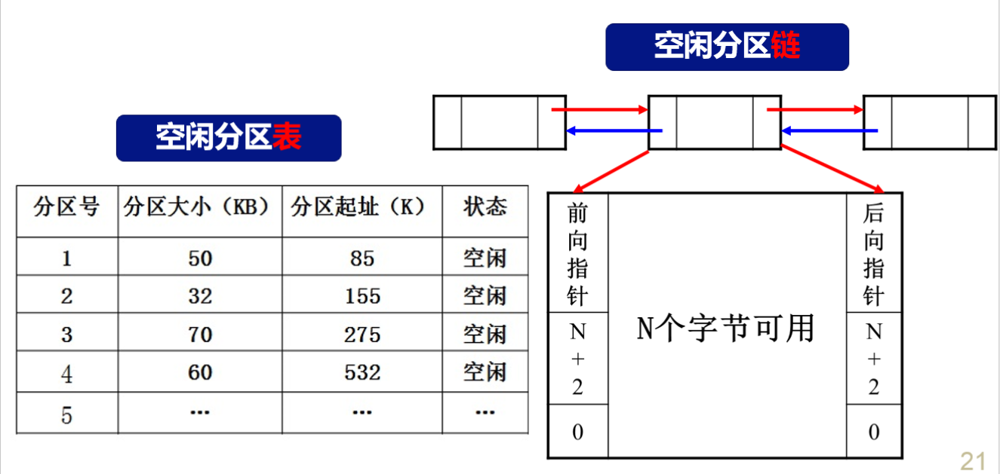

为了实现对空闲分区的分配和链接，在每个分区的起始部分，设置一些用于控制分区分配的信息，以及用于链接各分区所用的前向指针；在分区的尾部设置后向指针，通过前、后向指针，可将所有的空闲分区链接成一个双向链。

#### 4.3.4 动态分区分配--分配算法

基于**顺序搜索**的分配算法：搜索空闲分区链上满足其要求的空闲分区，有 **①首次适应算法** **②最佳适应算法** **③最坏适应算法** 等。

基于**索引**的分配算法：提高搜索空闲分区的速度，在大、中型系统中采用快速适应算法、伙伴系统和哈希算法。

##### 首次适应算法

首次适应算法是将输入的程序放置到主存里第一个足够装入它的地址最低的空闲区中。空闲区地址**由低到高**排序。

特点：尽可能地利用低地址空闲区，而尽量保存高地址空闲区。

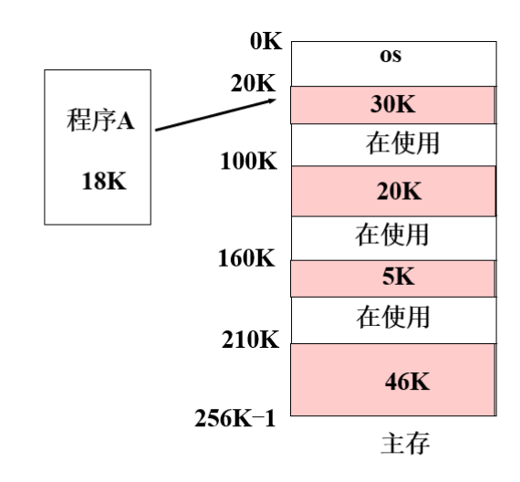

##### 最佳适应算法

最佳适应算法是将输入的程序放置到主存中与它所需大小最接近的空闲区中。空闲区**由小到大**排序。

特点：尽可能地利用小的空闲区，而尽量保存大的空闲区。

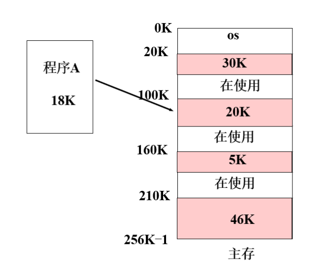

##### 最坏适应算法

最坏适应算法是将输入的程序放置到主存中与它所需大小差距最大的空闲区。空闲区**由大到小**排序。

特点：尽可能利用大的空闲区，而尽量保存小的空闲区。

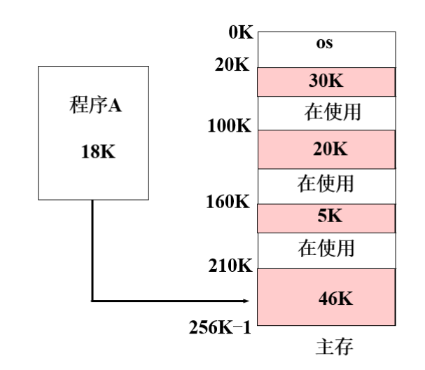

##### 动态分区分配算法实例

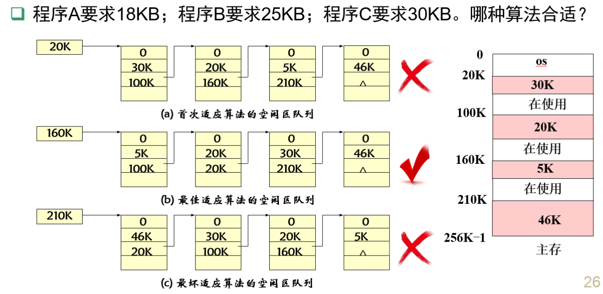

#### 4.3.5 内存分配流程以及内存回收

1. 内存分配
   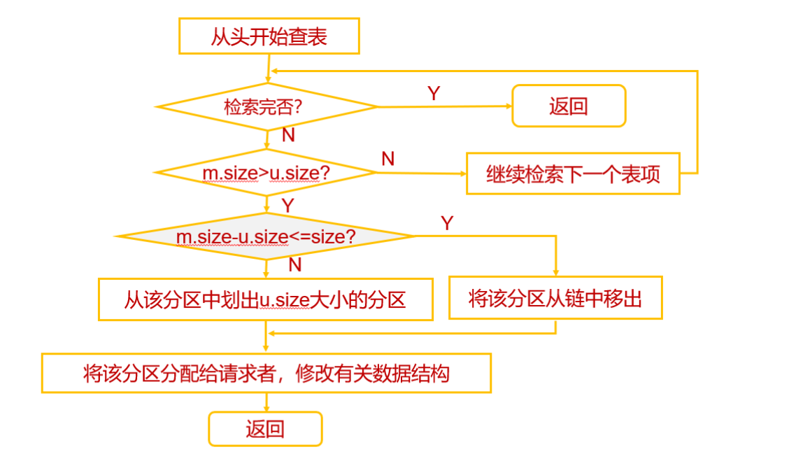
   其中，`m.size`表示每个分区大小，`u.size`表示请求的分区大小，`size`表示事先规定的不再切割的剩余部分大小。

2. 内存回收-空闲表的处理
   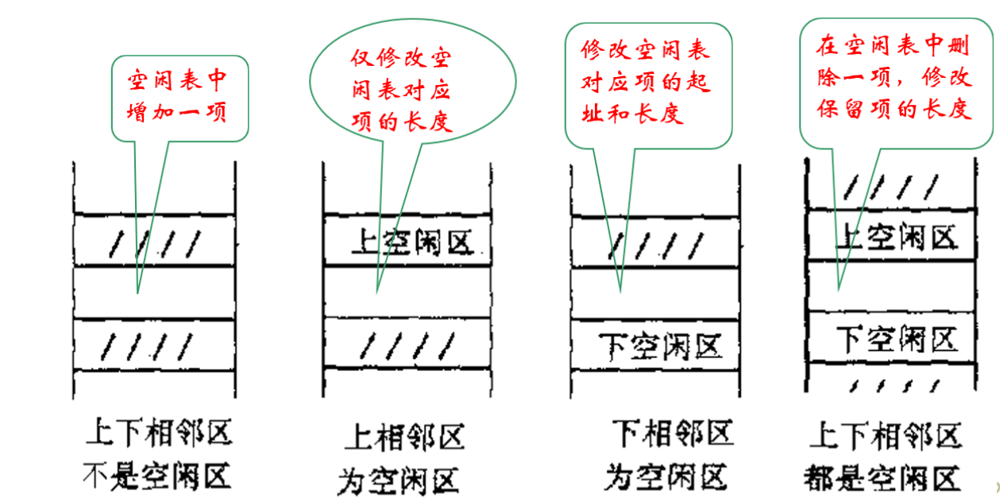
   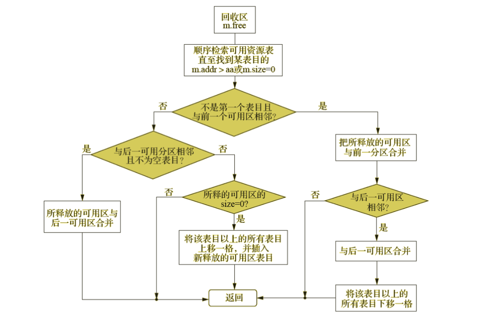

#### 4.3.6 碎片问题及紧凑（拼接）

**碎片问题**：在已分配区之间存在着的一些没有被充分利用的空闲区（外碎片）。

**拼接技术**：拼接技术是指移动存储器中某些已分配区中的信息，使本来分散的空闲区连成一个大的空闲区。

### 4.4 动态可重定位分区分配

#### 4.4.1 动态重定位分区分配

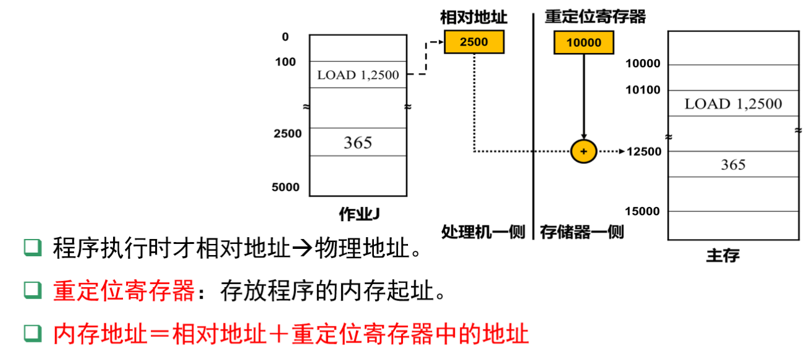

动态重定位分区分配将相对地址转换为物理地址的过程推迟到程序执行时进行。当系统对内存进行了“紧凑”，而使若干程序从内存的某处移至另一处时，不需要对程序做任何修改，只要用该程序在内存的新起始地址去置换原来的起始地址。

#### 4.4.2 动态重定位分配算法流程

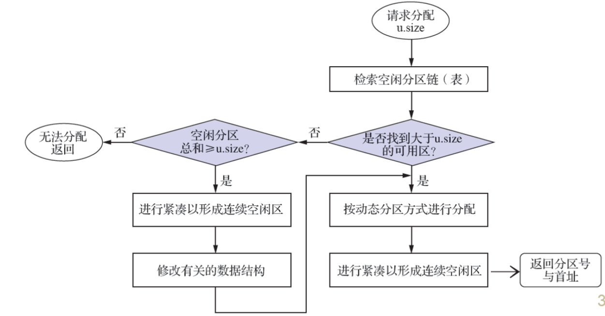

#### 4.4.3 动态分区分配的特点

优点：

- 没有内碎片，提高了内存的利用率
- 多个作业或进程共享内存，提高并发性，提高系统效率
- 要求硬件支持少，管理简单，容易实现

缺点：

- 有外碎片，内存利用率仍待进一步提高
- 作业或进程大小受分区大小控制，除非采用覆盖/交换技术
- 难以实现各分区之间的信息共享

>内碎片：是已经被分配出去（能明确指出属于哪个进程）却不能被利用的内存空间。
>外碎片：是还没有被分配出去（不属于任何进程），但由于太小了无法分配给申请内存空间的新进程的内存空闲区域。

## 5 分页存储管理方式*

### 5.1 概述

连续分配 -- 有“碎片”，解决方式“紧凑”，但有CPU开销。

离散分配：分页存储管理、分段存储管理、段页式存储管理

1. 页面和物理块
   **页面**--内存逻辑地址编号，第0页，第1页，······
   **块**--内存物理空间的编号，0#块，1#块，······
   **页面大小**--通常1~8KB（2的幂）
   

2. 地址结构
   若逻辑地址为A，页面大小为L，则页号P和页内地址d：
   $P=INT[\frac{A}{L}]$ ，其中INT为取整函数
   $d=[A]MODL$ ，其中MOD为取余函数

>例如，系统页面大小为1KB，设A=5168B，则P=5，d=48

### 5.2 页表

页表的作用：完成页号与物理块号之间的映射，每个进程都有一张页表。
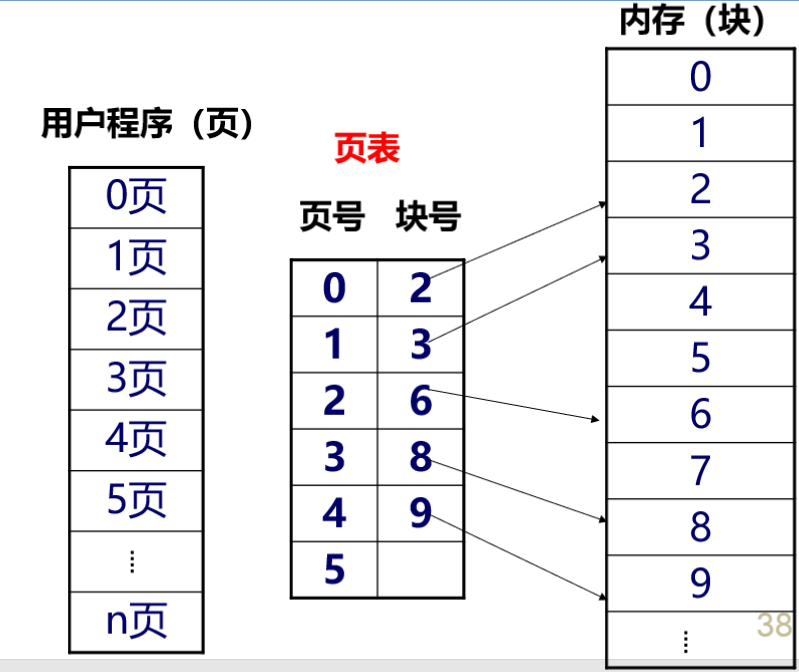

### 5.3 基本的地址变换机构

任务：逻辑页号 → 物理块号
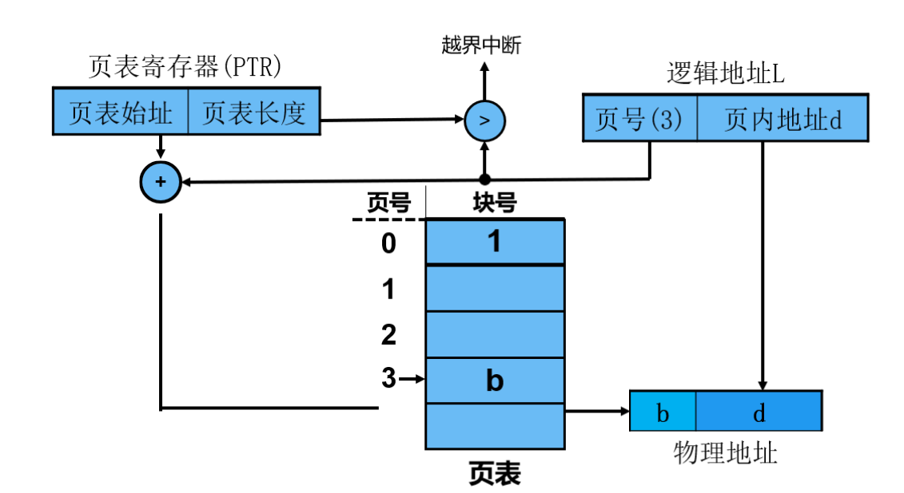

>两个功能：越界保护；每个进程对应一页表，其信息（如长度、起始地址）放在PCB中，执行时将其首地址装入页表寄存器。

一个例子：
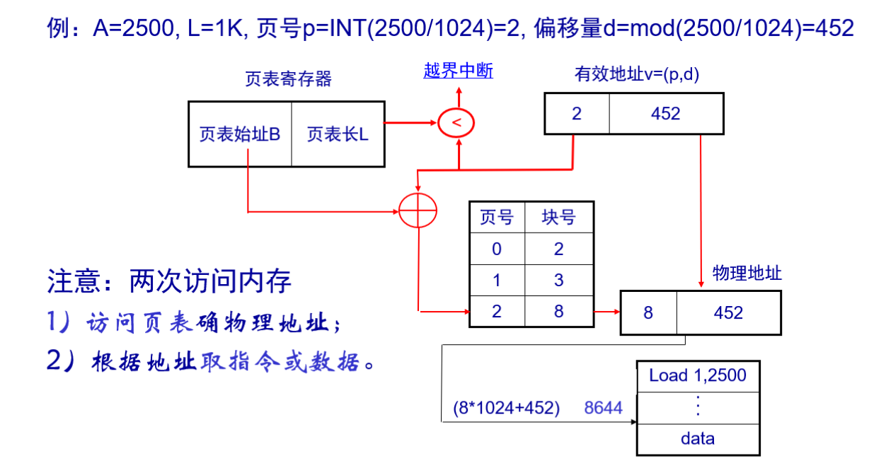

逻辑地址到物理地址的转换-例子：
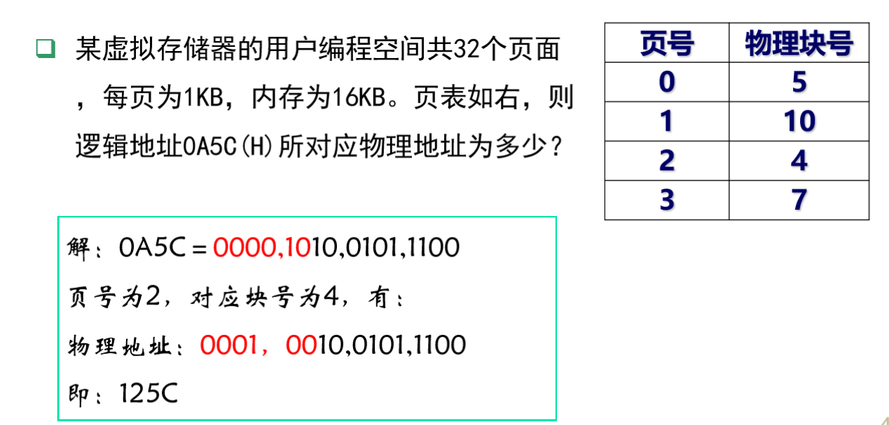

### 5.4 具有快表的地址变换机构

基本的地址变换机构需要两次访问内存：访问页表（获得物理地址）、访问物理地址（获得所需数据）。

快表：具有并行查询能力的特殊高速缓冲存储器，又称为“联想存储器”，这大大提高了系统的访问速度。

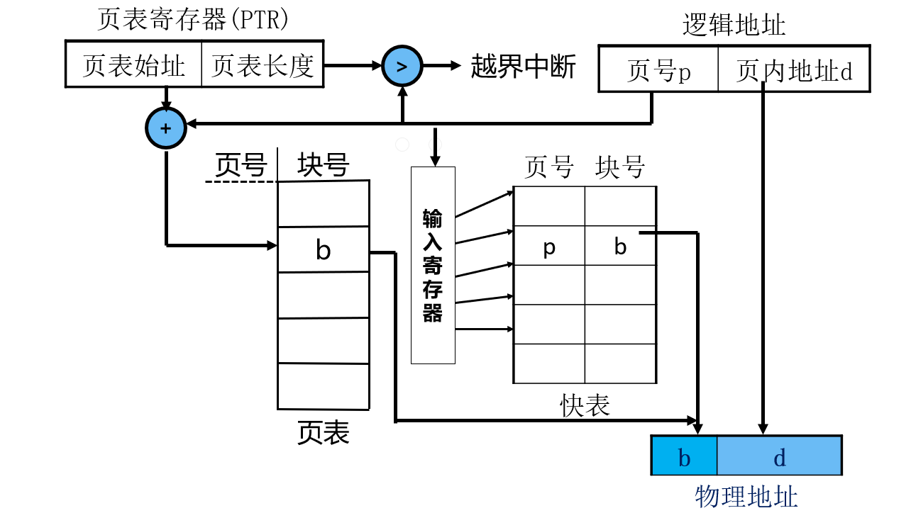

#### 内存的有效访问时间EAT

EAT(Effective access time)：给定**逻辑地址**找到内存中对应**物理地址**单元中数据所用总时间。

1. 没有快表的情况
   两次访问：查找页表、访问物理地址。如果访问一次时间为t，则 $EAT=t+t=2t$

2. 存在快表的情况
   设访问快表时间为λ，访问一次时间为t，快表的命中率为a，则$EAT=a*λ+(t+λ)(1-a)+t=2t+λ-t*a$

内存的有效访问时间EAT-例子：

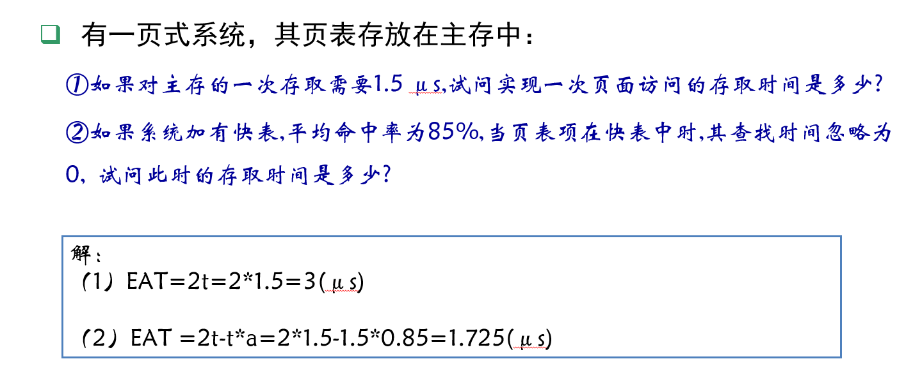

### 5.5 两级和多级页表

在两级页表机制中：

- 第一级页表：称为外层页表（页目录），其中的每个表目是存放某个页表的物理地址。
- 第二级页表：其中的每个表目所存放的才是页的物理块号。

假设逻辑地址长度为32位，两级页表系统将逻辑地址分成三段：
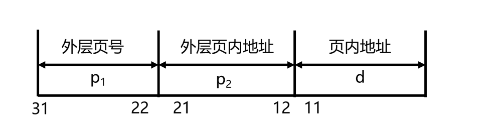

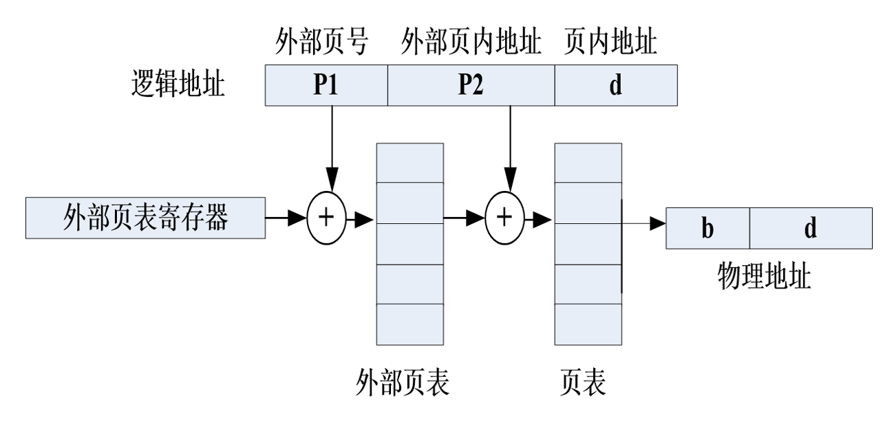

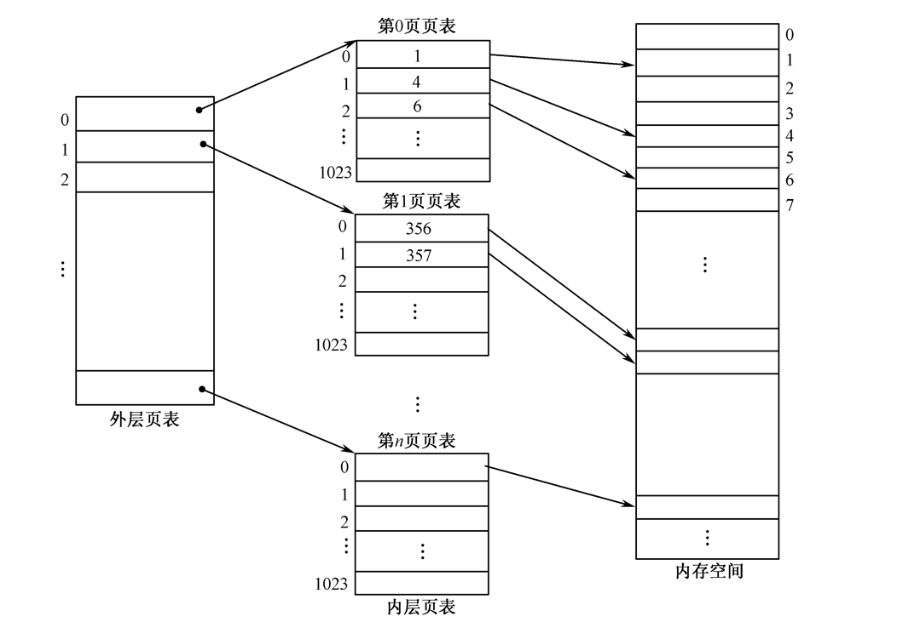

## 6 分段存储管理方式

### 6.1 基本原理

引入分段存储管理方式的目的是**满足用户/程序员多方面要求**。

将作业地址划分若干段，都有**段名/段号**，**段内**地址从0开始编址，并**连续存储**。各段长度不相等，由用户组决定。

每个段都有其逻辑意义和功能，使得便于

- 方便编程（段名和长度）
- 信息共享（段是信息的逻辑单位）
- 信息保护（防止对内存的破坏）
- 动态链接（需要时才调入）
- 动态增长（如数据段的增长）

### 6.2 段表-地址映射

段表用于实现从逻辑段到物理内存区的映射，其保存在内存中，由控制寄存器保存其地址。

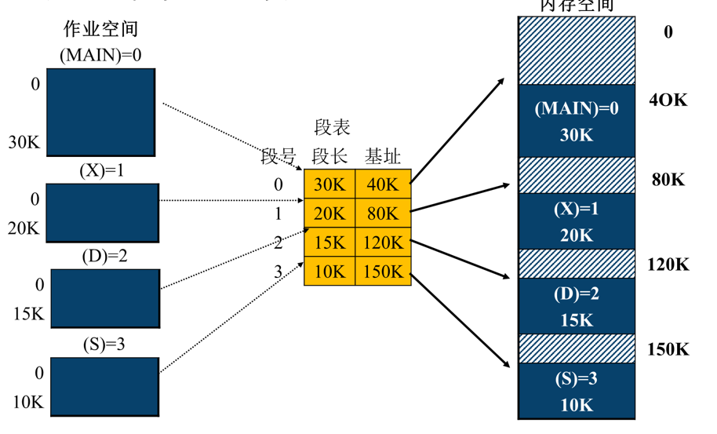

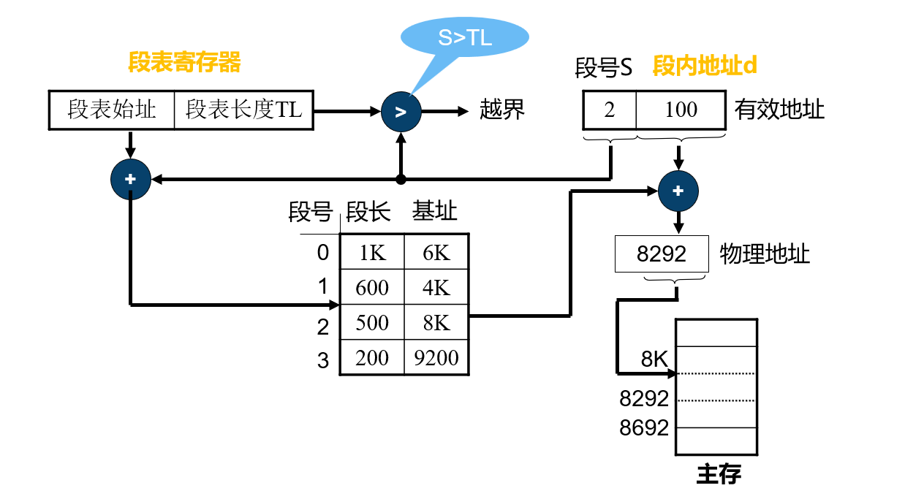

### 6.3 信息共享

分段的一个突出优点，是易于实现段的共享，即允许若干个进程共享一个或多个分段，且对段的保护也十分简单易行。在分页系统中，虽然也能实现程序和数据的共享，但远不如分段系统来得方便。

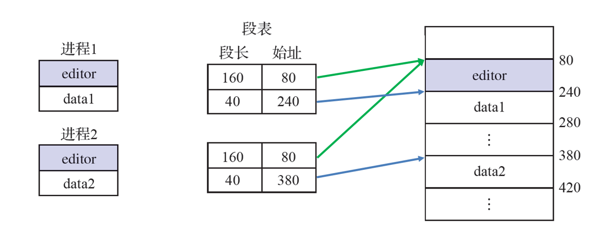

### 6.4 分页和分段的主要区别

| &emsp;      | 分页             | 分段                 |
| ----------- | ---------------- | -------------------- |
| 信息单位    | 页               | 段（逻辑上有意义）   |
| 信息完整性  | 离散分配方式     | 意义相对完整         |
| 页/段的大小 | 固定，由系统决定 | 不固定，由程序员决定 |
| 地址空间    | 一维             | 二维                 |

## 7 段页式存储管理方式

### 7.1 基本原理

分段和分页原理的结合，即先将用户程序分成若干段，再把每个段分成若干页，并为每个段赋予一个段名。这样既有分段系统的便于实现、可共享、易于保护、可动态链接等优点，又能像分页系统那样很好的解决内存的外部碎片问题。

### 7.2 地址变换过程

