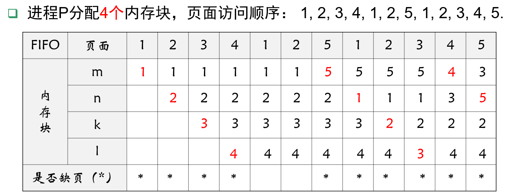

## 1 虚拟存储器概述

### 1.1 常规存储器管理方式的特征

常规存储管理共同特点--要求把进程全部装入内存才能运行

- 大作业＞内存  无法运行
- 多作业＞内存  部分运行，效率低

两种解决方案

- 物理增加内存容量，但受到机器寻址能力限制，且增加成本
- 逻辑扩充内存容量，“虚拟存储”管理技术

虚拟存储管理要研究的问题

1. 作业信息不全部装入主存，能否保证作业的正确运行？
   回答是肯定的，1968年P.Denning发现程序执行时的**局部性原理**。
2. 以CPU时间和外存空间换取昂贵内存空间，如何进行动态调度？
   置换算法

### 1.2 局部性原理

程序的局部性原理：指程序在执行过程中的一个较短时间内，所执行的指令地址或操作数地址分别局限于一定的存储区域中。

时间局部性：程序的循环操作导致指令、数据的重复执行、访问
空间局部性：程序的顺序执行导致某段时间访问地址集中在一定范围

### 1.3 虚拟存储器的基本思想

虚拟存储器是指具有请求调入功能和置换功能，能**从逻辑上对内存容量进行扩充的一种存储系统**。虚存的实质：**以时间换空间**，但时间牺牲不大。

基本思想：

- **超越限制**：程序、数据大小可以超过内存的大小
- **部分载入**：在程序装入时，不必将其全部读入到内存，而只需将当前需要执行的部分页或段读入到内存，就可让程序开始执行
- **缺页调入**：在程序执行中，如访问数据未在内存（称为缺页或缺段），则由CPU通知OS将相应页/段调入内存，然后继续执行程序
- **闲页调出**：将内存中暂时不使用的页/段调出到外存上，从而腾出空间
- 把内存与外存有机的结合起来，得到一个容量很大的“内存”，这就是**虚存**。 （即虚存=内存+部分外存）

虚拟存储器的实现方法：

- 请求分页存储管理（动态页式管理）
- 请求分段存储管理（动态段式管理）
- 段页式虚拟存储器

### 1.4 虚拟存储器的特征

1. **多次性**：一个作业被分成多次调入内存运行
2. **对换性**：允许在作业的运行过程中进行换进、换出，亦即，在进程运行期间，允许将那些暂时不使用的程序和数据，从内存调至外存的对换区（换出），待以后需要时再将它们从外存调至内存（换进），能有效提高内存利用率。
3. **虚拟性**：能够从逻辑上扩充内存容量，使用户所看到的内存容量远大于实际内存容量。**虚拟性是以多次性和对换性为基础的**，而多次性和对换性又必须建立在离散分配的基础上。

## 2 请求分页存储管理方式

### 2.1 请求分页基本原理

基本原理：在请求分页式存储管理系统中，进程运行之前将一部分页面装入内存，另外一部分页面则装入外存。在进程运行过程中，如果所访问的页面不在内存中，则发生**缺页中断**，进入操作系统，由操作系统进行页面的动态调度。

### 2.2 请求页表机制

### 2.3 缺页中断机构

每当访问页不在内存时，便产生**缺页中断**，请求OS将所缺页调入内存。缺页中断与一般中断有相同点，也有着显著的区别：

（1）**在指令执行期间产生和处理中断信号**。通常，CPU都是在一条指令执行完后，才检查是否有中断请求到达。而缺页中断是在指令执行期间，发现所要访问的指令或数据不在内存时所产生和处理的。

（2）**一条指令在执行期间可能产生多次缺页中断**。基于这些特征，系统中的硬件机构应能保存多次中断时的状态，并保证最后能返回到中断前产生缺页中断的指令处继续执行。

### 2.4 地址变换机构

### 2.5 请求分页中的内存分配

最小物理块数的确定：保证进程正常运行所需的最小物理块数。

物理块的分配策略：

- 固定分配局部置换
- 可变分配全局置换
- 可变分配局部置换

物理块分配算法：

- 平均分配算法
- 按比例分配算法
- 考虑优先权的分配算法

### 2.6 页面调入策略

#### 何时调入页面？

预调页策略：预先调入一些页面到内存
请求调页策略：需要访问的页面不在内存时，调入内存

#### 从何处调入页面？

如系统拥有足够对换区空间，全部从对换区调入所需页面；如缺少足够对换区空间，凡是不会被修改的文件，都直接从文件区调入。

#### 如何调入页面？

页面调入方法：

①查找所需页在磁盘上的位置；

②查找一内存空闲块：如果有空闲块，就直接使用它；若没有空闲块，使用页面置换算法选择一个“牺牲”内存块；将“牺牲”块的内容写到磁盘上，更新页表和物理块表；

③将所需页读入（新）空闲块，更新页表；

④重启用户进程

缺页率：$f=F/A=F/(S+F)$，其中S为访问页面成功（在内存）的次数，F为访问页面失败（不在内存）的次数，总访问次数为A=S+F。

## 3 页面置换算法

### 3.1 概述

页面置换过程

两个问题：

（1）置换哪些页面？--未来不再使用的或最近较少使用的页面

（2）如何判断？--在局部性原理下依据过去的统计数据进行预测

具体算法有**最佳页面置换算法**(OPT,optimal replacement algorithm)、**先进先出置换算法**(FIFO)、**最近最久未使用置换算法**(LRU,Least Recently Used)、时钟页面置换算法(Clock)、最近未使用页面淘汰算法(NRU,Not Recently Used)、页面缓冲算法(PBA,page buffering algorithm)

### 3.2 最佳页面置换算法(OPT)

淘汰将来**再也不会出现**或**在最远位置出现**的页。OPT算法是一种理想情况，因为实际执行中无法预知页面顺序，故无法实现，但可用作性能评价的依据。

缺页率：7/12=58.3%

### 3.3 先进先出算法(FIFO)

淘汰建立**时间最早**的页面，可以通过链表或队列来表示各页的建立时间先(队首)后(队尾)。

缺页率：9/12=75%

Belady现象：在FIFO算法下，当内存块增加时，反而出现缺页率也增加的异常现象。
缺页率：10/12=83.8%

### 3.4 最近最久未使用置换算法(LRU)

淘汰**最长时间内没有被访问过**的页面，利用了局部性原理

### 3.5 内存有效访问时间EAT

内存有效访问时间（EAT,effective access time)：是指给定**逻辑地址**找到内存中对应**物理地址**单元中的数据所用的总时间。

1. 被访问页在内存，且对应页表在快表中
   $EAT=\lambda+t$，其中设访问快表的时间为λ，访存一次时间为t

2. 被访问页在内存，但对应页表不在快表中
   $EAT=2(t+\lambda)$
3. 被访问页不在内存
   $EAT=\epsilon+2(t+\lambda)$，其中$\epsilon$为缺页中断处理时间

## 4 抖动与工作集

### 4.1 抖动

如果一个进程没有足够的页，那么缺页率将很高，这将导致：

- CPU利用率低下
- 操作系统认为需要增加多道程序设计的道数
- 系统中将加入一个新的进程

抖动（Thrashing）：一个进程的页面经常换入换出

产生抖动的根本原因是，**同时在系统中运行的进程太多，由此分配给每一个进程的物理块太少，频繁地出现缺页中断**。页面在内存与外存之间频繁调度，以至于调度页面所需时间比进程实际运行的时间还多，此时系统效率急剧下降，甚至导致系统崩溃，这种现象称为“抖动”。

OS要选择一个适当的进程数和置换算法，以在并发水平和缺页（段）率之间达到一个平衡。Denning提出了“工作集”的概念。

进程发生缺页的时间间隔与所获得的物理块数有关。根据程序运行的局部性原理，如果能够预知某段时间内程序要访问的页面，并将它们预先调入内存，将会大大降低缺页率。

### 4.2 工作集

工作集是指在某段时间间隔里，进程实际所要访问页面的集合。Denning指出为了较少产生缺页，应将**程序全部工作集装入内存**中。然而无法事先预知程序在不同时刻即将访问哪些页面，故仍只有像置换算法那样，**用程序的过去某段时间内的行为作为程序在将来某段时间内行为的近似**。

### 4.3 抖动的预防方法

1. 采取局部置换策略
2. 把工作集算法融入到处理机调度中
3. 利用“L=S”准则调节缺页率：L是缺页之间的平均时间，S是平均缺页服务时间。如 L >> S ，说明很少发生缺页，磁盘利用率不高；如 L << S ,说明频繁发生缺页，超过磁盘处理能力；只有当 L ≈ S 接近时，磁盘和处理机利用率均最佳。
4. 选择暂停的进程

## 5 请求分段存储管理方式

### 5.1 基本原理

在请求分段式存储管理系统中，进程运行之前一部分段装入内存，另外一部分段则装入外存。在进程运行过程中，如果所访问的段不在内存中，则发生**缺段中断**，进入操作系统，由操作系统进行段的动态调度。

### 5.2 段表

### 5.3 缺段中断机构

每当发现要访问的段尚未调入内存时，便由缺段中断机构产生缺段中断信号，进入OS后由缺段中断处理程序将所需的段调入内存。

缺段中断机构与缺页中断机构类似：

- 它同样需要在一条指令的执行期间，产生和处理中断，以及在一条指令执行期间，可能产生多次缺段中断
- 但由于分段是信息的逻辑单位，因而不可能出现一条指令被分割在两个分段中和一组信息被分割在两个分段中的情况
- 由于段不是定长的，缺段中断处理要比对缺页中断处理要复杂。

请求分段的中断处理过程：
