## 1 I/O系统的功能、模型和接口

### 1.1 设备的分类

根据设备**传输处理单位**分类：

1. 块设备(Block device)
   - 块设备将信息存储在固定大小的块中，每个块都有自己的地址
   - 基本特征是每个块都能独立于其它块而读写
   - 磁盘是最常见的块设备

2. 字符设备(Character device)

   - 在I/O传输过程中以字符为单位进行传输的设备
   - 例如磁盘，打印机等

3. 根据设备的**功能特性**分类：

   - 存储设备 例如磁盘等
   - I/O设备 输入输出设备、交互式设备
   - 数据通信设备 例如网卡等

4. 根据设备**可否共享**分类：

   - 独占设备--进程互斥访问 例如打印机、磁带机
   - 共享设备--进程并发访问 例如磁盘
   - 虚拟设备--虚拟技术 例如Spooling技术

5. 按**传输速率**分类：

   - 低速  设备 几~数百B/S，键盘、鼠标等
   - 中速设备 数千~数十万B/S，打印机
   - 高速设备 数百KB~千MB/S，磁带机、磁盘机、光盘等

### 1.2 硬件系统--外设

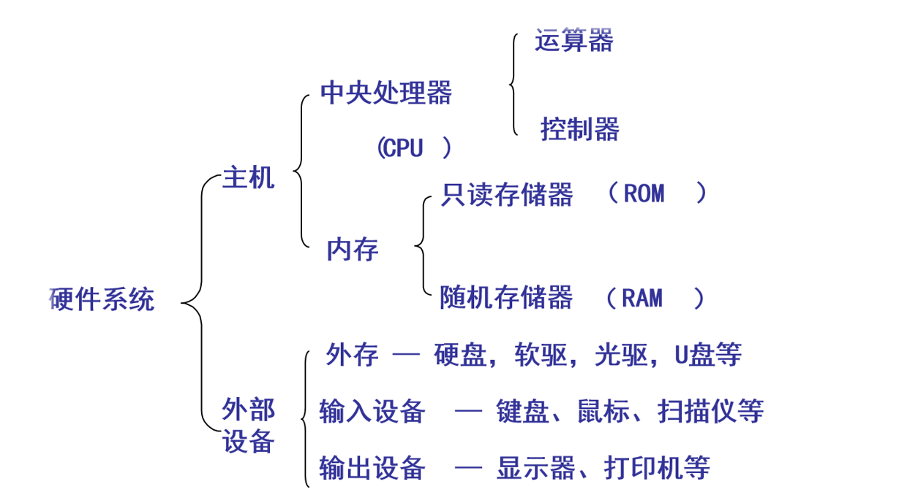

### 1.3 I/O系统基本功能

- 隐藏物理设备细节
- 控制I/O设备
- 保证OS与设备无关
- 提高CPU和I/O设备利用率
- 设备共享
- 处理错误

### 1.4 I/O软件的层次结构

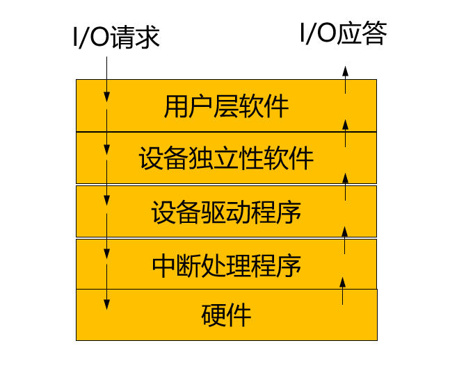

I/O模块之间的层次视图

## 2 I/O设备和设备控制器

### 2.1 设备与控制器之间的接口

执行I/O操作的机械部件--一般I/O设备
执行控制I/O的电子部件--设备控制器（适配器）
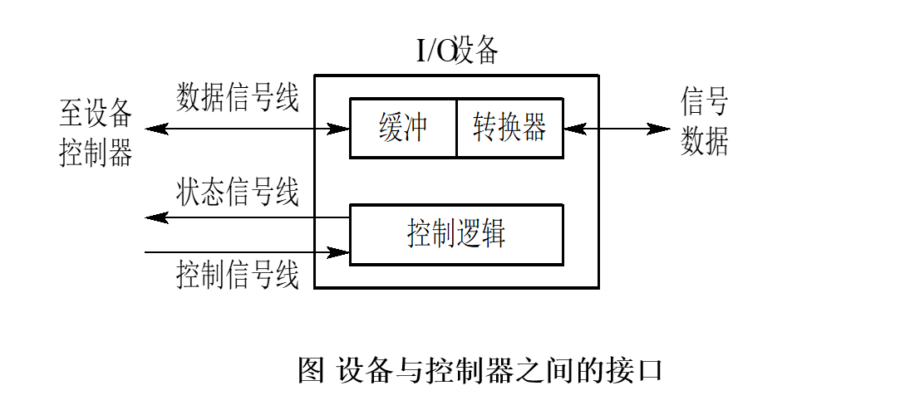

>通常，设备并不是直接与CPU进行通信，而是与设备控制器通信，因此，在I/O设备中应含有与设备控制器间的接口，在该接口中有三种类型的信号，各对应一条信号线。数据信号线用于在设备和设备控制器之间传送数据信号。对于输入设备，由外界输入的信号经转换器转换后所形成的数据，先送入缓冲器中，当数据量达到一定的比特(字符)数后，再从缓冲器通过一组数据信号线传送给设备控制器；对输出设备而言，则是将从设备控制器经过数据信号线传送来的一批数据先暂存于缓冲区中，经转换器作适当转换后，再逐个字符地输出。状态信号线用于传送指示设备当前状态的信号：正在读（或写），设备已读（写）完成，并准备好新的数据传送。控制信号线是由设备控制器向I/O设备发送控制信号时的通路。该信号规定了设备将要执行的操作，如读操作（由设备->控制器传送数据）或写操作（从控制器接受数据），或执行磁头移动等操作。

### 2.2 设备控制器

#### 2.2.1 基本功能

1. 接受和识别指令
2. 地址识别
3. 数据交换
4. 数据缓冲
5. 标识和报告设备的状态
6. 差错控制

#### 2.2.2 设备控制器的组成

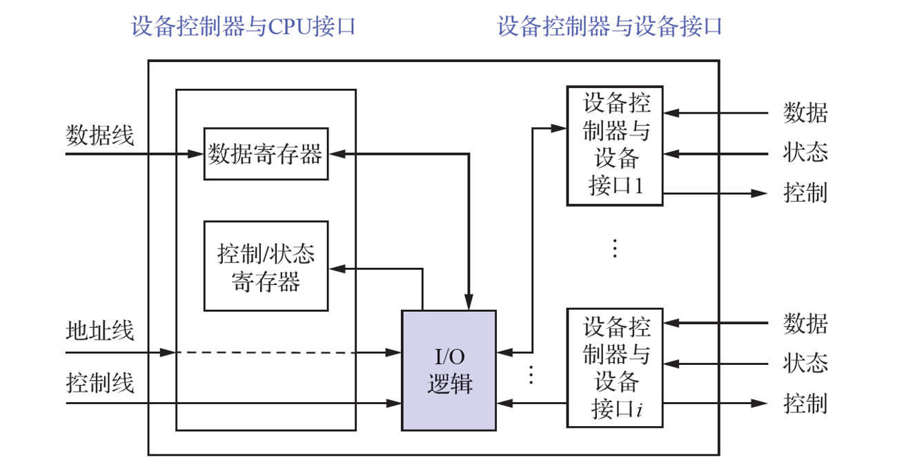

>设备控制器与CPU接口：实现CPU与设备控制器之间的通信，包括数据线、地址线和控制线。一个设备控制器可以连接一个或多个设备。
>I/O逻辑：实现对设备的控制，通过一组控制线与CPU交互，CPU利用该逻辑向控制器发送I/O命令，I/O逻辑对收到的命令进行译码。

### 2.3 内存映像I/O

驱动程序将抽象I/O命令转换为具体命令和参数等，并装入设备控制器的相应寄存器，由控制器执行这些命令，具体实施对I/O设备控制。具体方法：

- 采用特定I/O指令 访问内存和设备需要两种不同的指令
- 采用内存映像I/O形式
  对内存单元和设备控制器中寄存器统一编址k。k在0~n-1 范围时，表示内存地址；若k≥n时，为某控制器的寄存器地址。统一了访问方法，简化了I/O编程。
  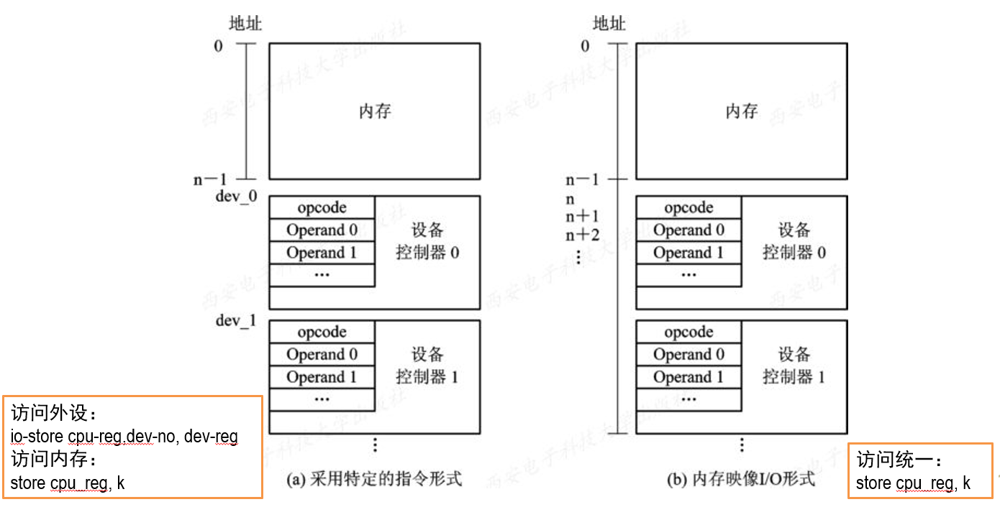

### 2.4 I/O通道

#### 2.4.1 概述

引入I/O通道的目的：**把CPU从繁忙的I/O任务中解脱出来，建立独立的I/O操作**。

在设置了通道后，CPU只需向通道发送一条I/O指令。通道在收到该指令后，便从内存中取出本次要执行的通道程序，然后执行该通道程序，仅当通道完成了规定的I/O任务后，才向CPU发中断信号。

**I/O通道是一种特殊的处理机**，它具有执行I/O指令的能力，并通过执行通道（I/O）程序来控制I/O操作，但是通道没有自己的内存。

通道是通过执行**通道程序并与设备控制器共同实现对I/O设备的控制的**。通道程序是由一系列通道指令（或通道命令）所构成的。

#### 2.4.2 I/O通道的类型

1. 字节多路通道(Byte Multiplexor Channel)
2. 数组选择通道(Block Selector Channel)：以数据块为单位成批传送数据，用来连接高速设备，每个通道一次只能为一台设备服务（一次只能执行一个通道指令程序）
3. 数组多路通道(Block Multiplexor Channel)：以数据块为单位传送数据，主要用来连接中速块设备，每个通道可同时为多台设备服务（可同时执行多个通道指令程序）
   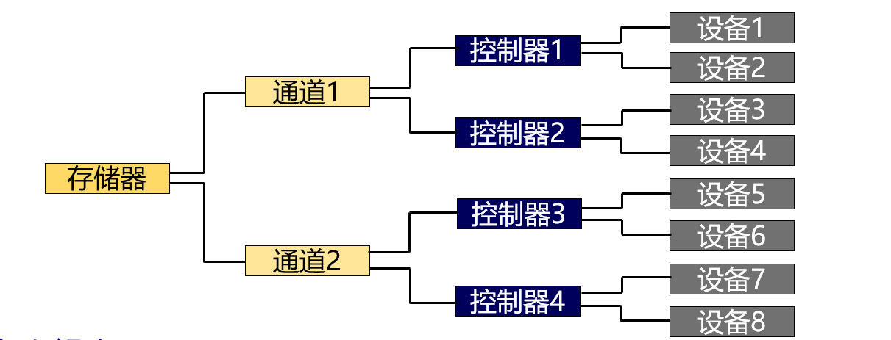

#### 2.4.3 多通路I/O系统

“瓶颈”问题：通道价格昂贵，数量较少，成为I/O瓶颈，造成整个系统吞吐量下降。

解决该问题的最有效方法，便是**增加设备到主机间通路而不增加通道**，即把一个设备连接到多个控制器上，而一个控制器又连接到多个通道上。

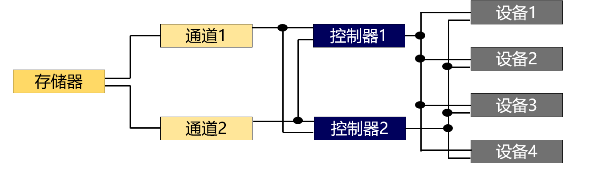

### 2.5 I/O设备的控制方式

- 使用轮询的可编程I/O方式
- 使用中断的可编程I/O方式
- 直接存储器访问方式（DMA）
- I/O通道控制方式

程序I/O和中断驱动方式的流程
 

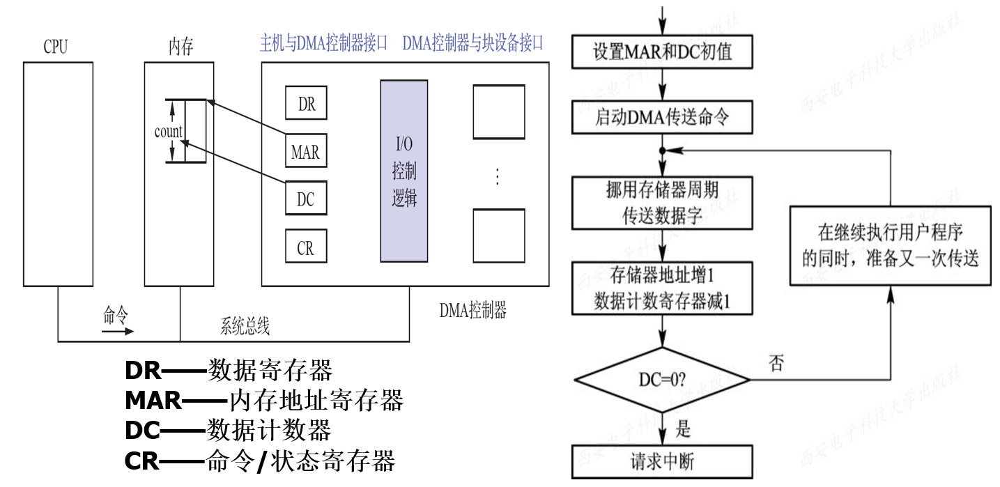

DMA控制器的组成图和流程图

>DMA方式数据传输的基本单位是数据块，所传输的数据是从I/O设备直接送入内存的，或者相反，CPU仅在传送一个或多个数据块的开始和结束时才进行干预。

## 3 中断和中断处理程序

### 3.1 中断简介

1. 中断和陷入

- 中断(Interrupt)是指CPU对I/O设备发来的中断信号的一种响应
- 陷入(Trap)是指CPU内部事件所引起的中断

2. 中断向量表
   中断向量表存放每个设备的中断处理程序入口地址，并为每个设备的中断请求分配一个中断号，对应于中断向量表中的一个表项。
3. 中断优先级
   系统为每个中断源规定不同的优先级

### 3.2 对多中断源的处理方式

引起中断的事件叫中断源。中断处理时，又来新中断请求，此时有两种选择：屏蔽(禁止)中断、嵌套中断

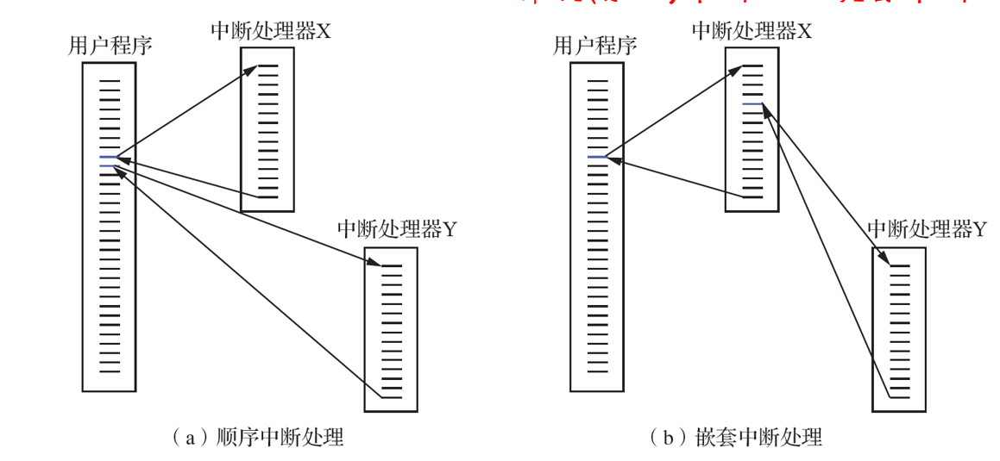

中断处理过程：

1. 测定是否有未响应的中断信号
2. 保护被中断进程的CPU现场
3. 转入相应的设备处理程序
4. 处理中断
5. 恢复CPU现场并退出中断

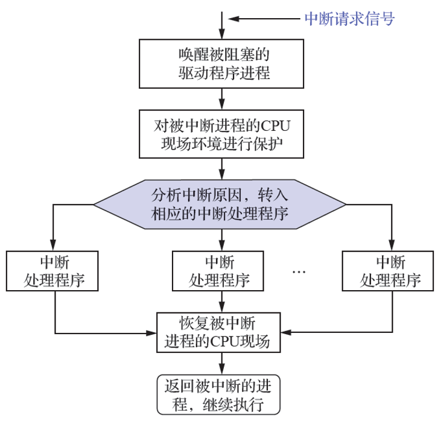

## 4 设备驱动程序

设备驱动程序是**操作系统内核与机器硬件之间的接口**。设备驱动程序为应用程序屏蔽了硬件的细节。在应用程序看来，**硬件设备只是一个设备文件**，可以像操作普通文件一样对硬件设备进行操作。

处理过程：

1. 将抽象要求转换为具体要求
2. 为服务请求进行校验
3. 检查设备的状态
4. 传送必要的参数
5. 启动I/O设备

设备驱动程序与外界的接口：与OS内核的接口、与系统引导的接口、与设备的接口。

设备驱动程序的组成：

- 设备驱动程序的注册与注销
- 设备的打开与释放
- 设备的读/写操作
- 设备的控制操作
- 设备的中断与轮询

## 5 与设备无关的I/O软件

1. 基本概念
   **设备独立性/无关性(Device Independence)**：应用程序所用设备，不应局限于某一具体的物理设备。为实现设备独立性，须在设备驱动程序上设置一层软件，称为**与设备无关的I/O软件，或设备独立性软件。** 以此方便用户和提高OS的可适应性与可扩展性。

2. 设备分配

数据结构：

- 设备控制表DCT - 记录设备的情况
- 控制器控制表COCT、通道控制表CHCT和系统设备表SDT

设备分配时应考虑的因素：

- 独占设备、共享设备、虚拟设备的分配策略
- 分配算法：先来先服务、优先级高者优先
- 安全性考虑：安全分配、不安全分配

独占设备的分配程序：分配设备、分配控制器、分配通道

3. 逻辑设备表
   在应用程序中使用的是逻辑设备名，而系统只识别物理设备名。逻辑设备表(LUT)用于将逻辑设备名映射为物理设备名。

4. I/O调度
   调度一组I/O请求就是按照确定好的顺序来执行I/O操作，提高计算机效率。通过I/O调度可以改善系统整体性能，在进程间公平共享设备访问，减少完成I/O调度所需的平均等待时间。实现方法是为每个设备维护一个请求等待队列。

## 6 用户层的I/O软件

1. 系统调用与库函数
   系统调用：应用程序通过系统调用间接调用OS中的I/O过程，对I/O设备进行操作。

库函数：C语言或UNIX中，系统调用与库函数几乎一一对应。

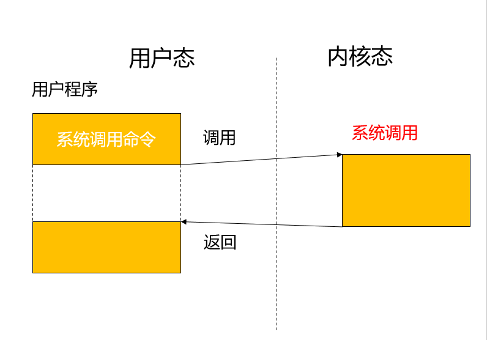

2. 假脱机技术
   假脱机技术(Spooling)，即**外部设备联机并行操作**，外围操作与CPU数据处理同时进行。

优点：提高I/O速度，将独占设备改造为共享设备，实现了虚拟设备功能。

## 7 缓冲区管理

1. 引入缓冲的主要原因
   （1）缓和CPU与I/O设备间速度不匹配的矛盾
   （2）减少对CPU中断频率，放宽对CPU中断响应时间的限制
   （3）解决数据粒度不匹配的问题
   （4）提高CPU与I/O设备之间并行性
2. 缓存是保存数据副本的高速内存区域：CPU缓存、磁盘缓存、光驱缓存等。CPU缓存：为了缓和CPU与内存读/写速率不匹配的矛盾。

缓存和缓冲：缓冲可以保存数据项的唯一的现有版本；缓存只是提供一个位于其他地方的数据项的更快存储副本；有时，同一个内存区，既可以是缓存，也可以是缓冲。

## 8 磁盘性能概述和磁盘调度

### 8.1 磁盘结构

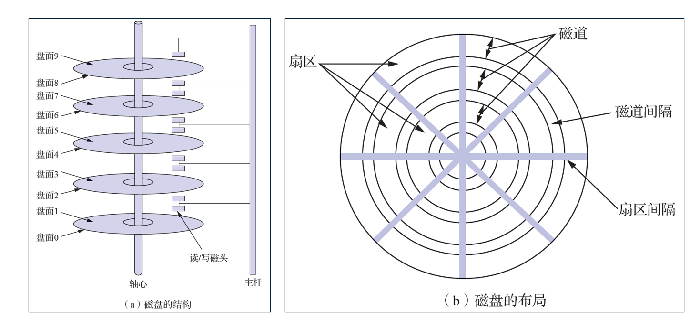

- 盘面（磁头）：磁盘设备可包含一或多个盘片，每个盘片分为一个或两个盘面，每个盘面上有一个读写磁头。
- 磁道（柱面）：每个盘面可分为若干条磁道，每个磁道上可存储相同数目的二进制位。
- 扇区：每条磁道逻辑上分为若干个大小相同的扇区，每个扇区的大小相当于一个盘块（数据块）。
- 磁盘密度即每英寸中所存储的位数，显然是内层磁道的密度较外层磁道的密度高。

### 8.2 磁盘容量计算

容量 = 柱面 x 磁头 x 扇区，每扇区存放512B数据。

### 8.3 磁盘访问时间

寻道时间：是指系统把磁头移到相应的磁道或柱面上所用时间
旋转延迟时间：是指一旦磁头到达指定磁道、必须等待所需要的扇区转到读/写磁头下所用的延迟时间。
传输时间：指信息实际在盘和内存之间进行传送所花费的时间。

一次磁盘服务的总时间就是这三者之和，即：
访问时间=寻道时间+旋转延迟时间+传输时间

### 8.4 磁盘调度算法

磁盘调度算法的目的是尽可能减少操作中的**寻道时间**。

#### 先来先服务FCFS

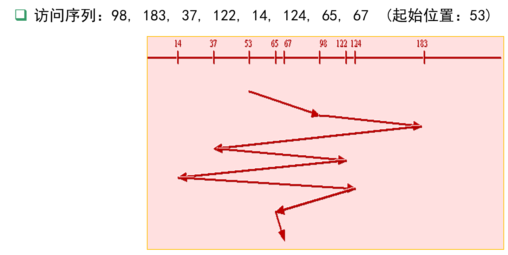
最简单的磁盘调度算法，根据进程请求访问磁盘的先后次序进行调度。仅适于请求磁盘I/O的进程数目较少的场合。
优点：公平简单，每个进程的请求都能一次得到处理，不会出现某一进程的请求长期得不到满足的情况。
缺点：由于未对寻道进行优化，致使平均寻道时间较长。

#### 最短寻道时间有限SSTF

优先选择距当前磁头最近的访问请求进行服务。
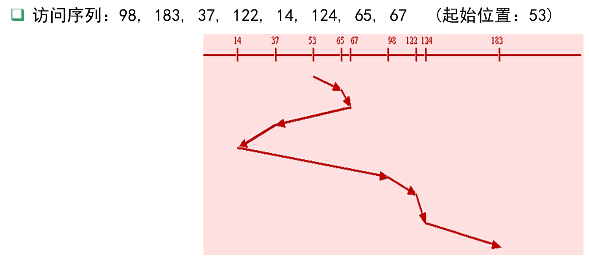
选择这样的进程，其要求访问的磁道与当前磁头所在的磁道距离最近，以使每次的寻道时间最短，但不保证平均寻道时间最短

#### 扫描算法SCAN

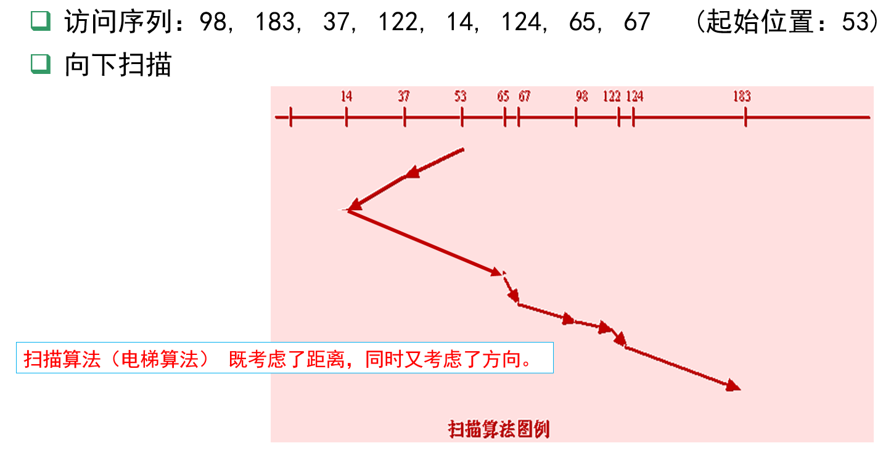

#### 循环扫描算法CSCAN

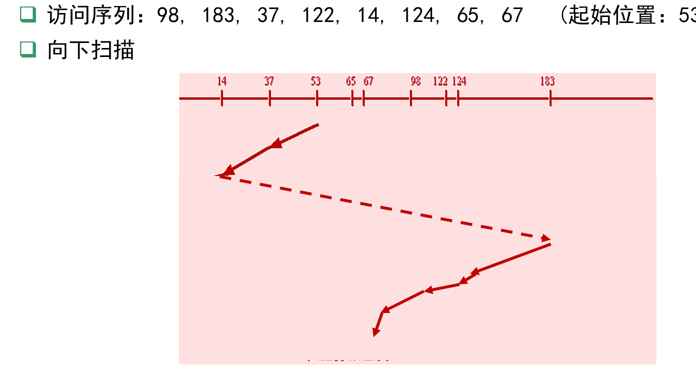