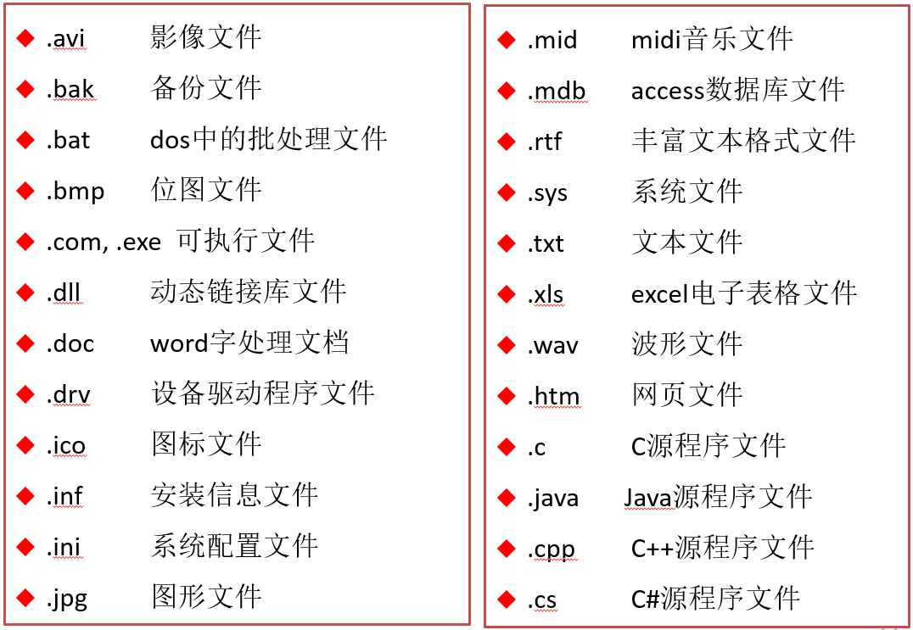
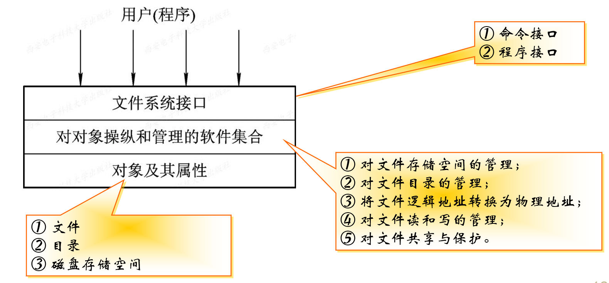
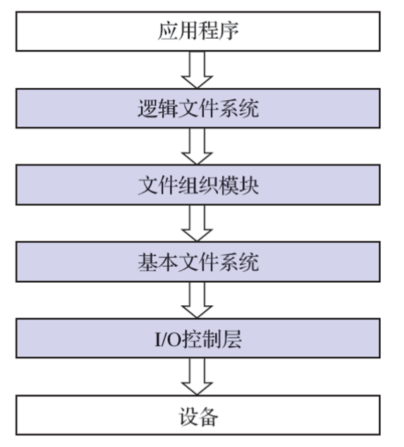
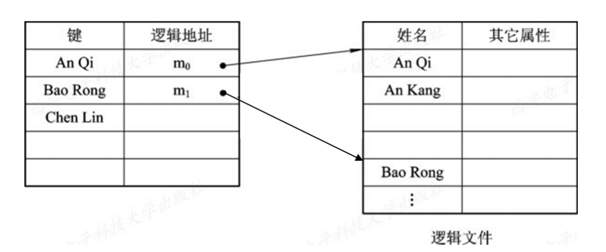
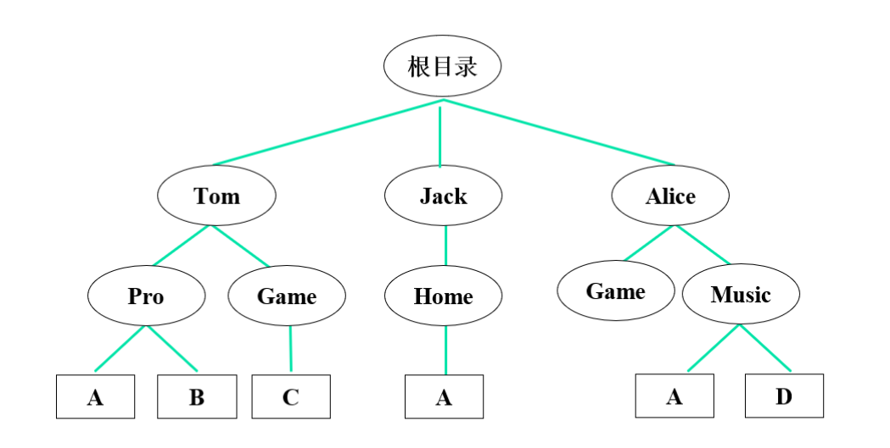
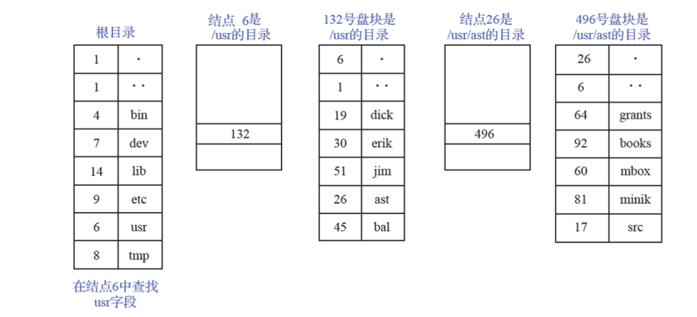
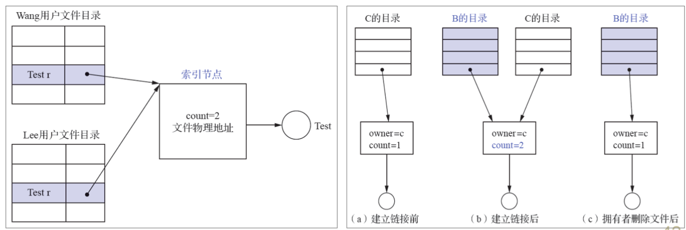
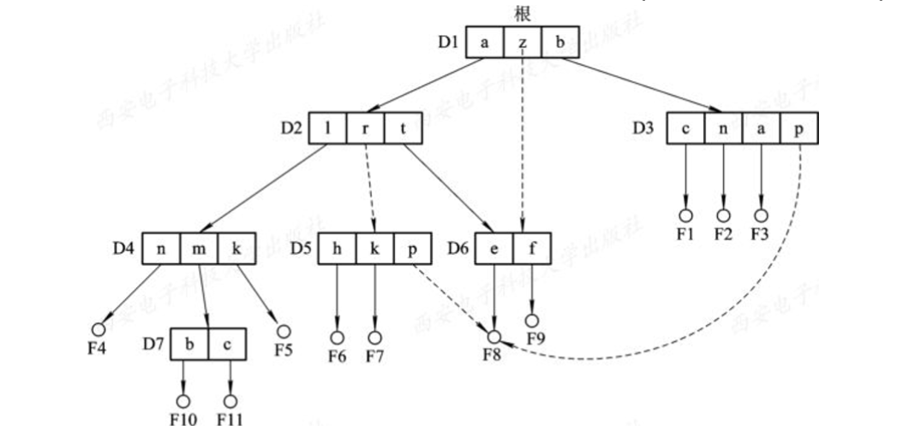
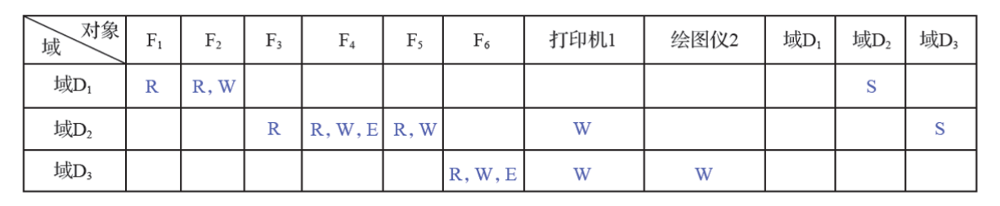

## 1 文件和文件系统

### 1.1 文件的概念

文件：一组带标识的在**逻辑上有完整意义**的信息项的序列，这个标识为文件名。

主要属性：文件类型、文件长度、文件的物理位置、文件的建立时间

命名形式：`文件名.扩展名`，扩展名代表文件的类型

### 1.2 文件类型

1. 按性质和用途分：系统文件、库文件、用户文件。
2. 按组织形式分：

- 普通文件：一般格式文件
- 目录文件：由文件的目录构成的特殊文件，是管理文件系统的系统文件。主要用于检索文件的目录信息
- 特殊文件（设备文件）：与设备驱动程序紧密相连，OS会把其操作转成为设备的操作。分为**字符设备文件**：例如模仿终端、打印机和网络等；**块设备文件**：例如模仿磁盘

3. 按数据的形式分：源文件、目标文件、可执行文件
4. 按存取控制属性分：只执行文件、只读文件、读写文件

### 1.3 文件系统

文件系统是操作系统中负责管理和存取文件信息的软件机构。

文件系统的组成：

- 管理文件所需的数据结构：如目录表、文件控制块、存储分配表
- 管理程序
- 一组操作

文件系统的功能：对文件存储空间的管理、对文件目录的管理、用于将文件的逻辑地址转换为物理地址的机制、对文件读和写的管理、对文件的共享和保护

文件系统模型

>**命令接口**：指作为用户与文件系统直接交互的接口，用户可通过键盘终端键入命令取得文件系统的服务。**程序接口**：指作为用户程序与文件系统的接口，用户程序可通过系统调用取得文件系统的服务

文件系统的层次结构

### 1.4 文件操作

1. 最基本的文件操作

- 创建文件(create)
- 删除文件(delete)
- 读文件(read)
- 写文件(write)
- 设置文件读/写位置(set)

2. 文件的打开和关闭操作

- 打开(open)
- 关闭(close)

3. 其他操作

- 设置/获得文件属性，如改变文件名、改变文件拥有者等
- 有关目录的操作，如创建、删除目录等

## 2 文件的逻辑结构

### 2.1 按文件是否有结构分类

1. 有结构文件：变长记录、定长记录
2. 无结构文件，又称流式文件。文件长度是以**字节**为单位，利用**读、写指针**来指出下一个要访问的字符。例如源程序、可执行文件、库函数等。

### 2.2 按文件的组织方式分类

#### 顺序文件

顺序文件的排列方式：串结构（记录按存入先后顺序排列）、顺序结构（按关键字排列）。

优点是批量存取效率高；缺点是查找费时删除困难

#### 索引文件

按**关键字**建立索引，即为变长记录文件建立一张索引表，索引表按关键字排序，实现了直接存取。也可为顺序文件建立**多个索引表**，为每一个可能成为检索条件的域配置一张索引表。

#### 索引顺序文件

索引顺序文件的特征：是对顺序文件的一种改进，基本上克服了变长记录的顺序文件不能随机访问，以及不便于记录的删除和插入的缺点。

保留了顺序文件的关键特征，即记录是按关键字的顺序组织起来的。增加了两个新特征：**引入了索引表**，通过该表可以实现对索引顺序文件随机访问；**增加了溢出文件**，用它来记录新增加的、删除的和修改的记录。

一级索引顺序文件

>如果在一个顺序文件中所含有的记录数为$N$，则为检索到具有指定关键字的记录，平均须查找$N/2$个记录；对于索引顺序文件，则为能检索到具有指定关键字的记录，平均只要查找$sqrt(N)$个记录数，因而其检索效率比顺序文件提高约$sqrt(N)/2$倍。

两级索引顺序文件：对于一个非常大的文件，为进一步提高检索效率，可以为顺序文件建立多级索引，即为索引文件再建立一张索引表，从而形成两级索引表。

直接文件：根据**关键字**直接获得指定记录的物理地址。即，关键字本身就决定了记录的物理地址。

## 3 文件目录

目录管理四大基本功能：按名存取、检索速度、文件重名、文件共享

### 3.1 文件控制块

文件控制块(FCB)：文件控制块是OS为管理文件而设置的数据结构，存放了为管理文件所需的所有有关信息（文件属性）。**FCB是文件存在的标志**。

FCB的内容：

- 基本信息：文件名、物理位置、逻辑结构、物理结构
- 存取控制信息：文件主/核准用户/一般用户存取权限
- 使用信息：文件建立时间、最近修改日期等使用信息

### 3.2 几个基本概念

**文件目录**：把所有文件的FCB组织在一起，就构成了文件目录，即文件控制块的有序集合。

**目录项**：构成文件目录的项目（目录项就是FCB）

**目录文件**：为实现对文件目录的管理，通常将文件目录以文件的形式保存在外存，这个文件就叫目录文件。

### 3.3 目录结构

目录结构类型：单级文件目录、二级文件目录、多级文件目录（树形目录）

树形结构目录几个概念：根目录、父目录、子目录、树叶（文件）

>路径名(path name)：从树的根（主目录）开始，把各级目录名与数据文件名依次地用 “/” 连接起来，即构成该数据文件唯一的路径名。绝对路径名：从树根直到树叶（数据文件）为止，包括各中间节点（目录）名的全部路径名；相对路径名：当前目录（工作目录）。

多级目录结构的特点：

- 层次清晰
- 不同层次、不同用户的文件可以被赋予不同的存取权限，有利于文件的保护
- 解决了文件重名问题
- 查找搜索速度快

目录查询技术：

1. 线性检索法：顺序检索法。例如查找`/usr/ast/mbox`的过程
   

2. Hash法：将文件名变换为索引值，再利用该索引值到目录中去查找。

## 4 文件共享

### 4.1 基于有向无环图实现共享

有向无环图：树形目录中，允许一个文件有多个父目录。

利用索引节点实现共享，设置链接技术变量count

### 4.2 利用符号链接实现共享

基本思想：允许一个文件有多个父目录，但其中**仅有一个作为主父目录**，其他父目录都是通过符号链接方式与之链接的(简称链接父目录)。

>系统创建一个`LINK`类型的新文件，取名为F8_link，并将F8_link写入链接父目录D5中，以实现D5与文件F8的链接。在新文件F8_link中包含被链接文件F8的路径名。这样的链接方法被称为符号链接，新文件F8_link中的路径名则只被看做是符号链接。当用户通过D5访问F8且正要读LINK类新文件F8_link时，此要求被OS截断，OS根据新文件中的路径名去找到文件F8，实现共享。

## 5 文件保护

影响文件安全性的主要因素：

- 人为因素（采取存取控制机制）
- 系统因素（采取系统容错技术）
- 自然因素（建立后备系统）

 一个进程能对某对象执行操作的权力，称为**访问权**(Access right)。

**保护域**简称为“域”，“域”是进程对一组对象访问权的集合，进程只能在指定域内执行操作。即**规定了进程所能访问的对象和能执行的操作。**

访问矩阵：用矩阵来描述系统的访问控制，行代表域，列代表对象，每一项为访问权

具有域切换权的访问控制矩阵：能够将进程从**一个保护域切换为另一个域**。如，由于域D1和D2所对应的项中有一个S（即切换权），则允许在域D1中进程切换到域D2中。
