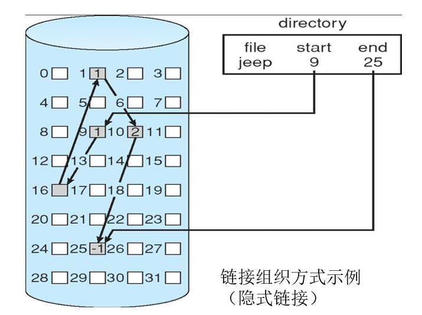
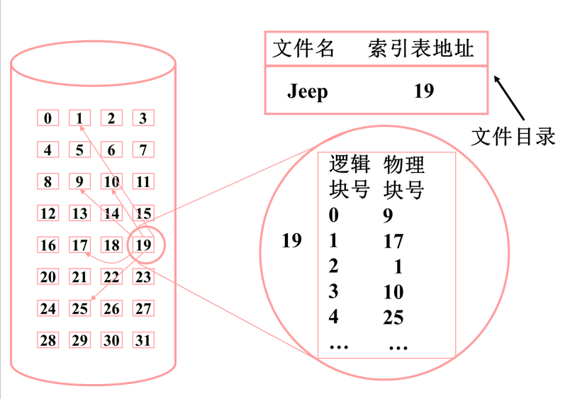
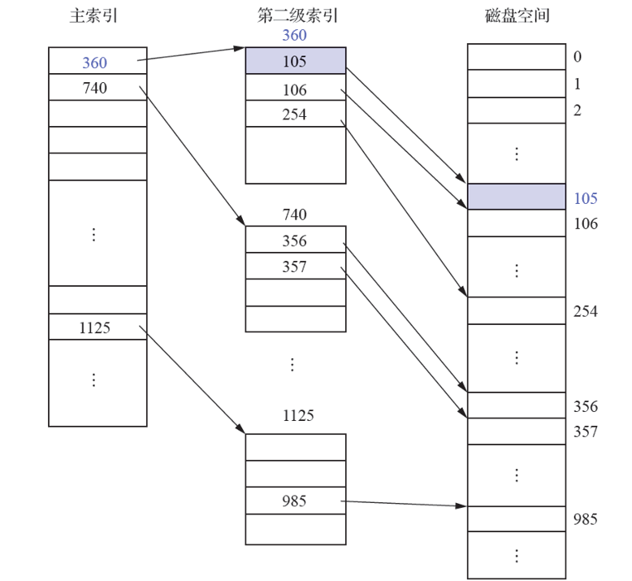
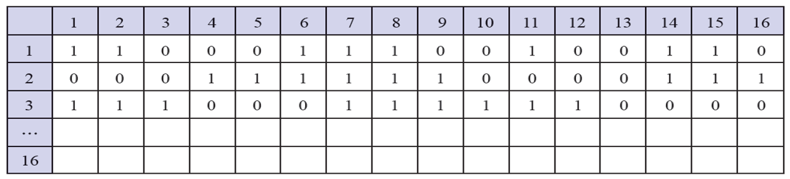
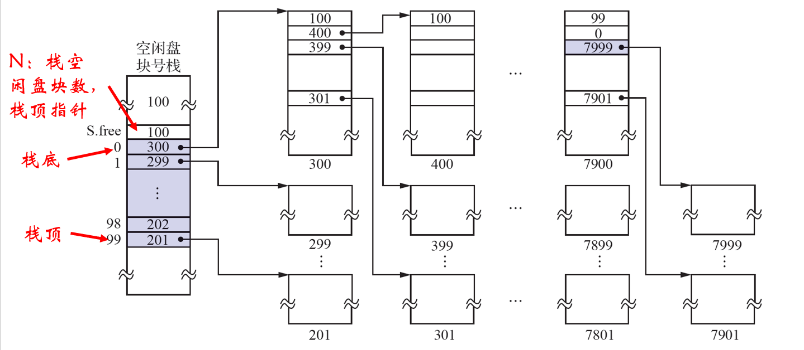

## 1 外存的组织方式

### 1.1 概述

文件的物理结构直接与外存的组织方式有关，不同的外存组织方式，将形成不同的文件物理结构。

- **连续组织方式**：形成的文件物理结构是**顺序式文件结构**
- **链接组织方式**：形成的文件物理结构是**链接式文件结构**
- **索引组织方式**：形成的文件物理结构是**索引式文件结构**

### 1.2 连续组织方式

为每个文件分配一组**相邻连续**的磁盘块，形成的物理文件叫**顺序文件**。

优点：顺序访问容易、速度快

缺点：会产生许多外部碎片，外存空间利用率低；必须事先知道文件的长度；不能灵活地删除和插入记录；文件不能动态增长。

### 1.3 链接组织方式

为文件**分配不连续的盘块**，通过链接指针将一个文件的所有盘块链接在一起，所形成的物理文件称为**链接文件**。

优点：消除外碎片，提高了利用率；插、删、改记录很容易；适应文件动态增长
缺点：隐式链接：指针存放在每个盘块中，只适用于顺序访问；显式链接：指针显式地存放在内存的文件分配表FAT中。

### 1.4 索引组织方式

把所有的磁盘块号放在一个索引块（表）中。

优点：既能顺序存取，又能随机存取；满足了文件动态增、插、删的要求；能充分利用外存空间。
缺点：较多的寻道次数和寻道时间；索引表本身带来了系统开销。

索引表的链接模式：一个索引表占用一个盘块，读写简单，但大文件就需要用多个索引表并将之链接起来，存取速度慢。

多级索引：将一个大文件的所有索引表（二级索引）的地址放在另一个索引表（一级索引）中，还可扩展三级或四级索引，能存取很长的文件，但速度慢。

## 2 文件存储空间的管理

### 2.1 概述

文件存储空间的**基本分配单位是盘块**(block)。

常用的管理方法：空闲区表法、空闲链表法、位示图法、成组链接法

### 2.2 空闲区表法

系统为外存上所有空闲区建立一张空闲表，属于连续分配方式。

**分配**类似于内存分区动态分配，如首次适应、最佳适应算法等。

**回收**时，也类似于内存回收方法。

### 2.3 空闲链表法

**空闲盘块链**：以盘块为单位链接起来。优点是分配回收简单，缺点是效率较低。

**空闲盘区链**：将所有空闲盘区链接起来，分配盘区方法与内存动态分区分配类似。优点是效率较高，缺点是分配和回收较复杂。

### 2.4 位示图法

位示图法是一个$m*n$的矩阵，可描述为 Map[m,n] ,每个物理块都对应一个比特位。"0" 表示空闲，"1" 表示已分配

盘块的分配，分三步进行：
（1）顺序扫描位示图，找出一个/组空闲 "0" 位；
（2）将空闲位换成盘块号，假定空闲 "0" 位于第 i 行第 j 列，n 为每行位数，则 盘块号 $b=n(i-1)+j$
（3）修改位示图，令 Map[i,j] = 1

盘块的回收，分两步：
（1）将盘块号转换成位示图中的行号和列号。转换公式：行号$i=(b-1)/n+1$ ，列号$j=(b-1)\%n+1$
（2）修改位示图，令 Map[i,j] = 0

### 2.4 成组链接法

空闲盘块的组织：文件区中的所有空闲盘块，被分成若干个组；将每一组含有的盘块总数N和该组所有的盘块号，计入其前一组的第一个盘块的`S.free(0)~S.free(99)`中；将第一组的盘块总数和所有的盘块号，计入空闲盘块号栈中，作为当前可供分配的空闲盘块号；最末一组只有99个盘块。

假定磁盘共有10000个盘块，每100个盘块作为一组，其中第201~7999号用于存放文件，即文件区。