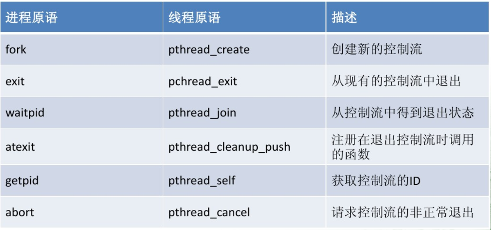

### 实验名称：经典同步问题：生成者与消费者问题

### 相关知识

#### 信号量

信号量是用来协调不同进程间的数据对象，可用来保护共享资源，也能用来实现进程间及同一进程不同线程间的进程同步。分为二值信号灯和计算信号灯两种类型。

#### 进程与线程原语的比较



#### 线程创建

线程创建是通过函数 `pthread_create(thread,attr,start_routine,arg)`函数来实现的，而该函数是通过Linux特有的系统调用`clone`来实现的。
格式：

```c
#include<pthread.h>
int pthread_create(thread,attr,start_routine,arg);
```

其中参数`thread`为线程标识符，`attr`为线程属性设置，`start_routine`为线程函数起始地址，`arg`为传递给`start_routine`的参数。创建线程成功返回0，否则返回错误号。

#### 获得线程标识符

格式：

```c
#include<pthread.h>
pthread_t pthread_self(void);
```

说明：返回调用的线程的标识符。每个线程都有自己的线程标识符，以便在进程内区分，线程标识符在`pthread_create`创建时产生。

#### 线程等待

格式：

```c
#include<pthread.h>
int pthread_join(thread,retval);
```

说明：该函数将调用它的线程阻塞，一直等到被等待的线程结束为止，当函数返回时，被等待线程的资源被收回。`thread`为被等待的线程标识符，`retval`为用户定义的指针，存放被等待线程的返回值。

#### 线程退出

格式：

```c
#include<pthread.h>
void pthread_exit(retval); //终止调用线程，`retval`为线程的返回值。

int pthread_cancel(thread); //终止由参数thread指定的线程
```

### 实验内容

使用多线程和信号量解决生产者/消费者问题：有一个长度为N的缓冲池被生产者和消费者共同使用。只要缓冲池未满，生产者就可以将消息送入缓冲池；只要缓冲池不空，消费者便可从缓冲池中取走一个消息。生产者向缓冲池放入消息的同时，消费者不能操作缓冲池，反之亦然。

`pthread_join()`将调用它的线程阻塞，一直等到被等待的线程结束为止，当函数返回时，被等待线程的资源被收回。本实验中使用`room_sem`信号量来表示缓冲区可用空间，`product_sem`信号量表示缓冲区中有无可用产品，而`mutex`代表线程互斥信号量。

编写`producer_consumer.c`:

```c
#include<stdio.h>
#include<stdlib.h>
#include<unistd.h>
#include<pthread.h>
#include<semaphore.h>
#include<sys/types.h>
#define PRODUCER_NUM 5
#define CONSUMER_NUM 5
#define POOL_SIZE 11
int pool[POOL_SIZE]; //buffer
int head=0; //read pointer
int rear=0; //write pointer
sem_t room_sem;//available room in buffer
sem_t product_sem;//available products in buffer
pthread_mutex_t mutex;
void producer_fun(void*arg)
{
        while(1)
        {
                sleep(1);
                sem_wait(&room_sem);
                pthread_mutex_lock(&mutex);
                //producer write data to buffer
                pool[rear]=1;
                rear=(rear+1)%POOL_SIZE;
                printf("producer %d write to pool\n",(int)arg);
                printf("pool size is %d\n",(rear-head+POOL_SIZE)%POOL_SIZE);
                pthread_mutex_unlock(&mutex);
                sem_post(&product_sem);
        }
}
void consumer_fun(void *arg)
{
        while(1)
        {
                int data;
                sleep(10);
                sem_wait(&product_sem);
                pthread_mutex_lock(&mutex);
                //consumer read data in buffer
                data=pool[head];
                head=(head+1)%POOL_SIZE;
                printf("consumer %d read from pool\n",(int)arg);
                printf("pool size is %d\n",(rear-head+POOL_SIZE)%POOL_SIZE);
                pthread_mutex_unlock(&mutex);
                sem_post(&room_sem);
        }
}
int main()
{
        pthread_t producer_id[PRODUCER_NUM];
        pthread_t consumer_id[CONSUMER_NUM];
        pthread_mutex_init(&mutex,NULL);
        int ret=sem_init(&room_sem,0,POOL_SIZE-1);//initialize the signal room_sem
        if(ret!=0)
        {
                printf("sem_init error\n");
                exit(0);
        }
        ret=sem_init(&product_sem,0,0); //initialize the signal produc_sem
        if(ret!=0)
        {
                printf("sem_init error\n");
                exit(0);
        }
        for(int i=0;i<PRODUCER_NUM;i++)
        {
                //create producer thread
                ret=pthread_create(&producer_id[i],NULL,producer_fun,(void*)i);
                if(ret!=0)
                {
                        printf("producer_id error\n");
                        exit(0);
                }
                //create consumer thread
                ret=pthread_create(&consumer_id[i],NULL,consumer_fun,(void*)i);
                if(ret!=0)
                {
                        printf("consumer_id error\n");
                        exit(0);
                }
        }
        for(int i=0;i<PRODUCER_NUM;i++)
        {
                pthread_join(producer_id[i],NULL);
                pthread_join(consumer_id[i],NULL);
        }
        exit(0);
}
```

编译时使用以下命令：
`gcc -o producer_consumer producer_consumer.c -lpthread`

>注：编译选项要加上`-lpthread`，因为`pthread`不是Linux默认库，链接时需要使用静态库`libpthread.a`。