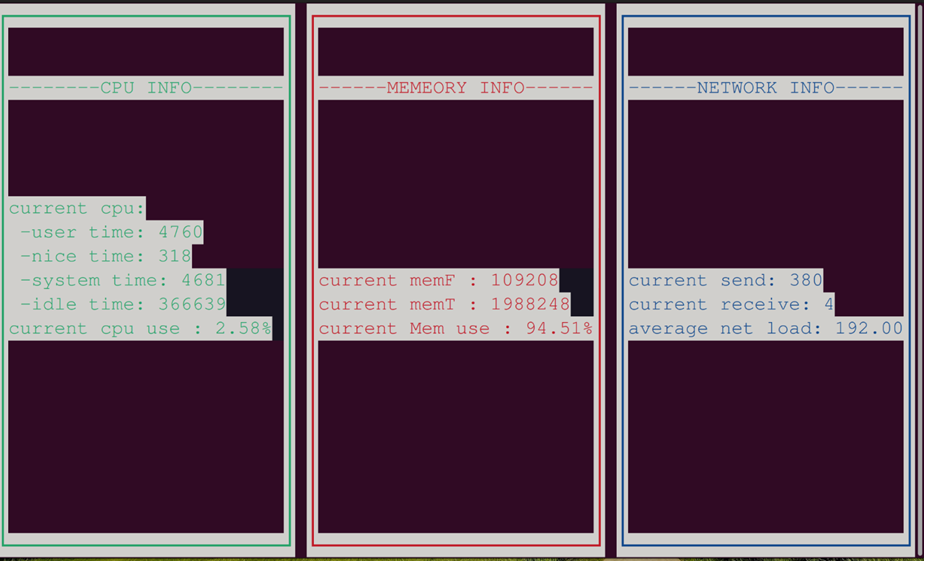

## 实验目的

- 加深对进程概念理解，进一步认识进程并发执行
- 掌握Linux系统的进程创建和终止操作
- 掌握文件系统调用及文件标准子例程的编程方法
- 掌握Linux下终端图形编程方法，能编写基于文本的图形界面
- 掌握proc文件系统的使用

## 相关知识

Linux C编程中的头文件

| 头文件      | 含义                               |
| ----------- | ---------------------------------- |
| stdio.h     | 标准输出输入                       |
| stdlib.h    | 标准库头文件                       |
| string.h    | 字符串处理相关函数                 |
| unistd.h    | 类UNIX系统的系统调用               |
| fcntl.h     | 定义了文件信息控制                 |
| sys/types.h | 基本系统数据类型，包括多个派生类型 |
| sys/stat.h  | 方便获取文件属性                   |
| sys/time.h  | 时间、日期相关函数                 |

### 进程的创建

格式：

```c
#include<sys/types.h>
#include<unistd.h>
pid_t getpid(void); //返回调用进程id号
pid_t getppid(void); //返回调用进程的父进程id号
pid_t fork(void);
```

说明：进程调用fork创建一个子进程，`pid_t`表示有符号整形量，若调用成功，则在父进程中返回子进程的pid，在子进程中返回0，创建失败返回-1；

`fork()`产生当前进程的拷贝，该函数“调用一次，返回两次”，即在父进程中调用一次，在父进程和子进程中各返回一次。开始是一个控制流程，调用fork之后发生分叉，变成两个控制流程，这就是fork名称的由来。

### 进程终止

格式：

```c
#include<stdlib.h>
void exit(int status);
```

说明：`exit()`自我终止当前进程，使其进入僵死状态，等待父进程进行善后处理，`status`是返回给父进程的一个整数。

### 文件系统调用

文件使用方式：打开文件→文件读/写→关闭文件

1. 打开文件—open

```c
int open(filename,int flags);
int open(filename,int flags,mode_t mode);
```

| 标志      | 含义                                               |
| --------- | -------------------------------------------------- |
| O_RDONLY  | 以只读的方式打开文件                               |
| O_WRONLY  | 以只写方式打开文件                                 |
| O_RDWR    | 以读写方式打开文件                                 |
| O_APPEND  | 以追加的方式打开文件                               |
| O_CREATE  | 如没有要打开的文件，创建该文件                     |
| O_EXEC    | 若使用了O_CREATE而且文件以及存在，就会发生一个错误 |
| O_NOBLOCK | 以非阻塞的方式打开一个文件                         |
| O_TRUNC   | 若文件已经存在，则删除文件的内容                   |

`mode`为八进制数表示文件权限，例如：`0640`表示`-rw-r-----`

打开文件示例：

```c
open("test",O_RDONLY|O_CREATE,0640); //成功则返回一个文件描述符，否则返回-1
```

文件描述符是由无符号整数表示的句柄，进程使用它来标识打开的文件。

文件描述符与包括相关信息（如文件的打开模式、文件的位置类型、文件的初始类型等）的文件对象关联，这些信息被称作文件的上下文。

内核利用文件描述符(file descriptor)来访问文件，在形式上它是一个非负整数，代表一个索引值，指向内核为每一个进程所维护的该进程打开文件的记录表。习惯上，标准输入(standard input)的文件描述符是0，标准输出(standard output)是1，标准错误(standard error)是2。POSIX定义了STDIN_FILENO、STDOUT_FILENO和STDERR_FILENO来代替0、1、2，这三个符号常量位于头文件`unistd.h`中。

2. 读文件—read

```c
ssize_t read(int fd, void * buf, size_t count);
```

说明：从文件描述符fd所指文件中读取count字节的数据，放到缓冲区buf中。如果成功则返回读取的字节数，出错返回-1；若在调read之前已到达文件末尾，则这次read返回0。

3. 写文件—write

```c
ssize_t write (int fd, const void * buf, size_t count);
```

说明：将缓冲区buf中count个字节写入文件描述符fd所指文件中去。若调用成功返回实际写入的字节数；若发生fd有误或者磁盘已满等问题，返回值 < count；若没有写出任何数据，则返回值为0；调用不成功返回-1，并将错误代码存入errno中。

4. 关闭文件—close

```c
int close(int fd); //成功返回0，否则返回-1
```

关闭文件和打开文件是配对的，即打开的文件最好要显式的关闭。


### C库函数

C文件操作用库函数实现，包含在`stdio.h`中，系统自动打开和关闭三个标准文件：

- 标准输入-键盘（stdin）
- 标准输出-显示器（stdout）
- 标准出错输出-显示器（stderr）

1. 文件打开—fopen
   函数原型：

```c
FILE *fopen(const char *filename, const char *mode)
```

该函数使用给定的模式 mode 打开 filename 所指向的文件。其中mode值为以下：

| 文件使用方式 | 含义                                                         |
| ------------ | ------------------------------------------------------------ |
| "r"          | 打开一个用于读取的文件。该文件必须存在。                     |
| "w"          | 创建一个用于写入的空文件。如果文件名称与已存在的文件相同，则会删除已有文件的内容，文件被视为一个新的空文件。 |
| "a"          | 追加到一个文件。写操作向文件末尾追加数据。如果文件不存在，则创建文件。 |
| "r+"         | 打开一个用于更新的文件，可读取也可写入。该文件必须存在。     |
| "w+"         | 创建一个用于读写的空文件。                                   |
| "a+"         | 打开一个用于读取和追加的文件。                               |

返回值：该函数返回一个 指向文件结构体的FILE 指针。否则返回 NULL，且设置全局变量 errno 来标识错误。

2. 文件读/写
   函数原型：

```c
size_t fread ( void *ptr, size_t size, size_t count, FILE *fp );
size_t fwrite ( void * ptr, size_t size, size_t count, FILE *fp );
```

`fread()` 函数用来从指定文件中读取块数据。所谓块数据，也就是若干个字节的数据，可以是一个字符，可以是一个字符串，可以是多行数据，并没有什么限制。对参数的说明：

- `ptr` 为内存区块的指针，它可以是数组、变量、结构体等。`fread()` 中的 `ptr` 用来存放读取到的数据，`fwrite()` 中的 `ptr` 用来存放要写入的数据。
- `size`：表示每个数据块的字节数。
- `count`：表示要读写的数据块的块数。
- `fp`：表示文件指针。

理论上，每次读写 `size*count` 个字节的数据。
返回值：返回成功读写的块数，也即 count。如果返回值小于 count：

- 对于 `fwrite()` 来说，肯定发生了写入错误，可以用 `ferror()` 函数检测。
- 对于 `fread()` 来说，可能读到了文件末尾，可能发生了错误，可以用 `ferror()` 或 `feof()` 检测。

3. 文件关闭—fclose
   函数原型：`fclose(fp)`
   作用：关闭fp指向的文件，使文件指针变量与文件“脱销”，释放文件结构体和文件指针。正常关闭返回0；出错时返回非0；


### curses编程

### proc文件系统

proc文件系统是Linux中的特殊文件系统，提供给用户一个可以了解内核内部工作过程的可读窗口，在运行时访问内核内部数据结构、改变内核设置的机制。

- 保存系统当前工作的特殊数据，但并不存在于任何物理设备中；
- 对其进行读写时，才根据系统中的相关信息即时生成；或映射到系统中的变量或数据结构；
- proc被称为'伪文件系统，
- 其挂接目录点固定为/proc；
- `man proc`进行了详细说明。

`/proc`的文件可以用于访问有关内核的状态、计算机的属性、正在运行的进程的状态等信息。大部分`/proc`中的文件和目录提供系统物理环境最新的信息。

尽管`/proc`中的文件是虚拟的，但它们仍可以使用任何文件编辑器或像`more`, `less`或`cat`这样的程序来查看。当编辑程序试图打开一个虚拟文件时，这个文件就通过内核中的信息被凭空地(on the fly)创建了。

得到有用的系统/内核信息
proc文件系统可以被用于收集有用的关于系统和运行中的内核的信息。下面是一些重要的文件：

| 文件              | 含义                                |
| ----------------- | ----------------------------------- |
| /proc/cpuinfo     | CPU的信息（型号、家族、缓存大小等） |
| /proc/meminfo     | 物理内存、交换空间等的信息          |
| /proc/mounts      | 已加载的文件系统的列表              |
| /proc/devices     | 可用设备的列表                      |
| /proc/filesystems | 被支持的文件系统                    |
| /proc/modules     | 已加载的模块                        |
| /proc/version     | 内核版本                            |
| /proc/cmdline     | 系统启动时输入的内核命令行参数      |

文件`/proc/cpuinfo`包含一个系统的CPU信息，十分清楚地给出了这个系统的有用的硬件信息。
可以使用以下命令查看：

```bash
ls -l /proc/cpuinfo
```

## 实验内容

编写一个C程序，使用Linux下基于文本的终端图形编程库curses，分窗口实时监测（即周期性刷新显示）CPU、内存和网络的详细使用情况和它们的利用率。

```c
#include <curses.h>
#include <time.h>
#include <string.h>
#include <sys/wait.h>
#include <unistd.h>
#include <fcntl.h>
#include <sys/types.h>
#include <sys/stat.h>
#include <stdio.h>
#include <sys/types.h>
#include <stdlib.h>
#include <sys/sem.h>
#include <sys/ipc.h>
#include <sys/shm.h>

int main()
{
    pid_t pid1, pid2, pid3;
    unsigned int receive0, send0;
    initscr();
    refresh();
    WINDOW *wp1, *wp2, *wp3; /*定义分屏，并指定各个分屏位置*/

    wp3 = subwin(stdscr, LINES, COLS / 3, 0, 0);
    wp2 = subwin(stdscr, LINES, COLS / 3, 0, COLS / 3 + 1);
    wp1 = subwin(stdscr, LINES, COLS / 3, 0, COLS / 3 * 2 + 2);
    if (start_color() == OK)
    {
        box(wp3, ACS_VLINE, ACS_HLINE);
        box(wp2, ACS_VLINE, ACS_HLINE);
        box(wp1, ACS_VLINE, ACS_HLINE);
        touchwin(stdscr);

        init_pair(1, COLOR_BLUE, COLOR_WHITE); /*定义一组颜色*/
        wattron(wp1, COLOR_PAIR(1));           /*激活颜色到分屏*/
        init_pair(2, COLOR_RED, COLOR_WHITE);
        wattron(wp2, COLOR_PAIR(2));
        init_pair(3, COLOR_GREEN, COLOR_WHITE);
        wattron(wp3, COLOR_PAIR(3));

        int sum = 0, i;
        if (0 == (pid3 = fork())) /*进程3负责监控cpu使用情况和利用率*/
        {
            FILE *fp;
            char buf[256];
            char cpu[5];
            long user, nice, sys, idle;
            long all1, all2, idle1, idle2;
            float usage, usage1, usage2;
            while (1)
            {
                fp = fopen("/proc/stat", "r");
                if (fp == NULL)
                {
                    perror("fopen:");
                    exit(0);
                }

                wmove(wp3,3,1);
                wprintw(wp3,"--------CPU INFO--------");
                fgets(buf, sizeof(buf), fp);
                sscanf(buf, "%s %ld %ld %ld %ld", cpu, &user, &nice, &sys, &idle);
                wmove(wp3, LINES / 2 - 3, 1);
                wprintw(wp3, "current cpu:\n  -user time: %ld\n  -nice time: %ld\n  -system time: %ld\n  -idle time: %ld\n", user, nice, sys, idle); /*两次获取求平均值。*/

                all1 = (user + nice + sys + idle) / 100;
                idle1 = idle / 100;
                rewind(fp);
                sleep(1);
                memset(buf, 0, sizeof(buf));
                cpu[0] = '\0';
                user = nice = sys = idle = 0;
                fgets(buf, sizeof(buf), fp);
                sscanf(buf, "%s %ld %ld %ld %ld", cpu, &user, &nice, &sys, &idle);
                all2 = (user + nice + sys + idle) / 100;
                idle2 = idle / 100;
                usage1 = (float)(all1 - idle1) / all1 * 100;
                usage2 = (float)(all2 - idle2) / all2 * 100;
                usage = (usage1 + usage2) / 2;

                wmove(wp3, LINES / 2 + 2, 1);
                wprintw(wp3, "current cpu use : %.2f\%\n", usage);

                curs_set(0);
                box(wp3, ACS_VLINE, ACS_HLINE);
                fclose(fp);
                sleep(1);
                wrefresh(wp3);
            }
        }
        if (0 == (pid2 = fork())) /*进程2负责监控内存使用情况和利用率*/
        {
            FILE *fp1;
            char buf1[256];
            char name1[20];
            char name2[20];
            unsigned long MemT, MemF;
            float usage3, usage4;
            while (1)
            {
                fp1 = fopen("/proc/meminfo", "r");
                if (fp1 == NULL)
                {
                    perror("fopen:");
                    exit(0);
                }
                wmove(wp2,3,1);
                wprintw(wp2,"------MEMEORY INFO-------");
                fgets(buf1, sizeof(buf1), fp1);
                sscanf(buf1, "%s %lu %s", name1, &MemT, name2); /*第一行是总内存*/
                fgets(buf1, sizeof(buf1), fp1);
                sscanf(buf1, "%s %lu %s", name2, &MemF, name2); /*第二行是空闲内存*/
                wmove(wp2, LINES / 2, 1);
                wprintw(wp2, "current memF : %lu\n", MemF);
                wmove(wp2, LINES / 2 + 1, 1);
                wprintw(wp2, "current memT : %lu\n", MemT);
                usage3 = (float)MemF / 100;
                usage4 = (float)MemT / 100;
                usage3 = (double)(1 - (usage3 / usage4)) * 100;
                wmove(wp2, LINES / 2 + 2, 1);
                wprintw(wp2, "current Mem use : %.2f\%\n", usage3);

                curs_set(0);
                box(wp2, ACS_VLINE, ACS_HLINE);
                fclose(fp1);
                sleep(3);
                wrefresh(wp2); /*刷新屏幕，显示输出内容*/
            }
        }
        if (0 == (pid1 = fork())) /*进程1负责统计从监控开始工作后接受和发送数据包数，并计算平均负载*/
        {
            FILE *fp2; /*获取最初的网络状态，即发送和接受数据包数*/
            char buf2[256];
            char ch[20];
            unsigned int receive1, send1;
            float usage5;
            fp2 = fopen("/proc/net/dev", "r");
            if (fp2 == NULL)
            {
                perror("fopen:");
                exit(0);
            }
            fgets(buf2, sizeof(buf2), fp2);
            fgets(buf2, sizeof(buf2), fp2);
            fgets(buf2, sizeof(buf2), fp2);
            fgets(buf2, sizeof(buf2), fp2);
            sscanf(buf2, "%s %u %u", ch, &send0, &receive0);
            fclose(fp2);

            while (1)
            {
                fp2 = fopen("/proc/net/dev", "r");
                rewind(fp2); /*指针回到最初的位置*/
                memset(buf2, 0, sizeof(buf2));
                ch[0] = '\0';
                fgets(buf2, sizeof(buf2), fp2); /*fgets获取字符数足够大时，就会从文件中以行的方式读入，*/
                fgets(buf2, sizeof(buf2), fp2); /*由于所需数据在文件第四行，所以调用fgets四次*/
                fgets(buf2, sizeof(buf2), fp2);
                fgets(buf2, sizeof(buf2), fp2);
                wmove(wp1,3,1);
                wprintw(wp1,"------NETWORK INFO-------");
                sscanf(buf2, "%s %u %u", ch, &send1, &receive1);
                wmove(wp1, LINES / 2, 1);
                wprintw(wp1, "current send: %u\n", send1 - send0); /*计算参数变化量，并求均值，即为平均负载*/
                wmove(wp1, LINES / 2 + 1, 1);
                wprintw(wp1, "current receive: %u\n", receive1 - receive0);
                usage5 = (float)((send1 - send0) + (receive1 - receive0)) / 2;
                wmove(wp1, LINES / 2 + 2, 1);
                wprintw(wp1, "average net load: %.2f\n", usage5);
                box(wp1, ACS_VLINE, ACS_HLINE);
                fclose(fp2);
                sleep(4);
                wrefresh(wp1);
            }
        }

        waitpid(pid1, NULL, 0);
        waitpid(pid2, NULL, 0);
        waitpid(pid3, NULL, 0);

        wattroff(wp1, COLOR_PAIR(1));
        wattroff(wp2, COLOR_PAIR(2));
        wattroff(wp3, COLOR_PAIR(3));
        refresh();
        getch();
    }
    else
    {
        waddstr(stdscr, "Can not init color");
        refresh();
        getch();
    }
    getch();
    endwin();
    return 0;
}
```

实验结果：
