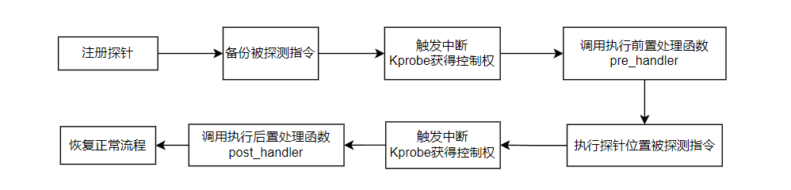

## 简介

传统的内核调试采用在源代码中插入`printk()`调用语句的方式。尽管其可以在内核的任何位置实现相应调试信息的获取， 但由于每一次对调试点的新增或修改，都需要重新编译内核， 所以这种方式具有相当的局限性且极其低效。为此， Linux 内核自2.6.9 版起便集成了一种所谓**Kprobes**（Kernel Probes ） 的运行时内核调试技术。这是一种非破坏性的二进制插桩技术， 且一般以可加载内核模块方式来动态地加载或卸载，故而不再需要重新编译内核。除了少数特定的函数以及自身实现代码之外， **Krobes** 几乎能在运行时内核的任意位置插入探针（ probe ）， 并设置由使用者自定义的处理函数， 因此极大地方便了人们对内核的开发与研究。

**Kprobes** 是IBM公司开发的一个轻量级调试工具，它允许内核运行时通过加载模块设置探测器，内核运行到探测点时便执行其相应的处理函数，其基本工作机制是：用户指定一个探测点，并把一个用户定义的处理函数关联到该探测点，当内核执行到该探测点时，相应的关联函数被执行，然后继续执行正常的代码路径。使用**Kprobes**可以轻松地通过收集处理器寄存器和全局数据结构等调试信息。开发者甚至可以使用**Kprobes**来修改寄存器值和全局数据结构的值。

**Kprobes**实现了三种类型的探测点：`kprobes`、`jprobes`和`kretprobes `（也叫返回探测点）。`kprobes`是可以被插入到内核的任何指令位置的探测点；`jprobes`则只能被插入到一个内核函数的入口；而`kretprobes `则是在指定的内核函数返回时才被执行。这三种类型可以用在不同情况的上下文中。

## 实现原理

当安装一个`kprobes`探测点时，**Kprobes**首先备份被探测的指令，然后使用断点指令（即在ｉ386和x86_64的`int3`指令） 来取代被探测指令的头一个或几个字节。当CPU执行到探测点时，将因运行断点指令而执行`trap`操作，那将导致保存CPU的寄存器调用相应的`trap`处理函数，而`trap`处理函数将调用相应的`notifier_call_chain` （内核中一种异步工作机制） 中注册的所有`notifier`函数，**Kprobes**正是通过向`trap`对应的`notifier_call_chain` 注册关联到探测点的处理函数来实现探测处理的。当**Kprobes**注册的`notifier`被执行时，它首先执行关联到探测点的`pre_handler`函数，并把相应的`kprobe struct`和保存的寄存器作为该函数的参数。



接着，**Kprobes**单步执行被探测指令的备份，最后，**Kprobes**执行`post_handler`。等所有这些运行完毕后，紧跟在被探测指令后的指令流`jprobe`通过注册`kprobes`在被探测函数入口来实现，它能无缝地访问被探测函数的参数。


`jprobe`处理函数应当和被探测函数有同样的原型，而且该处理函数在函数末必须调用**Kprobes**提供的函数`jprobe_return()`。当执行到该探测点时，**Kprobes**备份CPU寄存器和栈的一些部分，然后修改指令寄存器指向`jprobe`处理函数，当执行该`jprobe`处理函数时，寄存器和栈内容与执行真正的被探测函数一模一样，因此它不需要任何特别的处理就能访问函数参数，在该处理函数执行到最后时，它调用`jprobe_return()`，那导致寄存器和栈恢复到执行探测点时的状态，因此被探测函数能被正常运行。

> 需要注意，被探测函数的参数可能通过栈传递，也可能通过寄存器传递，但是`jprobe`对于两种情况都能工作，因为它既备份了栈，又备份了寄存器，当然，前提是`jprobe`处理函数原型必须与被探测函数完全一样。

`kretprobe`也使用了`kprobes`来实现，当用户调用`register_kretprobe()`时，**Kprobes**在被探测函数的入口建立了一个探测点，当执行到探测点时，**Kprobes**保存了被探测函数的返回地址并取代返回地址为一个`trampoline`的地址，**Kprobes**在初始化时定义了该`trampoline`并且为该`trampoline`注册了一个kprobe，当被探测函数执行它的返回指令时，控制传递到该`trampoline`，因此kprobe已经注册的对应于`trampoline`的处理函数将被执行，而该处理函数会调用用户关联到该`kretprobe`上的处理函数，处理完毕后，设置指令寄存器指向已经备份的函数返回地址，因而原来的函数返回被正常执行。

被探测函数的返回地址保存在类型为`kretprobe_instance`的变量中，结构`kretprobe`的`maxactive`字段指定了被探测函数可以被同时探测的实例数，函数`register_kretprobe()`将预分配指定数量的`kretprobe_instance`。如果被探测函数是非递归的并且调用时已经保持了自旋锁（spinlock），那么`maxactive`为1就足够了；如果被探测函数是非递归的且运行时是抢占失效的，那么`maxactive`为`NR_CPUS`就可以了；如果`maxactive`被设置为小于等于0，它被设置到缺省值（如果抢占使能，即配置了`CONFIG_PREEMPT`，缺省值为10和2∗`NR_CPUS`中的最大值，否则缺省值为`NR_CPUS`）。如果`maxactive`被设置的太小了，一些探测点的执行可能被丢失，但是不影响系统的正常运行，在结构`kretprobe`中`nmissed`字段将记录被丢失的探测点执行数，它在返回探测点被注册时设置为0，每次当执行探测函数而没有`kretprobe_instance`可用时，它就加1。

## Kprobes 启用及相关接口函数

支持**Kprobes**的相关内核配置选项：

| 配置选项              | 说明                             |
| --------------------- | -------------------------------- |
| CONFIG_KPROBES        | 启用**Kprobes**                  |
| CONFIG_MODULES        | 开启模块运行时插入支持           |
| CONFIG_MODULES_UNLOAD | 开启模块运行时卸载支持           |
| CONFIG_KALLSYMS       | 启用内核符号表                   |
| CONFIG_KALLSYMS_ALL   | 支持内核符号表中包含所有符号信息 |

**Kprobes**接口函数原型：

| 接口函数原型                                                 | 功能                         |
| ------------------------------------------------------------ | ---------------------------- |
| `int register_kprobe(struct kprobe * kp);`                   | kprobe探针注册函数原型       |
| `int pre_handler(struct kprobe*p,struct pt_regs*regs);`      | kprobe探针前置处理函数原型   |
| `void post_handler(struct kprobe*p,struct pt_regs*regs,unsigned long flags);` | kprobe探针后置处理函数原型   |
| `int fault_handler(struct kprobe*p,struct pt_regs*regs,int trapnr);` | kprobe探针错误处理函数原型   |
| `void unregister_kprobe(struct kprobe*kp);`                  | kprobe探针注销函数原型       |
| `int register_jprobe(struct jprobe*jp);`                     | jprobe探针注册函数原型       |
| `void unregister_jprobe(struct jprobe*jp);`                  | jprobe探针注销函数原型       |
| `int register_kretprobe(struct kretprobe*rp);`               | kretprobe探针注册函数原型    |
| `int kretprobe_handler(struct kretprobe_instance*ri,struct pt_regs*regs);` | 函数返回后调用的处理函数原型 |
| `void unregister_kretprobe(struct kretprobe*rp);`            | kretprobe探针注销函数原型    |

### struct kprobe

`kprobe` 结构体定义于源码文件`/linux/kprobe.h` 中， 是整个**Kprobes** 内核调试机制的基础。下面的代码段列出了其中较为关键的结构体成员。

```c
struct kprobe{
    kprobe_opcode_t * addr; 	/*待探测地址*/
    const char *symbol_name;	/*待探测函数名*/
    unsigned int offset;		/*地址偏移量*/
    kprobe_pre_handler_t pre_handler;		/*指向前置处理函数的指针*/
    kprobe_post_handler_t post_handler;		/*指向后置处理函数的指针*/
    kprobe_fault_handler_t fault_handler;	/*指向错误处理函数的指针*/
    kprobe_opcode_t opcode;		/*探测点处的原指令*/
    struct arch_specific_insn ainsn;		/*与平台相关的原指令副本*/
    ...... /*其它*/
};
```


所谓 *kprobe*探针其实就是该结构体的一个实例，用户可设置`symbol_name`、`offset`以及`addr`等字段来指定待探测的内核位置。其中`symbol_name`字段用来指定待探测内核函数的符号名，`offset`字段则用来告知**Kprobes**待探测位置相对于函数入口地址的偏移量，当需要探测相关函数内部的某个位置时，需要计算并设置该字段。

> 注意，在i386， x86_64等CISC类型的架构中，**Kprobes**注册探针时并不会检查探测点地址是否超过了指令边界，所以`offset`字段的使用需要格外谨慎。

此外，也可以直接设置`addr`字段来指定探测位置。事实上，在注册探针的过程中， **Kprobes** 首先会通过内核符号表查到**symbol_name**中存储的符号对应的地址， 然后在此基础上加上`offset`中设置的偏移量从而得到真正的探测点地址， 最后该地址会被填入当前结构体实例的`addr`字段中。需要指出的是， 如果`symbol_name` 与`addr`均被设值， 则注册*kprobe* 探针将直接返回错误信息。

`pre_handler`指定执行到探测点时执行的处理函数，`post_handler`指定执行完探测点后执行的处理函数，`fault_handler`指定错误处理函数，当在执行`pre_handler`、`post_handler`以及被探测函数期间发生错误时它会被调用。它们是**Kprobes**机制预设的回调钩子，也是实现内核运行时调试的关键。其函数原型为：

```c
/*前置处理函数的类型定义*/
typedef int(*kprobe_pre_handler_t)(struct kprobe*,struct pt_regs*);
/*后置处理函数的类型定义*/
typedef void(*kprobe_post_handler_t)(struct kprobe*,struct pt_regs*,unsigned long flags);
/*错误处理函数的类型定义*/
typedef int(*kprobe_fault_handler_t)(struct kprobe*,struct pt_regs*,int trapnr);
```

在调用该注册函数前，用户必须先设置好`struct kprobe`的这些字段，用户可以指定任何处理函数为`NULL`。

### register_kprobe

用于注册一个`kprobes`类型的探测点，其函数原型为：

```c
int register_kprobe(struct kprobe * kp);
```

为了使用该函数，用户需要在源文件中包含头文件`linux/kprobes.h`。该函数的参数是`struct kprobe`类型的指针。

该注册函数会在`kp->addr`地址处注册一个`kprobes`类型的探测点，当执行到该探测点时，将调用函数`kp->pre_handler()`执行完被探测函数后，将调用`kp->post_handler()`。如果在执行`kp->pre_handler()`、`kp->post_handler()`或在单步跟踪被探测函数期间发生错误，将调用`kp->fault_handler()`，该函数成功时返回0，否则返回负的错误码。

探测点处理函数`pre_handler()`的函数原型：

```c
int pre_handler(struct kprobe * p, struct pt_regs * regs)
```

用户必须按照该原型参数格式定义自己的`pre_handler()`，当然函数名取决于用户自己。参数ｐ就是指向该处理函数关联到的`kprobes`探测点的指针，可以在该函数内部引用该结构的任何字段。参数`regs`指向运行到探测点时保存的寄存器内容。Kprobe负责在调用`pre_handler()`时传递这些参数，用户不必关心，只是要知道在该函数内就能访问这些内容，一般地，它应当始终返回0。

探测点处理函数`post_handler()`的函数原型：

 ```c
void post_handler(struct kprobe * p, struct pt_regs * regs, unsigned long flags)
 ```

前两个参数与`pre_handler()`相同，最后一个参数`flags`总是0。
错误处理函数`fault_handler()`的原型如下：

```c
int fault_handler(struct kprobe * p,struct pt_regs * regs, int trapnr)
```

参数`trapnr`是与错误处理相关的架构依赖的`trap`号（例如对于i386通常的保护错误是13，而页失效错误是14）。如果成功地处理了异常，它应当返回1。

### register_jprobe

与`kprobe`不同的是，`jprobe`探针仅在函数入口处进行探测且一个函数只能注册一个`jprobe`实例，它常常用来获取传入函数的参数。其结构体定义如下：

```c
struct jprobe{
    struct kprobe kp;
    void *entry;	/*指向入口处需调用的处理函数的指针*/
};
```

其中`entry`成员指定被探测函数入口点处的处理函数，该处理函数需要与被探测函数具有一样的参数列表。而待探测函数则通过结构体实例中`kp`成员的`symbol_name`字段来指定。

该函数用于注册`jprobe`类型的探测点，其原型为：

```c
int register_jprobe(struct jprobe * jp);
```

用户在调用该注册函数前需要定义一个`struct jprobe`类型的变量并设置它的`kp.addr`和`entry`字段，`kp.addr`指定探测点的位置，它必须是被探测函数的第一条指令的地址，`entry`指定探测点的处理函数，该处理函数的参数表和返回类型应当与被探测函数完全相同，而且它必须正好在返回前调用`jprobe_return()`。如果被探测函数被声明为`asmlinkage`、`fastcall`或影响参数传递的任何其他形式，那么相应的处理函数也必须声明为相应的形式。

该注册函数在`jp->kp.addr`注册一个jprobes类型的探测点，当内核运行到该探测点时，`jp->entry`指定的函数会被执行。如果成功，该函数返回0，否则返回负的错误码。

### register_kretprobe

`kretprobe`一般用于获取指定函数的返回值，其结构体定义如下：

```c
struct kretprobe{
    struct kprobe kp;
    kretprobe_handler_t handler;	/*执行返回后需调用的处理函数的指针*/
    ...... /*其它*/
};
```

该函数用于注册`kretprobe`的探测点，其原型为：

```c
int register_kretprobe(struct kretprobe * rp);
```

该注册函数的参数为`struct kretprobe`类型的指针，用户在调用该函数前必须定义一个`struct kretprobe`的变量并设置它的`kp.addr`、`handler`以及`maxactive`字段。`kp.addr`指定探测点的位置，`handler`指定探测点的处理函数，`maxactive`指定可以同时运行的最大处理函数实例数，它应当被恰当设置，否则可能丢失探测点的某些运行。

该注册函数在地址`rp->kp.addr`注册一个kretprobe类型的探测点，当被探测函数返回时，`rp->handler`会被调用。如果成功，它返回0，否则返回负的错误码。

kretprobe处理函数的原型：

```c
int kretprobe_handler(struct kretprobe_instance * ri, struct pt_regs * regs);
```

参数`regs`指向保存的寄存器，`ri`指向类型为`struct kretprobe_instance`的变量，该结构的`ret_addr`字段表示返回地址，`rp`指向相应的`kretprobe_instance`变量，`task`字段指向相应的`task_struct`。结构`struct kretprobe_instance`是注册函数`register_kretprobe`根据用户指定的`maxactive`值来分配的，Kprobe负责在调用kretprobe处理函数时传递相应的`kretprobe_instance`。

### unregister * probe

对应于每一个注册函数，有相应的卸载函数。

```c
void unregister_kprobe(struct kprobe * kp);
void unregister_jprobe(struct jprobe * jp);
void unregister_kretprobe(struct kretprobe *rp);
```

上面是对应与三种探测点类型的卸载函数，当使用探测点的模块卸载或需要卸载已经注册的探测点时，需要使用相应的卸载函数来卸载已经注册的探测点，`kp`,`jp`和`rp`分别为指向结构`struct kprobe`、`struct jprobe`和`struct kretprobe`的指针，它们应当指向调用对应的注册函数时使用的那个结构，也就说注册和卸载必须针对同样的探测点，否则会导致系统崩溃。这些卸载函数可以在注册后的任何时刻调用。