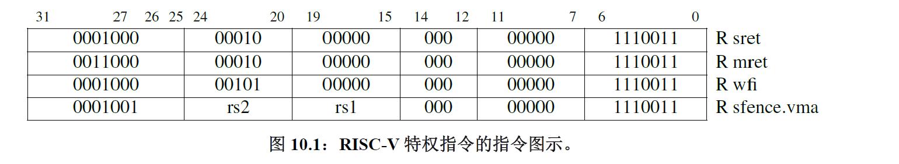
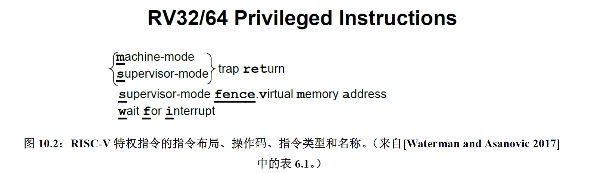
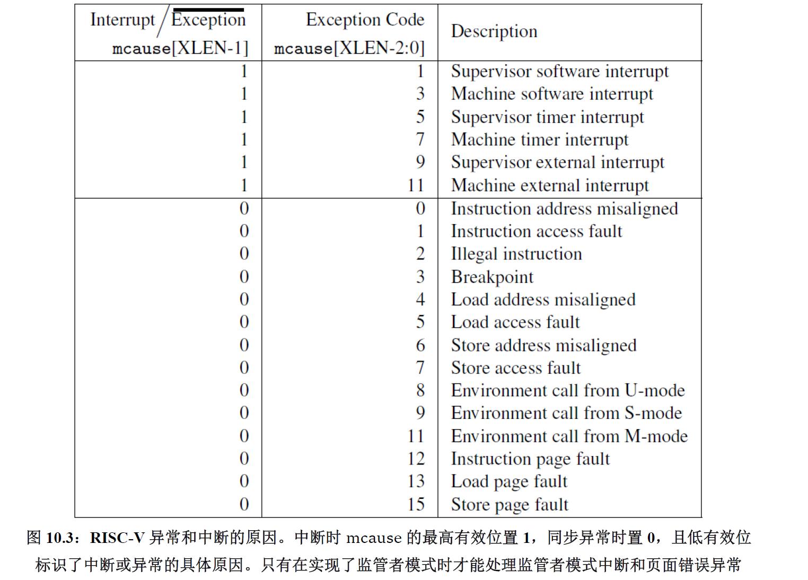
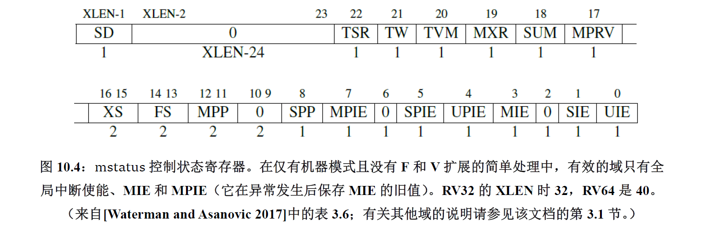
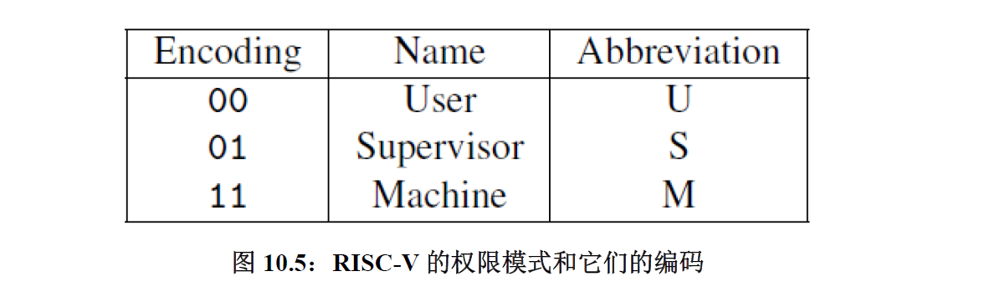
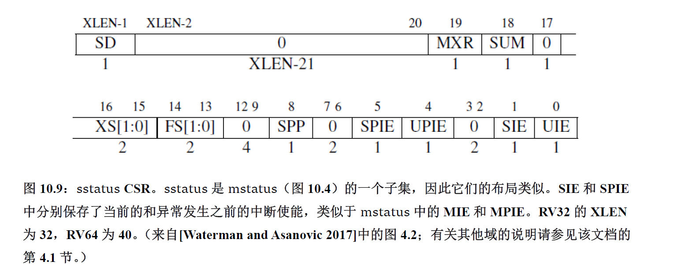
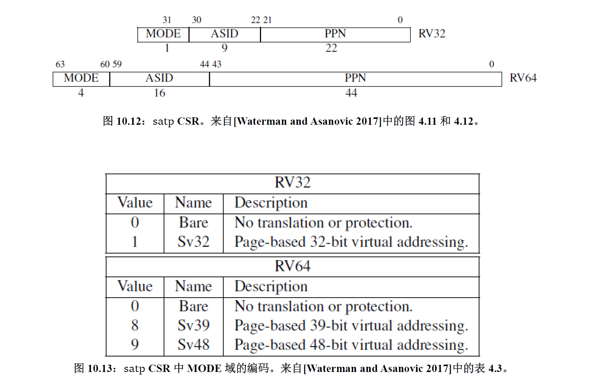
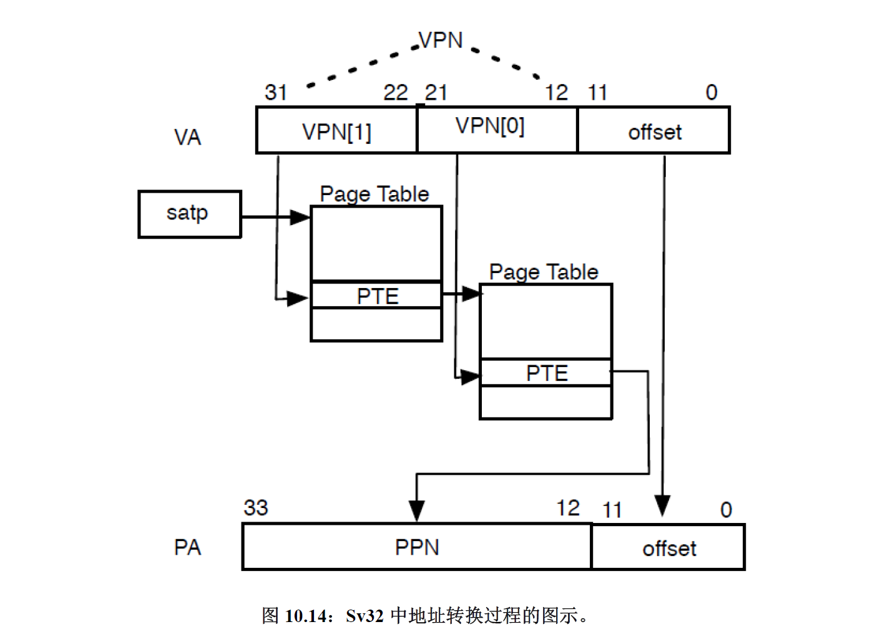

## RISC-V简介

### 什么是RISC-V

RISC-V 是一个最新的，清晰的，简约的，开源的ISA，它以过去ISA 所犯过的错误为鉴。RISC-V 架构师的目标是让它在从最小的到最快的所有计算设备上都能有效工作。遵循冯诺依曼70 年前的建议，这个ISA 强调简洁性来保证它的低成本，同时有着大量的寄存器和透明的指令执行速度，从而帮助编译器和汇编语言程序员将实际的重要问题转换为适当的高效代码。

RISC-V于2011年推出，迅速发展，如今已经开启了开源芯片设计的黄金时代。在芯片设计领域，RISC-V有望像Linux那样成为计算机芯片与系统创新的基石。但是只有RISC-V又是远远不够的，更重要的是要形成一个基于RISC-V的开源芯片设计生态，包括开源工具链、开源IP、开源SoC等等。

### RISC-V的目标

ISA设计的基本原则：

- 成本
- 简洁性
- 性能
- 架构与具体实现分离
- 提升空间（保留操作码空间，供未来为特定领域添加自定义指令）
- 程序大小
- 易于编程/编译/链接（寄存器分配方面）

RISC-V（“RISC five”）的目标是成为一个通用的指令集架构（ISA）：

- 它要能适应包括从最袖珍的嵌入式控制器，到最快的高性能计算机等各种规模的处理器。
- 它应该能兼容各种流行的软件栈和编程语言。
- 它应该适应所有实现技术，包括现场可编程门阵列（FPGA）、专用集成电路（ASIC）、全定制芯片，甚至未来的设备技术。
- 它应该对所有微体系结构样式都有效：例如微编码或硬连线控制;顺序或乱序执行流水线; 单发射或超标量等等。
- 它应该支持广泛的专业化，成为定制加速器的基础，因为随着摩尔定律的消退，加速器的重要性日益提高。
- 它应该是稳定的，基础的指令集架构不应该改变。更重要的是，它不能像以前的专有指令集架构一样被弃用，例如AMD Am29000、Digital Alpha、Digital VAX、Hewlett Packard PA-RISC、Intel i860、Intel i960、Motorola 88000、以及ZilogZ8000。

### 模块化与增量型ISA

计算机体系结构的传统方法是**增量ISA**，新处理器不仅必须实现新的ISA扩展，还必须实现过去的所有扩展。目的是为了保持向后的二进制兼容性，这样几十年前程序的二进制版本仍然可以在最新的处理器上正确运行。例如当今主导ISA80x86的历史可以追溯到1978年，它平均每个月增加大约三条指令。

RISC-V的不同寻常之处，除了在于它是最近诞生的和开源的以外，还在于：和几乎所有以往的ISA不同，它是**模块化**的。它的核心是一个名为RV32I的基础ISA，运行一个完整的软件栈。RV32I是固定的，永远不会改变。这为编译器编写者，操作系统开发人员和汇编语言程序员提供了稳定的目标。模块化来源于可选的标准扩展，根据应用程序的需要，硬件可以包含或不包含这些扩展。这种模块化特性使得RISC-V具有了袖珍化、低能耗的特点，而这对于嵌入式应用可能至关重要。RISC-V编译器得知当前硬件包含哪些扩展后，便可以生成当前硬件条件下的最佳代码。惯例是把代表扩展的字母附加到指令集名称之后作为指示。例如，RV32IMFD将乘法（RV32M），单精度浮点（RV32F）和双精度浮点（RV32D）的扩展添加到了基础指令集（RV32I）中。

## RISC-V入门

RISC-V的核心内容是RV32I，它是固定不变的基础整数指令集。

RISC-V的标准扩展：

- 乘法和除法（RV32M）
- 浮点操作（RV32F和RV32D）
- 原子操作（RV32A）

当这些扩展添加到RIV32I 中的时候，我们统称RV32G（G 代表一般）。此外，还有可选扩展：

- 压缩扩展RV32C
- 向量扩展RV32V

## RV32/64特权架构

以上主要关注RISC-V 对通用计算的支持：引入的所有指令都在用户模式（应用程序的代码在此模式下运行）下可用。现在介绍两种新的权限模式：运行最可信的代码的机器模式（machine mode），以及为Linux，FreeBSD 和Windows 等操作系统提供支持的监管者模式（supervisor mode）。这两种新模式都比用户模式有着更高的权限，这也是本章标题的来源。有更多权限的模式通常可以使用权限较低的模式的所用功能，并且它们还有一些低权限模式下不可用的额外功能，例如处理中断和执行I/O 的功能。处理器通常大部分时间都运行在权限最低的模式下，处理中断和异常时会将控制权移交到更高权限的模式。

嵌入式系统运行时（runtime）和操作系统用这些新模式的功能来响应外部事件，如网络数据包的到达；支持多任务处理和任务间保护；抽象和虚拟化硬件功能等。





图10.1 是RISC-V 特权指令的图形表示，图10.2 列出了这些指令的操作码。显然，特权架构添加的指令非常少。作为替代，几个新的控制状态寄存器（CSR）显示了附加的功能。

> 为了描述简洁，我们引入术语XLEN 来指代整数寄存器的宽度（以位为单位）。
> 对于RV32，XLEN 为32；对RV64，XLEN 则是64。

### 简单嵌入式系统的机器模式

机器模式（缩写为M 模式，M-mode）是RISC-V 中**hart**（hardware thread，硬件线程）可以执行的最高权限模式。在M 模式下运行的hart 对内存，I/O 和一些对于启动和配置系统来说必要的底层功能有着完全的使用权。因此它是唯一所有标准RISC-V 处理器都必须实现的权限模式。实际上简单的RISC-V 微控制器仅支持M 模式。

> 软件线程在harts 上进行分时复用。 大多数处理器核都只有一个hart。

**机器模式最重要的特性是拦截和处理异常（不寻常的运行时事件）的能力。**RISC-V 将异常分为两类。一类是**同步异常**，这类异常在指令执行期间产生，如访问了无效的存储器地址或执行了具有无效操作码的指令时。另一类是**中断**，它是与指令流异步的外部事件，比如鼠标的单击。

在M 模式运行期间可能发生的同步例外有五种：

- **访问错误异常** 当物理内存的地址不支持访问类型时发生（例如尝试写入ROM）。
- **断点异常** 在执行ebreak 指令，或者地址或数据与调试触发器匹配时发生。
- **环境调用异常** 在执行ecall 指令时发生。
- **非法指令异常** 在译码 阶段发现无效操作码时发生。
- **非对齐地址异常** 在有效地址不能被访问大小整除时发生，例如地址为0x12 的amoadd.w。



有三种标准的中断源：软件、时钟和外部来源。**软件中断**通过向内存映射寄存器中存数来触发，并通常用于由一个hart 中断另一个hart（在其他架构中称为处理器间中断机制）。当hart 的时间比较器（一个名为mtimecmp 的内存映射寄存器）大于实时计数器mtime 时，会触发**时钟中断**。**外部中断**由平台级中断控制器（大多数外部设备连接到这个中断控制器）引发。不同的硬件平台具有不同的内存映射并且需要中断控制器的不同特性，因此用于发出和消除这些中断的机制因平台而异。所有RISC-V 系统的共同问题是如何处理异常和屏蔽中断，这是下一节的主题。

### 机器模式下的异常处理

八个控制状态寄存器（CSR）是机器模式下异常处理的必要部分：

- mtvec（Machine Trap Vector）它保存发生异常时处理器需要跳转到的地址。
- mepc（Machine  Exception PC）它指向发生异常的指令。
- mcause（Machine Exception Cause）它指示发生异常的种类。
- mie（Machine Interrupt Enable）它指出处理器目前能处理和必须忽略的中断。
- mip（Machine Interrupt Pending）它列出目前正准备处理的中断。
- mtval（Machine Trap Value）它保存了陷入（trap）的附加信息：地址例外中出错
  的地址、发生非法指令例外的指令本身，对于其他异常，它的值为0。
- mscratch（Machine Scratch）它暂时存放一个字大小的数据。
- mstatus（Machine Status）它保存全局中断使能，以及许多其他的状态



处理器在M 模式下运行时，只有在全局中断使能位mstatus.MIE 置1 时才会产生中断.此外，每个中断在控制状态寄存器mie 中都有自己的使能位。这些位在mie 中的位置对应于图10.3 中的中断代码。例如，mie[7]对应于M 模式中的时钟中断。控制状态寄存器mip具有相同的布局，并且它指示当前待处理的中断。将所有三个控制状态寄存器合在一起考虑，如果mstatus.MIE = 1，mie[7] = 1，且mip[7] = 1，则可以处理机器的时钟中断。

当一个hart 发生异常时，硬件自动经历如下的状态转换：

- 异常指令的PC 被保存在mepc 中，PC 被设置为mtvec。（对于同步异常，mepc指向导致异常的指令；对于中断，它指向中断处理后应该恢复执行的位置。）
- 根据异常来源设置mcause（如图10.3 所示），并将mtval 设置为出错的地址或者其它适用于特定异常的信息字。
- 把控制状态寄存器mstatus 中的MIE 位置零以禁用中断，并把先前的MIE 值保留到MPIE 中。
- 发生异常之前的权限模式保留在mstatus 的MPP 域中，再把权限模式更改为M。图10.5 显示了MPP 域的编码（如果处理器仅实现M 模式，则有效地跳过这个步骤）。



```assembly
# save registers
csrrw a0, mscratch, a0 	# save a0; set a0 = &temp storage
sw a1, 0(a0)			# save al
sw a2, 4(a0)			# save a2
sw a3, 8(a0)			# save a3
sw a4, 12(a0)			# save a4

#decode interrupt cause
csrr a1, mcause			# read exception cause
bgez a1, exception		# branch if not an interrupt
andi a1, a1, 0x3f		# isolate interrupt cause
li a2, 7				# a2 = timer interrupt cause
bne a1, a2, otherInt	# branch if not a timer interrupt

# handle timer interrupt by incrementing time comparator
la a1, mtimecmp			# a1 = &time comparator
lw a2, 0(a1)			# load lower 32 bits of comparator
lw a3, 4(a1)			# load upper 32 bits of comparator
addi a4, a2, 1000		# increment lower bits by 1000 cycles
sltu a2, a4, a2			# generate carry-out
add a3, a3, a2			# increment upper bits
sw a3, 4(a1)			# store upper 32 bits
sw a4, 0(a1)			# store lower 32 bits

#restore registers and return
lw a4, 12(a0)			# restore a4
lw a3, 4(a0)			# restore a3
lw a2, 4(a0)			# restore a2
lw a1, 0(a0)			# restore al
csrrw a0,mscratch, a0	# restore a0; mscratch = &temp storage
mret#return from handler
```

上述RISC-V 汇编代码展示了遵循此模式的基本时钟中断处理程序。代码中假定了全局中断已通过置位mstatus.MIE 启用；时钟中断已通过置位mie[7]启用；mtvec CSR 已设置为此处理程序的入口地址；而且mscratchCSR 已经设置为有16 个字节用于保存寄存器的临时空间的地址。第一部分保存了五个寄存器，把a0 保存在mscratch 中，a1 到a4 保存在内存中。然后它检查mcause 来读取异常的类别：如果mcause<0 则是中断，反之则是同步异常。如果是中断，就检查mcause 的低位是否等于7，如果是，就是M 模式的时钟中断。如果确定是时钟中断，就给时间比较器加上1000 个时钟周期，于是下一个时钟中断会发生在大约1000 个时钟周期之后。最后一段恢复了a0 到a4 和mscratch，然后用mret 指令返回。

它只对时间比较器执行了递增操作，然后继续执行之前的任务。更实际的时钟中断处理程序可能会调用调度程序，从而在任务之间切换。它是非抢占的，因此在处理程序的过程中中断会被禁用。不考虑这些限制条件的话，它就是一个只有一页的RISC-V 中断处理程序的完整示例！

> 除了上面介绍的mret 指令之外，M 模式还提供了另外一条指令：wfi（Wait For Interrupt）。wfi 通知处理器目前没有任何有用的工作，所有它应该进入低功耗模式，直到任何使能有效的中断等待处理，即mie&mip ≠ 0。RISC-V 处理器以多种方式实现该指令，包括到中断待处理之前都停止时钟。有的时候只把这条指令当作nop 来执行。因此，wfi 通常在循环内使用。

有时需要在处理异常的过程中转到处理更高优先级的中断。唉，mepc，mcause，mtval 和mstatus 这些控制寄存器只有一个副本，处理第二个中断的时候如果软件不进行一些帮助的话，这些寄存器中的旧值会被破坏，导致数据丢失。可抢占的中断处理程序可以在启用中断之前把这些寄存器保存到内存中的栈，然后在退出之前，禁用中断并从栈中恢复寄存器。

### 嵌入式系统中的用户模式与进程隔离

RISC-V 提供了保护系统免受不可信的代码危害的机制，并且为不受信任的进程提供隔离保护。

必须禁止不可信的代码执行特权指令（如mret）和访问特权控制状态寄存器（如mstatus），因为这将允许程序控制系统。这样的限制很容易实现，只要加入一种额外的权限模式：用户模式（U 模式）。这种模式拒绝使用这些功能，并在尝试执行M 模式指令或访问CSR 的时候产生非法指令异常。其它时候，U 模式和M 模式的表现十分相似。通过将mstatus.MPP 设置为U（如图10.5 所示，编码为0），然后执行mret 指令，软件可以从M 模式进入U 模式。如果在U 模式下发生异常，则把控制移交给M 模式。

这些不可信的代码还必须被限制只能访问自己那部分内存。实现了M 和U 模式的处理器具有一个叫做物理内存保护（PMP，Physical Memory Protection）的功能，允许M 模式指定U 模式可以访问的内存地址。PMP 包括几个地址寄存器（通常为8 到16 个）和相应的配置寄存器。这些配置寄存器可以授予或拒绝读、写和执行权限。当处于U 模式的处理器尝试取指或执行load 或store 操作时，将地址和所有的PMP 地址寄存器比较。如果地址大于等于PMP 地址i，但小于PMP 地址i+1，则PMP i+1 的配置寄存器决定该访问是否可以继续，如果不能将会引发访问异常。

### 现代操作系统的监管者模式

复杂的RISC-V 处理器使用基于页面的虚拟内存，这个功能构成了监管者模式（S 模式）的核心，这是一种可选的权限模式，旨在支持现代类Unix 操作系统，如Linux，FreeBSD 和Windows。S 模式比U 模式权限更高，但比M 模式低。与U 模式一样，S 模式下运行的软件不能使用M 模式的CSR 和指令，并且受到PMP 的限制。

默认情况下，发生所有异常（不论在什么权限模式下）的时候，控制权都会被移交到M 模式的异常处理程序。但是Unix 系统中的大多数例外都应该进行S 模式下的系统调用。M 模式的异常处理程序可以将异常重新导向S 模式，但这些额外的操作会减慢大多数异常的处理速度。因此，RISC-V 提供了一种异常委托机制。通过该机制可以选择性地将中断和同步异常交给S 模式处理，而完全绕过M 模式。

mideleg（Machine Interrupt Delegation，机器中断委托）CSR 控制将哪些中断委托给S模式。与mip 和mie 一样，mideleg 中的每个位对应于图10.3 中相同的异常。例如，mideleg[5]对应于S 模式的时钟中断，如果把它置位，S 模式的时钟中断将会移交S 模式的异常处理程序，而不是M 模式的异常处理程序。委托给S 模式的任何中断都可以被S 模式的软件屏蔽。sie（Supervisor Interrupt Enable，监管者中断使能）和sip（Supervisor Interrupt Pending，监管者中断待处理）CSR是S 模式的控制状态寄存器，他们是mie 和mip 的子集。它们有着和M 模式下相同的布局，但在sie 和sip 中只有与由mideleg 委托的中断对应的位才能读写。那些没有被委派的中断对应的位始终为零。



M 模式还可以通过medeleg CSR 将同步异常委托给S 模式。该机制类似于刚才提到的中断委托，但medeleg 中的位对应的不再是中断，而是图10.3 中的同步异常编码。例如，置上medeleg[15]便会把store page fault（store 过程中出现的缺页）委托给S 模式。

请注意，无论委派设置是怎样的，发生异常时控制权都不会移交给权限更低的模式。在M 模式下发生的异常总是在M 模式下处理。在S 模式下发生的异常，根据具体的委派设置，可能由M 模式或S 模式处理，但永远不会由U 模式处理。S 模式有几个异常处理CSR：sepc、stvec、scause、sscratch、stval 和sstatus，它们执行与10.2 中描述的M 模式CSR 相同的功能。图10.9 显示了sstatus 寄存器的布局。
监管者异常返回指令sret 与mret 的行为相同，但它作用于S 模式的异常处理CSR，而不是M 模式的CSR。

S 模式处理例外的行为已和M 模式非常相似。如果hart 接受了异常并且把它委派给了S 模式，则硬件会原子地经历几个类似的状态转换，其中用到了S 模式而不是M 模式的CSR：

- 发生例外的指令的PC 被存入sepc，且PC 被设置为stvec。
- scause 按图10.3 根据异常类型设置，stval 被设置成出错的地址或者其它特定异常的信息字。
- 把sstatus CSR 中的SIE 置零，屏蔽中断，且SIE 之前的值被保存在SPIE 中。
- 发生例外时的权限模式被保存在sstatus 的SPP 域，然后设置当前模式为S 模式。

### 基于页面的虚拟内存

S 模式提供了一种传统的虚拟内存系统，它将内存划分为固定大小的页来进行地址转换和对内存内容的保护。启用分页的时候，大多数地址（包括load 和store 的有效地址和PC 中的地址）都是虚拟地址。要访问物理内存，它们必须被转换为真正的物理地址，这通过遍历一种称为页表的高基数树实现。页表中的叶节点指示虚地址是否已经被映射到了真正的物理页面，如果是，则指示了哪些权限模式和通过哪种类型的访问可以操作这个页。访问未被映射的页或访问权限不足会导致页错误例外（page fault exception）

RISC-V 的分页方案以SvX 的模式命名,其中X 是以位为单位的虚拟地址的长度。RV32 的分页方案Sv32 支持4GiB 的虚址空间，这些空间被划分为2^10^ 个4 MiB 大小的巨页。每个巨页被进一步划分为2^10^ 个4 KiB 大小的基页（分页的基本单位）。因此，Sv32 的页表是基数为210 的两级树结构。页表中每个项的大小是四个字节，因此页表本身的大小是4 KiB。页表的大小和每个页的大小完全相同，这样的设计简化了操作系统的内存分配。


图10.10 显示了Sv32 页表项（page-table entry，PTE）的布局，从左到右分别包含如下所述的域：

- V 位决定了该页表项的其余部分是否有效（V = 1 时有效）。若V = 0，则任何遍历到此页表项的虚址转换操作都会导致页错误。
- R、W 和X 位分别表示此页是否可以读取、写入和执行。如果这三个位都是0，那么这个页表项是指向下一级页表的指针，否则它是页表树的一个叶节点。
- U 位表示该页是否是用户页面。若U = 0，则U 模式不能访问此页面，但S 模式可以。若U = 1，则U 模式下能访问这个页面，而S 模式不能。
- G 位表示这个映射是否对所有虚址空间有效，硬件可以用这个信息来提高地址转换的性能。这一位通常只用于属于操作系统的页面。
- A 位表示自从上次A 位被清除以来，该页面是否被访问过。
- D 位表示自从上次清除D 位以来页面是否被弄脏（例如被写入）。
- RSW 域留给操作系统使用，它会被硬件忽略。
- PPN 域包含物理页号，这是物理地址的一部分。若这个页表项是一个叶节点，那么PPN 是转换后物理地址的一部分。否则PPN 给出下一节页表的地址。（图10.10 将PPN 划分为两个子域，以简化地址转换算法的描述。）

RV64 支持多种分页方案，但我们只介绍最受欢迎的一种，Sv39。Sv39 使用和Sv32 相同的4 KiB 大的基页。页表项的大小变成8 个字节，所以它们可以容纳更大的物理地址。为了保证页表大小和页面大小一致，树的基数相应地降到29，树也变为三层。Sv39 的512GiB 地址空间划分为29 个1 GiB 大小的吉页。每个吉页被进一步划分为29 个巨页。在Sv39 中这些巨页大小为2 MiB，比Sv32 中略小。每个巨页再进一步分为29 个4 KiB 大小的基页。

图10.11 显示了Sv39 页表项的布局。它和Sv32 完全相同，只是PPN 字段被扩展到了44 位，以支持56 位的物理地址，或者说226 GiB 大小的物理地址空间。



一个叫satp（Supervisor Address Translation and Protection，监管者地址转换和保护）的S 模式控制状态寄存器控制了分页系统。如图10.12 所示，satp 有三个域。MODE 域可以开启分页并选择页表级数，图10.13 展示了它的编码。ASID（Address Space Identifier，
地址空间标识符）域是可选的，它可以用来降低上下文切换的开销。最后，PPN 字段保存了根页表的物理地址，它以4 KiB 的页面大小为单位。通常M 模式的程序在第一次进入S模式之前会把零写入satp 以禁用分页，然后S 模式的程序在初始化页表以后会再次进行satp 寄存器的写操作。



当在satp 寄存器中启用了分页时，S 模式和U 模式中的虚拟地址会以从根部遍历页表的方式转换为物理地址。图10.14 描述了这个过程：

1. satp.PPN 给出了一级页表的基址，VA[31:22]给出了一级页号，因此处理器会读取位于地址(satp. PPN × 4096 + VA[31: 22] × 4)的页表项。
2. 该PTE 包含二级页表的基址，VA[21:12]给出了二级页号，因此处理器读取位于地址(PTE. PPN × 4096 + VA[21: 12] × 4)的叶节点页表项。
3. 叶节点页表项的PPN 字段和页内偏移（原始虚址的最低12 个有效位）组成了最终结果：物理地址就是(LeafPTE. PPN × 4096 + VA[11: 0])

随后处理器会进行物理内存的访问。Sv39 的转换过程几乎和Sv32 相同，区别在于其具有较大的PTE 和更多级页表。

除了一点以外，我们几乎讲完了RISC-V 分页系统的所有内容。如果所有取指，load和store 操作都导致多次页表访问，那么分页会大大地降低性能！所有现代的处理器都用地址转换缓存（通常称为TLB，全称为Translation Lookaside Buffer）来减少这种开销。为了降低这个缓存本身的开销，大多数处理器不会让它时刻与页表保持一致。这意味着如果操作系统修改了页表，那么这个缓存会变得陈旧而不可用。S 模式添加了另一条指令来解决这个问题。这条sfence.vma 会通知处理器，软件可能已经修改了页表，于是处理器可以相应地刷新转换缓存。它需要两个可选的参数，这样可以缩小缓存刷新的范围。一个位于rs1，它指示了页表哪个虚址对应的转换被修改了；另一个位于rs2，它给出了被修改页表的进程的地址空间标识符（ASID）。如果两者都是x0，便会刷新整个转换缓存。

## 总结

RISC-V 特权架构的模块化特性满足了各种系统的需求。十分精简的机器模式以低成本的特征支持裸机嵌入式应用。附加的用户模式和物理内存保护功能共同支持了更复杂的嵌入式系统中的多任务处理。最后，监管者模式和基于页面的虚拟内存提供了运行现代操作系统所必需的灵活性。

## 链接

Github. URL: https://github.com/riscv

官网. URL: https://riscv.org/technical/specifications/

The RISC-V Instruction Set Manual, Volume I: User-Level ISA, Version 2.0. URL: http://www2.eecs.berkeley.edu/Pubs/TechRpts/2014/EECS-2014-54.pdf