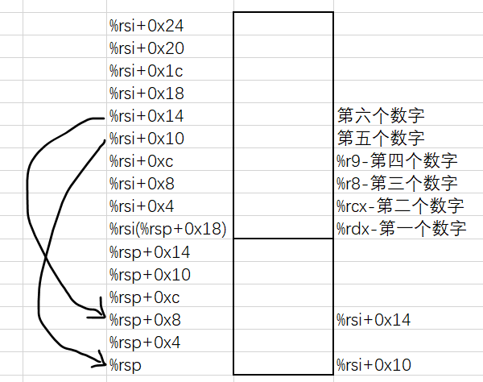

## 实验材料

- README

  http://csapp.cs.cmu.edu/3e/README-bomblab

- Writeup

  http://csapp.cs.cmu.edu/3e/bomblab.pdf

- 自学材料

  https://csapp.cs.cmu.edu/3e/bomb.tar

## 实验简介与准备

“二进制炸弹 "是以目标代码文件的形式提供给学生的程序。 运行时，程序会提示用户输入 6 个不同的字符串。 如果其中任何一个字符串不正确，炸弹就会 "爆炸"，打印出一条错误信息，并将事件记录到分级服务器上。 学生必须 "拆除 "自己独特的炸弹，方法是拆解和逆向工程程序，以确定 6 个字符串应该是什么。 该实验室教会学生理解汇编语言，还迫使他们学习如何使用调试器。

下载`bomb.tar`到Linux工作目录：

```shell
wget https://csapp.cs.cmu.edu/3e/bomb.tar
```

解压：

```shell
tar xvf bomb.tar
```

## 问题

为了拆除炸弹，学生必须使用调试器，通常 gdb 或 ddd，反汇编二进制文件并单步执行 每个阶段的机器代码。这个想法是要了解每个 汇编语句确实如此，然后使用这些知识来推断拆解字符串。

查看`bomb.c`源码，每个阶段的框架大致如下：

```c
char *input;
......
initialize_bomb();
.....

/* Hmm...  Six phases must be more secure than one phase! */
input = read_line();             /* Get input                   */
phase_1(input);                  /* Run the phase               */
phase_defused();                 /* Drat!  They figured it out!
```

### phase_1

首先，使用`objdump -d bomb > bomb.asm`命令，生成反汇编代码文件，查看`main`函数中以上代码的汇编代码：

```assembly
  400e0f:	bf 08 00 00 00       	mov    $0x8,%edi
  400e14:	e8 07 fe ff ff       	call   400c20 <exit@plt>
  400e19:	e8 84 05 00 00       	call   4013a2 <initialize_bomb>
  400e1e:	bf 38 23 40 00       	mov    $0x402338,%edi
  400e23:	e8 e8 fc ff ff       	call   400b10 <puts@plt>
  400e28:	bf 78 23 40 00       	mov    $0x402378,%edi
  400e2d:	e8 de fc ff ff       	call   400b10 <puts@plt>
  400e32:	e8 67 06 00 00       	call   40149e <read_line>
  400e37:	48 89 c7             	mov    %rax,%rdi
  400e3a:	e8 a1 00 00 00       	call   400ee0 <phase_1>
  400e3f:	e8 80 07 00 00       	call   4015c4 <phase_defused>
```

第8行代码表示调用了`read_line`函数读取了一行输入，第9行将读取到的输入存入`%rdi`（这是第一个参数寄存器）。接着调用了`phase_1`函数，其汇编代码如下：

```assembly
0000000000400ee0 <phase_1>:
  400ee0:	48 83 ec 08          	sub    $0x8,%rsp	# 将栈指针减8
  400ee4:	be 00 24 40 00       	mov    $0x402400,%esi # 将某地址的数据移动到%esi
  400ee9:	e8 4a 04 00 00       	call   401338 <strings_not_equal>
  400eee:	85 c0                	test   %eax,%eax
  400ef0:	74 05                	je     400ef7 <phase_1+0x17>
  400ef2:	e8 43 05 00 00       	call   40143a <explode_bomb>
  400ef7:	48 83 c4 08          	add    $0x8,%rsp
  400efb:	c3                   	ret    
```

以上代码首先将某地址的数据存入`%esi`（这是第二个参数寄存器），然后调用了`strings_not_equal`函数。接着，若返回值不为0，则调用`explode_bomb`函数，显然，该函数说明答案是错误的。到这里，它是把我输入的数据(存放在`%rdi`中)与在地址`0x402400`处的数据进行比较，看是否相等，因此，这个地址处存放的数据就是答案。使用`x`命令查看该内存处的数据：

```shell
(gdb) × /s 0x402400
0×402400：		"Border relations with Canada have never been better."
```

为了方便后面的实验，将上述字符串存入`ans.txt`中。

### phase_2

使用`disas phase_2`命令，查看`phase_2`函数的汇编代码：

```assembly
0000000000400efc <phase_2>:
  400efc:	55                   	push   %rbp
  400efd:	53                   	push   %rbx
  400efe:	48 83 ec 28          	sub    $0x28,%rsp # 开辟40个字节的栈空间
  400f02:	48 89 e6             	mov    %rsp,%rsi
  400f05:	e8 52 05 00 00       	call   40145c <read_six_numbers>
  400f0a:	83 3c 24 01          	cmpl   $0x1,(%rsp) # 比较1和栈顶
  400f0e:	74 20                	je     400f30 <phase_2+0x34>
  400f10:	e8 25 05 00 00       	call   40143a <explode_bomb>
  400f15:	eb 19                	jmp    400f30 <phase_2+0x34>
  400f17:	8b 43 fc             	mov    -0x4(%rbx),%eax
  400f1a:	01 c0                	add    %eax,%eax
  400f1c:	39 03                	cmp    %eax,(%rbx)
  400f1e:	74 05                	je     400f25 <phase_2+0x29>
  400f20:	e8 15 05 00 00       	call   40143a <explode_bomb>
  400f25:	48 83 c3 04          	add    $0x4,%rbx
  400f29:	48 39 eb             	cmp    %rbp,%rbx
  400f2c:	75 e9                	jne    400f17 <phase_2+0x1b>
  400f2e:	eb 0c                	jmp    400f3c <phase_2+0x40>
  400f30:	48 8d 5c 24 04       	lea    0x4(%rsp),%rbx
  400f35:	48 8d 6c 24 18       	lea    0x18(%rsp),%rbp
  400f3a:	eb db                	jmp    400f17 <phase_2+0x1b>
  400f3c:	48 83 c4 28          	add    $0x28,%rsp
  400f40:	5b                   	pop    %rbx
  400f41:	5d                   	pop    %rbp
  400f42:	c3                   	ret  
```

`read_six_numbers`的汇编代码：

```assembly
000000000040145c <read_six_numbers>:
  40145c:	48 83 ec 18          	sub    $0x18,%rsp # 申请了24个字节的栈空间
  401460:	48 89 f2             	mov    %rsi,%rdx
  401463:	48 8d 4e 04          	lea    0x4(%rsi),%rcx 
  401467:	48 8d 46 14          	lea    0x14(%rsi),%rax
  40146b:	48 89 44 24 08       	mov    %rax,0x8(%rsp)
  401470:	48 8d 46 10          	lea    0x10(%rsi),%rax
  401474:	48 89 04 24          	mov    %rax,(%rsp)
  401478:	4c 8d 4e 0c          	lea    0xc(%rsi),%r9
  40147c:	4c 8d 46 08          	lea    0x8(%rsi),%r8
  401480:	be c3 25 40 00       	mov    $0x4025c3,%esi
  401485:	b8 00 00 00 00       	mov    $0x0,%eax
  40148a:	e8 61 f7 ff ff       	call   400bf0 <__isoc99_sscanf@plt>
  40148f:	83 f8 05             	cmp    $0x5,%eax
  401492:	7f 05                	jg     401499 <read_six_numbers+0x3d>
  401494:	e8 a1 ff ff ff       	call   40143a <explode_bomb>
  401499:	48 83 c4 18          	add    $0x18,%rsp
  40149d:	c3                   	ret 
```

使用`x`命令打印出第11行中`0x4025c3`地址处的内容：

```assembly
(gdb) x /s 0x4025c3
0x4025c3:		"%d %d %d %d %d %d"		
```

可知输入的是6个整数。回顾一下，x86 的函数调用约定为：

- `%rdi`：第一个参数

- `%rsi`：第二个参数

- `%rdx`：第三个参数

- `%rcx`：第四个参数

- `%r8`：第五个参数

- `%r9`：第六个参数

- `%rax`：返回值

超出六个参数的部分，会被压入栈中。而`sscanf`函数的签名为：

```c
int sscanf(const char *str, const char *format, ...);
```

故`%rdx`为存储第一个输入数字的寄存器，`%rcx`中为第二个数字，....，根据第2~第10行代码画出内存图：



参数从右至左入栈，向低地址增长，所以第七个参数（即输入的第五个数字）存放在栈顶`%rsp`中。最后，`sscanf`函数返回读取输入的个数，第14行将返回值与`0x5`比较，若小于等于便会直接引发爆炸。

回到`phase_2`中，第7~9行说明栈顶元素（第一个数字）必须是1，然后跳转到`0x400f30`处：

```assembly
  400f30:	48 8d 5c 24 04       	lea    0x4(%rsp),%rbx 	# %rbx=%rsp+4
  400f35:	48 8d 6c 24 18       	lea    0x18(%rsp),%rbp 	# %rbp=%rsp+24
  400f3a:	eb db                	jmp    400f17 <phase_2+0x1b>
```

然后跳转到`0x400f17`，第11行到第15行：

```assembly
  400f17:	8b 43 fc             	mov    -0x4(%rbx),%eax	# %eax=%rbx-4
  400f1a:	01 c0                	add    %eax,%eax		# %eax=%eax*2
  400f1c:	39 03                	cmp    %eax,(%rbx)
  400f1e:	74 05                	je     400f25 <phase_2+0x29>
  400f20:	e8 15 05 00 00       	call   40143a <explode_bomb>
```

到这里就很明显了，这两段代码的意思就是比较后一个数字是不是前一个数字的两倍，如果是就执行第16行代码进行后面数字的比较，直到第六个数字（`%rbx`等于`%rbp`）。所以，最终答案为：

```shell
1 2 4 8 16 32
```

### phase_3

`phase_3`的汇编代码如下：

```assembly
0000000000400f43 <phase_3>:
  400f43:	48 83 ec 18          	sub    $0x18,%rsp
  400f47:	48 8d 4c 24 0c       	lea    0xc(%rsp),%rcx
  400f4c:	48 8d 54 24 08       	lea    0x8(%rsp),%rdx
  400f51:	be cf 25 40 00       	mov    $0x4025cf,%esi
  400f56:	b8 00 00 00 00       	mov    $0x0,%eax
  400f5b:	e8 90 fc ff ff       	call   400bf0 <__isoc99_sscanf@plt>
  400f60:	83 f8 01             	cmp    $0x1,%eax
  400f63:	7f 05                	jg     400f6a <phase_3+0x27>
  400f65:	e8 d0 04 00 00       	call   40143a <explode_bomb>
  400f6a:	83 7c 24 08 07       	cmpl   $0x7,0x8(%rsp)
  400f6f:	77 3c                	ja     400fad <phase_3+0x6a>
  400f71:	8b 44 24 08          	mov    0x8(%rsp),%eax
  400f75:	ff 24 c5 70 24 40 00 	jmp    *0x402470(,%rax,8)
  400f7c:	b8 cf 00 00 00       	mov    $0xcf,%eax
  400f81:	eb 3b                	jmp    400fbe <phase_3+0x7b>
  400f83:	b8 c3 02 00 00       	mov    $0x2c3,%eax
  400f88:	eb 34                	jmp    400fbe <phase_3+0x7b>
  400f8a:	b8 00 01 00 00       	mov    $0x100,%eax
  400f8f:	eb 2d                	jmp    400fbe <phase_3+0x7b>
  400f91:	b8 85 01 00 00       	mov    $0x185,%eax
  400f96:	eb 26                	jmp    400fbe <phase_3+0x7b>
  400f98:	b8 ce 00 00 00       	mov    $0xce,%eax
  400f9d:	eb 1f                	jmp    400fbe <phase_3+0x7b>
  400f9f:	b8 aa 02 00 00       	mov    $0x2aa,%eax
  400fa4:	eb 18                	jmp    400fbe <phase_3+0x7b>
  400fa6:	b8 47 01 00 00       	mov    $0x147,%eax
  400fab:	eb 11                	jmp    400fbe <phase_3+0x7b>
  400fad:	e8 88 04 00 00       	call   40143a <explode_bomb>
  400fb2:	b8 00 00 00 00       	mov    $0x0,%eax
  400fb7:	eb 05                	jmp    400fbe <phase_3+0x7b>
  400fb9:	b8 37 01 00 00       	mov    $0x137,%eax
  400fbe:	3b 44 24 0c          	cmp    0xc(%rsp),%eax
  400fc2:	74 05                	je     400fc9 <phase_3+0x86>
  400fc4:	e8 71 04 00 00       	call   40143a <explode_bomb>
  400fc9:	48 83 c4 18          	add    $0x18,%rsp
  400fcd:	c3                   	ret    
```

使用`x/s 0x4025cf`查看该地址的内容：

```assembly
(gdb) x/s 0x4025cf
0x4025cf:		"%d %d"
```

可知输入是两个整数，第11行表面第一个数不能超过7，否则引发爆炸。然后执行第13~14行代码：

```assembly
  400f71:	8b 44 24 08          	mov    0x8(%rsp),%eax
  400f75:	ff 24 c5 70 24 40 00 	jmp    *0x402470(,%rax,8)
```

这里先拿出第一个数字，然后间接跳转到其他地址去执行指令，类似于跳表。`*0x402470(,%rax,8)`的值为`(8 %rax + 0x402470)`，具体的跳转地址取决于`%rax`中的值，即输入的第一个数字。

> `jmp` 指令的操作数有前缀 `*`，表明这是一个间接跳转，操作数指定一个内存位置，索引由寄存器给出，这个寄存器保存着索引 index的值。

用`x`命令打印出`0x402470`地址放的什么：


原来如此，对比`phase_3`中第15~28行，如果`%rax`为0，那么就会执行：

```assembly
  400f7c:	b8 cf 00 00 00       	mov    $0xcf,%eax
  400f81:	eb 3b                	jmp    400fbe <phase_3+0x7b>
```

接着：

```assembly
  400fbe:	3b 44 24 0c          	cmp    0xc(%rsp),%eax 
  400fc2:	74 05                	je     400fc9 <phase_3+0x86>
```

也就是比较`0xcf`和第二个数字的值，如果不相等就会爆炸。同理，可以得到第一个数字与第二个数字的正确对应关系了：

| 第一个数字 | 第二个数字十六进制 | 第二个数字十进制 |
| ---------- | ------------------ | ---------------- |
| 0          | cf                 | 207              |
| 1          | 137                | 311              |
| 2          | 2c3                | 707              |
| 3          | 100                | 256              |
| 4          | 185                | 389              |
| 5          | ce                 | 206              |
| 6          | 2aa                | 682              |
| 7          | 147                | 327              |

这里我选择`0 207`，通过测试。

### phase_4

`phase_4`的汇编代码：

```assembly
000000000040100c <phase_4>:
  40100c:	48 83 ec 18          	sub    $0x18,%rsp # 申请24个字节的栈空间
  401010:	48 8d 4c 24 0c       	lea    0xc(%rsp),%rcx
  401015:	48 8d 54 24 08       	lea    0x8(%rsp),%rdx
  40101a:	be cf 25 40 00       	mov    $0x4025cf,%esi
  40101f:	b8 00 00 00 00       	mov    $0x0,%eax
  401024:	e8 c7 fb ff ff       	call   400bf0 <__isoc99_sscanf@plt>
  401029:	83 f8 02             	cmp    $0x2,%eax # 输入两个数
  40102c:	75 07                	jne    401035 <phase_4+0x29>
  40102e:	83 7c 24 08 0e       	cmpl   $0xe,0x8(%rsp) # 第一个参数
  401033:	76 05                	jbe    40103a <phase_4+0x2e>
  401035:	e8 00 04 00 00       	call   40143a <explode_bomb>
  40103a:	ba 0e 00 00 00       	mov    $0xe,%edx # fun4的第三个参数 14
  40103f:	be 00 00 00 00       	mov    $0x0,%esi # fun4的第二个参数 0
  401044:	8b 7c 24 08          	mov    0x8(%rsp),%edi # fun4的第一个参数（输入的第一个数）
  401048:	e8 81 ff ff ff       	call   400fce <func4>
  40104d:	85 c0                	test   %eax,%eax
  40104f:	75 07                	jne    401058 <phase_4+0x4c> # fun4函数必须返回0
  401051:	83 7c 24 0c 00       	cmpl   $0x0,0xc(%rsp) # 输入的第二个数字必须为0
  401056:	74 05                	je     40105d <phase_4+0x51>
  401058:	e8 dd 03 00 00       	call   40143a <explode_bomb>
  40105d:	48 83 c4 18          	add    $0x18,%rsp
  401061:	c3                   	ret   
```

使用命令`x/s 0x4025cf`查看地址`0x4025cf`的内容为`"%d %d"`，由第10~12行可知输入的第一个数字的范围为[0,14]，然后调用了`func4`函数，并传给它三个参数（分别为`0xe`，`0x0`以及输入的第一个数字），第 17~18行表明该函数必须要返回0。最后，输入的第二个数字必须是0。

现在来看看`func4`函数：

```assembly
0000000000400fce <func4>: # a=%edi b=%esi c=%edx
  400fce:	48 83 ec 08          	sub    $0x8,%rsp
  400fd2:	89 d0                	mov    %edx,%eax 
  400fd4:	29 f0                	sub    %esi,%eax # ret=c-b
  400fd6:	89 c1                	mov    %eax,%ecx
  400fd8:	c1 e9 1f             	shr    $0x1f,%ecx # tmp=(c-b)>>31
  400fdb:	01 c8                	add    %ecx,%eax # ret+=tm
  400fdd:	d1 f8                	sar    %eax # ret>>=1
  400fdf:	8d 0c 30             	lea    (%rax,%rsi,1),%ecx # tmp=ret+b
  400fe2:	39 f9                	cmp    %edi,%ecx
  400fe4:	7e 0c                	jle    400ff2 <func4+0x24> # if(a<=ret+b)
  400fe6:	8d 51 ff             	lea    -0x1(%rcx),%edx 
  400fe9:	e8 e0 ff ff ff       	call   400fce <func4>
  400fee:	01 c0                	add    %eax,%eax
  400ff0:	eb 15                	jmp    401007 <func4+0x39>
  400ff2:	b8 00 00 00 00       	mov    $0x0,%eax 
  400ff7:	39 f9                	cmp    %edi,%ecx
  400ff9:	7d 0c                	jge    401007 <func4+0x39> # if(a>=ret+b)
  400ffb:	8d 71 01             	lea    0x1(%rcx),%esi
  400ffe:	e8 cb ff ff ff       	call   400fce <func4>
  401003:	8d 44 00 01          	lea    0x1(%rax,%rax,1),%eax
  401007:	48 83 c4 08          	add    $0x8,%rsp
  40100b:	c3                   	ret    
```

对应的c代码可能为：

```c
// edx = 0xe
// esi = 0x0
// edi = x1
int fun4(int edx, int esi, int edi) {

    int eax = edx - esi; // 返回值
    eax = (eax + (eax >> 31)) >> 1;

    int ecx = eax + esi;
    if (edi > ecx) {
        esi = ecx + 1;
        return 2 * eax + 1 + fun4(edx, esi, edi);
    } else if (edi < ecx) {
        edx = ecx - 0x1;
        return 2 * fun4(edx, esi, edi);
    } else {
        return 0;
    }
}
```

最后，判断`func4`为0时，`edi`的值为0/1/3/7。

### phase_5

该函数的汇编：

```assembly
0000000000401062 <phase_5>:
  401062:	53                   	push   %rbx
  401063:	48 83 ec 20          	sub    $0x20,%rsp
  401067:	48 89 fb             	mov    %rdi,%rbx
  40106a:	64 48 8b 04 25 28 00 	mov    %fs:0x28,%rax
  401071:	00 00 
  401073:	48 89 44 24 18       	mov    %rax,0x18(%rsp)
  401078:	31 c0                	xor    %eax,%eax
  40107a:	e8 9c 02 00 00       	call   40131b <string_length>
  40107f:	83 f8 06             	cmp    $0x6,%eax # 字符串长度为6
  401082:	74 4e                	je     4010d2 <phase_5+0x70>
  401084:	e8 b1 03 00 00       	call   40143a <explode_bomb>
  401089:	eb 47                	jmp    4010d2 <phase_5+0x70>
  40108b:	0f b6 0c 03          	movzbl (%rbx,%rax,1),%ecx # 将%rbx开始的%rax个字节移动到%ecx
  40108f:	88 0c 24             	mov    %cl,(%rsp) # 将%ecx的低八位放到%rdx中
  401092:	48 8b 14 24          	mov    (%rsp),%rdx
  401096:	83 e2 0f             	and    $0xf,%edx # 只保留%edx最低的四位
  401099:	0f b6 92 b0 24 40 00 	movzbl 0x4024b0(%rdx),%edx # 将0x4024b0+%rdx赋值给%edx
  4010a0:	88 54 04 10          	mov    %dl,0x10(%rsp,%rax,1) # 将%edx中低八位保存栈中
  4010a4:	48 83 c0 01          	add    $0x1,%rax # 接下来三行使用%rax控制循环6次
  4010a8:	48 83 f8 06          	cmp    $0x6,%rax
  4010ac:	75 dd                	jne    40108b <phase_5+0x29>
  4010ae:	c6 44 24 16 00       	movb   $0x0,0x16(%rsp)
  4010b3:	be 5e 24 40 00       	mov    $0x40245e,%esi # 加载指定数据
  4010b8:	48 8d 7c 24 10       	lea    0x10(%rsp),%rdi # 加载保存在栈中的字符串
  4010bd:	e8 76 02 00 00       	call   401338 <strings_not_equal>
  4010c2:	85 c0                	test   %eax,%eax
  4010c4:	74 13                	je     4010d9 <phase_5+0x77>
  4010c6:	e8 6f 03 00 00       	call   40143a <explode_bomb>
  4010cb:	0f 1f 44 00 00       	nopl   0x0(%rax,%rax,1)
  4010d0:	eb 07                	jmp    4010d9 <phase_5+0x77>
  4010d2:	b8 00 00 00 00       	mov    $0x0,%eax # %eax置零
  4010d7:	eb b2                	jmp    40108b <phase_5+0x29>
  4010d9:	48 8b 44 24 18       	mov    0x18(%rsp),%rax
  4010de:	64 48 33 04 25 28 00 	xor    %fs:0x28,%rax
  4010e5:	00 00 
  4010e7:	74 05                	je     4010ee <phase_5+0x8c>
  4010e9:	e8 42 fa ff ff       	call   400b30 <__stack_chk_fail@plt>
  4010ee:	48 83 c4 20          	add    $0x20,%rsp
  4010f2:	5b                   	pop    %rbx
  4010f3:	c3                   	ret   
```

第14~22行，这一个循环体实际上是在依次取出我们输入的字符，然后以这个字符的低 4 位作为索引（也就是 ASCII 码的低四位），取出 `0x4024b0` 处的字符串的指定索引处的值，这个地址处的字符串为：`maduiersnfotvbylSo you think You can stop the bomb with ctrl-c, do you?`，然后放入到栈中。在栈中的位置是，从 `%rsp + 0x10` 开始的连续六个字节处。

第23行给取出的6个字符后面加上了`\0`字符串终止符。

第24行，用`x/s 0x40245e`查看该地址处的值为`"flyers"`。然后，25行将其与保存在栈中的字符串进行比较，若不同就会爆炸。

`"flyers"`六个字符在字符串`"maduiersnfotvbyl"`中的索引分别为9/15/14/5/6/7，所以，输入的六个字符的低四位所对应的十进制也为9/15/14/5/6/7。

通过查询ASCII表，可知输入字符串是`)/>%&7`。

### phase_6

`phase_6`的代码有点长，我们拆开分析：

```assembly
  4010f4:	41 56                	push   %r14
  4010f6:	41 55                	push   %r13
  4010f8:	41 54                	push   %r12
  4010fa:	55                   	push   %rbp
  4010fb:	53                   	push   %rbx
  4010fc:	48 83 ec 50          	sub    $0x50,%rsp
  401100:	49 89 e5             	mov    %rsp,%r13
  401103:	48 89 e6             	mov    %rsp,%rsi
  401106:	e8 51 03 00 00       	call   40145c <read_six_numbers>
```

第一部分，调用`read_six_numbers`函数读取了6个数字，这个函数在`phase_2`中已经遇到过了。

```assembly
  40110b:	49 89 e6             	mov    %rsp,%r14
  40110e:	41 bc 00 00 00 00    	mov    $0x0,%r12d
  401114:	4c 89 ed             	mov    %r13,%rbp # 循环开始, %rbp保存当前栈顶数字
  401117:	41 8b 45 00          	mov    0x0(%r13),%eax 
  40111b:	83 e8 01             	sub    $0x1,%eax
  40111e:	83 f8 05             	cmp    $0x5,%eax
  401121:	76 05                	jbe    401128 <phase_6+0x34> # 检查每个数字小于等于6
  401123:	e8 12 03 00 00       	call   40143a <explode_bomb>
  401128:	41 83 c4 01          	add    $0x1,%r12d
  40112c:	41 83 fc 06          	cmp    $0x6,%r12d
  401130:	74 21                	je     401153 <phase_6+0x5f> # 循环6次跳出
  401132:	44 89 e3             	mov    %r12d,%ebx
  401135:	48 63 c3             	movslq %ebx,%rax
  401138:	8b 04 84             	mov    (%rsp,%rax,4),%eax # 取出下一个数字
  40113b:	39 45 00             	cmp    %eax,0x0(%rbp)
  40113e:	75 05                	jne    401145 <phase_6+0x51> # 若相邻数字相同就会爆炸
  401140:	e8 f5 02 00 00       	call   40143a <explode_bomb>
  401145:	83 c3 01             	add    $0x1,%ebx # 循环变量+1
  401148:	83 fb 05             	cmp    $0x5,%ebx 
  40114b:	7e e8                	jle    401135 <phase_6+0x41> # 内循环
  40114d:	49 83 c5 04          	add    $0x4,%r13 
  401151:	eb c1                	jmp    401114 <phase_6+0x20> # 外循环
```

由以上代码可知，输入的六个数字中，每个数字都要小于等于6，并且不能有相同数字。输入的六个数的内存布局为：

| %rsp | %rsp+0x4 | %rsp+0x8 | %rsp+0xc | %rsp+0x10 | %rsp+0x14

```assembly
  401153:	48 8d 74 24 18       	lea    0x18(%rsp),%rsi
  401158:	4c 89 f0             	mov    %r14,%rax
  40115b:	b9 07 00 00 00       	mov    $0x7,%ecx
  401160:	89 ca                	mov    %ecx,%edx
  401162:	2b 10                	sub    (%rax),%edx # 计算7-x
  401164:	89 10                	mov    %edx,(%rax) # 将输入的每个x替换为7-x
  401166:	48 83 c0 04          	add    $0x4,%rax # 下一个数
  40116a:	48 39 f0             	cmp    %rsi,%rax
  40116d:	75 f1                	jne    401160 <phase_6+0x6c>
```

以上循环将计算每个输入x的`7-x`值。最后，

```assembly
  40116f:	be 00 00 00 00       	mov    $0x0,%esi
  401174:	eb 21                	jmp    401197 <phase_6+0xa3>
  401176:	48 8b 52 08          	mov    0x8(%rdx),%rdx
  40117a:	83 c0 01             	add    $0x1,%eax
  40117d:	39 c8                	cmp    %ecx,%eax
  40117f:	75 f5                	jne    401176 <phase_6+0x82>
  401181:	eb 05                	jmp    401188 <phase_6+0x94>
  401183:	ba d0 32 60 00       	mov    $0x6032d0,%edx
  401188:	48 89 54 74 20       	mov    %rdx,0x20(%rsp,%rsi,2) # 将指定六个地址存入指定地址
  40118d:	48 83 c6 04          	add    $0x4,%rsi # 每次增加4
  401191:	48 83 fe 18          	cmp    $0x18,%rsi # 当执行6次后，退出循环
  401195:	74 14                	je     4011ab <phase_6+0xb7>
  401197:	8b 0c 34             	mov    (%rsp,%rsi,1),%ecx # 取对应的数字
  40119a:	83 f9 01             	cmp    $0x1,%ecx
  40119d:	7e e4                	jle    401183 <phase_6+0x8f>
  40119f:	b8 01 00 00 00       	mov    $0x1,%eax
  4011a4:	ba d0 32 60 00       	mov    $0x6032d0,%edx
  4011a9:	eb cb                	jmp    401176 <phase_6+0x82>
```

将从`0x6032d0`开始的六个地址存入`%rsp+0x20 ~ %rsp+0x48`中，内存布局为：

| %rsp+0x20 | %rsp+0x28 | %rsp+0x30 | %rsp+0x38 | %rsp+0x40 | %rsp+0x48

使用`x`命令查看这六个地址的信息，每个节点占8个字节：

```shell
(gdb) x/24w 0x6032d0
0x6032d0 <node1>:       332     1       6304480 0
0x6032e0 <node2>:       168     2       6304496 0
0x6032f0 <node3>:       924     3       6304512 0
0x603300 <node4>:       691     4       6304528 0
0x603310 <node5>:       477     5       6304544 0
0x603320 <node6>:       443     6       0       0
```

数和对应的节点地址之间的关系是，`%rsp`处的第一个数所对应的节点地址为`%rsp+0x20`，`%rsp+0x4`处的第二个数所对应的节点地址为`%rsp+0x28`，这样。

```assembly
  4011ab:	48 8b 5c 24 20       	mov    0x20(%rsp),%rbx # 节点地址
  4011b0:	48 8d 44 24 28       	lea    0x28(%rsp),%rax # 第二个数的节点地址
  4011b5:	48 8d 74 24 50       	lea    0x50(%rsp),%rsi
  4011ba:	48 89 d9             	mov    %rbx,%rcx
  4011bd:	48 8b 10             	mov    (%rax),%rdx
  4011c0:	48 89 51 08          	mov    %rdx,0x8(%rcx) # 将第二个数对应的节点地址写到第一个数对应节点地址+8处（next域）
  4011c4:	48 83 c0 08          	add    $0x8,%rax
  4011c8:	48 39 f0             	cmp    %rsi,%rax
  4011cb:	74 05                	je     4011d2 <phase_6+0xde>
  4011cd:	48 89 d1             	mov    %rdx,%rcx
  4011d0:	eb eb                	jmp    4011bd <phase_6+0xc9>
  4011d2:	48 c7 42 08 00 00 00 	movq   $0x0,0x8(%rdx) # 第六个数对应的节点的指针域为NULL
```

最后看剩余的部分：

```assembly
  4011d9:	00 
  4011da:	bd 05 00 00 00       	mov    $0x5,%ebp
  4011df:	48 8b 43 08          	mov    0x8(%rbx),%rax 
  4011e3:	8b 00                	mov    (%rax),%eax
  4011e5:	39 03                	cmp    %eax,(%rbx)
  4011e7:	7d 05                	jge    4011ee <phase_6+0xfa> # 前一个节点要大于等于后一个节点
  4011e9:	e8 4c 02 00 00       	call   40143a <explode_bomb>
  4011ee:	48 8b 5b 08          	mov    0x8(%rbx),%rbx
  4011f2:	83 ed 01             	sub    $0x1,%ebp
  4011f5:	75 e8                	jne    4011df <phase_6+0xeb>
```

第一个数对应节点的内容**(取 4 个字节，而不是 8 个字节)**大于第二个数对应节点的内容，第二个数对应节点的内容大于第三个数对应节点的内容，以此类推。根据节点地址的数据，可知这六个数为：3、4、5、6、1、2。

又因为这是由`7-x`得到的，故原始输入应该为：4、3、2、1、6、5。

## 参考资料

[Bomb Lab](https://www.zixiangcode.top/article/csapp-bomblab)

[《深入理解计算机系统》实验2.Bomb Lab](https://www.hegongshan.com/2021/05/09/csapp-2-bomb-lab/)

[手把手教你拆解 CSAPP 的 炸弹实验室 BombLab](https://zhuanlan.zhihu.com/p/451623574)

[更适合北大宝宝体质的 Bomb Lab 踩坑记](https://zhuanlan.zhihu.com/p/680186419)