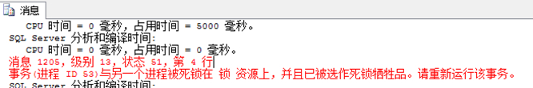

# 事务

## 什么是事务

宏观上看，事务就是一次完整的操作过程；程序角度看，事务是用户自定义的数据操作系统，由多条命令组成，内部所有命令语句要被当成一个整体，要么全部被执行，要么全部不执行（前面已经执行部分的命令都撤销—回滚）。以前的后触发器的机制就是事务。

 如：a账号要给B账号转N元钱，由两步完成：

（1）A账户号-n；（2）B账号+n

事务对待：上两步要么两句都成功，要么一句都不执行。

## 事务的主要特征

（1）原子性：指事务是数据的逻辑工作单位，每一步都要被执行，不可再分。

（2）一致性：指事务的执行结果必须从数据库一个状态确定变到另一个状态。（对数据的改变是确切的，事务常用于数据修改类的操作）

（3）隔离性：在执行一个事务的过程，不能被其它事务干扰。(即使多个事务要使用到共同的数据，那也要依次进行，不交叉并发处理)

（4）持久性：事务一旦被提交运行，它的操作对数据库的改变影响是永远的(事务一旦完成后，不可能回滚)

## 事务分类

### 隐式事务

不需要人为指定和设置，操作过程当事务对待。SQL本身提供的这些数据操纵语句自动当成事务对待的。如：

```sql
Update 学生表 set 性别=’男’,身高=身高+0.5 where 姓名=’杨春’
```

 详细过程：在表中定位到杨春记录---复制数据到deleted临时表—再删除本记录---再复制到inserted临时表---再修改inserted临时表的数据性别，身高---再把inserted数据存放到物理表

### 显示事务

程序员写代码时，明确显示地写出事务的开始和结束标记。 一般事务是定义在过程中的，有可能把整个过程的代码当成事务，也可以把过程的部分连续位置的代码当成事务。 明尾暗头—事务的开头是隐含的，但结束有明确标记（常用于整个过程的开头号到当前代码为事务）。

四大事务专用语句

（1）begin transaction: 事务开始

（2）commit transaction: 事务到此已经成功执行，数据已经处理完成，后继语句可不当事务对待。

（3）rollback transaction: 整数处理过程出错了，回滚到没有处理之前的数据状态，或回滚到事务内部的保存点。

（4）save transaction: 事务内部的保存点，如果事务内有此语句，当事务回滚时，可以不全部回滚，只回滚到本位置

例1：模拟上面银行转账

```sql
Begin tran
 Update 支付表 set 总额=总额-n where 账号=’a’
 Update 支付表 set 总额=总额+n  where 账号=’b’
Commit tran
```

说明：最简单的事务。最前面的begin tran可省—明尾暗头

例：学生表的年龄约束为10-100；身高介于1-3.0米

```sql
begin tran
 update 学生表 set 年龄=20 where 姓名='杨春'
 update 学生表 set 身高=-1 where 名字='李大方'
commit tran
```

 再例：

```sql
create proc mypro13 as /*事务一般是写在过程/函数中*/
begin
begin tran /*显式事务*/
 begin try
  insert into 学生表(学号,姓名,年龄) values('2011','aaa',17)
  insert into 学生表(学号,姓名,年龄) values('2012','bbb','xx')
  insert into 学生表(学号,姓名,年龄) values('2013','ccc',19)
 end try
 begin catch
  select ERROR_NUMBER() as errnum,ERROR_SEVERITY() as err2,ERROR_LINE() as err3,ERROR_PROCEDURE() as eer4, ERROR_MESSAGE() as err4 /*错误捕获select ERROR_MESSAGE as err6*/
  if(@@TRANCOUNT>0)  rollback tran
 end catch
 if(@@TRANCOUNT>0) /*如果已经执行到此了，说明上面事务已经完成了*/
  commit tran
end
end

execute  mypro13
```

例：设置保存点

```sql
create proc mypro16 as
begin
begin tran
 begin try
  insert into 学生表(学号,姓名,年龄) values('2011','aaa',17) 
  save tran mysave1 /*加一个保存点，如果后面出错，则可滚回到此为止*/
  insert into 学生表(学号,姓名,年龄) values('2012','bbb','xx')
  insert into 学生表(学号,姓名,年龄) values('2013','ccc',19)
 end try
 begin catch
  select ERROR_NUMBER() as errnum,ERROR_SEVERITY() as err2,ERROR_LINE() as err3,ERROR_PROCEDURE() as eer4, ERROR_MESSAGE() as err4 
 -- select ERROR_MESSAGE as err6
  if(@@TRANCOUNT>0) 
  rollback tran mysave1
 end catch
 if(@@TRANCOUNT>0)
 commit tran
 -- rollback tran mysave1
end

execute  mypro16
```

# 事务与并发控制

例：在一台计算机上模仿两个程序调用同一个数据，观察数据变化。

如果是成千上万用户这样访问同一个数据，会不会出错？？---数据在多用户多任务情况下并发控制。

在SQL中分别使用三个查询窗口，模仿网络上多用户针对访问同一个数据

**代码1：** 

```sql
while(5>1)
begin
begin tran
 update 学生表 set 年龄=年龄+1 where 姓名='杨春'
 waitfor delay '00:00:05'
commit tran
end
```

**代码2：**

```sql
while(5>1)
begin
begin tran
 update 学生表 set 年龄=年龄+10 where 姓名='杨春'
 waitfor delay '00:00:05'
commit tran 
end
```

代码3:

```sql
select * from 学生表
```

引例2：打开两个查询窗口，把下面的语句，分别放入2个查询窗口，在5秒内运行2个事务模块。

第一个窗口：

```sql
begin tran 
  update 学生表 set 年龄=年龄+10 where 姓名='杨春'
  waitfor delay '0:0:5'  
  update 课程表  set 学时=学时+10 where 课程号='101' 
commit tran
select * from 学生表 where 姓名='杨春'
select * from 课程表 where 课程号='101'
```

第二个窗口：

```sql
begin tran 
  update 课程表  set 学时=学时+1 where 课程号='101' 
  waitfor  delay '0:0:5' 
  update 学生表 set 年龄=年龄+1 where 姓名='杨春'
commit tran
select * from 学生表 where 姓名='杨春'
select * from 课程表 where 课程号='101'
```

报错：



## 锁

从程序员的角度看：分为乐观锁和悲观锁。  

- 乐观锁：完全依靠数据库来管理锁的工作。  

- 悲观锁：程序员自己管理数据或对象上的锁处理。

在多用户都用事务同时访问同一个数据资源的情况下，就会造成以下几种数据错误。

- 更新丢失：多个用户同时对一个数据资源进行更新，必定会产生被覆盖的数据，造成数据读写异常。

- 不可重复读：如果一个用户在一个事务中多次读取一条数据，而另外一个用户则同时更新啦这条数据，造成第一个用户多次读取数据不一致。

- 脏读：第一个事务读取第二个事务正在更新的数据表，如果第二个事务还没有更新完成，那么第一个事务读取的数据将是一半为更新过的，一半还没更新过的数据，这样的数据毫无意义。

- 幻读/幽灵数据：第一个事务读取一个结果集后，第二个事务，对这个结果集经行增删操作，然而第一个事务中再次对这个结果集进行查询时，数据发现丢失或新增。

然而锁定，就是为解决这些问题所生的，他的存在使得**一个事务对他自己的数据块进行操作的时候，而另外一个事务则不能插足这些数据块**。这就是所谓的锁定。

锁定从数据库系统的角度大致可以分为6种：

（1）共享锁（S）：还可以叫他读锁。可以并发读取数据，但不能修改数据。也就是说当数据资源上存在共享锁的时候，所有的事务都不能对这个资源进行修改，直到数据读取完成，共享锁释放。

（2）排它锁（X）：还可以叫他独占锁、写锁。就是如果你对数据资源进行增删改操作时，不允许其它任何事务操作这块资源，直到排它锁被释放，防止同时对同一资源进行多重操作。

（3）更新锁（U）：防止出现死锁的锁模式，两个事务对一个数据资源进行先读取再修改的情况下，使用共享锁和排它锁有时会出现死锁现象，而使用更新锁则可以避免死锁的出现。资源的更新锁一次只能分配给一个事务，如果需要对资源进行修改，更新锁会变成排他锁，否则变为共享锁。

（4）意向锁：SQL Server需要在层次结构中的底层资源上（如行，列）获取共享锁，排它锁，更新锁。例如表级放置了意向共享锁，就表示事务要对表的页或行上使用共享锁。在表的某一行上上放置意向锁，可以防止其它事务获取其它不兼容的的锁。意向锁可以提高性能，因为数据引擎不需要检测资源的每一列每一行，就能判断是否可以获取到该资源的兼容锁。意向锁包括三种类型：意向共享锁（IS），意向排他锁（IX），意向排他共享锁（SIX）。

一个表中，在加载的同时，不允许其它进程访问该表。这些锁之间的相互兼容性，也就是，是否可以同时存在。

## 死锁

什么是死锁，为什么会产生死锁。我用 “事务把死锁给整出来啦” 标题下的两个事务产生的死锁来解释应该会更加生动形象点。

例子是这样的：

第一个事务（称为A）：先更新学生表 --->>停顿5秒---->>更课程表

第二个事务（称为B）：先更新课程表--->>停顿5秒---->>更新学生表

先执行事务A----5秒之内---执行事务B，出现死锁现象。

过程是这样子的：

1. A更新学生表，请求学生表的排他锁，成功。

2. B更新课程表，请求课程表的排他锁，成功。

3. 5秒过后

4. A更新课程表，请求课程表的排它锁，由于B占用着课程表的排它锁，等待。

5. B更新学生表，请求学生表的排它锁，由于A占用着学生表的排它锁，等待。

这样相互等待对方释放资源，造成资源读写拥挤堵塞的情况，就被称为死锁现象，也叫做阻塞。而为什么会产生，上例就列举出来了。

然而数据库并没有出现无限等待的情况，是因为数据库搜索引擎会定期检测这种状况，一旦发现有情况，立马选择一个事务作为牺牲品。牺牲的事务，将会回滚数据。有点像两个人在过独木桥，两个无脑的人都走在啦独木桥中间，如果不落水，必定要有一个人给退回来。这种相互等待的过程，是一种耗时耗资源的现象，所以能避则避。

