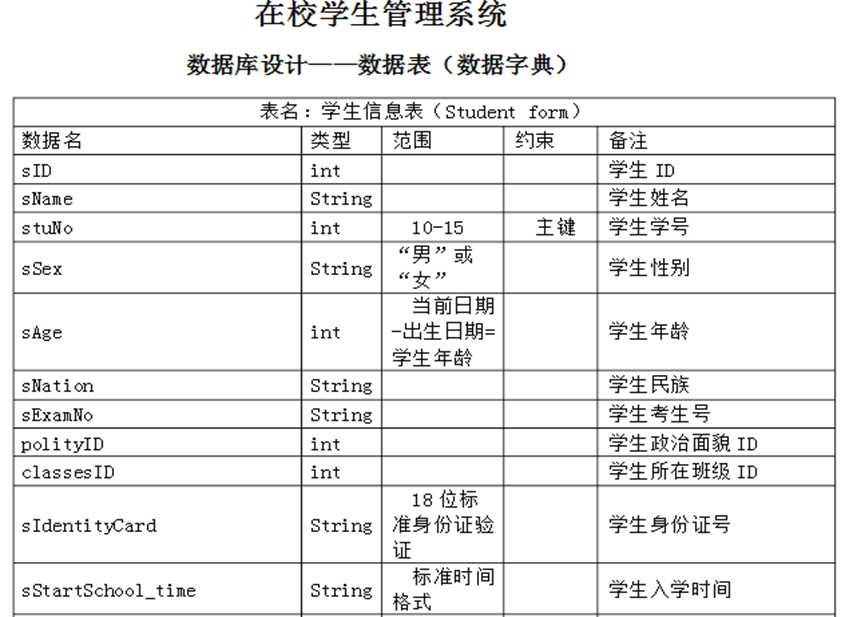
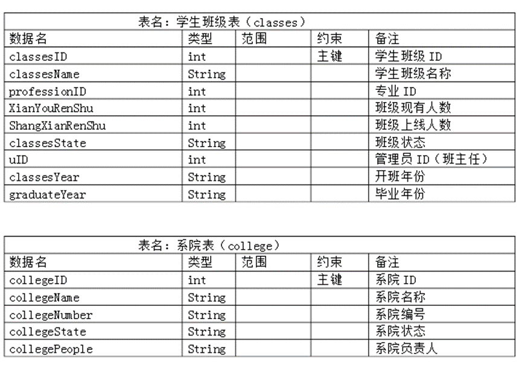
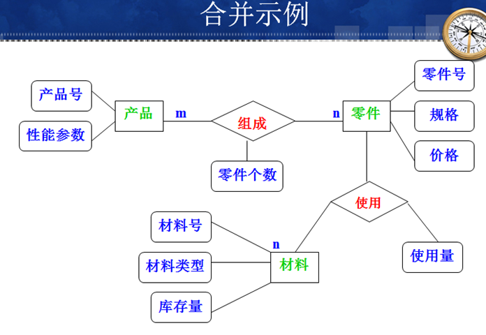
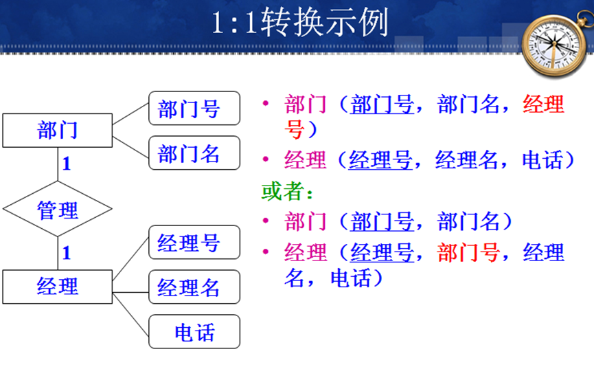
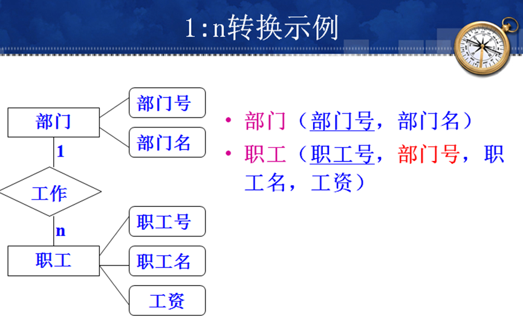

# 概念

数据库需求分析就是分析人员在调查现存系统基础上，对用户的数据需求进行分析和确认

# 数据库需求分析的主要内容

1. 数据结构分析：分析各种数据的结构，主要是指用户方的业务数据。
2. 数据定义分析：针对需求，确定需要定义哪些数据库主要内容，主要包括基本表，视图，索引等。
3. 数据操纵分析：确定用户那哪些数据需要增删查改，甚至包括联动的触发器等（表的列级，记录级，表间的约束，触发器---完整实现数据完整性控制）
4. 数据安全分析： 哪些数据可以被哪些角色用户操作，数据加密存储等。
5. 数据完整性分析：对数据的约束，数据之间，用户表关系之间的约束等的分析
6. 并发处理分析：分析数据并发处理的需求和可能性，是否需要采用事务处理。
7. E-R图设计：根据以上分析，做出实体联系图，这是数据库中的基本表的设计依据

# 需求分析的工具

 主要流行的工具是DFD（数据流程图）和DD(数据字典)。

 DFD：通过图形符号形象描述数据输入，输出和移动变换过程。常采用结构化分析方法SA，自顶向下，逐层分解，把复杂的数据需求分析细化。

DD是前期数据收集和分析的纸面化结果，即对数据流程图DFD中各个元素（数据项，数据结构，实体，数据流等）进行详细的说明和备注、名词解释等。

 数据流程图DFD与数据字典DD结合就构成了数据库设计的逻辑模型，是数据库设计的成果的核心内容之一。 

实例：在校学生管理系统的数据库设计---数据表和数据字典

# 数据库需求调查

 主要的调查方法有：

- 跟班作业法： 到用户方工作一线，跟班调查用户的工作过程

- 问卷调查法

# 数据安全分析

 核心问题：用户访问权限控制，数据加密存储，病毒，黑客。

数据访问权限控制->  用户角色： 管理员用户admin  , 数据库应用系统用户

# 并发处理分析

多个程序或多个用户同时访问同一数据对象。

# E-R图

 1 矩形框表示实体，椭圆表示属性

 2 E-R图要描述出不同实体之间的联系：1对1，1对多，多对多

 3 原则： 实体个数尽可能少；实体所包含的属性尽可能少；实体间联系无冗余；满足范式，但同时应该减少实体集：平时为满足2NF，3NF，常分解实体，但并不是实体个数越多越好，否则减少了数据冗余但增加数据库结构的冗余

 4 E-R图设计步骤：局部E-R→合并成全局E-R

 实例：描述产品，零件，材料关系

5 E-R模型向关系模型的转换

•  一个实体转换为一个关系模式。实体的属性就是关系的属性，实体的标识符就是关系的码。

•  对于实体间的联系分情况处理。

•  1:1联系可以转换为一个独立的关系模式，也可以与任意一端所对应的关系模式合并。

•  1:n联系可以转换为一个独立的关系模式，也可以与n端所对应的关系模式合并。

•  m:n联系转换为一个关系模式。 

•  三个或三个以上实体间的一个多元联系可以转换为一个关系模式。 具有相同码的关系模式可以合并

