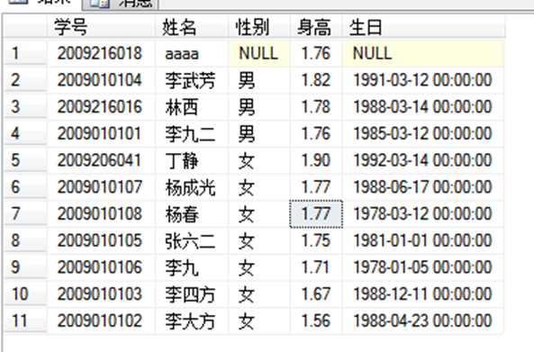
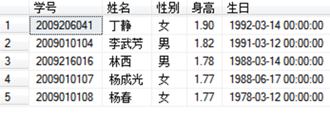
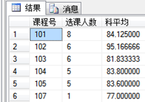

# 基本数据类型与数据定义

SQL：结构化查询语言。使用SQL命令，给出几个用户参数，系统根据这些参数从底层数据库提取结果。这个过程是封装了的，结构化的。其主要功能概括为：

- 数据定义功能：create , drop, alter 对表头结构的建，删，改

- 数据查询：select 最主要应用的，最复杂部分

- 数据操纵：insert , update ,delete 数据内容增，改，删

- 数据控制： grant，revoke,deny 授权用户权限控制

##  SQL SERVER 中基本数据类型

### 数值型

1.准确型：能精确存储数据，如整数，定点小数

- int  4字节，表示范围： -2^31~ 2^31-1 

- bigint  8字节

- smallint  2字节

- tinyint :  1字节，且是无符号数，表示0-255

- numeric(p,q) 小数，指定最多为p位，其中有q位小数,如表示0-100.0之间的数学成绩，有一位小数

 注意：尽量避免定义float ，为避免精度丢失问题，应该使用 :数学 numeric(4,1)

 如定义身高以米为单位，两位小数： `身高 numeric(3,2)`

2.近似型： 

- float 8字节  ---类似C中的double 

- real 型，  4字节 ---类似C中的float

 数据库中少用近似型，多用准确型

### 字符串型 string 

 一个字符包括英文，其它非英文如中文汉字。早期一个英文字符占1B，一个汉字占2B，在计算串长时易错。后来全世界的字符统一编码，不管是什么字符都统一为2B内码。任何变量要定义，如早期char[20] 是定长串，是否用完都是占20个字节，存在浪费，好处是数据定长，便于随机查找。如个人信息的备注内容，长度差别巨大，一般使用变长串，用多少字节占多少空间，如早期串指针。

 常用的数据库中字符串类型：

- Char(n) n取值 1-8000 普通编码， 定长

- Nchar(n) 统一字符编码，n取值1-4000 定长

- Varchar(n ) n取值1-8000,变长串

- Nvarchar(n) n取值1-4000, 统一字符编码的变长串

 如：定义一个姓名列，性别列，个人说明列

 ```sql
姓名: char(6), nchar(6)
性别：char(1), nchar(1)   f /m , 1/0, 男/女
个人说明： varchar(100), nvarchar(100) /*每个人说明情况内容长度差别大，故使用变长串，反而节约空间.*/
Text , Ntext /*可存储海量字符，如小说的内容，最多20亿个字符（10亿个汉字）*/
 ```

总结：变长串nchar( ) , 变长串nvarchar( ), 

长篇内容使用Ntext,如果列是数字或英文字母char( ) 

### 日期时间型

- Datetime : 占8字节空间来存放一个标准的日期时间，早支持1753年：如：1999-12-1 12:33:55 12.332

- Smalldatetime 占四字节，只支持 1900-1-1 -2079年

 前者支持到毫秒，后者支持到分钟

> 说明：一个日期是相对于1900-1-1的间隔天数，一个日期对应的是一个整数。所以日期其实是一个整数，使用公式显现成一个日期格式.

 今天的78天后是哪一天？ 

```sql
select GETDATE()+78
```

时间是一个相对于当天从00:00:00开始的秒数.

> 特别注意： 字符串常量，日期时间常量在sqlserver用单引号

 时间间隔计算：t2-t1得间隔秒数

### binary image型

  常用于存放二进制的文件内容，如一个WORD文件，一张照片

## 数据定义

建立数据库建立表，修改表的结构（不涉及到表的内容操作）

### 建立基本表

```sql
Create table 表名(列名及参数和约束 )
```

例：建立一个课程表

```sql
create table 课程表( 
课程号 char(3),课程名 nchar(12),学分 tinyint ,
开课学期 tinyint,课程说明 nvarchar(200)
)
```

### 修改表结构 modify structure

 对表名进行变更，弄不好有可能造成大量旧数据内容丢失。

 主句： `alter table 表名 修改子句`

 (1)向已有表增加新列

```sql
Alter table 表名 add 字段名及参数
```

例：向上面的课程表增加一列 所属专业编号

```sql
 alter table 课程表 add 所属专业 nchar(5)
```

例：一次性同时增加多列，如向课程表增加开课学院，任课老师

```sql
alter table 课程表 add 开课学院 nchar(10),任课教师 nchar(6)
```

(2)删除表中的原有列

```sql
Alter table 表名 drop column 列名

alter table 课程表 drop column 开课学院,任课教师
```

(3)修改已有列的字段列参数(不能改列名，只能修改类型，宽度，约束)

```sql
Alter table 表名 alter column 列名(参数)
```

例：把所属专业列的nchar(5)改为char(20)

```sql
alter table 课程表 alter column 所属专业 char(20)
```

(4)更名基本表：

例： 把原2表全部表头和内容复制3表，再把2表删除掉

```sql
 Select * into 课程表3 from 课程表2 
 Drop table 课程表2
```

(5)对已有列更名

 例：假设原表课程表2已有大量数据，不可能重新建表，现要把”所属专业”改为“从属专业”；

```sql
alter table 课程表 add 从属专业 char(20)
update 课程表 set 从属专业=所属专业

alter table 课程表 drop column 所属专业
select * from 课程表
```

又如：把学生表的生日列修改为“出生日期”列:

```sql
alter table 学生表 add 出生日期 smalldatetime
update 学生表 set 出生日期=生日
alter table 学生表 drop column 生日
```

# 常用查询操作

SQL查询命令格式：

```sql
select exps from table where exps2
```

## 基本查询

比如：

```sql
select 学号,姓名 from 学生表 where 性别='男'
select * from 学生表 where 性别='男'
select 学号+姓名,YEAR(getdate())-YEAR(出生日期) from 学生表

select 学号+姓名 as xhxm,YEAR(getdate())-YEAR(出生日期) as nl from 学生表 as xs
select 学号 as 编号,出生日期 as 生日 from 学生表
select 学号 编号,出生日期 生日 from 学生表 xs
```

求年龄：

```sql
select 学号,姓名,YEAR(GETDATE())-YEAR(出生日期) as 年龄 from 学生表
```

求虚岁：

```sql
select 学号,姓名,convert(numeric(3,0),(datediff(day,出生日期,GETDATE()))*1.0/365+0.5) as 虚岁  from 学生表
```

## 别名问题

表名和列名的别名问题：以后编程时要引用这些数据时，方便书写，如

```sql
select 学号 as xh, 姓名 as xm,身高 sg from 学生表 as xsb
```

列名，表达计算结果列名，表名都可以取alias ,方便后继编程引用

## 把查询结果保存到一个新表中(可拆分表)

格式：``select exps1 into tablename from ……``

这把查询结果不以视图显示，而是默默地存放到一个新表中去（物理表）

```sql
select * into T1 from 学生表 where 性别='男'
select * from t1
select * into T2 from 学生表 where 性别='女'
```

以上操作可以把大表拆分成多个小的表

实例：把学生表中女生数据存放到一个“学生女”表中，列有学号，姓名，性别，年龄

```sql
select 学号,姓名,性别,
 DATEDIFF(YEAR,出生日期,GETDATE())as 年龄 into 学生女
 from 学生表 where 性别='女'
```

反之，如何把多个结构相 的表合并成一个大表？

实例：把学生表中姓杨的学生和学生女表中年龄在35以上的 的学生合并成一个新表

```sql
 select 学号,姓名,性别 into temp from 学生表 where 1>2
 select * from temp
 insert into temp select 学号,姓名,性别 from 学生表 where LEFT(姓名,1)='杨'
 insert into temp select 学号,姓名,性别 from 学生女 where 年龄>=35
```

## 去掉查询结果的重复值 distinct

用于求类别，求集合

例：求学生表中哪些学生没有选课

```sql
select * from 学生表 where 学号 not in(
select distinct 学号 from 成绩表)
```

有哪些学生选了课？

```sql
select 姓名,性别 from 学生表
 where 学号 not in (select distinct 学号 from 成绩表)
```

例：求学生表中有哪几种姓氏

```sql
select distinct LEFT(姓名,1) from 学生表
```

## 集合包含in

单值情况： ``Where x =单值``

多值成集合：``Where x in(集合值)``

例：查出所有男生团员的计算机网络基础 ，计算机基础，高等数学上下的成绩情况（学号，课程号，成绩）

 ```sql
select * from 成绩表  where 
 学号 in (select 学号 from 学生表 where 性别='男' and 团员否=1)
 and 课程号 in(select 课程号 from 课程表 where 名称
 in('计算机网络基础','计算机基础','高等数学上','高等数学下'))  
 ```

## 字符串匹配 like

-  ``%``代表任意多个字符（包括0-n个）

-  ``_ ``必须只能代表一个任意字符
   如：``张_ ``可代表张三，张六（两个字），而 ``张%`` 可代表：张   张三  张三四(以要以张字开头即可)

-  ``[^字符]`` 不在其中选一个字符

例： 查出学生表中所有姓杨，张，李的人,有如下办法

```sql
Select * from 学生表 where left(姓名,1)=’杨’ or left(姓名,1)=’张’ or left(姓名,1)=’李’

Select * from 学生表 where left(姓名,1) in(’杨’,’张’,’李’)

Select * from 学生表 where left(姓名,1) like '[杨张李]'

Select * from 学生表 where 姓名 like '[杨张李]%'

Select * from 学生表 where substring(姓名,1,1) like '[杨张李]'
```

例：上例中求反操作

```sql
Select * from 学生表 where 姓名 like '杨张李%'
```

注意：如果查询时，``%`` 或``_ ``本身就是被查询的内容，如何处理？

例：要从表中查出某说明列中含有“50%”字样的串

```sql
Select * from xx where 列名 like ’%50!%%’ escape ’!’
```

说明：第1个``%``和第3个``%``是匹配任意字符串，第2个``!%``表示此``%``不是匹配意义，``escape ’!’``，说明``!``后面这个字符不是匹配意义（类似于早期C语言中的转义字符``\``）

例：有产品表，有列产品编号，现要查出编号中含有`` no_2``字样的所有产品

```sql
Select * from 产品表 where 编号 like ’%no!_2%’ escape ’!’
```

## 排序

默认为升序asc ， 也可以人为指定为降序desc

```sql
select 学号,姓名,年龄 from 学生表 where 性别='男' order by 年龄 desc
```

 如果是计算结果排序呢？

```sql
select 学号,姓名,YEAR(getdate())-YEAR(生日) from 学生表 where 性别='男' order by 3 desc
```

> 注意：order by 依据可以是列名，也可是列序号（如3表示按第3列排序）

或者：

```sql
select 学号,姓名,YEAR(getdate())-YEAR(生日) as 年龄 from 学生表 where 性别='男' order by 年龄 desc
```

注意：本处的年龄不是表中的原属性年龄，是查询结构别名年龄。查询结果如果直接来自物理表的列名，查询结果列名同物理表列名。

多列参与排序问题：

如：先按科室把所有员工分成类，同科室的人连续位置排列，在同科室内部再按补贴多高到低排序。

```sql
Select * from 补贴表 order by 科室 ASC, 补贴 desc
```

一个desc只管自己的列，本处科室是升序，补贴是降序

例：把学生表所有人按性别分类，同类性别内按身高降序，如果性别和身高再相同，则进一步按年龄升序(年龄以生日为准)

```sql
 select 学号,姓名,性别,身高,生日 
 from 学生表 order by 性别,身高 desc,生日 desc
```



>注：数值直接比较大小，汉字按拼音，日期是今天比昨天大，逻辑值true>false。多关键参与排序时，第一个主关键字，后面第二，三关键字. 从左向右，先满足左边的关键字排序，在值重复情况下才再按右边关键字排序。

如何从排序结果里面取前面一部分元组行呢？如取前n个， 取前n%：

`` Top n , top n percent``

取出身高前五名：

```sql
select top 5  学号,姓名,性别,身高 ,生日 from 学生表 order by 身高 desc 
```

再例：要取出年龄较小的前30%的人呢?

```sql
select top 30 percent  学号,姓名,性别,身高 ,生日 from 学生表 order by 生日 desc
```

如果刚好第4和7名身高的同学身高值相同，都是1.77，咋取？

```sql
select top 4 with ties 学号,姓名,性别,身高 ,生日 from 学生表 order by 身高 desc
```



如果不加with ties则没有杨春。

例：随机挑选四个记录出来

```sql
select top 4 学号,姓名,身高 from 学生表 order by NEWID() 
```

# 数据插入

命令格式：

```sql
insert into 表名(属性列表) values（对应属性列值表）
```

注意：values不是value，属性列和值的个数，顺序，数据类型都要完全一致时；仅当插入数据时，按表的原始属性列顺序插入所有值时，“属性列表”可省写。

如：

```sql
insert into 课程表(课程号,名称,学时,类别,开课学期,学分)
 values('115','机械力学',45,'选修课','第学期',3)
```

说明：学时45表中是整数型，但插入数据时使用字符文本串，系统有容错能力，把数值文本转换为数值。

> 日期常量要加引号，否则会当成一个数学计算表达式如：‘1989-12-1’，如果写成1989-12-1会当成一个减法表达式，逻辑上是错误的.

上例可以省掉属性列说明，因为**全列插入**，改为：

```sql
insert into 课程表
 values('116','量子物理',45,'选修课','第学期',3)
```

如果值不是全列插入，前面的属性列表不能省的。

如何把其它的查询结果当成新数据插入到表中？

格式：

```sql
insert into 表名1（属性列） select …from 表名2….
```

把从表2查询得到的数据插入到表1中。子查询的结果列与目标表的列完全一致。

实例：表1 的字段为学号 姓名 性别 生日；表2的字段为：学号 名字 性别  出生日期，如何把表2中的所有男生选出来插入到表1？

```sql
insert into 表1(学号,姓名,性别,生日) 
select 学号,名字 as 姓名,性别,出生日期 as 生日 from 表2)
```

可见，源数据与目标表的表头结构要一致。

# 数据更新

**格式：** 

```sql
update 表名 set 列1=表达式1[,列2= 表达式2,……] [where 条件]
```

用法1:直接根据条件修改某一个，某一些记录的属性值,对已经事先存在的记录进行某些列的值的修改

例： 把表中杨春同学的性别修改为男，生日提前10天

```sql
update 学生表 set 性别='男',生日=生日-10 where 姓名='杨春'
```

用法2: 横向计算应用

已知学生成绩表结构：学号 姓名 语文 数学 英语 总分 平均分

计算所有学生的总分，平均分

```sql
Update 学生成绩 set 总分=语文+数学+英语,平均分=总分/3
```

上面命令不能修改为：

```sql
Update 学生成绩 set平均分=总分/3,总分=语文+数学+英语
```

在SQL中，逗号并列的计算，从左向右的，上例不能得到平均分的

用法3:实际开发APP时，如用户初步注册（调用你的QQ，微信号初步简单的注册，当用户进一步使用本APP其它功能时，再完善个人资料），基本理论：

```sql
 Insert into 用户表(用户ID)values(微信号)
```

即先在系统中给新用户占个位，以后完善个人资料时，使用update更新其它数据。

注意：update是支持多表连接操作

例：给所有姓李的同学的102课程加1分

 方法1: 嵌套查询

```sql
update 成绩表 set 成绩=成绩+1 where 课程号='102'
  and 学号 in(select 学号 from 学生表 where LEFT(姓名,1)='李')
```

方法2: 

```sql
 update 成绩表 set 成绩=成绩+1
  from 学生表 a inner join 成绩表 b on a.学号=b.学号
  where 课程号='102' and lefT(姓名,1)='李'
```

方法2使用表的连接并不是用于查询，而是作为主句update 的约束条件。

# 数据删除

## 删除表

删除表：``drop table 表名``

```sql
 drop table 教学表
```

注意，数据库删除数据和表是无法恢复的。

## 删除表记录元组

 格式：``delete from 表名 where 条件``

不加条件，表要清空，小心

 ```sql
delete from 学生表 where 姓名 like '杨%'
 ```

小结：到此已经学了数据定义，数据库和表的结构建立和修改维护，数据操纵，最核心的是数据增，删除，查，修改。

# 聚合函数应用

 函数在sqlserver中，分：系统函数（如sin(x)，getdate() ）, 聚合函数（专用于表的统计工作，自定义函数。

 其中自定义函数又分：标值函数（返回的结果一个标量值，如学号，身高这些单一值），表值函数（返回一堆数据，以视图表的形式返回）。

## count( )统计表中元组个数 

```sql
select COUNT(性别) from 学生表

select COUNT(姓名) from 学生表

select COUNT(*) from 学生表  //常用的
```

例：统计表中的女生比男生多几个人？

```sql
select (select COUNT(*) from 学生表 where 性别='女')
 -(select COUNT(*) from 学生表 where 性别='男')
```

例： 根据成绩表统计出有几门课有学生选

```sql
select COUNT(distinct 课程号) from 成绩表
```

补：哪些课程有人选？ 列出课程名

```sql
select 名称 from 课程表 where 课程号 in (select distinct 课程号 from 成绩表) 
```

## 求和函数sum(  )、求均值函数 avg(  )

纵向对数值型列求和，平均

```sql
 select SUM(成绩) from 成绩表 where 课程号='101'

 select AVG(成绩) from 成绩表 where 课程号='102'
```

一次性分组统计出两门课的平均成绩：

```sql
 select 课程号, AVG(成绩) as 科平均 from 成绩表 
   where 课程号 in('102','105')  group by 课程号
```

例；有结构：成绩表（学号，语文，数学，英语，总分，平均分）

根据三科成绩，计算出所有学生的总分，和平均分,不能使用sum,average,因为它们是纵向操作。本题是要求横向计算

方法1:结果不填写表里

```sql
 Select 学号,语文,数学,英语, 语文+数学+英语 as 总分,总分/3 as 平均分 from 成绩表
```

方法2:结果填表

```sql
 Update 成绩表 set 总分 =语文+数学+英语,平均分 = 总分/3
```

## max( ) min( ) 常用于对数值，日期列求大值，小值

求课程号为101的最高分与最低分之差：

```sql
 select MAX(成绩)-MIN(成绩) from 成绩表 where 课程号='101'
```

求年龄最小值(生日最大值)：

```sql
select MAX(生日) from 学生表 
```

例：一次性求出101课程的最高，最低，平均，总分，选课人数

```sql
select MAX(成绩) as 最高分,MIN(成绩) 最低分,
   avg(成绩) as 平均分 ,sum(成绩) as 科总分,
   count(*) as 选课人数 from 成绩表 where 课程号='101'
```

 说明：类似以上返回一堆数据，可以事先定义表值函数。

## group by 分组及统计应用

 分组一般结合统计聚会函数一起使用

例：统计出表各性别的人数

```sql
select 性别, COUNT(*) as 人数 from 学生表 group by 性别
```

例：统计出成绩表中各课程的选课人数，科平均分

```sql
select 课程号,COUNT(*) as 选课人数,AVG(成绩) as 科平均 from 成绩表  group by 课程号
```



例：求每个人的选课数和所选课的平均分：

```sql
select 学号,COUNT(*) as 选课门数,AVG(成绩) 
as 人平均 from 成绩表 group by 学号
```

例：统计出成绩表中，每个姓李的学生的选课情况；包括学号，科目数，总分，平均分，要求只列出选课数目大于等于6的人情况, 最后结果按科目数降排

```sql
select 学号,COUNT(*) as 科目数,SUM(成绩) as 总分,
  AVG(成绩) as 平均分
  from 成绩表 where 学号 in 
(select 学号 from 学生表 where 姓名 like '李%')
  group by 学号 having count(*)>=6 order by 2
```

例：求出大学英语所有学生的总分和平均值，选课人数

```sql
select COUNT(*) as 人数, SUM(成绩) as 总分 ,AVG(成绩) as 科平均 from 成绩表 
 where 课程号= (select 课程号 from 课程表 where 名称='大学英语')
```


