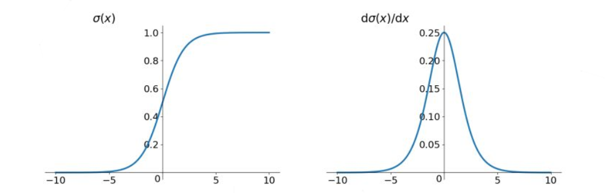
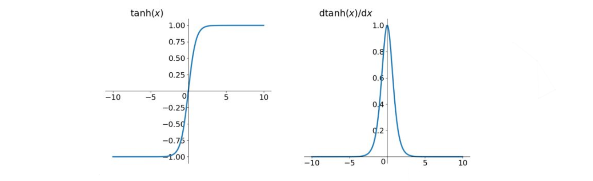
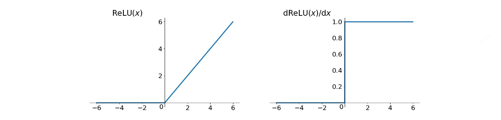
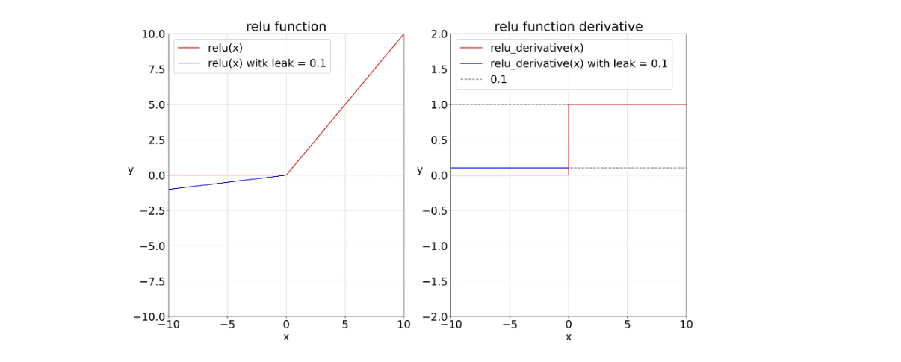
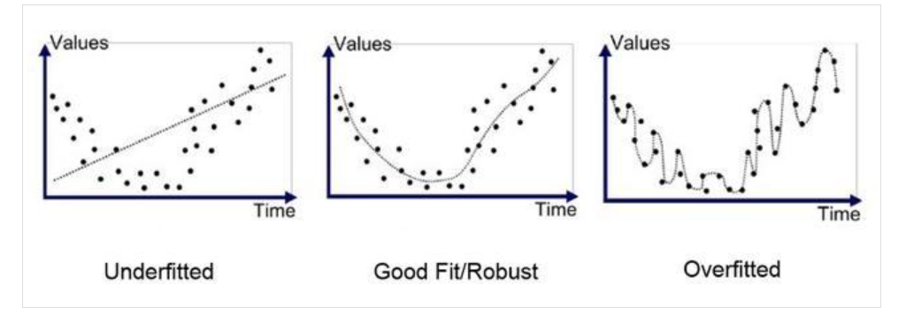
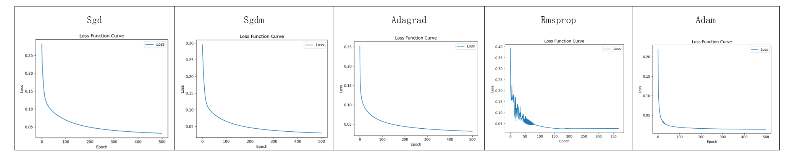
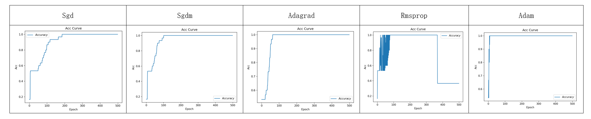

# 神经网络计算

## 数据类型

`tf.int,tf.float`...

- `tf.int32`
- `tf.float32`
- `tf.float64`

`tf.bool`

- `tf.constant([True,False])`

`tf.string`

- `tf.constant("Hello world!")`

## 创建一个Tensor

张量（Tensor）：即多维数组（列表），张量的阶又称张量的维度，可以表示0阶到n阶数组（列表）。

| 维数 | 阶   | 名字        | 例子                        |
| ---- | ---- | ----------- | --------------------------- |
| 0-D  | 0    | 标量 scalar | s=1 2 3                     |
| 1-D  | 1    | 向量 vector | v=[1,2,3]                   |
| 2-D  | 2    | 矩阵 matrix | m=[[1,2,3],[4,5,6],[7,8,9]] |
| n-D  | n    | 张量 tensor | t=[[[  ---(n个)             |

创建一个张量：`tf.constant(张量内容,dtype=数据类型（可选）)`

```python
import tensorflow as tf
a=tf.constant([1,5],dtype=tf.int64)
print(a.dtype)
print(a.shape)
```

将`numpy`的数据类型转换为`Tensor`数据类型：`tf.convert_to_tensor(数据名,dtype=数据类型（可选）)`

```python
b = tf.convert_to_tensor(a, dtype=tf.int64)

# 创建全0的张量
a = tf.zeros([2, 3]) # 2行3列
# 创建全1的张量	
b = tf.ones(4)		 # 4个元素
# 创建全为指定值的张量
c = tf.fill([2, 2], 9)
```

生成正态分布的随机数，默认均值为0，标准差为1：`tf.random.normal(维度,mean=均值,stddev=标准差)`

生成截断式正态分布的随机数：`tf.random.truncated_normal(维度,mean=均值,stddev=标准差)`

生成均匀分布的随机数：`tf.random.uniform(维度,minval=最小值,maxval=最大值)`

> 在`tf.truncated_normal`中如果随机生成数据的取值在$(\mu-2\sigma,\mu+2\sigma)$之外，则重新进行生成，这保证了生成值在均值附近。$\mu$为均值，标准差$\sigma=\sqrt{\frac{\sum_{i=1}^n(x_i-\bar{x})^2}{n}}$。

```python
d = tf.random.normal([2, 2], mean=0.5, stddev=1)
print("d:", d)
e = tf.random.truncated_normal([2, 2], mean=0.5, stddev=1)
print("e:", e)
f = tf.random.uniform([2, 2], minval=0, maxval=1)
print("f:", f)
```

输出：

```shell
d: tf.Tensor(
[[-0.2615776   0.03525731]
 [ 0.4088872   0.27938813]], shape=(2, 2), dtype=float32)
e: tf.Tensor(
[[ 0.45028624 -0.16580975]
 [ 0.20868507  1.2704782 ]], shape=(2, 2), dtype=float32)
f: tf.Tensor(
[[0.19484854 0.09551072]
 [ 0.9372535  0.25159132]], shape=(2, 2), dtype=float32)
```

## 常用函数

强制`tensor`转化为数据类型：`tf.cast(张量名,dtype=数据类型)`

### 最值

计算张量维度上元素的最小值：`tf.reduce_min(张量名)`

计算张量维度上元素的最大值：`tf.reduce_max(张量名)`

```python
x1 = tf.constant([1., 2., 3.], dtype=tf.float64)
print("x1:", x1)
x2 = tf.cast(x1, tf.int32)
print("x2:", x2)
print("minimum of x2：", tf.reduce_min(x2))
print("maxmum of x2:", tf.reduce_max(x2))
```

运行结果：

```shell
x1: tf.Tensor([1. 2. 3.], shape=(3,), dtype=float64)
x2: tf.Tensor([1 2 3], shape=(3,), dtype=int32)
minimum of x2： tf.Tensor(1, shape=(), dtype=int32)
maxmum of x2: tf.Tensor(3, shape=(), dtype=int32)
```

### 数学运算

在一个二维张量或者数组中，可以通过axis来控制执行维度：`axis=0`代表跨行（经度，down），`axis=1`代表跨列（纬度，across），若不指定axis，则所有元素参与计算。

计算张量沿着指定维度的平均值：`tf.reduce_mean(张量名,axis=操作轴)`

计算张量沿着指定维度的和：`tf.reduce_sum(张量名,axis=操作轴)`

`tf.Variable()`将变量标记为“可训练”，被标记的变量会在反向传播中记录梯度信息。神经网络训练中，常用该函数标记待训练参数。

```python
w=tf.Variable(tf.random.normal([2,2],mean=0,stddev=1))
```

对应元素的四则运算：`tf.add, tf.subtract, tf.multiply, tf.divide`，只有维度相同的张量才可以做四则运算。

- 实现两个张量对应元素相加：`tf.add(张量1,张量2)`

平方、次方与开方：`tf.square, tf.pow, tf.sqrt`

矩阵乘：`tf.matmul`

```python
a = tf.ones([1, 3])
b = tf.fill([1, 3], 3.)

print("a+b:", tf.add(a, b))
print("a-b:", tf.subtract(a, b))
print("a*b:", tf.multiply(a, b))
print("b/a:", tf.divide(b, a))

print("a的立方:", tf.pow(a, 3))
print("a的平方:", tf.square(a))
print("a的开方:", tf.sqrt(a))

print("a*b:", tf.matmul(a, b))
```

### 构建数据集

切分传入张量的第一维度，生成输入特征/标签对，构建数据集`data=tf.data.Dataset.from_tensor_slices((输入特征,标签))`

```python
features = tf.constant([12, 23, 10, 17])
labels = tf.constant([0, 1, 1, 0])
dataset = tf.data.Dataset.from_tensor_slices((features, labels))
for element in dataset:
    print(element)
```

输出结果：

```shell
(<tf.Tensor: shape=(), dtype=int32, numpy=12>, <tf.Tensor: shape=(), dtype=int32, numpy=0>)
(<tf.Tensor: shape=(), dtype=int32, numpy=23>, <tf.Tensor: shape=(), dtype=int32, numpy=1>)
(<tf.Tensor: shape=(), dtype=int32, numpy=10>, <tf.Tensor: shape=(), dtype=int32, numpy=1>)
(<tf.Tensor: shape=(), dtype=int32, numpy=17>, <tf.Tensor: shape=(), dtype=int32, numpy=0>)
```

### 计算梯度

`with`结构记录计算过程，`gradient`求出张量的梯度：

```python
with tf.GradientTape() as tape:
    若干个计算过程
grad=tape.gradient(函数,对谁求导)
```

例如，

```python
with tf.GradientTape() as tape:
    x = tf.Variable(tf.constant(3.0))
    y = tf.pow(x, 2)
grad = tape.gradient(y, x)
print(grad) # 6
```

### 遍历元素

`enumerate`是python的内建元素，它可以遍历每个元素（如列表、元组或字符串），组合形式为：索引 元素，常在`for`循环中使用。

```python
seq = ['one', 'two', 'three']
for i, element in enumerate(seq):
    print(i, element)
```

运行结果：

```shell
0 one
1 two
2 three
```

### 独热编码

独热编码（one-hot encoding）：在分类问题中，常用独热编码做标签，标记类型为0或1。`tf.one_hot()`函数将待转换数据，转换为one-hot形式的数据输出：`tf.one_hot(待转换数据,depth=几分类)`

```python
classes = 3
labels = tf.constant([1, 0, 2])  # 输入的元素值最小为0，最大为2
output = tf.one_hot(labels, depth=classes)
print("result of labels1:", output)
print("\n")
```

运行结果：

```shell
result of labels1: tf.Tensor(
[[0. 1. 0.]
 [1. 0. 0.]
 [0. 0. 1.]], shape=(3, 3), dtype=float32)
```

`tf.nn.softmax(x)`计算出了每种类型的可能性大小，使输出符合概率分布，其公式为：$Softmax(y_i)=\frac{e^{y_i}}{\sum_{j=0}^ne^{y_i}}$

对参数更新一般用到`assign_sub`函数，使用该函数前，先用`tf.Variable`定义变量`w`为可训练：`w.assign_sub(w要自减的内容)`，即`w.assign_sub(1)`表示`w=w-1`。

函数`tf.argmax`返回张量沿指定维度最大值的索引：`tf.argmax(张量名,axis=操作轴)`

## 例子：神经网络实现鸢尾花分类

主要步骤如下：

1、准备数据

- 数据集读入
- 数据集乱序
- 生成训练集和测试集（即x_train/y_train，x_test/y_test）
- 配成（输入特征，标签）对，每次读入一小撮（一个batch）

2、搭建网络

- 定义神经网络中所有可训练参数

3、参数优化

- 嵌套循环迭代，`with`结构更新参数，显示当前`loss`

4、测试效果

- 计算当前参数前向传播后的准确率，显示当前`acc`

5、acc/loss可视化

代码示例（含注释讲解）：[iris.py](code/ex1_iris.py)

# 神经网络优化

训练时，可以先用较大的学习率，快速得到较优解，然后逐步减小学习率，使模型在训练后期稳定。

$指数衰减学习率=初始学习率*学习率衰减率^{当前轮数/多少轮衰减一次}$

## 激活函数

优秀的激活函数：

- 非线性：激活函数非线性时，多层神经网络可逼近所有函数
- 可微性：优化器大多用梯度下降更新参数
- 单调性：当激活函数是单调的，能保证单层网络的损失函数是凸函数
- 近似恒等性：$f(x) \approx x$当参数初始化为随机小值时，神经网络更稳定

激活函数输出值的范围：

- 激活函数输出为有限值时，基于梯度的优化方法更稳定
- 激活函数输出为无限值时，建议**调小学习率**

### **Sigmoid** 函数

 `tf.nn.sigmoid(x)`

公式：$f(x)=\frac{1}{1+e^{-x}}$

图像：



特点：

- 易造成梯度消失
- 输出非0均值，收敛慢
- 幂运算复杂，训练时间长

### Tanh 函数

`tf.math.tanh(x)`

公式：$f(x)=\frac{1-e^{-2x}}{1+e^{-2x}}$

图像：



特点：

- 输出是0的均值
- 易造成梯度消失
- 幂运算复杂，训练时间长

### Relu 函数

`tf.nn.relu(x)`

公式：$$f(x)=max(x,0)=\begin{cases}0&x<0\\x&x>=0\end{cases}$$

图像：



优点：

- 解决了梯度消失问题（在正区间）
- 只需判断输入是否大于0，计算速度快
- 收敛速度远快于`sigmoid`和`tanh`

缺点：

- 输出非零均值，收敛慢
- Dead Relu问题：某些神经元可能永远也不被激活，导致相应的参数永远不能被更新

### Leaky Relu 函数

`tf.nn.leaky_relu(x)`

公式：$f(x)=max(ax,x)$

图像：



理论上讲，`Leaky Relu`有`Relu`的所有优点，外加不会有`Dead Relu`问题。但在实际操作中，并没有完全证明`Leaky Relu`总是好于`Relu`。

关于激活函数，对于初学者的建议：

- 首选`Relu`激活函数；
- 学习率设置较小值；
- 输入特征标准化，即让输入特征满足以0为均值，1为标准差的正态分布；
- 初始化参数中心化，即让随机生成的参数满足以0为均值，$\sqrt{\frac{2}{当前层输入特征个数}}$为标准差的正态分布。

## 损失函数

损失函数（loss）：预测值$y$与已知答案$y\_$的差异。

神经网络的目标就是使得loss最小。loss计算方式有三种：均方误差**MSE**（Mean Squared Error）、自定义、交叉熵**CE**（Cross Entropy）。

1、均方误差$MSE(y\_,y)=\frac{\sum^n_{i=1}(y-y\_)^2}{n}$；

TF中表示：`loss_mse=tf.reduce_mean(tf.square(y_-y))`

2、自定义损失函数$loss(y\_,y)=\sum_n f(y\_,y)$，其中$y\_$为标准答案数据集，$y$为计算出的预测答案。

如预测商品销量，预测多了就会损失成本，预测少了就会损失利润。若利润 ≠ 成本，则mse产生的loss无法利益最大化。
$$
f(y\_,y)=\begin{cases}
PROFIT *(y\_-y) & y<y\_ & 预测的y少了，损失利润PROFIT \\
COST *(y-y\_) 	& y>=y\_ & 预测的y多了，损失成本COST
\end{cases}
$$

```python
loss_zdy= tf.reduce_sum(tf.where(tf.greater(y, y_), (y - y_) * COST, (y_ - y) * PROFIT))
```

3、交叉熵损失函数**CE**（Cross Entropy）表征两个概率分布之间的距离$H(y\_,y)=-\sum y\_*lny$；

TF中表示：`tf.losses.categorical_crossentropy(y_,y)`

代码示例：[loss_func.py](code/ex2_loss_func.py)

在**Tensorflow**中，`softmax`与交叉熵结合，即输出先过`softmax`函数，再计算$y$与$y\_$的交叉熵损失函数：`tf.nn.softmax_cross_entropy_with_logits(y_,y)`

代码示例：

```python
# softmax与交叉熵损失函数的结合
import tensorflow as tf
import numpy as np

y_ = np.array([[1, 0, 0], [0, 1, 0], [0, 0, 1], [1, 0, 0], [0, 1, 0]])
y = np.array([[12, 3, 2], [3, 10, 1], [1, 2, 5], [4, 6.5, 1.2], [3, 6, 1]])
y_pro = tf.nn.softmax(y)
loss_ce1 = tf.losses.categorical_crossentropy(y_,y_pro)
loss_ce2 = tf.nn.softmax_cross_entropy_with_logits(y_, y)

print('分步计算的结果:\n', loss_ce1)
print('结合计算的结果:\n', loss_ce2)
```

运行结果相同：

```shell
分步计算的结果:
 tf.Tensor(
[1.68795487e-04 1.03475622e-03 6.58839038e-02 2.58349207e+00
 5.49852354e-02], shape=(5,), dtype=float64)
结合计算的结果:
 tf.Tensor(
[1.68795487e-04 1.03475622e-03 6.58839038e-02 2.58349207e+00
 5.49852354e-02], shape=(5,), dtype=float64)
```

## 缓解过拟合

欠拟合、正确拟合与过拟合：



欠拟合解决方法：

- 增加输入特征项
- 增加网络参数
- 减少正则化参数

过拟合解决方法：

- 数据清洗
- 增大训练集
- 采用正则化
- 增大正则化参数

正则化缓解过拟合是一种通用的方法。正则化在损失函数中引入模型复杂度指标，利用给$w$加权值，弱化了训练数据的噪声（一般不正则化$b$）。

$loss=loss(y\_,y)+REGULARIZER* loss(w)$，用超参数$REGULARIZER$给出参数$w$在总$loss$中的比例，即正则化的权重。

$loss_{L1}(w)=\sum_i |w_i|$                                        $loss_{L2}(w)=\sum_i |w_i^2|$

正则化的选择：

- L1正则化大概率会使很多参数变为0，因此该方法可通过稀疏参数，即减少参数的数量，降低复杂度。
- L2正则化会使参数很接近0但不为0，因此该方法可通过减少参数值的大小降低复杂度。

示例代码：[regularization.py](code/ex3_regularizationcontain.py)

## 优化器

对于神经网络参数优化器，先明确几个符号含义：待优化参数$w$，损失函数$loss$，学习率$lr$，每次迭代一个$batch$，$t$表示当前$batch$迭代的总次数：

1. 计算$t$时刻损失函数关于当前参数的梯度$g_t=\nabla loss=\frac{\partial{loss}}{\partial{(w_t)}}$
2. 计算$t$时刻一阶动量$m_t$和二阶动量$V_t$
3. 计算$t$时刻下降梯度：$\eta_t=lr\cdot m_t/\sqrt{V_t}$
4. 计算$t+1$时刻参数：$w_{t+1}=w_t-\eta_t=w_t-lr\cdot m_t/\sqrt{V_t}$

> 一阶动量：与梯度相关的函数；二阶动量：与梯度平方相关的函数。不同的优化器实际上就是定义了不同的一阶动量和二阶动量的公式。

### SGD

随机梯度下降（无momentum），是常用的梯度下降法。参数：$m_t=g_t,V_t=1,\quad\eta_t=lr\cdot m_t/\sqrt{V_t}=lr\cdot g_t,\quad  w_{t+1}=w_t-\eta_t=w_t-lr\cdot g_t$

代码实现：

```python
# 计算loss对各个参数的梯度
grads = tape.gradient(loss, [w1, b1])

# 实现梯度更新 w1 = w1 - lr * w1_grad    b = b - lr * b_grad
w1.assign_sub(lr * grads[0])  # 参数w1自更新
b1.assign_sub(lr * grads[1])  # 参数b自更新
```

### SGDM（含momentum的SGD）

在**SGD**基础上增加了一阶动量。参数：
$$
\begin{align*}
& m_t=\beta \cdot m_{t-1}+(1-\beta)\cdot g_t\\
& V_t=1\\
& \eta_t=lr \cdot m_t/\sqrt{V_t}=lr \cdot m_t\\
& \quad\quad =lr\cdot(\beta \cdot m_{t-1}+(1-\beta)\cdot g_t) \\
& w_{t+1}=w_t-\eta_t \\
& \quad\quad =w_t-lr\cdot(\beta \cdot m_{t-1}+(1-\beta)\cdot g_t)

\end{align*}
$$
代码实现：

```python
m_w, m_b = 0, 0
beta = 0.9 

# sgd-momentun  
m_w = beta * m_w + (1 - beta) * grads[0]
m_b = beta * m_b + (1 - beta) * grads[1]
w1.assign_sub(lr * m_w)
b1.assign_sub(lr * m_b)
```

### Adagrad

在**SGD**基础上增加二阶动量。参数：
$$
\begin{align*}
& m_t=g_t \\
& V_t=\sum^t_{\tau=1}g^2_{\tau} \\
& \eta_t=lr \cdot m_t/\sqrt{V_t} \\
& \quad\quad =lr \cdot g_t/(\sqrt{\sum^t_{\tau=1}g^2_{\tau}}) \\
& w_{t+1}=w_t-\eta_t \\
& \quad\quad =w_t-lr \cdot g_t/(\sqrt{\sum^t_{\tau=1}g^2_{\tau}}) 
\end{align*}
$$
代码实现：

```python
v_w, v_b = 0, 0

# adagrad
v_w += tf.square(grads[0])
v_b += tf.square(grads[1])
w1.assign_sub(lr * grads[0] / tf.sqrt(v_w))
b1.assign_sub(lr * grads[1] / tf.sqrt(v_b))
```

### RMSProp

在SGD基础上增加二阶动量。参数
$$
\begin{aligned}
& m_t=g_t \\
& V_t=\beta \cdot V_{t-1}+(1-\beta)\cdot g^2_t \\
& \eta_t=lr \cdot m_t/\sqrt{V_t} \\
& \quad\quad =lr \cdot g_t/(\sqrt{\beta \cdot V_{t-1}+(1-\beta)\cdot g^2_t}) \\
& w_{t+1}=w_t-\eta_t \\
& \quad\quad =w_t-lr \cdot g_t/(\sqrt{\beta \cdot V_{t-1}+(1-\beta)\cdot g^2_t})
\end{aligned}
$$
代码实现：

```python
v_w, v_b = 0, 0
beta = 0.9

# rmsprop
v_w = beta * v_w + (1 - beta) * tf.square(grads[0])
v_b = beta * v_b + (1 - beta) * tf.square(grads[1])
w1.assign_sub(lr * grads[0] / tf.sqrt(v_w))
b1.assign_sub(lr * grads[1] / tf.sqrt(v_b))
```

### Adam

同时结合**SGDM**一阶动量和**RMSProp**二阶动量，并在此基础上增加了两个修正项。

$m_t=\beta_1 \cdot m_{t-1}+(1-\beta_1)\cdot g_t$

修正一阶动量的偏差：$\hat{m_t}=\frac{m_t}{1-\beta_1^t}$

$V_t=\beta_2 \cdot V_{step-1}+(1-\beta_2)\cdot g^2_t$

修正二阶动量的偏差：$\hat{V_t}=\frac{V_t}{1-\beta_2^t}$

$\eta_t=lr \cdot \hat{m_t}/\sqrt{V_t}  =lr \cdot \frac{m_t}{1-\beta_1^t}/\sqrt{\frac{V_t}{1-\beta_2^t}}$

$w_{t+1}=w_t-\eta_t=w_t-lr \cdot \frac{m_t}{1-\beta_1^t}/\sqrt{\frac{V_t}{1-\beta_2^t}}$

代码实现：

```python
m_w, m_b = 0, 0
v_w, v_b = 0, 0
beta1, beta2 = 0.9, 0.999
delta_w, delta_b = 0, 0
global_step = 0

# adam
m_w = beta1 * m_w + (1 - beta1) * grads[0]
m_b = beta1 * m_b + (1 - beta1) * grads[1]
v_w = beta2 * v_w + (1 - beta2) * tf.square(grads[0])
v_b = beta2 * v_b + (1 - beta2) * tf.square(grads[1])

m_w_correction = m_w / (1 - tf.pow(beta1, int(global_step)))
m_b_correction = m_b / (1 - tf.pow(beta1, int(global_step)))
v_w_correction = v_w / (1 - tf.pow(beta2, int(global_step)))
v_b_correction = v_b / (1 - tf.pow(beta2, int(global_step)))

w1.assign_sub(lr * m_w_correction / tf.sqrt(v_w_correction))
b1.assign_sub(lr * m_b_correction / tf.sqrt(v_b_correction))
```

在鸢尾花分类[iris.py](code/ex1_iris.py)代码的基础上，添加优化器示例：[optimizer.py](code/ex4_optimizer.py)

通过本例对各类优化器进行对比如下：

`loss`图对比：



`acc`图对比：



训练耗时(total_time)对比：

| Sgd                | Sgdm              | Adagrad           | Rmsprop            | Adam               |
| ------------------ | ----------------- | ----------------- | ------------------ | ------------------ |
| 14.596922397613525 | 15.72754693031311 | 14.78954291343689 | 15.649871826171875 | 18.266055822372437 |

# 神经网络八股

## 六步法搭建网络

使用**Tensorflow API**：`tf.keras`搭建神经网络--六部法：

- `import` 相关模块
- `train, test` 指定训练集，测试集
- `model=tf.keras.models.Sequential` 搭建网络结构，逐层描述每层网络（相当于走了一遍前向传播）
- `model.compile` 配置训练中的优化器、损失函数、评测指标
- `model.fit` 执行训练过程，告知训练/测试集、batch大小、迭代多少次数据集等
- `model.summary` 打印网络结构和参数统计

1、`import` 相关模块

2、`train, test` 指定训练集，测试集

3、`model=tf.keras.models.Sequential([网络结构]) # 描述各层网络`

网络结构举例：

拉直层：`tf.keras.layers.Flattern()`

全连接层：`tf.keras.layers.Dense(神经元个数,activation="激活函数",kernel_regularizer=哪种正则化)`
  				  `activation`可选：relu、softmax、sigmoid、tanh
					`kernel_regularizer`可选：`tf.keras.regularizers.l1()`、`tf.keras.regularizers.l2()`

卷积层：`tf.keras.layers.Conv2D(filters=卷积核个数,kernel_size=卷积核尺寸,strides=卷积步长,padding="valid" or "same")`

LSTM层：`tf.keras.layers.LSTM()`

4、`model.compile(optimizer=优化器,loss=损失函数,metrics=["准确率"])`

> `optimizer`可选：
>
> - `'sgd'` or `tf.keras.optimizers.SGD(lr=学习率,momentum=动量参数)`
> - `'adagrad'` or `tf.keras.optimizers.Adagrad(lr=学习率)`
> - `'adadelta'` or `tf.keras.optimizers.Adadelta(lr=学习率)`
> - `'adam'` or `tf.keras.optimizers.Adam(lr=学习率,beta_1=0.9,beta_2=0.999)`
>
> `loss`可选：
>
> - `mse` or `tf.keras.losses.MeanSquaredError()`
> - `'sparse_categorical_crossentropy'` or `tf.keras.losses.SparseCategoricalCrossentropy(from_logits=False)`
>
> `Metrics`可选：
>
> - `accuracy`：$y$和$y\_$都是数值，如$y\_=[1] \quad y=[1]$
> - `categorical_accuracy`：$y$和$y\_$都是独热码（概率分布），如$y\_=[0,1,0]\quad y=[0.256,0.695,0.048]$
> - `sparse_categorical_accuracy`：$y\_$是数值，$y$是独热码（概率分布），如$y\_=[1] \quad y=[0.256,0.695,0.048]$

5、`model.fit(训练集的输入特征, 训练集的标签, batch_size=, epochs=, validation_data=(测试集的输入特征，测试集的标签), validation_split=从训练集划分多少比例给测试集, validation_freq=多少次epoch测试一次)`

6、`model.summary()`打印出网络结构和参数统计

使用六步法复现鸢尾花分类：[iris_sequential.py](code/ex5_iris_sequential.py)

可以使用一个`class`类封装一个神经网络结构：

```python
class MyModel(Model):
    def __init__(self):
        super(MyModel,self).__init__()
        定义网络结构块
    def call(self,x):
        调用网络结构块，实现前向传播
        return y
model=MyModel()
```

使用类复现鸢尾花分类：[iris_class.py](code/ex5_iris_class.py)

## 使用公开数据集进行练习

### MNIST 数据集

六步法：[mnis_sequential.py](code/ex6_mnist_sequential.py)

使用类：[mnist_class.py](code/ex6_mnist_class.py)

### FASHION 数据集

六步法：[fashion_sequential.py](code/ex7_fashion_sequential.py)

使用类：[fashion_class.py](code/ex7_fashion_class.py)

## 数据增强-扩充数据集

```python
image_gen_train=tf.keras.preprocessing.image.ImageDataGenerator(
    rescale=所有数据将乘以该值,
    rotation_range=随机旋转角度范围, 
    width_shift_range=随机宽度偏移量, 
    height_shift_range=随机高度偏移量, 
    horizontal_flip=是否随机水平翻转, 
    zoom_range=随机缩放的范围[1-n,1+n])

image_gen_train.fix(x_train)
```

代码示例：[augmented_images.py](code/ex8_augmented_images.py)

## 断点续训，存取模型

读取模型：`load_weights(路径文件名)`

保存模型：`tf.keras.callbacks.ModelCheckpoint(filepath=路径文件名,save_weights_only=True/False,save_best_only=True/False)`

## 参数提取-把参数存入文本

`model.trainable_variables`返回模型中可训练的参数。

设置`print`输出格式：`np.set_printoptions(threshold=超过多少省略显示)`

代码：[mnist_train.py](code/ex9_mnist_train.py)

## 给图识物

代码：[mnist_app.py](code/ex9_mnist_app.py)


