# 深度学习引言

## 什么是神经网络？

假设你有一个数据集，它包含了六栋房子的信息。所以，你知道房屋的面积是多少平方英尺或者平方米，并且知道房屋价格。这时，你想要拟合一个根据房屋面积预测房价的函数。

如果你对线性回归很熟悉，你可能会说：“好吧，让我们用这些数据拟合一条直线。”于是你可能会得到这样一条直线。


但有点奇怪的是，你可能也发现了，我们知道价格永远不会是负数的。因此，为了替代一条可能会让价格为负的直线，我们把直线弯曲一点，让它最终在零结束。这条粗的蓝线最终就是你的函数，用于根据房屋面积预测价格。有部分是零，而直线的部分拟合的很好。你也许认为这个函数只拟合房屋价格。

作为一个神经网络，这几乎可能是最简单的神经网络。我们把房屋的面积作为神经网络的输入（我们称之为$x$），通过一个节点（一个小圆圈），最终输出了价格（我们用表$y$示）。其实这个小圆圈就是一个单独的神经元。接着你的网络实现了左边这个函数的功能。

在有关神经网络的文献中，你经常看得到这个函数。从趋近于零开始，然后变成一条直线。这个函数被称作**ReLU**激活函数，它的全称是**Rectified Linear Unit**。rectify（修正）可以理解成，这也是你得到一个这种形状的函数的原因。


## 神经网络的监督学习

事实表明，到目前几乎所有由神经网络创造的经济价值，本质上都离不开一种叫做监督学习的机器学习类别，让我们举例看看。

在监督学习中你有一些输入$x$，并想学习到一个函数来映射到一些输出$y$，比如我们之前提到的房价预测的例子，你只要输入有关房屋的一些特征，试着去输出或者估计价格$y$​。我们举一些其它的例子，来说明神经网络已经被高效应用到其它地方。


如今应用深度学习获利最多的一个领域，就是在线广告。这也许不是最鼓舞人心的，但真的很赚钱。具体就是通过在网站上输入一个广告的相关信息，因为也输入了用户的信息，于是网站就会考虑是否向你展示广告。

神经网络已经非常擅长预测你是否会点开这个广告，通过向用户展示最有可能点开的广告，这就是神经网络在很多家公司难以置信地提高获利的一种应用。因为有了这种向你展示你最有可能点击的广告的能力，而这一点击的行为的改变会直接影响到一些大型的在线广告公司的收入。

对于图像应用，我们经常在神经网络上使用卷积（**Convolutional Neural Network**），通常缩写为**CNN**。对于序列数据，例如音频，有一个时间组件，随着时间的推移，音频被播放出来，所以音频是最自然的表现。作为一维时间序列（两种英文说法**one-dimensional time series / temporal sequence**）.对于序列数据，经常使用**RNN**，一种递归神经网络（**Recurrent Neural Network**），比如语言，英语和汉语字母表或单词都是逐个出现的，所以语言也是最自然的序列数据，因此更复杂的**RNNs**版本经常用于这些应用。

## 深度学习的发展

数字化时代，各种传感器、物联网设备，数据量极速上升。仅仅在过去的20年里对于很多应用，我们便收集到了大量的数据，远超过机器学习算法能够高效发挥它们优势的规模。规模推动深度学习进步，这里的规模同时指的也是神经网络的规模，我们需要一个带有许多隐藏单元的神经网络，也有许多的参数及关联性，就如同需要大规模的数据一样。事实上如今最可靠的方法来在神经网络上获得更好的性能，往往就是**要么训练一个更大的神经网络，要么投入更多的数据**。

作为一个具体的例子，神经网络方面的一个巨大突破是从**sigmoid**函数转换到一个**ReLU**函数，这个函数我们在之前提到过。


如果你无法理解刚才说的某个细节，也不需要担心，可以知道的一个使用**sigmoid**函数和机器学习问题是，在这个区域，也就是这个**sigmoid**函数的梯度会接近零，所以学习的速度会变得非常缓慢，因为当你实现梯度下降以及梯度接近零的时候，参数会更新的很慢，所以学习的速率也会变的很慢，而通过改变这个被叫做激活函数的东西，神经网络换用一个叫做**ReLU**的函数（修正线性单元），**ReLU**它的梯度对于所有输入的负值都是零，因此梯度更加不会趋向逐渐减少到零。而这里的梯度，这条线的斜率在这左边是零，仅仅通过将**Sigmod**函数转换成**ReLU**函数，便能够使得一个叫做梯度下降（**gradient descent**）的算法运行的更快，这就是一个或许相对比较简单的算法创新的例子。但是根本上算法创新所带来的影响，实际上是对计算带来的优化，所以有很多像这样的例子，我们通过改变算法，使得代码运行的更快，这也使得我们能够训练规模更大的神经网络，或者是多端口的网络。

# 神经网络编程基础

## 二分类

在神经网络的计算中，通常先有一个叫做前向暂停(**forward pause**)或叫做前向传播(**forward propagation**)的步骤，接着有一个叫做反向暂停(**backward pause**) 或叫做反向传播**(backward propagation**)的步骤。

逻辑回归是一个用于二分类(**binary classification**)的算法。首先我们从一个问题开始说起，这里有一个二分类问题的例子，假如你有一张图片作为输入，比如这只猫，如果识别这张图片为猫，则输出标签1作为结果；如果识别出不是猫，那么输出标签0作为结果。现在我们可以用字母$y$来表示输出的结果标签，如下图所示：

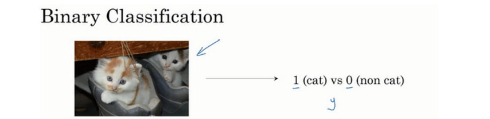

在二分类问题中，我们的目标就是习得一个分类器，它以图片的特征向量作为输入，然后预测输出结果为1还是0，也就是预测图片中是否有猫。

需要用到的一些符号定义：

$x$：表示一个$n_x$维输入数据，维度为$(n_x,1)$；

$y$：表示输出结果，取值为$(0,1)$；

$(x^{(i)},y^{(i)})$：表示第$i$组数据，可能是训练数据，也可能是测试数据，这里默认是训练数据；

$X=[x^{(1)},x^{(2)},...,x^{(m)}]$：表示所有的训练数据集的输入值，放在一个$n_{x} \times m$的矩阵中，其中$m$表示样本数目；

$Y=[y^{(1)},y^{(2)},...,y^{(m)}]$：对应所有训练数据集的输出值，维度为$1\times m$。

## 逻辑回归以及代价函数

### 逻辑回归

对于二元分类问题来讲，给定一个输入特征向量$X$，它可能对应一张图片，你想识别这张图片识别看它是否是一只猫或者不是一只猫的图片，你想要一个算法能够输出预测 $\hat{y}$，也就是对实际值$y$的估计。即，在给定了输入特征$X$的前提条件下，你想让 $\hat{y}$ 表示 $y$ 等于1的一种可能性或者是机会。在上面的例子中， $X$是看到的图片，而你想让 $\hat{y}$ 来告诉你这是一只猫的图片的机率有多大。

$X$ 是一个$n_{x}$维的向量（相当于有$n_{x}$个特征的特征向量）。我们用$w$来表示逻辑回归的参数，这也是一个$n_{x}$维向量（因为实际上是特征权重，维度与特征向量相同），参数里面还有$b$，这是一个实数（表示偏差）。所以给出输入$x$以及参数$w$和$b$之后，我们怎样产生输出预测值。这时候就有一个关于输入$x$的线性函数（实际上这是你在做线性回归时所用到的）：$\hat{y}=w^{T}x+b$。

但这对于二元分类问题来讲不是一个很好的算法，因为你想让$\hat{y}$表示实际值$y$等于1的机率的话，其值应该在0到1之间，而该函数的值可能大于1或者甚至为负数。因此在逻辑回归中，我们的输出应该是$\hat{y}$等于由上面得到的线性函数式子作为自变量的**sigmoid**函数中，将线性函数转换为非线性函数。

下图是**sigmoid**函数的图像，如果我把水平轴作为$z$轴，那么关于的**sigmoid**函数是这样的，它是平滑地从0走向1，曲线与纵轴相交的截距是0.5，这就是关于$z$的**sigmoid**函数的图像。我们通常都使用$z$来表示$w^{T}x+b$的值。

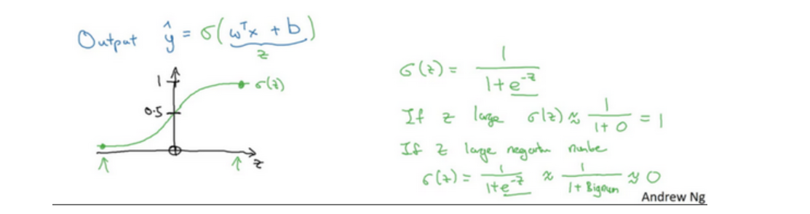

关于**sigmoid**函数的公式是这样的，$ \sigma(z)=\frac{1}{1+{e^{-z}}}$，这里$z$是一个实数。如果$z$很大的话那么关于$z$的**sigmoid**函数会非常接近1；反之，如果$z$非常小或者说是一个绝对值很大的负数时，关于$z$的sigmoid函数就会非常接近于0。因此当你实现逻辑回归时，你的工作就是去让机器学习参数$w$以及$b$这样才使得$\hat{y}$成为对$y=1$这一情况的概率的一个很好的估计。

### 逻辑回归的代价函数

上面讲了逻辑回归模型，这节将介绍逻辑回归的代价函数（也翻译作成本函数）。

为了训练逻辑回归模型的参数$w$和参数$b$，给予一个$m$样本的训练集，同时需要一个代价函数，通过训练代价函数来得到参数$w$和参数$b$。先看一下逻辑回归的输出函数：

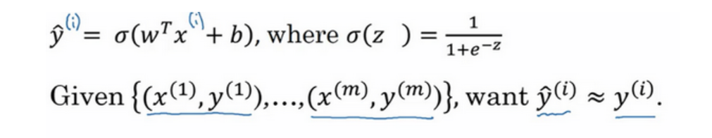

上面的定义是对一个训练样本来说的，这种形式也适用于每个训练样本，使用这些带有圆括号的上标来区分索引和样本，训练样本$i$所对应的预测值是$y^{i}$，这是用训练样本的$w^{T}x^{(i)}+b$然后通过**sigmoid**函数来得到的。也可以把$z$定义为$z^{(i)}=w^{T}x^{(i)}+b$，上标$(i)$指明数据的第$i$个训练样本。

损失函数又叫做误差函数，用来衡量算法的运行情况(来衡量预测输出值和实际值有多接近)，**Loss function:**$L(\hat{y},y)$.在逻辑回归中用到的损失函数是：$L(\hat{y},y)=-ylog(\hat{y})-(1-y)log(1-\hat{y})$

下面来理解这个损失函数是如何起作用的，举个例子：

当$y=1$时损失函数$L=-log(\hat{y})$，如果想要损失函数$L$尽可能小，那么$\hat{y}$就要尽可能大，因为**sigmoid**函数取值$[0,1]$，所以$\hat{y}$会无限接近于1。同理，当$y=0$时，$\hat{y}$会无限接近于0。

**也就是说，如果$y$等于1，我们就尽可能让$\hat{y}$变大，如果$y$等于0，我们就尽可能让 $\hat{y}$变小。** 损失函数是在单个训练样本中定义的，它衡量的是算法在单个训练样本中表现如何，为了衡量算法在全部训练样本上的表现如何，我们需要定义一个算法的**代价函数**，算法的代价函数是对$m$个样本的损失函数求和然后除以$m$:

$$J(w,b)=\frac{1}{m}\sum^{m}_{i=1}L(\hat{y}^{(i)},y^{(i)})=\frac{1}{m}\sum^{m}_{i=1}(-y^{(i)}log\hat{y}^{(i)}-(1-y^{(i)})log(1-\hat{y}^{(i)}))$$

损失函数只适用于像这样的单个训练样本，而代价函数是参数的总代价，所以在训练逻辑回归模型时候，我们需要找到合适的$w$和$b$，来让代价函数 $J$的总代价降到最低。 根据我们对逻辑回归算法的推导及对单个样本的损失函数的推导和针对算法所选用参数的总代价函数的推导，结果表明逻辑回归可以看做是一个非常小的神经网络。

## 梯度下降法（Gradient Descent）

在测试集上，我们通过最小化代价函数（成本函数）$J(w,b)$来训练参数$w$和$b$，

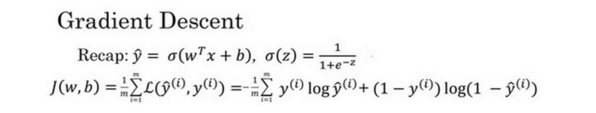

下面对梯度下降法进行形象化说明，下图中，横轴表示空间参数$w$和$b$，实践中$w$可以是更高的维度，但为了方便，这里定义$w$和$b$都是单一实数，代价函数（成本函数）$J(w,b)$是在水平轴$w$和$b$上的曲面，曲面的高度就是$J(w,b)$在某一点的函数值。现在要做的就是找到使得代价函数（成本函数）$J(w,b)$取最小值时的参数$w$和$b$。

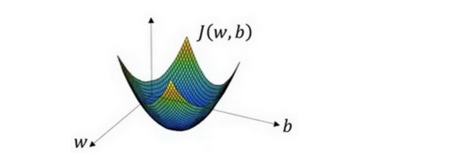

首先初始化参数$w$和$b$，可以采用随机初始化的方法，对于逻辑回归几乎所有的初始化方法都有效，因为函数是凸函数，无论在哪里初始化，应该达到同一点或大致相同的点。

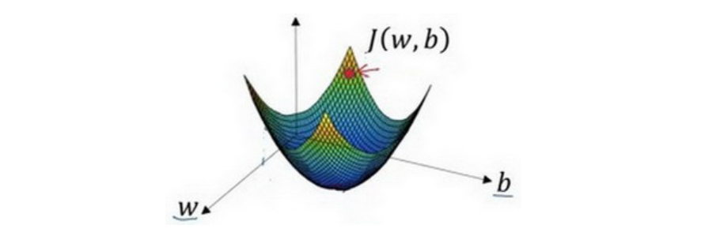

朝最陡的下坡方向走一步，不断迭代，直到走到全局最优解或者接近全局最优解的地方。

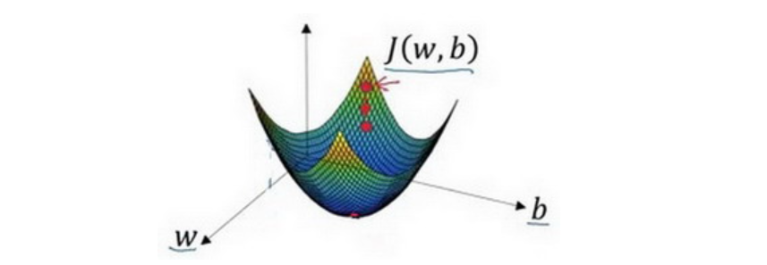

逻辑回归的代价函数（成本函数）$J(w,b)$是含有两个参数的，梯度下降法的迭代过程实际上就是不断重复地做如下公式：

$$w:=w-a\frac{\partial{J(w,b)}}{\partial{w}}$$

$$b:=b-a\frac{\partial{J(w,b)}}{\partial{b}}$$

其中$:=$表示更新参数，$\partial$表示求偏导符号，读作**round**，$\frac{\partial{J(w,b)}}{\partial{w}}$就是函数$J(w,b)$对$w$求偏导，在代码中使用$dw$来表示这个结果；同理$db$表示函数$J(w,b)$对$b$求偏导的结果。

## 计算图

可以说，一个神经网络的计算，都是按照前向或反向传播过程组织的。首先我们计算出一个新的网络的输出（前向过程），紧接着进行一个反向传输操作。后者我们用来计算出对应的梯度或导数。

例如，我们尝试计算由三个变量$a,b,c$组成的函数$J=3(a+bc)$，可以把计算过程画成下图所示的计算图：先画三个变量$a,b,c$，第一步计算$u=bc$，在这周围画一个矩形框，其输入是$b,c$；第二步$v=a+u$，最后一步计算$J=3v$。

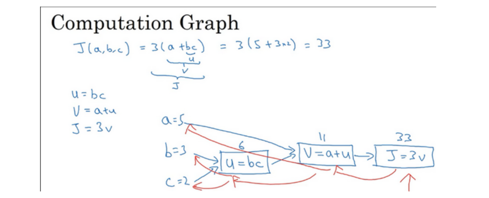

从上例可以看出，通过一个从左向右的过程，可以计算出$J$的值；而为了计算导数，从右向左（红色箭头）的过程是用于计算导数最自然的方式。

下面用到的公式：

$\frac{dJ}{du}=\frac{dJ}{dv} \frac{dv}{du}, \frac{dJ}{db}=\frac{dJ}{du}\frac{du}{db}, \frac{dJ}{da}=\frac{dJ}{du}\frac{du}{da}$

如何计算$\frac{dJ}{dv}$？换个说法，把这个$v$值拿过来，改变一下，那么$J$值会怎么变呢？明显的，对于任何$v$的增量$J$都会有3倍增量。有$\frac{dJ}{dv}=\frac{df(a)}{da}=3$，这里$J$扮演了$f$的角色。这就是一步反向传播。同理，$\frac{dJ}{da}=3$，这是另一步反向传播计算。

计算图就是一个计算流程图，就是正向或者说从左到右的计算来计算成本函数J，你可能需要优化的函数，然后反向从右到左计算导数。

## 逻辑回归中的梯度下降

假设样本只有两个特征$x1$和$x2$，为了计算$z$，我们还需要输入参数$w1,w2,b$。因此$z$的计算公式为：$z=w1x1+w2x2+b$。

回想一下逻辑回归的公式定义如下：$\hat{y}=a=\sigma(z)$其中$z=w^{T}x+b,\sigma(z)=\frac{1}{1+e^{-z}}$；

损失函数：$L(\hat{y}^{(i)},y^{(i)})=-y^{(i)}log\hat{y}^{(i)}-(1-y^{(i)})log(1-\hat{y}^{(i)})$；

代价函数：$J(w,b)=\frac{1}{m}\sum^{m}_{i}L(\hat{y}^{(i)},y^{(i)})$；

现在只考虑单个样本的情况，单个样本的代价函数定义如下：$L(a,y)=-(ylog(a)+(1-y)log(1-a))$，其中$a$是逻辑回归的输出，$y$是样本的标签值。

梯度下降法中，$w,b$的修正量可以表述如下：$w:=w-a\frac{\partial{J(w,b)}}{\partial{w}}, b:=b-a\frac{\partial{J(w,b)}}{\partial{b}}$。

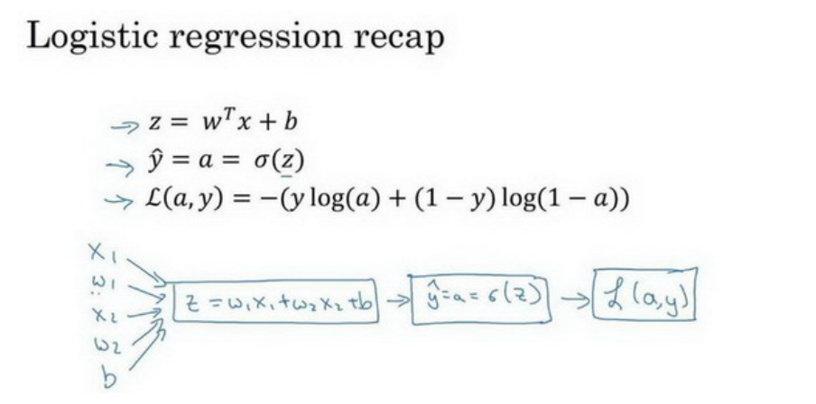

如图，在公式外侧画上长方形，计算图的下一步是计算：$\hat{y}=a=\sigma(z)$，最后计算损失函数$L(a,y)$。为了使得逻辑回归中最小化代价函数$L(a,y)$，我们需要做的仅仅是修改参数$w,b$的值。

首先，反向计算出代价函数$L(a,y)$关于$a$的导数，通过微积分得到：$\frac{dL(a,y)}{da}=-y/a+(1-y)/(1-a)$，在代码中这个值可以用$da$表示。

再反向一步，求出代价函数L关于$z$的导数：$dz=\frac{dL(a,y)}{dz}=(\frac{dL}{da}) \cdot (\frac{da}{dz})=(-\frac{y}{a}+\frac{1-y}{1-a}) \cdot a(1-a)=a-y$。

最后一步反向推导，也就是计算$w$和$b$变化对代价函数$L$的影响。特别地，可以用$dw1=\frac{1}{m}\sum^{m}_{i}x_1^{(i)}(a^{(i)}-y^{(i)}), dw2=\frac{1}{m}\sum^m_ix_2^{(i)}(a^{(i)}-y^{(i)}), db=\frac{1}{m}\sum^m_i(a^{(i)}-y^{(i)})$。即，$dw1$表示$\frac{\partial{L}}{\partial{w_1}}=x_1 \cdot dz$，$dw2$表示$\frac{\partial{L}}{\partial{w_2}}=x_2 \cdot dz, db=dz$。

因此，关于单个样本的梯度下降算法，所需要做如下事情：使用公式$dz=(a-y)$计算$dz$，使用$dw1=x_1 \cdot dz$计算$dw1， dw2=x_2 \cdot dz$计算$dw2, db=dz$计算$db$。然后，更新$w_1=w_1-adw_1$，更新$w_2=w_2-adw_2$，更新$b=b-adb$。这就是关于单个样本实例的梯度下降算法中参数更新一次的步骤。

需要说明的是，训练逻辑回归模型不仅仅只有一个训练样本，而是有$m$个训练样本的整个训练集。下面将这些思想应用到整个训练样本集中。

## m个样本的梯度下降

首先，你要时刻记住有关损失函数$J(w,b)$的定义：$J(w,b)=\frac{1}{m}\sum^m_{i=1}L(a^{(i)},y^{(i)})$。

当算法输出关于样本$y$的预测值$a^{(i)}$，即$\sigma(z^{(i)})=\sigma(w^Tx^{(i)}+b)$。现在你知道带有求和的全局代价函数，实际上是1到$m$项各个损失的平均。 所以它表明全局代价函数对$w_1$的微分，对$w_1$的微分也同样是各项损失对$w_1$微分的平均。

下面是一步梯度下降的算法，代码流程：

```python
J=0;dw1=0;dw2=0;db=0; //初始化
for i = 1 to m
    z(i) = wx(i)+b;
    a(i) = sigmoid(z(i));
    J += -[y(i)log(a(i))+(1-y(i)）log(1-a(i));
    dz(i) = a(i)-y(i);
    dw1 += x1(i)dz(i);
    dw2 += x2(i)dz(i);
    db += dz(i);
J/= m;
dw1/= m;
dw2/= m;
db/= m;
w=w-alpha*dw
b=b-alpha*db
```


## 向量化逻辑回归的梯度输出

在深度学习领域，经常会用算法处理大数据集，这时代码运行速度就非常重要，其中避免**for**循环、运行向量化就是一个关键的技巧。具体做法如下：

$$Z=w^TX+b=np.dot(w.T,X)+b$$

$$A=\sigma(Z)$$

$$dZ=A-Y$$

$$dw=\frac{1}{m}*X*dz^T$$

$$db=\frac{1}{m}*np.sum(dZ)$$

$$w:=w-a*dw$$

$$b:=b-a*db$$

现在我们利用前五个公式完成了前向和后向传播，也实现了对所有训练样本进行预测和求导，再利用后两个公式，梯度下降更新参数。我们的目的是不使用**for**循环，所以我们就通过一次迭代实现一次梯度下降，但如果你希望多次迭代进行梯度下降，那么仍然需要**for**循环，放在最外层。不过我们还是觉得一次迭代就进行一次梯度下降，避免使用任何循环比较舒服一些。

# 浅层神经网络

## 神经网络概述

之前我们了解了逻辑回归模型，图3.1.1：

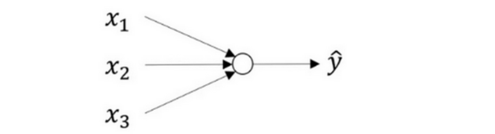

并知道了如何与下面公式建立联系：
$$
\left.
	\begin{array}{1}
	x\\
	w\\
	b
	\end{array}
	\right\}
	\implies{z=w^Tx+b}
	\implies{\alpha=\sigma{(z)}}
	\implies{L(a,y)}
$$
如上所示，首先输入特征$x$，参数$w、b$，然后计算出$z$，然后通过$z$可以计算出$a$，最后计算出loss function $L(a,y)$。

神经网络看起来长这样，图3.1.2：

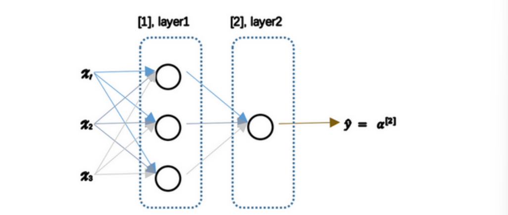

- 输入层：$x_1、x_2、x_3$
- 隐藏层：包括四个节点
- 输出层：只有一个节点

> 隐藏层的含义：在一个神经网络中，当使用监督学习训练它的时候，训练集包含了输入$x$也包含了目标输出$y$，而中间结点的准确值我们是不知道的。

对于图3.1.1中的节点，它包含了计算的两个步骤：首先通过公式计算出$z$值，然后通过$\sigma(z)$计算$a$值。把许多*sigmoid*单元堆叠起来可以形成一个神经网络，图3.1.2中的神经网络对应的3个节点。首先计算第一层网络中的各个节点相关的数$z^{[1]}$，接着计算$a^{[1]}$，下一层网络的计算同理。

> 我们使用符号$^{[m]}$表示第$m$层网络中节点相关的数，这些节点的集合被称为第$m$层网络，这样可以保证$^{[m]}$不会和之前用来表示单个训练样本的$^{(i)}$（表示第i个训练样本）混淆。

整个计算过程如下：
$$
\left.
	\begin{array}{1}
	x\\
	W^{[1]}\\
	b^{[1]}
	\end{array}
	\right\}
	\implies{z^{[1]}=W^{[1]}x+b^{[1]}}
	\implies{\alpha^{[1]}=\sigma{(z^{[1]})}}
$$

$$
\left.
	\begin{array}{1}
	a^{[1]}=\sigma(z^{[1]})\\
	W^{[2]}\\
	b^{[2]}
	\end{array}
	\right\}
	\implies{z^{[2]}=W^{[2]}a^{[1]}+b^{[2]}}
	\implies{\alpha^{[2]}=\sigma{(z^{[2]})}}
	\implies{L(a^{[2]},y)}
$$

此时$a^{[2]}$就是整个神经网络最终的输出，用$\hat{y}$表示。在逻辑回归中，通过直接计算$z$得到结果$a$。而这个神经网络中，我们反复的计算$a$和$z$，计算$a$和$z$，最后得到了最终的输出**loss function**。

在逻辑回归中，有一些从后向前的计算用来计算导数$da、dz$。同样，在神经网络中也有从后向前的计算，计算出$da^{[2]}、dz^{[2]}$，然后计算$dW^{[2]}、db^{[2]}$等。

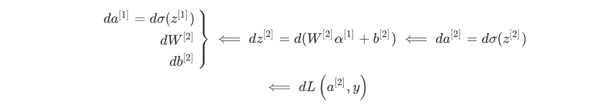

上述例子就是基于逻辑回归重复使用了两次该模型得到的神经网络。

## 计算一个神经网络的输出

回顾一下只有一个隐藏层的简单两层神经网络结构：

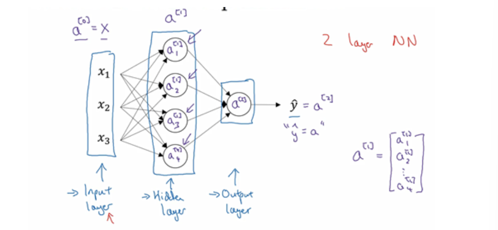

其中，$x$表示输入特征，$a$表示每个神经元的输出，$W$表示特征的权重，上标表示神经网络的层数（隐藏层为1），下标表示该层的第几个神经元，这就是神经网络的符号惯例。

下图中，用圆圈表示神经网络的计算单元，逻辑回归的计算有两个步骤，首先计算出$z$，然后在第二步中以**sigmoid**函数为激活函数计算$z$（得出$a$），一个神经网络只是这样子做了好多次重复计算。

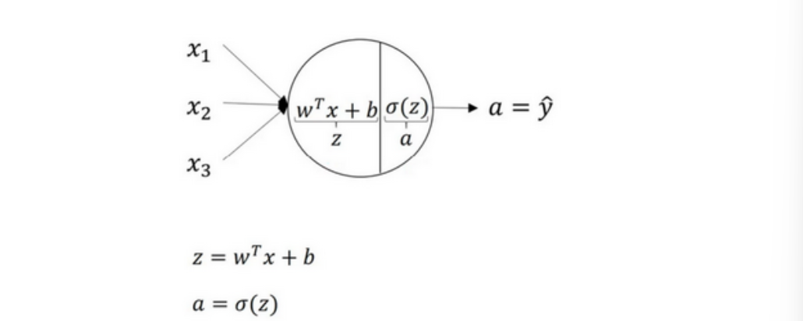

回到两层的神经网络，我们从隐藏层的第一个神经元开始计算：输入与逻辑回归相似，这个神经元的计算与逻辑回归一样分为两步，小圆圈代表了计算的两个步骤：

第一步，计算$z_1^{[1]}=w_1^{[1]T}x+b_1^{[1]}$。

第二步，通过激活函数计算$a_1^{[1]}=\sigma(z_1^{[1]})$.

隐藏层的第二个以及后面两个神经元的计算过程一样，最终分别得到$a_2^{[1]}、a_3^{[1]}、a_4^{[1]}$。

接下来我们要做的就是把这四个等式**向量化**。向量化的过程是将神经网络中的一层神经元参数纵向堆积起来，例如隐藏层中的纵向堆积起来变成一个$(4,3)$的矩阵，用符号$W^{[1]}$表示，公式：

$z^{[n]}=w^{[n]}x+b^{[n]}，a^{[n]}=\sigma(z^{[n]})$

详细过程如下：
$$
a^{[1]}=
\begin{bmatrix}
a_1^{[1]}\\
a_2^{[1]}\\
a_3^{[1]}\\
a_4^{[1]}
\end{bmatrix}
=\sigma(z_1^{[1]})
$$

$$
\begin{bmatrix}
z_1^{[1]}\\
z_2^{[1]}\\
z_3^{[1]}\\
z_4^{[1]}
\end{bmatrix}
=\underbrace{
\begin{bmatrix}
...W_1^{[1]T}...\\
...W_2^{[1]T}...\\
...W_3^{[1]T}...\\
...W_4^{[1]T}...
\end{bmatrix}
}_{W^{[1]}}
*\underbrace{\begin{bmatrix}
x_1\\
x_2\\
x_3
\end{bmatrix}}_{input}
+\underbrace{\begin{bmatrix}
b_1^{[1]}\\
b_2^{[1]}\\
b_3^{[1]}\\
b_4^{[1]}
\end{bmatrix}}_{b^{[1]}}
$$

这就是一次计算一个样本的神经网络输出。

## 多样本向量化

在本节中，将会了解到如何向量化多个训练样本，并计算出结果。

逻辑回归是将各个训练样本组合成矩阵，对矩阵的各列进行计算。神经网络是通过对逻辑回归中的等式简单的变形，让神经网络计算出输出值。这种计算是所有的训练样本同时进行的，以下是实现它具体的步骤：

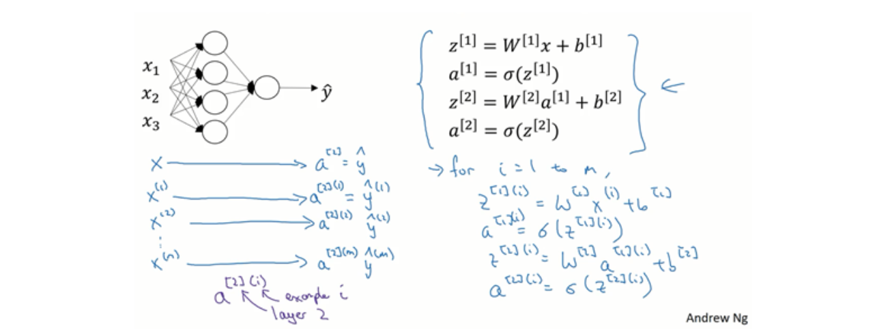

上图四个等式给出了如何计算出$z^{[1]},a^{[1]},z^{[2]},a^{[2]}$。对于一个给定的输入特征向量$X$，这四个等式可以计算出$a^{[2]}$等于$\hat{y}$。这是针对于单一的训练样本，若有$m$个训练样本，就需要重复这个过程：

用第一个训练样本$x^{[1]}$来计算出预测值$\hat{y}^{[1]}$；然后，用$x^{[2]}$来计算出预测值$\hat{y}^{[2]}$；循环往复，直至用$x^{[m]}$计算出$\hat{y}^{[m]}$。用激活函数表示法，如上图左下所示，写成$a^{[2](1)},a^{[2](2)},...,a^{[2](m)}$。

> $a^{[2](i)}，(i)$指的是第i个训练样本，$[2]$指第二层。

公式：
$$
\left.
	\begin{array}{align}
	z^{[1](i)}=W^{[1](i)}x^{(i)}+b^{[1]}&\\
	a^{[1](i)}=\sigma(z^{[1](i)})&\\
	z^{[2](i)}=W^{[2](i)}a^{[1](i)}+b^{[2]}&\\
	a^{[2](i)}=\sigma(z^{[2](i)})&
	\end{array}
\right\}
\implies 
\left\{
	\begin{array}{align}
	A^{[1]}=\sigma(z^{[1]})\\
	z^{[2]}=W^{[2]}A^{[1]}+b^{[2]}\\
	A^{[2]}=\sigma(z^{[2]})
	\end{array}
\right.
$$


## 激活函数

使用一个神经网络时，需要决定使用哪种激活函数用隐藏层上，哪种用在输出节点上。到目前为止，之前的视频只用过**sigmoid**激活函数，但是，有时其他的激活函数效果会更好。


**sigmoid**激活函数：$a=g(z)=\sigma(z)=\frac{1}{1+e^{-z}}$。除了输出层是一个二分类问题基本不会用它。$\frac{d}{dz}g(z)=g(z)(1-g(z))$

**tanh**激活函数：$a=g(z)=tanh(z)=\frac{e^z-e^{-z}}{e^z+e^{-z}}$，其值介于+1和-1之间。**tanh**是非常优秀的，几乎适合所有场合。$\frac{d}{dz}g(z)=1-(tanh(z))^2$

**ReLu**激活函数：$a=g(z)=max(0,z)$。最常用的默认函数，如果不确定用哪个激活函数，就使用**ReLu**或者**Leaky ReLu**（$a=max(0.01z,z)$）。

为什么神经网络需要非线性激活函数？事实证明：要让你的神经网络能够计算出有趣的函数，你必须使用非线性激活函数。如果你在隐藏层用线性激活函数，在输出层用**sigmoid**函数，那么这个模型的复杂度和没有任何隐藏层的标准**Logistic**回归是一样的。总而言之，不能在隐藏层用线性激活函数，可以用**ReLU**或者**tanh**或者**leaky ReLU**或者其他的非线性激活函数，唯一可以用线性激活函数的通常就是输出层；除了这种情况，会在隐层用线性函数的，除了一些特殊情况，比如与压缩有关的，那方面在这里将不深入讨论。在这之外，在隐层使用线性激活函数非常少见。因为房价都是非负数，所以我们也可以在输出层使用**ReLU**函数这样你的$\hat{y}$都大于等于0。

## 神经网络的梯度下降

这节主要实现反向传播或者说梯度下降算法的方程组。

对于单隐层神经网络，主要参数有$W^{[1]}、b^{[1]}、W^{[2]}、b^{[2]}$，还有$n_x$表示输入特征的个数，$n^{[1]}$表示隐藏单元个数，$n^{[2]}$表示输出单元个数。

参数解释：矩阵$W^{[1]}$的维度就是$(n^{[1]},n^{[0]})$，$b^{[1]}$就是$n^{[1]}$维列向量，可以写成$(n^{[1]},1)$。矩阵$W^{[2]}$的维度就是$(n^{[2]},n^{[1]})$，$b^{[2]}$的维度就是$(n^{[2]},1)$维。

另外还有一个神经网络的成本函数，假设在做二分类任务，则成本函数**Cost function:**$J(W^{[1]},b^{[1]},W^{[2]},b^{[2]})=\frac{1}{m}\sum^{m}_{i=1}L(\hat{y},y)$。损失函数和之前做逻辑回归完全一样。

训练参数需要做梯度下降，**在训练神经网络的时候，随机初始化参数很重要**，而不是初始化成全零。当你参数初始化成某些值后，每次梯度下降都会循环计算以下预测值：$\hat{y}^{(i)},(i=1,2,...,m)$
$$
dW^{[1]}=\frac{dJ}{dW^{[1]}},db^{[1]}=\frac{dJ}{db^{[1]}}\\
dW^{[2]}=\frac{dJ}{dW^{[2]}},db^{[2]}=\frac{dJ}{db^{[2]}}
$$
其中：
$$
W^{[1]}\implies W^{[1]}-adW^{[1]},b^{[1]}\implies b^{[1]}-adb^{[1]}\\
W^{[2]}\implies W^{[2]}-adW^{[2]},b^{[2]}\implies b^{[2]}-adb^{[2]}
$$
则，正向传播方程**forward propagation**如下：
$$
\begin{align*}
&z^{[1]}=W^{[1]}x+b^{[1]}\\
&a^{[1]}=\sigma(z^{[1]})\\
&z^{[2]}=W^{[2]}a^{[1]}+b^{[2]}\\
&a^{[2]}=g^{[2]}(z^{[2]})=\sigma(z^{[2]})
\end{align*}
$$
反向传播方程**back propagation**如下：
$$
\begin{align*}
&dz^{[2]}=A^{[2]}-Y, Y=[y^{[1]} y^{[2]} ... y^{[m]}]\\
&dW^{[2]}=\frac{1}{m}dz^{[2]}A^{[1]T}\\
&db^{[2]}=\frac{1}{m}np.sum(dz^{[2]},axis=1,keepdims=True)\\
&dz^{[1]}=\underbrace{W^{[2]T}dz^{[2]}}_{(n^{[1]},m)}
*\underbrace{g^{[1]'}}_{隐藏层激活函数}
*\underbrace{(z^{[1]})}_{(n^{[1]},m)}\\
&dW^{[1]}=\frac{1}{m}dz^{[1]}x^T\\
&\underbrace{db^{[1]}}_{(n^{[1]},1)}=\frac{1}{m}np.sum(dz^{[1]},axis=1,keepdims=True)
\end{align*}
$$
上述是反向传播的步骤，注：这些都是针对所有样本进行过向量化，$Y$是$1\times m$的矩阵；这里`np.sum`是python的numpy命令，`axis=1`表示水平相加求和，`keepdims`是防止**python**输出那些古怪的秩数，加上这个确保阵矩阵$db^{[2]}$这个向量输出的维度$(n,1)$为这样标准的形式。

目前为止，我们计算的都和**Logistic**回归十分相似，但当你开始计算反向传播时，你需要计算的是隐藏层函数的导数，输出在使用**sigmoid**函数进行二元分类。这里是进行逐个元素乘积，因为$W^{[2]T}dz^{[2]}$和$(z^{[1]})$这两个都为$(n^{[1]},m)$矩阵；

以上就是正向传播的4个方程和反向传播的6个方程，如果你要实现这些算法，你必须正确执行正向和反向传播运算，你必须能计算所有需要的导数，用梯度下降来学习神经网络的参数。

# 深层神经网络

复习所学内容，逻辑回归结构如下图左边，一个隐藏层的神经网络结构如下图右边：


> 神经网络的层数定义：从左到右，由0开始定义。比如上边右图，$x_1、x_2、x_3$是第0层，这层右边的隐藏层是第1层。所以严格上来说逻辑回归也是一个一层的神经网络。有一个隐藏层的神经网络，就是一个两层神经网络。记住当我们算神经网络的层数时，我们不算输入层，我们只算隐藏层和输出层。

深度神经网络的每一层都有前向传播以及相反的反向传播，下面来讨论如何实现这些步骤。

对于前向传播，输入$a^{[l-1]}$，输出是$a^{[l]}$，缓存为$z^{[l]}$；在实现中可以缓存下$w^{[l]}、b^{[l]}$，这样更容易在不同的环节中调用函数。

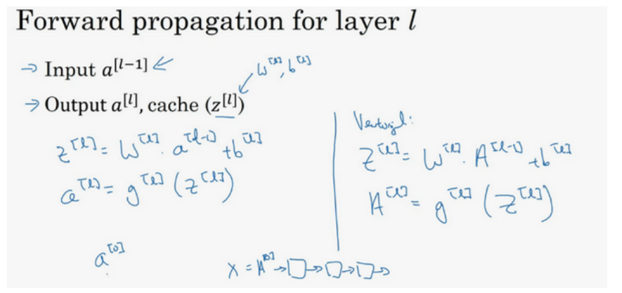

即，前向传播的步骤可以写成：$z^{[l]}=W^{[l]}\cdot a^{[l-1]}+b^{[l]}, a^{[l]}=g^{[l]}(z^{[l]})$

向量化实现过程可以写成：$z^{[l]}=W^{[l]}\cdot A^{[l-1]}+b^{[l]}, A^{[l]}=g^{[l]}(Z^{[l]})(A^{[0]}=X)$

前向传播需要输入$A^{[0]}$，也就是$X$来初始化；$a^{[0]}$对应于一个训练样本的输入特征，而$A^{[0]}$对应于一整个训练样本的输入特征。

对于反向传播，输入为$da^{[l]}$，输出为$da^{[l-1]}, dw^{[l]}, db^{[l]}$


则反向传播的步骤可以写为：
$$
\begin{align*}
&(1) dz^{[l]}=da^{[l]}*g^{[l]'}(z^{[l]}) \\
&(2) dw^{[l]}=dz^{[l]}\cdot a^{[l-1]} \\
&(3) db^{[l]}=dz^{[l]} \\
&(4) da^{[l-1]}=w^{[l]T}\cdot dz^{[l]} \\
&(5) dz^{[l]}=w^{[l+1]T}dz^{[l+1]}\cdot g^{[l]'}(z^{[l]})
\end{align*}
$$
式子（5）由式子（4）带入式子（1）得到，前四个式子就可实现反向函数。

向量化实现过程可以写成：
$$
\begin{align*}
&(1) dZ^{[l]}=dA^{[l]}*g^{[l]'}(Z^{[l]}) \\
&(2) dW^{[l]}=\frac{1}{m}dZ^{[l]}\cdot A^{[l-1]T} \\
&(3) db^{[l]}=\frac{1}{m}np.sum(dz^{[l]},axis=1,keepdims=True) \\
&(4) dA^{[l-1]}=W^{[l]T}\cdot dZ^{[l]} 
\end{align*}
$$
当实现深度神经网络的时候，其中一个常用的检查代码是否有错的方法就是拿出一张纸过一遍算法中矩阵的维数。

在你做深度神经网络的反向传播时，一定要确认所有的矩阵维数是前后一致的，可以大大提高代码通过率。

想要你的深度神经网络起很好的效果，你还需要规划好你的参数以及超参数。比如算法中的**learning rate** $a$（学习率）、**iterations**(梯度下降法循环的数量)、$L$（隐藏层数目）、$n^{[l]}$（隐藏层单元数目）、**choice of activation function**（激活函数的选择）都需要你来设置，这些数字实际上控制了最后的参数$w$和$b$的值，所以它们被称作超参数。

如何寻找超参数的最优值？

走**Idea—Code—Experiment—Idea**这个循环，尝试各种不同的参数，实现模型并观察是否成功，然后再迭代。

> 经常试试不同的超参数，勤于检查结果，看看有没有更好的超参数取值，你将会得到设定超参数的直觉。