# 深度学习的实用层面

## 机器学习基础

### 训练，验证，测试集(Train/Dev/Test sets)

创建新应用的过程中，我们不可能从一开始就准确预测出这些信息和其他超级参数。实际上，应用型机器学习是一个高度迭代的过程，通常在项目启动时，我们会先有一个初步想法，比如构建一个含有特定层数，隐藏单元数量或数据集个数等等的神经网络，然后编码，并尝试运行这些代码，通过运行和测试得到该神经网络或这些配置信息的运行结果，你可能会根据输出结果重新完善自己的想法，改变策略，或者为了找到更好的神经网络不断迭代更新自己的方案。

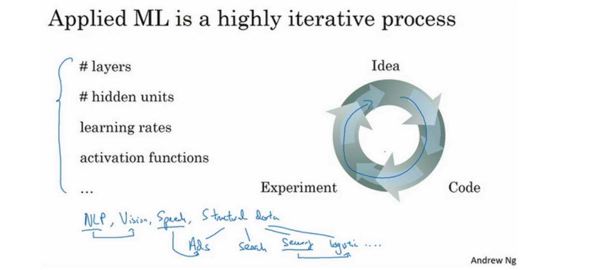

对于很多应用系统，即使是经验丰富的深度学习行家也不太可能一开始就预设出最匹配的超级参数，所以说，应用深度学习是一个典型的迭代过程，需要多次循环往复，才能为应用程序找到一个称心的神经网络，因此循环该过程的效率是决定项目进展速度的一个关键因素，而创建高质量的训练数据集，验证集和测试集也有助于提高循环效率。

在机器学习中，我们通常将样本分成训练集，验证集和测试集三部分，数据集规模相对较小，适用传统的划分比例，数据集规模较大的，验证集和测试集要小于数据总量的20%或10%。

> 在机器学习发展的小数据量时代，常见做法是将所有数据三七分，就是人们常说的70%验证集，30%测试集，如果没有明确设置验证集，也可以按照60%训练，20%验证和20%测试集来划分。

### 偏差，方差（Bias / Variance）

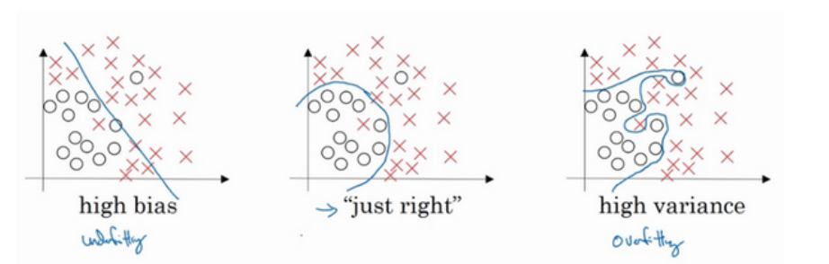

对于上图中数据集，如果给这个数据集拟合一条直线，可能得到一个逻辑回归拟合，但它并不能很好地拟合该数据，这是高偏差（**high bias**）的情况，我们称为“欠拟合”（**underfitting**）。

相反的如果我们拟合一个非常复杂的分类器，比如深度神经网络或含有隐藏单元的神经网络，可能就非常适用于这个数据集，但是这看起来也不是一种很好的拟合方式分类器方差较高（**high variance**），数据过度拟合（**overfitting**）。

在两者之间，可能还有一些像图中这样的，复杂程度适中，数据拟合适度的分类器，这个数据拟合看起来更加合理，我们称之为“适度拟合”（**just right**）是介于过度拟合和欠拟合中间的一类。

假定训练集误差是1%，为了方便论证，假定验证集误差是11%，可以看出训练集设置得非常好，而验证集设置相对较差，我们可能过度拟合了训练集，在某种程度上，验证集并没有充分利用交叉验证集的作用，像这种情况，我们称之为“高方差”。

假设训练集误差是15%，我们把训练集误差写在首行，验证集误差是16%，假设该案例中人的错误率几乎为0%，人们浏览这些图片，分辨出是不是猫。算法并没有在训练集中得到很好训练，如果训练数据的拟合度不高，就是数据欠拟合，就可以说这种算法偏差比较高。相反，它对于验证集产生的结果却是合理的，验证集中的错误率只比训练集的多了1%，所以这种算法偏差高，因为它甚至不能拟合训练集，这与上一张幻灯片最左边的图片相似。

再举一个例子，训练集误差是15%，偏差相当高，但是，验证集的评估结果更糟糕，错误率达到30%，在这种情况下，我会认为这种算法偏差高，因为它在训练集上结果不理想，而且方差也很高，这是方差偏差都很糟糕的情况。

再看最后一个例子，训练集误差是0.5%，验证集误差是1%，用户看到这样的结果会很开心，猫咪分类器只有1%的错误率，偏差和方差都很低。

总结，上面讲了如何通过分析在训练集上训练算法产生的误差和验证集上验证算法产生的误差来诊断算法是否存在高偏差和高方差，是否两个值都高，或者两个值都不高，根据算法偏差和方差的具体情况决定接下来你要做的工作。

训练神经网络的基本方法：

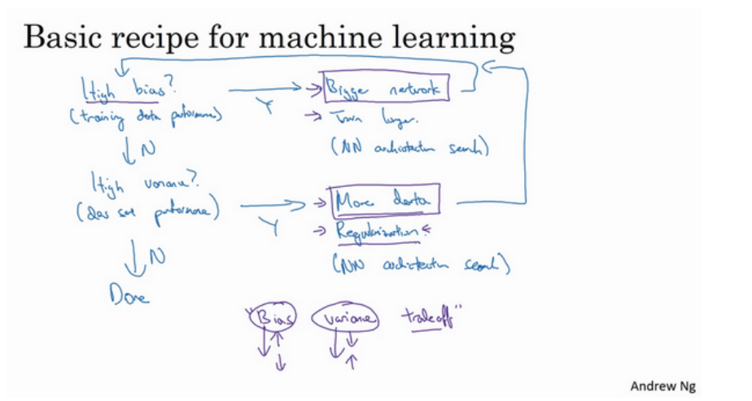

初始模型训练完成后，首先要知道算法的偏差高不高，如果偏差较高，试着评估训练集或训练数据的性能。如果偏差的确很高，甚至无法拟合训练集，那么你要做的就是选择一个新的网络，比如含有更多隐藏层或者隐藏单元的网络，或者花费更多时间来训练网络，或者尝试更先进的优化算法。

一旦偏差降低到可以接受的数值，检查一下方差有没有问题，为了评估方差，我们要查看验证集性能，我们能从一个性能理想的训练集推断出验证集的性能是否也理想，如果方差高，最好的解决办法就是采用更多数据，如果你能做到，会有一定的帮助，但有时候，我们无法获得更多数据，我们也可以尝试通过正则化来减少过拟合。如果能找到更合适的神经网络框架，有时它可能会一箭双雕，同时减少方差和偏差。注意以下两点：

- 高偏差和高方差是两种不同的情况，后续要尝试的方法也可能完全不同，通常会用训练验证集来诊断算法是否存在偏差或方差问题，然后根据结果选择尝试部分方法。举个例子，如果算法存在高偏差问题，准备更多训练数据其实也没什么用处，至少这不是更有效的方法，所以大家要清楚存在的问题是偏差还是方差，还是两者都有问题，明确这一点有助于我们选择出最有效的方法。
- **只要正则适度，通常构建一个更大的网络便可以在不影响方差的同时减少偏差，而采用更多数据通常可以在不过多影响偏差的同时减少方差**。这两步实际要做的工作是：训练网络，选择网络或者准备更多数据，现在我们有工具可以做到在减少偏差或方差的同时，不对另一方产生过多不良影响。

## 正则化（Regularization）

正则化是一种非常实用的减少方差的方法，正则化时会出现偏差方差权衡问题，偏差可能略有增加，如果网络足够大，增幅通常不会太高。

如果你怀疑神经网络过度拟合了数据，即存在高方差问题，那么最先想到的方法可能是正则化，另一个解决高方差的方法就是准备更多数据，这也是非常可靠的办法，但你可能无法时时准备足够多的训练数据，或者，获取更多数据的成本很高，但正则化有助于避免过度拟合，或者减少网络误差，下面我们就来讲讲正则化的作用原理。

在逻辑回归函数中加入正则化，只需添加正则化参数λ：$\frac{\lambda}{2m}||w||_2^2$，$w$欧几里得范数的平方等于$w_j$（$j$值从1到$n_x$）平方的和，即$||w||_2^2=\sum^{n_x}_{j=1}w_j^2=w^Tw$，此方法称为$L2$正则化。由于用了欧几里得法线，被称为向量参数$w$的$L2$范数。

$J(w,b)=\frac{1}{m}\sum^{m}_{i=1}L(\hat{y}^{(i)},y^{(i)})+\frac{\lambda}{2m}||w||_2^2$，其中$, w \in R^{n_x}, b \in R$

$L2$正则化是最常见的正则化类型，而$L1$正则化加的不是$L2$范数，而是正则项$\frac{\lambda}{m}$乘以参数$w$向量的$L1$范数 $\sum^{n_x}_{j=1}|w|$。

$\lambda$是正则化参数，我们通常使用验证集或交叉验证集来配置这个参数，尝试各种各样的数据，寻找最好的参数，我们要考虑训练集之间的权衡，把参数设置为较小值，这样可以避免过拟合，所以λ是另外一个需要调整的超级参数。

下面来讨论如何在神经网络中实现$L2$正则化：

$J(w^{[1]},b^{[1]},...,w^{[l]},b^{[l]})=\frac{1}{m}\sum^m_{i=1}L(\hat{y}^{(i)},y^{(i)})+\frac{\lambda}{2m}\sum^L_{l=1}||w^{[l]}||_F^2$，其中$||w^{[l]}||_F^2=\sum^{n^{[l-1]}}_{i=1}\sum^{n^{[l]}}_{j=1}(w_{ij}^{[l]})^2$

以上公式中，第一个求和符号其值$i$从1到$n^{[l-1]}$，第二个其值$j$从1到$n^{[l]}$，因为$W$是一个$n^{[l]}\times n^{[l-1]}$的多维矩阵，$n^{[l]}$表示$l$层单元的数量，$n^{[l-1]}$表示第$l-1$层隐藏单元的数量。该矩阵范数被称作“弗罗贝尼乌斯范数”，用下标$F$标注。

该如何使用该范数实现梯度下降呢？

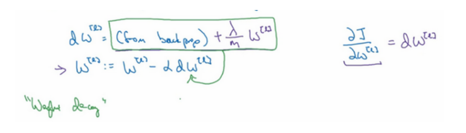

这就是之前我们额外增加的正则化项，既然已经增加了这个正则项，现在我们要做的就是给$dW$加上这一项$\frac{\lambda}{m}W^{[l]}$，然后计算这个更新项，使用新定义的$dW^{[l]}$，它的定义含有相关参数代价函数导数和，以及最后添加的额外正则项，这也是$L2$正则化有时被称为“权重衰减”的原因。

我们用$dW^{[l]}$的定义替换此处的$dW^{[l]}$，可以看到，$W^{[l]}$的定义被更新为$W^{[l]}$减去学习率$a$乘以**backprop**再加上$\frac{\lambda}{m}W^{[l]}$。

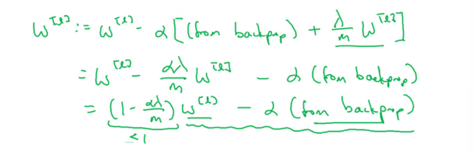

该正则项说明，不论$W^{[l]}$是什么，我们都试图让它变得更小，实际上，相当于我们给矩阵W乘以$(1-a\frac{\lambda}{m})$倍的权重，矩阵$W$减去$a\frac{\lambda}{m}$倍的它，也就是用这个系数$(1-a\frac{\lambda}{m})$乘以矩阵$W$，该系数小于1，因此$L2$范数正则化也被称为“权重衰减”，因为它就像一般的梯度下降，$W$被更新为少了$a$乘以**backprop**输出的最初梯度值，同时$W$也乘以了这个系数，这个系数小于1，因此$L2$正则化也被称为“权重衰减”。

以上就是在神经网络中应用$L2$正则化的过程。

在编程时，如果你使用的是梯度下降函数，在调试梯度下降时，其中一步就是把代价函数$J$设计成这样一个函数，在调试梯度下降时，它代表梯度下降的调幅数量。可以看到，代价函数对于梯度下降的每个调幅都单调递减。如果你实施的是正则化函数，请牢记，$J$已经有一个全新的定义。如果你用的是原函数$J$，也就是这第一个项正则化项，你可能看不到单调递减现象，为了调试梯度下降，请务必使用新定义的$J$函数，它包含第二个正则化项，否则函数$J$可能不会在所有调幅范围内都单调递减。

这就是$L2$正则化，它是训练深度学习模型时最常用的一种方法。

## dropout 正则化

假设要训练下图中的神经网络，它存在过拟合。

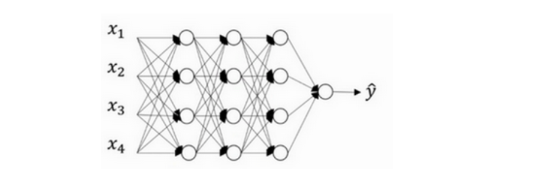

**dropout**（随机失活）会遍历网络的每一层，并设置消除神经网络中节点的概率。假设网络中的每一层，每个节点都以抛硬币的方式设置概率，每个节点得以保留和消除的概率都是0.5，设置完节点概率，我们会消除一些节点，然后删除掉从该节点进出的连线，最后得到一个节点更少，规模更小的网络，然后用**backprop**方法进行训练。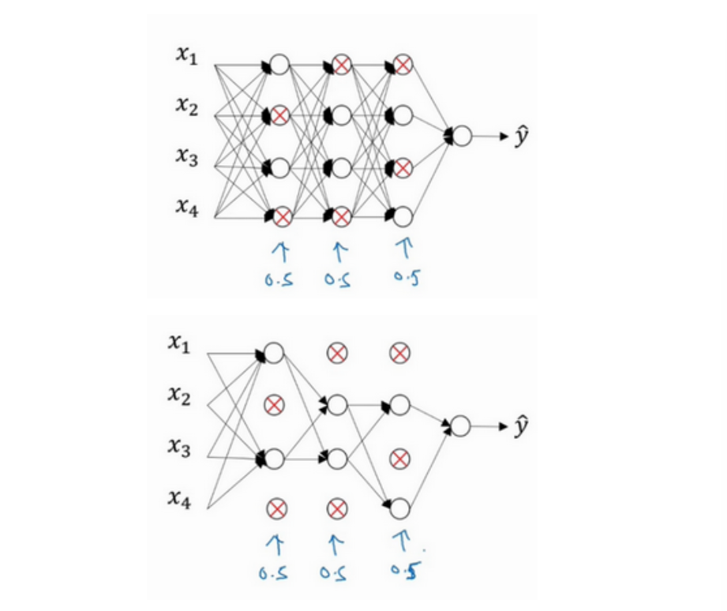

这是网络节点精简后的一个样本，对于其它样本，我们照旧以抛硬币的方式设置概率，保留一类节点集合，删除其它类型的节点集合。对于每个训练样本，我们都将采用一个精简后神经网络来训练它。

实施**dropout**最常用的方法是**inverted dropout**（反向随机失活）。下面用一个三层（$l=3$）网络来举例说明。

首先定义表示一个三层的**dropout**向量$d^{[3]}$：

```python
l=3
keep_prob=0.8
d3=np.random.rand(a3.shape[0],a3.shape[1])
```

然后看它是否小于常数**keep-prob**，它表示保留某个隐藏单元的概率，此处其值等于0.8，也意味着消除任意一个隐藏单元的概率是0.2，它的作用就是生成随机矩阵。$d^{[3]}$是一个矩阵（布尔型数组），每个样本和每个隐藏单元，其对应值为1的概率都是0.8，对应为0的概率是0.2。

然后从第三层中获取激活函数，$a^{[3]}$含有要计算的激活函数：

```python
a3=np.multiply(a3,d3)  # a3*=d3
```

这样做的作用是让$d^{[3]}$中所有等于0的元素（输出），而各个元素等于0的概率只有20%，乘法运算最终把$d^{[3]}$中相应元素输出，也就是让$d^{[3]}$中0元素与$a^{[3]}$中相对应元素归零。

最后，向外扩展$a^{[3]}$，用它除以**keep-prob**参数：

```python
a3/=keep_prob
```

为什么要这样做呢？先来看下$z^{[4]}$：$z^{[4]}=w^{[4]}a^{[3]}+b^{[4]}$。我们的预期是，$a^{[3]}$减少20%，也就是说$a^{[3]}$中有20%的元素被归零，为了不影响$z^{[4]}$的期望值，我们需要用$w^{[4]}a^{[3]}/0.8$，这将修正或弥补我们所需的那20%，$a^{[3]}$的期望值不会变，这就是所谓的**dropout**方法。

如果**keep-prop**设置为1，那么就不存在**dropout**，因为它会保留所有节点。反向随机失活（**inverted dropout**）方法通过除以**keep-prob**，确保$a^{[3]}$的期望值不变。

>  在测试阶段进行预测时，我们不期望输出结果是随机的，如果测试阶段应用**dropout**函数，预测会受到干扰。**Inverted dropout**函数在除以**keep-prob**时可以记住上一步的操作，目的是确保即使在测试阶段不执行**dropout**来调整数值范围，激活函数的预期结果也不会发生变化，所以没必要在测试阶段额外添加尺度参数，这与训练阶段不同。

**dropout**被正式地作为一种正则化的替代形式，其功能类似于$L2$正则化。$L2$对不同权重的衰减是不同的，它取决于倍增的激活函数的大小；**dropout**与$L2$正则化不同的是，被应用的方式不同，**dropout**也会有所不同，甚至更适用于不同的输入范围。

总结一下，如果你担心某些层比其它层更容易发生过拟合，可以把某些层的**keep-prob**值设置得比其它层更低，缺点是为了使用交叉验证，你要搜索更多的超级参数，另一种方案是在一些层上应用**dropout**，而有些层不用**dropout**，应用**dropout**的层只含有一个超级参数，就是**keep-prob**。

计算视觉中的输入量非常大，输入太多像素，以至于没有足够的数据，所以**dropout**在计算机视觉中应用得比较频繁。但要牢记一点，**dropout是一种正则化方法，它有助于预防过拟合，因此除非算法过拟合，不然不会使用dropou**t**。

**dropout**一大缺点就是代价函数不再被明确定义，每次迭代，都会随机移除一些节点，如果再三检查梯度下降的性能，实际上是很难进行复查的。

> 我通常会关闭**dropout**函数，将**keep-prob**的值设为1，运行代码，确保J函数单调递减。然后打开**dropout**函数，希望在**dropout**过程中，代码并未引入**bug**。

其他正则化方法：

1. 数据扩增（例如，水平翻转图片）

2. **early stopping**

   术语**early stopping**代表提早停止训练神经网络。在训练过程中，我们希望训练误差，代价函数都在下降，通过**early stopping**，我们不但可以绘制训练误差，或只绘制代价函数$J$的优化过程，还可以绘制验证集误差，它可以是验证集上的分类误差，或验证集上的代价函数，逻辑损失和对数损失等，你会发现，验证集误差通常会先呈下降趋势，然后在某个节点处开始上升，**early stopping**的作用是，你会说，神经网络已经在这个迭代过程中表现得很好了，我们在此停止训练。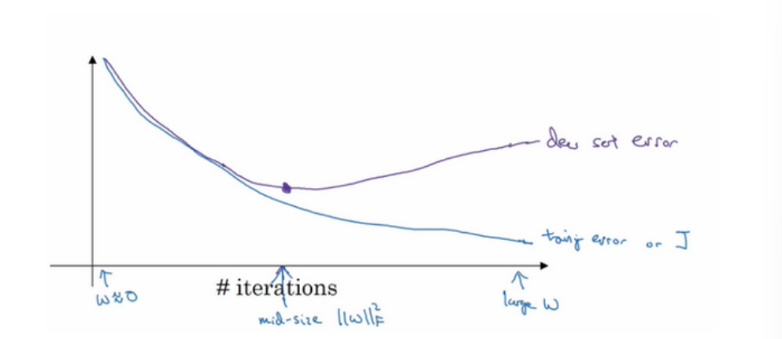

   我认为机器学习过程包括几个步骤，其中一步是选择一个算法来优化代价函数$J$，我们有很多种工具来解决这个问题，如梯度下降，后面我会介绍其它算法，例如**Momentum**，**RMSprop**和**Adam**等等，但是优化代价函数$J$之后，我也不想发生过拟合，也有一些工具可以解决该问题，比如正则化，扩增数据等等。

   **early stopping**的主要缺点就是不能独立地处理这两个问题(超级参数激增，选出可行的算法)，因为提早停止梯度下降，也就是停止了优化代价函数$J$，因为现在你不再尝试降低代价函数，所以代价函数$J$的值可能不够小，同时你又希望不出现过拟合，又没有采取不同的方式来解决这两个问题，而是用一种方法同时解决两个问题，这样做的结果使我要考虑的东西变得更复杂。

   如果不用**early stopping**，另一种方法就是$L2$正则化，训练神经网络的时间就可能很长。我发现，这导致超级参数搜索空间更容易分解，也更容易搜索，但是缺点在于，你必须尝试很多正则化参数$\lambda$的值，这也导致搜索大量$\lambda$值的计算代价太高。

   **Early stopping**的优点是，只运行一次梯度下降，你可以找出$w$的较小值，中间值和较大值，而无需尝试$L2$正则化超级参数的很多值。

## 归一化输入

训练神经网络，其中一个加速训练的方法就是归一化输入。假设一个训练集有两个特征，输入特征为2维，归一化需要两个步骤：

1. 零均值化：$\mu=\frac{1}{m}\sum^m_{i=1}x^{(i)}$，它是一个向量；更新$x$：$x:=x-\mu$，意思是移动训练集，直到它完成零均值化。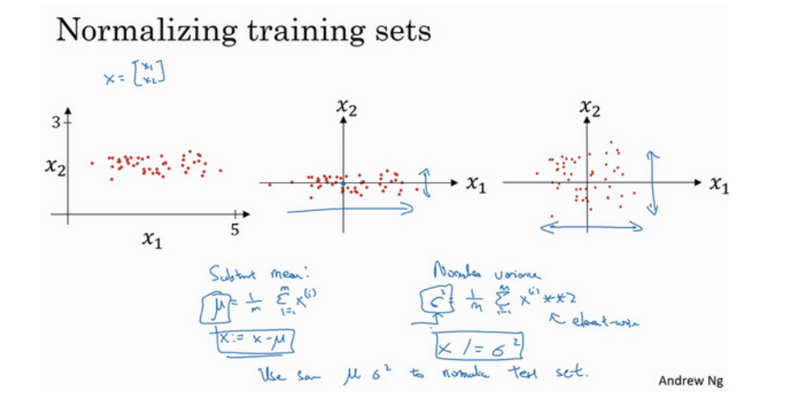

2. 归一化方差：$\sigma ^2=\frac{1}{m}\sum^m_{i=1}(x^{(i)})^2$,它是一个向量；更新$x$：$x/=\sigma ^2$，最后变成上图形式。

我们希望无论是训练集和测试集都是通过相同的$\mu $和$\sigma^2$定义的数据转换，这两个是由训练集得出来的。

   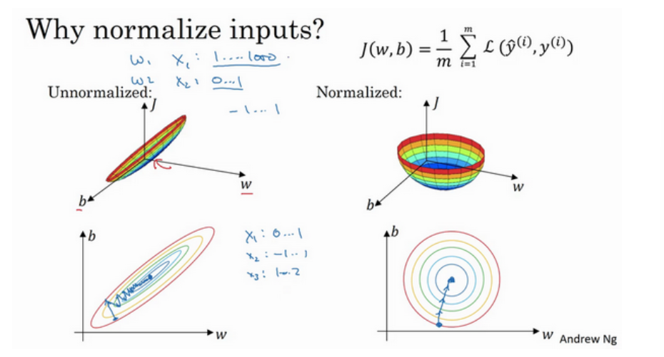

   上图是使用非归一化和归一化输入特征的代价函数对比，如果你在上图左边这样的代价函数上运行梯度下降法，你必须使用一个非常小的学习率。因为如果是在这个位置，梯度下降法可能需要多次迭代过程，直到最后找到最小值。但如果函数是一个更圆的球形轮廓，那么不论从哪个位置开始，梯度下降法都能够更直接地找到最小值，你可以在梯度下降法中使用较大步长，而不需要像在左图中那样反复执行。

   > 当然，实际上$w$是一个高维向量，因此用二维绘制$w$并不能正确地传达并直观理解，但总地直观理解是代价函数会更圆一些，而且更容易优化，前提是特征都在相似范围内，而不是从1到1000，0到1的范围，而是在-1到1范围内或相似偏差，这使得代价函数$J$优化起来更简单快速。

   当输入特征在非常不同的取值范围内，如其中一个从1到1000，另一个从0到1，这对优化算法非常不利，这时归一化特征值就非常重要了。如果特征值处于相似范围内，那么归一化就不是很重要了。执行这类归一化并不会产生什么危害，我通常会做归一化处理，虽然我不确定它能否提高训练或算法速度。

## 梯度消失/梯度爆炸

训练神经网络，尤其是深度神经所面临的一个问题就是梯度消失或梯度爆炸，也就是你训练神经网络的时候，导数或坡度有时会变得非常大，或者非常小，甚至于以指数方式变小，这加大了训练的难度。

考虑神经网络的参数：$W^{[1]},W^{[2]},...,W^{[l]}$，简单起见，假设使用线性激活函数$g(z)=z$，同时忽略b，$b^{[l]}=0$，则输出$y=W^{[l]}W^{[l-1]}W^{[l-2]}...W^{[3]}W^{[2]}W^{[1]}x$。

假设每个权重矩阵$W^{[l]}=\begin{bmatrix} 1.5 \quad 0\\0 \quad 1.5\end{bmatrix}$，即1.5倍单位矩阵，则最后一项$y=W^{[1]}\begin{bmatrix} 1.5 \quad 0\\0 \quad 1.5\end{bmatrix}^{(L-1)}x$，最后计算结果$\hat{y}=1.5^{(L-1)}x$。对于一个深度神经网络来说$L$较大，那么$\hat{y}$值也会非常大，实际上它呈指数级增长的，它增长的比率是$1.5^L$，因此对于一个深度神经网络，$y$的值将爆炸式增长。相反，如果权重是0.5，激活函数的值将以指数级下降，它是与网络层数数量$L$相关的函数，在深度网络中，激活函数以指数级递减。

直观理解是，权重$W$只比1略大一点，或者说只是比单位矩阵大一点，深度神经网络的激活函数将爆炸式增长；如果$W$比1略小一点，可能是$\begin{bmatrix} 0.9 \quad 0\\ 0 \quad 0.9\end{bmatrix}$，在深度神经网络中，激活函数将以指数级递减。

假设$L=150$，在这样一个深度神经网络中，如果激活函数或梯度函数以与$L$相关的指数增长或递减，它们的值将会变得极大或极小，从而导致训练难度上升，尤其是梯度指数小于$L$时，梯度下降算法的步长会非常非常小，梯度下降算法将花费很长时间来学习。

## 梯度检验

### 梯度的数值逼近

在实施**backprop**时，有一个测试叫做梯度检验，它的作用是确保**backprop**正确实施。因为有时候，你虽然写下了这些方程式，却不能100%确定执行**backprop**的所有细节都是正确的。为了逐渐实现梯度检验，我们首先说说如何计算梯度的数值逼近。

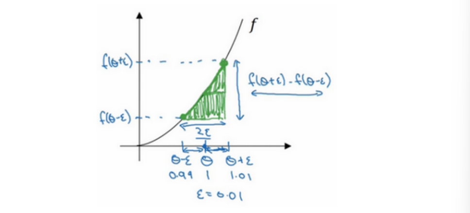

例如，$f(\theta)=\theta^3$，图中绿色三角形高宽比$\frac{f(\theta+\epsilon)-f(\theta-\epsilon)}{2\epsilon}=\frac{1.01^3-0.99^3}{2\times 0.01}=3.0001$接近于$g(\theta)=3\theta^2=3$，逼近误差为0.0001，所以使用双边误差（包括$\theta=1$左右两个方向）的方法更逼近导数，其结果接近于3，现在我们更加确信，可能是导数的正确实现，在梯度检验和反向传播中使用该方法时，最终，它与运行两次单边公差（$\theta=1$的右边或左边）的速度一样。

即，在执行梯度检验时，我们使用双边误差$\frac{f(\theta+\epsilon)-f(\theta-\epsilon)}{2\epsilon}$，而不要使用不够准确的单边公差。

上面讲了如何使用双边误差来判断别人给你的函数$g(\theta)$，是否正确实现了函数$f$的偏导，现在我们可以使用这个方法来检验反向传播是否得以正确实施，如果不正确，它可能有bug需要你来解决。

### 梯度检验（grad check）

下面看看如何利用梯度检验来调试或检验**backprop**的实施是否正确。

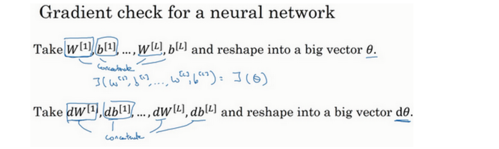

上图就是实施梯度检验的过程。首先，我们要明白$J(\theta_1,\theta_2,\theta_3,...)$是超参数$\theta$的一个函数,不论超级参数向量$\theta$的维度是多少，为了实施梯度检验，你要做的就是循环执行，从而对每个$\theta$  组成元素$i$计算$d\theta_{approx}[i]$的值，使用双边误差，也就是$d\theta_{approx}[i]=\frac{J(\theta_1,\theta_2,...,\theta_i+\epsilon,...)-J(\theta_1,\theta_2,...,\theta_i-\epsilon,...)}{2\epsilon}$。因为我们使用的是双边误差，只对$\theta_i$增加$\epsilon$，其它项保持不变；对另一边做同样的操作，只不过是减去$\epsilon$，$\theta$其它项全都保持不变。

从上节课中我们了解到代价函数的偏导数$d\theta_{approx}[i]$应该逼近$d\theta[i]=\frac{\partial{J}}{\partial{\theta_i}}$，然后你需要对i的每个值都执行这个运算，最后得到两个向量，得到$d\theta$的逼近值$d\theta_{approx}$，它与$d\theta$具有相同维度，它们两个与$\theta$具有相同维度，你要做的就是验证这些向量是否彼此接近。

具体来说，如何定义两个向量是否真的接近彼此？

可以使用$d\theta_{approx}[i]-d\theta[i]$的欧几里得范数：$\epsilon=\frac{||d\theta_{approx}-d\theta||_2}{||d\theta_{approx}||_2+||d\theta||_2}$，分母只是用于预防这些向量太小或太大，并且使得这个方程式变成比率。

- 如果$\epsilon$值为$10^{-7}$或更小，这就意味着导数逼近很有可能是正确的，它的值非常小；
- 如果它的值在$10^{-5}$范围内，我就要小心了，也许这个值没问题，但我会再次检查这个向量的所有项，确保没有一项误差过大，可能这里有**bug**;
- 如果$\epsilon$为$10^{-3}$，甚至更大，就要担心是否真的存在**bug**了。

分享一些关于如何在神经网络实施梯度检验的实用技巧和注意事项。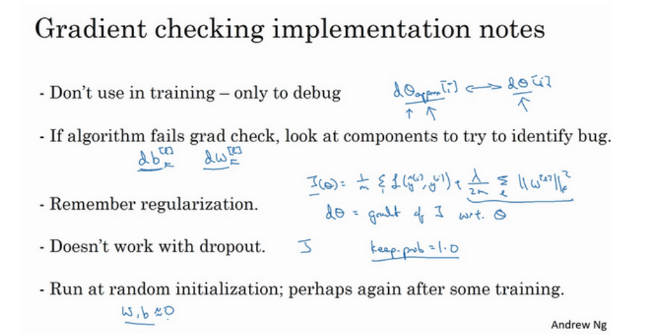

1、不要在训练中使用梯度检验，它只用于调试；

2、如果算法的梯度检验失败，要检查所有项，检查每一项，并试着找出**bug**；

3、在实施梯度检验时，如果使用正则化，请注意正则项；

4、梯度检验不能与**dropout**同时使用，因为每次迭代过程中，**dropout**会随机消除隐藏层单元的不同子集，难以计算**dropout**在梯度下降上的代价函数$J$。

# 优化算法

使用优化算法的目的是让神经网络运行得更快，以此加速训练模型。

## Mini-batch梯度下降法

向量化能够有效地对所有$m$个样本进行计算，允许你处理整个训练集，而无需某个明确的公式。所以我们要把训练样本放到巨大的矩阵$X$当中去，$X=[x^{(1)}x^{(2)}x^{(3)}......x^{(m)}]$，$Y$也是如此，$Y=[y^{(1)}y^{(2)}y^{(3)}......y^{(m)}]$，所以$X$的维数是$(n_x,m)$，$Y$的维数是$(1,m)$，向量化能够让你相对较快地处理所有$m$个样本。如果$m$很大的话，处理速度仍然缓慢。

可以把训练集分割为小一点的子集训练，这些子集被取名为**mini-batch**，假设每一个子集中只有1000个样本，那么把其中的$x^{(1)}$到$x^{(1000)}$取出来，将其称为第一个子训练集，也叫做**mini-batch**，然后你再取出接下来的1000个样本，从$x^{1001}$到$x^{2000}$，然后再取1000个样本，以此类推。

把$x^{(1)}$到$x^{(1000)}$称为$X^{\{1\}}$，$x^{(1001)}$到$x^{(2000)}$称为$X^{\{2\}}$，如果训练样本一共有500万个，每个**mini-batch**包括1000个样本，则有5000个**mini-batch**，最后得到$X^{\{5000\}}$。同样的，对$Y$也要进行相同处理，相应地拆分$Y$的训练集，从$y^{(1)}$到$y^{(1000)}$是$Y^{\{1\}}$，一直到$Y^{\{5000\}}$。即，**mini-batch**的数量$t$组成了$X^{\{t\}}$和$Y^{\{t\}}$。

> 回顾一下符号表示，$x^{(i)}$表示第$i$个训练样本；$z^{[l]}$表示神经网络中第$l$层的$z$值。

首先处理第一个**mini-batch**，即
$$
z^{[1]}=W^{[1]}X^{\{t\}}+b^{[1]} \\
A^{[1]}=g^{[1]}(Z^{[1]})
$$
依次类推，直到$A^{[L]}=g^{[L]}(Z^{[L]})$，这就是你的预测值。

则一个**mini-batch**的损失：
$$
J^{\{t\}}=\frac{1}{1000}\sum^l_{i=1}L(\hat{y}^{(i)},y^{(i)})+\frac{\lambda}{2*1000}\sum_l||w^{[l]}||^2_F
$$
其中$L(\hat{y}^{(i)},y^{(i)})$指的是来自于**mini-batch**$X^{\{t\}}$和$Y^{\{t\}}$中的样本。

接下来，执行反向传播来计算$J^{\{t\}}$的梯度，然后更新权值：
$$
W^{[l]}:=W^{[l]}-adW^{[l]}\\
b^{[l]}:=b^{[l]}-adb^{[l]}
$$
以上就是使用**mini-batch**梯度下降法训练样本的一代（1 epoch)的训练。

**mini-batch**梯度下降法每次同时处理单个的**mini-batch** $X^{\{t\}}$和$Y^{\{t\}}$，而不是同时处理全部的$X$和$Y$训练集（**batch**梯度下降法）。

当**mini-batch**的大小等于训练集的大小$m$时，就得到了**batch**梯度下降法；当**mini-batch**大小为1时，叫做随机梯度下降法，每个样本都是独立的**mini-batch**，此时一次只处理一个，也会失去所有向量化带来的加速，效率过低。

如果**mini-batch**大小既不是1也不是，应该取中间值，那应该怎么选择呢？其实是有指导原则的。

- 小于2000个样本时，使用**batch**梯度下降法；
- 一般的**mini-batch**大小为64到512（设置为2的n次方代码会运行的快些），同时要确保$X^{\{t\}}$和$Y^{\{t\}}$符合CPU/GPU内存。

## 指数加权平均数

指数加权平均数在统计学中被称为指数加权移动平均值。下面以每日温度的平均值来举例。

关键方程：$v_t=\beta v_{t-1}+(1-\beta)\theta_t$，通过调整这个很重要的参数$\beta$，可以取得不同的效果，往往中间有某个值效果最好。


$\beta=0.9$的时候，得到的结果是红线，如果它更接近于1，比如0.98，结果就是绿线，如果$\beta$小一点，如果是0.5，结果就是黄线。

一开始将$v$初始化为0，在第一天使$v:=\beta v+(1-\beta)\theta_1$；第二天更新$v:=\beta v+(1-\beta)\theta_2$，以此类推，有时候也会把$v$加下标，来表示$v$是用来计算数据的指数加权平均数。

指数加权平均数公式的好处之一在于，它代码少占用极少内存，只需把最新数据代入公式不断覆盖就可以了，其效率，它基本上只占用一行代码，计算指数加权平均数也只占用单行数字的存储和内存，当然它并不是最好的，也不是最精准的计算平均数的方法。

有一个技术名词叫做偏差修正，可以让平均数运算更加准确，来看看它是怎么运行的。

$v_t=\beta v_{t-1}+(1-\beta)\theta_t$

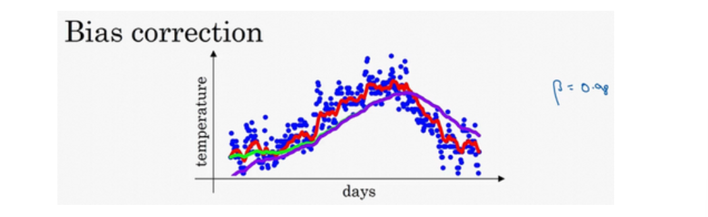

上图中，红色曲线对应的$\beta$值为0.9，绿色曲线对应的$\beta$值为0.98。如果你执行写在上面的公式，在等于0.98的时候，得到的并不是绿色曲线，而是紫色曲线，你可以注意到紫色曲线的起点较低，我们来看看怎么处理。

在估测初期不用$v_t$，而是$\frac{v_t}{1-\beta^t}$，$t$就是现在的天数。举个例子，当$t=2$时，对第二天温度的估测变成了$\frac{v_2}{1-\beta^2}=0.0396$，也就是$\theta_1$和$\theta_2$的加权平均数，并去除了偏差。随着$t$增加，$\beta^t$接近于0，所以当$t$很大的时候，偏差修正几乎没有作用，因此当$t$较大的时候，紫线基本和绿线重合了。

## 动量梯度下降法

还有一种算法叫做**Momentum**，或者叫做动量梯度下降法，运行速度几乎总是快于标准的梯度下降算法，基本的想法就是计算梯度的指数加权平均数，并利用该梯度更新权重。

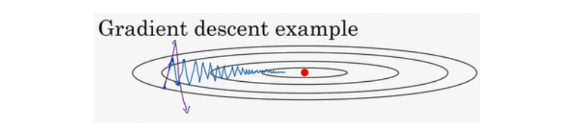

例如，某成本函数形状如图，红点代表最小值的位置，假设你从这里（蓝色点）开始梯度下降法，慢慢摆动到最小值，这种上下波动减慢了梯度下降法的速度，你就无法使用更大的学习率，如果你要用较大的学习率（紫色箭头），结果可能会偏离函数的范围，为了避免摆动过大，你要用一个较小的学习率。

另一个看待问题的角度是，在纵轴上，你希望学习慢一点，因为你不想要这些摆动，但是在横轴上，你希望加快学习，你希望快速从左向右移，移向最小值，移向红点。这就是使用动量梯度下降法的原因，其算法如下。

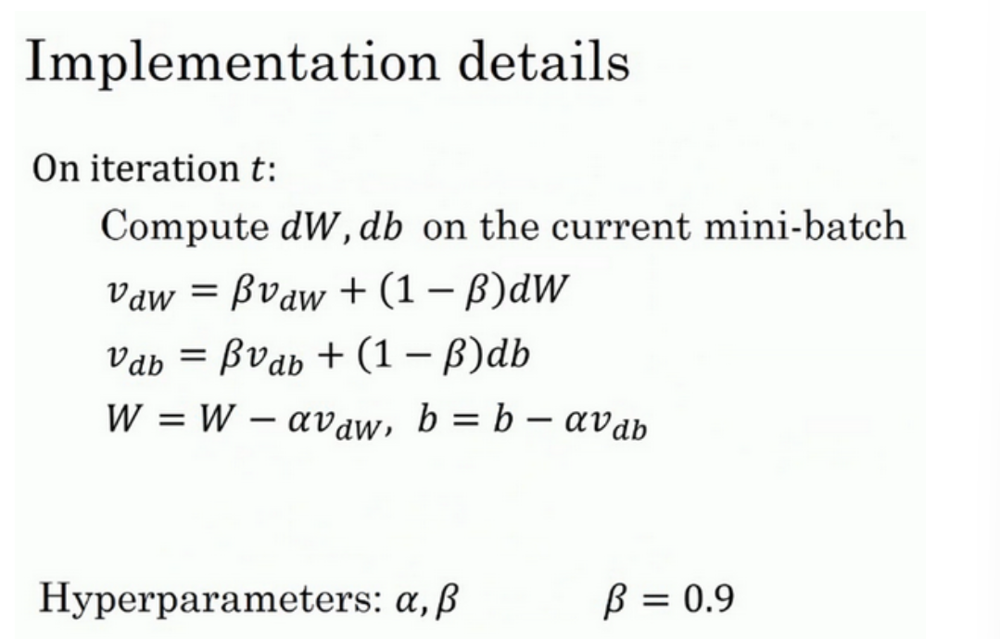

有两个超参数，学习率$a$以及参数$\beta$，$\beta$控制着指数加权平均数。最常用的值是0.9，我们之前平均了过去十天的温度，所以现在平均了前十次迭代的梯度。实际上$\beta$为0.9时，效果不错。$v_{dW}$初始值为0，这是和$dW$拥有相同维数的零矩阵，也就是跟$W$拥有相同的维数；$v_{db}$初始值也是和$db$相同维数的向量零，也就是和$b$是同一维数。

> 关于偏差修正，你要拿$v_{dW}$和$v_{db}$除以$1-\beta^t$，实际上人们不这么做，因为10次迭代之后，因为你的移动平均已经过了初始阶段。实际中，在使用梯度下降法或动量梯度下降法时，人们不会受到偏差修正的困扰

## RMSprop

我们知道了动量（**Momentum**）可以加快梯度下降，还有一个叫做**RMSprop**的算法，全称是**root mean square prop**（均方根）算法，它也可以加速梯度下降，我们来看看它是如何运作的。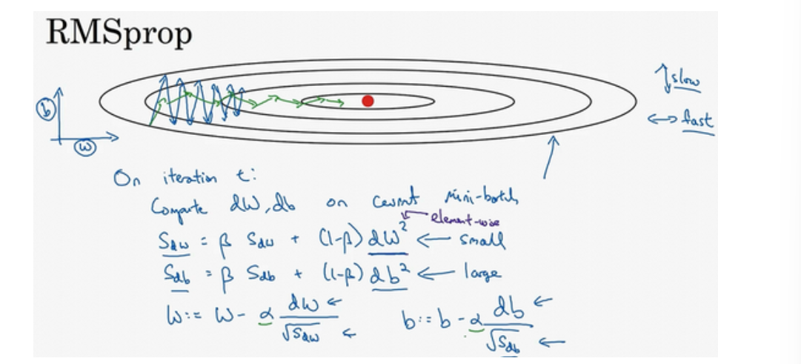

假设纵轴代表参数$b$，横轴代表参数$W$。如果你执行梯度下降，虽然横轴方向正在推进，但纵轴方向会有大幅度摆动，所以你想减缓$b$方向的学习，即纵轴方向，同时加快，至少不是减缓横轴方向的学习，**RMSprop**算法可以实现这一点。

在第$t$次迭代中，该算法会照常计算当下**mini-batch**的微分$dW,db$。这里用到了新符号$S_{dW}=\beta S_{dW}+(1-\beta)dW^2，S_{db}=\beta S_{db}+(1-\beta)db^2$，这个平方的操作是针对这一整个符号的，这样做能够保留微分平方的加权平均数。

接着**RMSprop**会这样更新参数值：$W:=W-a\frac{dW}{\sqrt{S_{dW}}}，b:=b-a\frac{db}{\sqrt{S_{db}}}$。图中可以看出，垂直方向的微分要比水平方向的大得多，所以斜率在b方向特别大，所以$db$较大，$dW$较小。$db$的平方较大，所以$S_{db}$也会较大，相比之下，$S_{dW}$会小一些，结果就是纵轴上的更新要被一个较大的数相除，就能消除摆动，而水平方向的更新则被较小的数相除。

**RMSprop**的影响就是你的更新最后会变成这样（绿色线），纵轴方向上摆动较小，而横轴方向继续推进。还有个影响就是，你可以用一个更大学习率$a$，然后加快学习，而无须在纵轴上垂直方向偏离。

> 要确保你的算法不会除以0，如果$S_{dW}$的平方根趋近于0怎么办？得到的答案就非常大，为了确保数值稳定，在实际操练的时候，你要在分母上加上一个很小很小的$\epsilon$，$\epsilon$是多少没关系，$10^{-8}$是个不错的选择，这只是保证数值能稳定一些。
>
> 实际中$dW,db$是高维度的参数向量，在你要消除摆动的维度中，最终你要计算一个更大的和值，这个平方和微分的加权平均值。

## Adam优化算法

**Adam**（**Adaptive Moment Estimation**）算法结合了**Momentum**和**RMSprop**梯度下降法，并且是一种极其常用的学习算法，被证明能有效适用于不同神经网络，适用于广泛的结构。

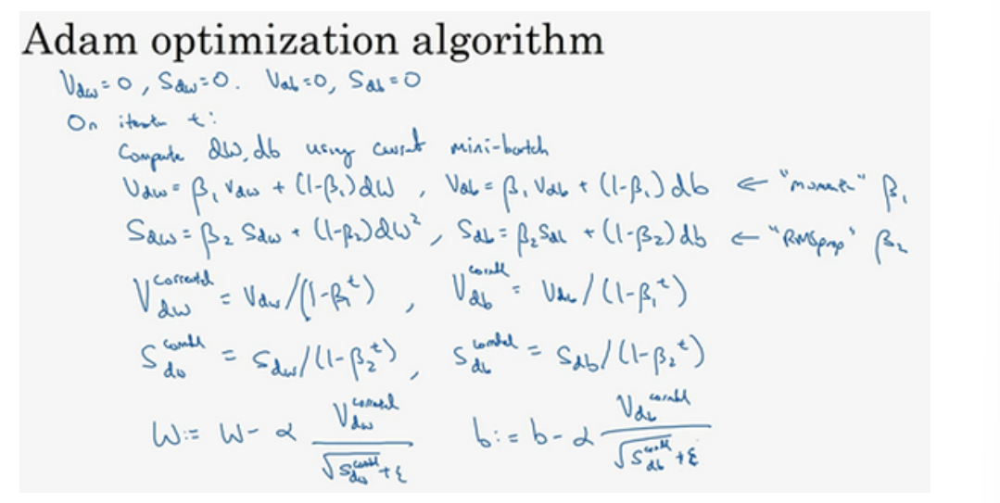

使用**Adam**算法，首先要初始化，$v_{dW}=0,S_{dW}=0,v_{db}=0,S_{db}=0$。

在第$t$次迭代中，用**mini-batch**梯度下降法计算当前**mini-batch**的微分$dW,db$，接下来计算**Momentum**指数加权平均数$v_{dW}=\beta_1v_{dW}+(1-\beta_1)dW，v_{db}=\beta_1v_{db}+(1-\beta_1)db$；

接着用**RMSprop**进行更新，即用不同的超参数$\beta_2$（这样不会跟$\beta_1$混淆），$S_{dW}=\beta_2S_{dW}+(1-\beta_2)(dW)^2，S_{db}=\beta_2S_{db}+(1-\beta_2)(db)^2$；

这相当于**Momentum**更新了超参数$\beta_1$，**RMSprop**更新了超参数$\beta_2$。一般使用**Adam**算法的时候，要计算偏差修正$v^{corrected}_{dW}=\frac{v_{dW}}{1-\beta_1^t}，v^{corrected}_{db}=\frac{v_{db}}{1-\beta_1^t}$；

$S$也使用偏差修正，$S^{corrected}_{dW}=\frac{S_{dW}}{1-\beta_2^t}，S^{corrected}_{db}=\frac{S_{db}}{1-\beta_2^t}$；

最后更新权重，$W:=W-\frac{av^{corrected}_{dW}}{\sqrt{S^{corrected}_{dW}}+\epsilon}，b:=b-\frac{av^{corrected}_{db}}{\sqrt{S^{corrected}_{db}}+\epsilon}$。

 本算法有很多超参数，**Momentum**涉及的项$\beta_1$常用的缺省值为0.9，这是$dW$的移动平均数，也就是$dW$的加权平均数；**Adam**算法的发明者推荐$\beta_2$使用0.999，这是在计算$(dW)^2$以及$(db)^2$的移动加权平均值；$\epsilon$一般为$10^{-8}$。在使用**Adam**的时候，人们往往使用缺省值即可，$\beta_1,\beta_2,\epsilon$都是如此，我觉得没人会去调整$\epsilon$，然后尝试不同的$a$值，看看哪个效果最好。

## 学习率衰减

加快学习算法的一个办法就是随时间慢慢减少学习率，我们将之称为学习率衰减。

假设你要使用**mini-batch**梯度下降法，**mini-batch**数量不大，大概64或者128个样本，在迭代过程中会有噪音（蓝色线），下降朝向这里的最小值，但是不会精确地收敛，所以你的算法最后在附近摆动，并不会真正收敛，因为你用的是固定值，不同的**mini-batch**中有噪音。但要慢慢减少学习率$a$的话，在初期的时候，学习率$a$还较大，你的学习还是相对较快，但随着$a$变小，你的步伐也会变慢变小，所以最后你的曲线（绿色线）会在最小值附近的一小块区域里摆动，而不是在训练过程中，大幅度在最小值附近摆动。

所以慢慢减少$a$的本质在于，在学习初期，你能承受较大的步伐，但当开始收敛的时候，小一些的学习率能让你步伐小一些。

可以将学习率设为$a=\frac{1}{1+decayrate*epochnum}a_0$，（**decayrate**为衰减率，**epochnum**为训练的代数，$a_0$为初始学习率），注意这个衰减率是另一个你需要调整的超参数。

这里有一个具体例子，如果你计算了几代，也就是遍历了几次，如果$a_0$为0.2，衰减率**decay-rate**为1，那么在第一代中，$a=\frac{1}{1+1}a_0=0.1$，在第二代学习率为0.067，第三代变成0.05，第四代为0.04等等。根据上述公式，学习率呈递减趋势。如果你想用学习率衰减，要做的是要去尝试不同的值，包括超参数$a_0$，以及超参数衰退率，找到合适的值，除了这个学习率衰减的公式，人们还会用其它的公式。比如指数衰减，如$a=0.95^{epochnum}a_0$，学习率呈指数下降。

学习率衰减并不是我尝试的要点，设定一个固定的$a$，然后好好调整，会有很大的影响，学习率衰减的确大有裨益，有时候可以加快训练，但它并不是我会率先尝试的内容。

## 局部最优问题

成本函数的零梯度点（导数为0），通常是鞍点。

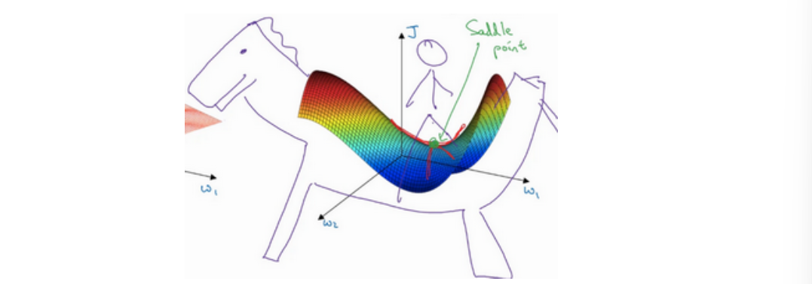

平稳段会减缓学习，平稳段是一块区域，其中导数长时间接近于0，如果你在此处，梯度会从曲面从上向下下降，因为梯度等于或接近0，曲面很平坦，得花上很长时间慢慢抵达平稳段的这个点，因为左边或右边的随机扰动，我换个笔墨颜色，大家看得清楚一些，然后你的算法能够走出平稳段（红色笔）。

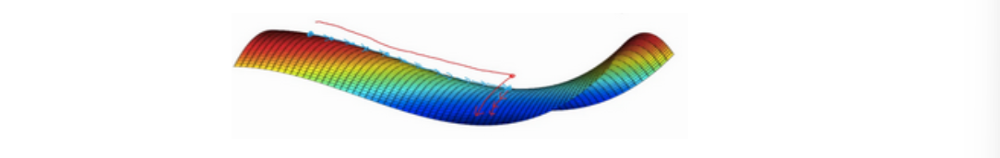

两个要点。第一，你不太可能困在极差的局部最优中，条件是你在训练较大的神经网络，存在大量参数，并且成本函数被定义在较高的维度空间。

第二点，平稳段是一个问题，这样使得学习十分缓慢，这也是像**Momentum**或是**RMSprop**，**Adam**这样的算法，能够加速学习算法的地方。在这些情况下，更成熟的优化算法，如**Adam**算法，能够加快速度，让你尽早往下走出平稳段。

# 超参数调试，batch正则化和程序框架

## 超参数调试

关于训练深度学习最难的部分之一就是要处理的参数的情况。从学习速率$a$到**Momentum**（动量梯度下降法）的参数$\beta$（默认0.9）；还需要选择**mini-batch**的大小，也许还得选择不同层中隐藏单元的数量；也许还得选择层数$l$，也许还想使用学习率衰减；**Momentum**或**Adam**优化算法的参数$\beta_1$（0.9）, $\beta_2$（0.999）和$\epsilon$（$10^{-8}$）。其中需要调试的最重要的超参数是学习速率$a$。

现在，如果你尝试调整一些超参数，该如何选择调试值呢？

若搜索的超参数只有两个，可以使用一个二维方格的策略；有三个超参数则以三维立方体来试验取值。

当给超参数取值时，另一个惯例是采用由粗糙到精细的策略。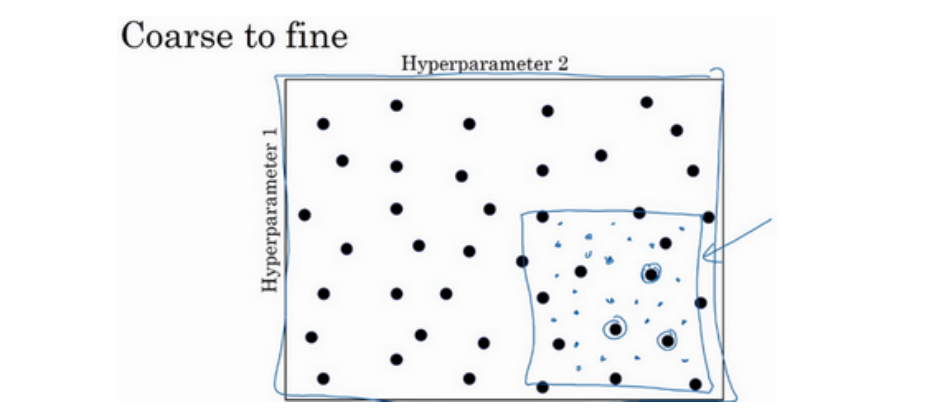

比如在二维的例子中，你进行了取值，也许你会发现效果最好的某个点，也许这个点周围的其他一些点效果也很好，那在接下来要做的是放大这块小区域（小蓝色方框内），然后在其中更密集得取值或随机取值，聚集更多的资源，在这个蓝色的方格中搜索，如果你怀疑这些超参数在这个区域的最优结果，那在整个的方格中进行粗略搜索后，你会知道接下来应该聚焦到更小的方格中。在更小的方格中，你可以更密集得取点。所以这种从粗到细的搜索也经常使用。

举个例子，假设你在搜索超参数学习率$a$，并怀疑其值最小值为0.0001最大值为1。采用对数标尺搜索超参数的方式，在**Python**中，可以这样做：`r=-4*np.random.rand()`，然后$a$随机取值：$a=10^r$。这是因为，$r\in [-4,0]，则a\in [10^{-4},10^0]$。

> 在对数坐标下取值，取最小值的对数就得到$a$的值，取最大值的对数就得到$b$值，现在在对数轴上的$10^a$到$10^b$区间取值，在$a,b$间随意均匀的选取$r$值，将超参数设置为$10^r$，这就是在对数轴上取值的过程。

那如何给用于计算指数的加权平均值的参数$\beta$取值？

假设认为$\beta$是0.9到0.999之间的某个值。我们换个思路，考虑$1-\beta$，此值大概从0.1到0.001之间，按照上面的方法，则需要再$[-3,-1]$之间随机均匀的给$r$取值，设定$1-\beta=10^r$，所以$\beta=1-10^r$，然后这就变成了在特定的选择范围内超参数随机取值。

## 将 Batch Norm 拟合进神经网络

**Batch**归一化会使参数搜索问题变得很容易，使神经网络对超参数的选择更加稳定，超参数的范围会更加庞大，工作效果也很好，也会使训练更加容易，甚至是深层网络。

在神经网络中，已知一些中间值，假设有一些隐藏单元值，从$z^{(1)}$到$z^{(m)}$（更准确的写法是$z^{[l][i]}$，这里省略了$l$）。要计算平均值、方差，并规范化每个$z^{(i)}$值：
$$
\begin{align*}
&\mu=\frac{1}{m}\sum^m_iz^{(i)} \\
&\sigma^2=\frac{1}{m}\sum^m_i(z_i-\mu)^2 \\
&z_{norm}^{(i)}=\frac{z^{(i)}-\mu}{\sqrt{\sigma^2+\epsilon}} 
\end{align*}
$$
其中规范化的方法是：减去均值$\mu$再除以标准偏差，为使数值稳定通常将$\epsilon$作为分母，以防$\sigma=0$的情况。

现在我们已把这些$z$值标准化，化为含平均值0和标准单位方差，所以$z$的每一个分量都含有平均值0和方差1，但我们不想让隐藏单元总是含有平均值0和方差1，也许隐藏单元有了不同的分布会有意义，现在来计算$\hat{z}^{(i)}=\gamma z^{(i)}_{norm}+\beta$

这里$\gamma,\beta$是模型的学习参数，使用梯度下降或一些其它类似梯度下降的算法，比如**Momentum**或者**Nesterov**，**Adam**来更新它们。

若$\gamma=\sqrt{\sigma^2+\epsilon},\beta=\mu$，那么$\hat{z}^{(i)}=z^{(i)}$。所以，在网络匹配这个单元的方式，之前可能是用$z^{(1)},z^{(2)}$等等，现在则会用$\hat{z}^{(i)}$取代$z^{(i)}$，方便神经网络中的后续计算。

归一化输入特征是怎样有助于神经网络中的学习，**Batch**归一化的作用是它适用的归一化过程，不只是输入层，甚至同样适用于神经网络中的深度隐藏层。你应用**Batch**归一化了一些隐藏单元值中的平均值和方差，不过训练输入和这些隐藏单元值的一个区别是，你也许不想隐藏单元值必须是平均值0和方差1。

比如，如果你有**sigmoid**激活函数，你不想让你的值总是全部集中在这里，你想使它们有更大的方差，或不是0的平均值，以便更好的利用非线性的**sigmoid**函数，而不是使所有的值都集中于这个线性版本中，这就是为什么有了$\gamma$和$\beta$两个参数后，你可以确保所有的$z^{(i)}$值可以是你想赋予的任意值，或者它的作用是保证隐藏的单元已使均值和方差标准化。那里，均值和方差由两参数控制，即$\gamma$和$\beta$，学习算法可以设置为任何值，所以它真正的作用是，使隐藏单元值的均值和方差标准化，即$z^{(i)}$有固定的均值和方差，均值和方差可以是0和1，也可以是其它值，它是由$\gamma$和$\beta$两参数控制的。

上面是在单一隐藏层进行**Batch**归一化，接下来，让我们看看它是怎样在深度网络训练中拟合的吧。

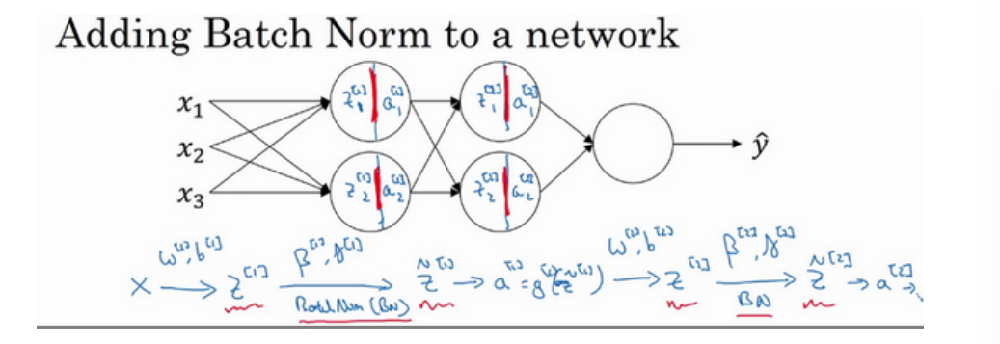

假设有上图中这样一个神经网络，可以认为每个单元负责计算两件事（计算$z$然后应用其到激活函数中计算$a$）。如果没有应用**Batch**归一化，则你会把输入$X$拟合到第一隐藏层，然后首先计算$z^{[1]}$，这是由$w^{[1]}$和$b^{[1]}$两个参数控制的。接着，通常而言，你会把$z^{[1]}$拟合到激活函数以计算$a^{[1]}$。但**Batch**归一化的做法是将值$z^{[1]}$进行**Batch**归一化，简称**BN**，此过程将由$\beta^{[1]}$和$\gamma^{[1]}$两参数控制，这一操作会给你一个新的规范化的值$z^{[1]}$（$\hat{z}^{[1]}$），然后将其输入激活函数中得到$a^{[1]}$，即$a^{[1]}=g^{[1]}(\hat{z}^{[l]})$。这就是第一层的计算，下一层同理。

对于新参数$\beta$，举个例子，对于给定层，你会计算$d\beta^{[l]}$，接着更新参数为$\beta^{[l]}=\beta^{[l]}-ad\beta^{[l]}$。你也可以使用**Adam**或**RMSprop**或**Momentum**，以更新参数和，并不是只应用梯度下降法。

让我们总结一下关于如何用**Batch**归一化来应用梯度下降法，假设你在使用**mini-batch**梯度下降法，你运行$t=1$到**batch**数量的**for**循环，你会在**mini-batch** $X^{\{t\}}$上每的个隐藏层都应用正向**prop**，用**Batch**归一化代替$z^{[l]}$为$\hat{z}^{[l]}$。接下来，它确保在这个**mini-batch**中，$z$值归一化均值和方差后是$\hat{z}^{[l]}$，然后，你用反向**prop**计算$dw^{[l]}$和$db^{[l]}$，及所有$l$层所有的参数，$d\beta^{[l]}$和$d\gamma^{[l]}$。尽管严格来说，$b$这部分其实已经去掉了。最后，你更新这些参数：$w^{[l]}=w^{[l]}-adw^{[l]},\beta^{[l]}=\beta^{[l]}-ad\beta^{[l]},\gamma^{[l]}=\gamma^{[l]}-ad\gamma^{[l]}$。

如果你已将梯度计算如下，你就可以使用梯度下降法了，但也适用于有**Momentum**、**RMSprop**、**Adam**的梯度下降法。

## Softmax 回归

二分分类只有两种可能的标记：0或1，比如这是一只猫或者不是一只猫，如果我们有多种可能的类型的话呢？有一种**logistic**回归的一般形式，叫做**Softmax**回归，能让你在试图识别某一分类时做出预测，或者说是多种分类中的一个，不只是识别两个分类，我们来一起看一下。

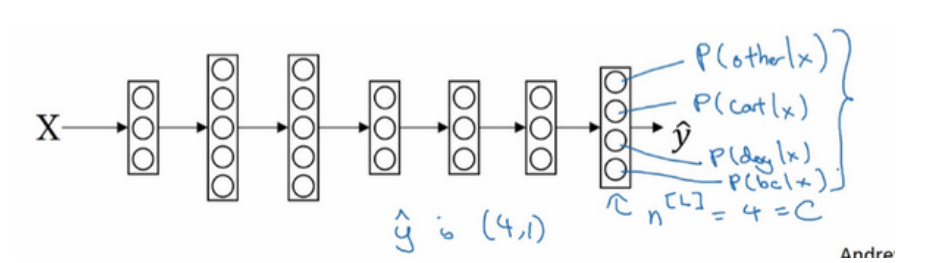

假设你不单需要识别猫，而是想识别猫，狗和小鸡，或者其它类。

上图例子中，建立的神经网络输出层有4个输出单元，如果用大写的$C$来表示输入会被分入的类别总个数，即$L$层的单元数量$n=C=4$。我们想要输出层单元的数字告诉我们这4种类型中每个的概率有多大，因此$\hat{y}$将是一个$4\times1$维向量，并且输出中的四个数字加起来应该等于1。

在第$L$层，算出$z^{[l]}=W^{[l]}a^{[L-1]}+b^{[l]}$之后，需要应用**Softmax**激活函数。首先，计算一个临时变量$t=e^{z^{[l]}}$，在这里$z^{[l]}$是$4\times1$维向量，故$t$也是；然后归一化，使和为1，因此$a^{[l]}=\frac{e^{z^{[l]}}}{\sum^4_{i=1}t_i}$，这里$a^{[l]}$也是一个$4\times1$维向量。而这个四维向量的第$i$个元素$a_i^{[l]}=\frac{t_i}{\sum^4_{j=1}t_j}$。

举个例子，假设已经算出了四维向量$z^{[l]}=\begin{bmatrix}5\\2\\-1\\3\end{bmatrix}$，现在要做的就是用这个元素取幂来计算$t=\begin{bmatrix}e^5\\e^2\\e^{-1}\\e^3\end{bmatrix}=\begin{bmatrix}148.4\\7.4\\0.4\\20.1\end{bmatrix}$，然后从向量$t$得到向量$a^{[l]}$就只需要将这些项目归一化，使总和为1，最终$a^{[l]}=\frac{t}{176.3}=\begin{bmatrix}0842\\0.042\\0.002\\0.114\end{bmatrix}$。

总结一下从$z^{[l]}$到$a^{[l]}$的计算步骤，整个计算过程，从计算幂到得出临时变量$t$，再归一化，我们可以将此概括为一个**Softmax**激活函数。之前，我们的激活函数都是接受单行数值输入，例如**Sigmoid**和**ReLu**激活函数，输入一个实数，输出一个实数。**Softmax**激活函数的特殊之处在于，因为需要将所有可能的输出归一化，就需要输入一个向量，最后输出一个向量。

> **Softmax**回归将**logistic**回归推广到了两种分类以上。考虑如果$C=2$时，只需要计算其中一个，结果就是你最终计算那个数字的方式又回到了**logistic**回归计算单个输出的方式。

下面来学习如何训练一个使用了**Softmax**层的模型。

在**Softmax**分类中，我们一般用到的损失函数是$L(\hat{y},y)=-\sum^4_{j=1}y_jlog{\hat{y}}$。

比如某个样本的目标输出为$\begin{bmatrix}0\\1\\0\\0\end{bmatrix}$，表示这是一张猫的图片。注意在这个样本中$y_1=y_3=y_4=0$，所以$L(\hat{y},y)=-y_2log{\hat{y_2}}=-log{\hat{y_2}}$。这就意味着，如果你的学习算法试图将它变小（因为梯度下降法是用来减少训练集的损失的），要使它变小的唯一方式就是使$-log{\hat{y_2}}$变小，要想做到这一点，就需要使$\hat{y_2}$尽可能大，因为这些是概率，所以不可能比1大。

> 概括来讲，损失函数所做的就是它找到你的训练集中的真实类别，然后试图使该类别相应的概率尽可能地高，如果你熟悉统计学中最大似然估计，这其实就是最大似然估计的一种形式。

所以，整个训练集的损失$J(w^{[1]},b^{[1]},......)=\frac{1}{m}\sum^m_{i=1}L(\hat{y}^{(i)},y^{(i)})$，因此你要做的就是用梯度下降法，使这里的损失最小化。

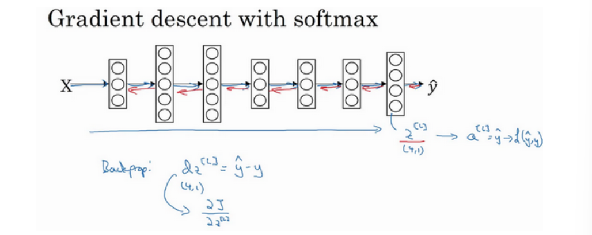

最后我们来看一下，在有**Softmax**输出层时如何实现梯度下降法，这个输出层会计算$z^{[l]}$，它是$C\times1$维的，在这个例子中是4×1，然后你用**Softmax**激活函数来得到$a^{[l]}$或者说$y$，然后又能由此计算出损失。我们已经讲了如何实现神经网络前向传播的步骤，来得到这些输出，并计算损失，那么反向传播步骤或者梯度下降法又如何呢？其实初始化反向传播所需要的关键步骤或者说关键方程是这个表达式$dz^{[l]}=\hat{y}-y$，你可以用$\hat{y}$这个4×1向量减去$y$这个4×1向量，你可以看到这些都会是4×1向量，当你有4个分类时，在一般情况下就是$4\times1$，这符合我们对$dz$的一般定义，这是对$z^{[l]}$损失函数的偏导数（$dz^{[l]}=\frac{\partial{J}}{\partial{z^{[l]}}}$）。

可以计算$dz^{{l}}$后，然后开始反向传播的过程，计算整个神经网络中所需要的所有导数。
