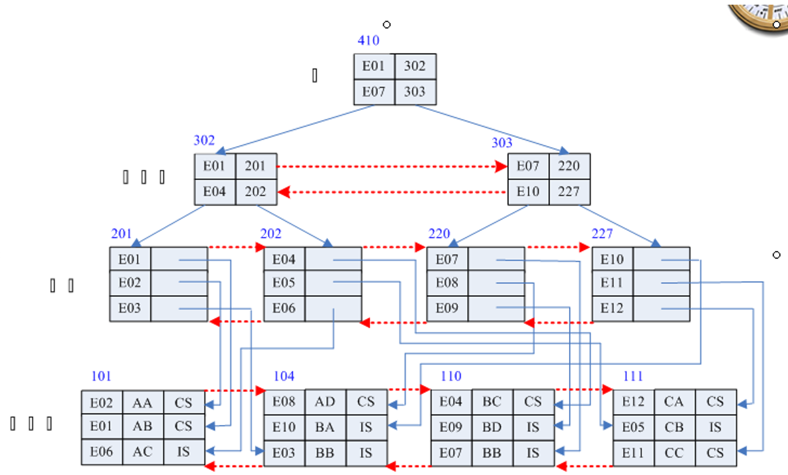

# 索引 index 

## 什么是索引

如学生花名册，默认是学生有序的，今天的新申请的QQ号数字比以前申请的要大。如此，这些数据有序的，主要目的是方便以后查询。数据表事先按要查询的关键字列索引后，以后要查询时可以使用二分查找—折半法。

如我们经常按用户ID号或用户名登陆等操作，可以对数据原表建立一个附属的文件，保存查询依据的记录顺序。但这样做要增加额外的存储空间，增加数据的复杂度，但最大好处是提高查询效率。 从顺序查找的n/2 降到log2(n)

 引例：如有学生表

| 隐藏的记录号 | 学号 | 姓名 | 身高 |
| ------------ | ---- | ---- | ---- |
| 1            | 01   | 张三 | 175  |
| 2            | 02   | 李四 | 165  |
| 3            | 05   | 张六 | 181  |
| 4            | 04   | 陈东 | 166  |
| 5            | 03   | 艾化 | 178  |

如果学生进入系统，按学号登陆，学号无序，只能顺序查找，如果有n 个学生，每个学生登陆时平均表中查找次数 n/2次.

如果事先针对学号列建立索引（按学生排列的每个记录的位置，出场顺序记录下来）：Index_xh     又可按姓名建立索引 index_xm

| index_xh | index_xm |
| -------- | -------- |
| 01 ->1   | 艾化->5  |
| 02->2    | 陈东-> 4 |
| 03->5    | 李四->2  |
| 04 ->4   | 张六->3  |
| 05->3    | 张三->1  |

可见，如果有了索引后，变顺序查找为二分查找，有N个记录，平均查找次数从n/2降到 log2(n)。如对100万个记录中数据查找，平均查找次从50万降到20次。

索引的缺点：增加存储空间(但比把原表复制成一个有序的新表空间开销少)，数据复杂度，如果物理表中的数据，特别是索引关键字经常变动，经常增删，必须要重新索引一次，对海量的数据来说，重新索引一次是很耗费资源。所以索引，并不适合经常增删改关键字的表。如学校教务处的学生表可以建立索引；对贴吧里的贴子表不适合建立索引.

## 索引分类

### 聚集索引 (clustered index)

 把数据按索引项的顺序进行物理排序。要生成一个新表，完全打乱原表中原数据的物理位置。

### 非聚集索引 (non clustered index)

现实开发相对说用得较多。一般是一个索引针对一表的一列（也可以是多列少），针对一列建立一个索引，一个表可以建立多个索引的。如果使用聚集索引不现实。非聚集索引就是上面的理论的实际应用，针对一个物理表，可以建立多个附属的索引表，并不打乱原物理的记录顺序，只是重新记录原表记录的位置。

例：以非聚集索引为例说明实际索引结构。索引使用数据页管理，可以把大量的数据分段管理，大大提高查询效率（使用B树采用折半查询更快）

## 应用 

 例1 为学生表的姓名列建立一个非聚集索引(以后用户使用姓名查询人，非常快). 当用户查``select ….from … where 姓名=…..``，系统自动启动姓名索引帮助用户提高查询效率。

```sql
 create index index_xm on 学生表(姓名)
```

 建立学号索引：

```sql
create index index_xh on 学生表(学号)
```

**注：有时原物理中索引列有重复值，索引后，重复值只保留一个值在索引表中**

```sql
Create unique index index_xm on 学生表(姓名)
```

# 视图 view

数据库中的建立的表table叫物理表; view是查询结果的保存，它是虚拟表。使用select命令查询出的结果，是临时，用完就关闭---临时的视图。

某个查询结果我们要以后再使用，可以把查询的命令保存起来，叫虚拟表，永久视图。（视图本身不是物理表,视图本身是无数据，就是一个可简单可复杂的select命令）

 例：编程时经常要使用学生表和成绩两个表，为避免每次书写连接命令。把操作成功后的这个查询命令保存起来.

```sql
create view myvv1 as
(select a.*,课程号,成绩 from 
 学生表 a inner join 成绩表 b on a.学号=b.学号)
```

生成一个视图，myvv1，它可以当表一样使用，其实它就是一个查询命令。

```sql
select * from myvv1
```

视图可以在平时当成一般表用，但它本身并不存放数据，当使用到视图时，它去执行内部SELECT命令。视图也可以作为其它视图的数据来源。

```sql
 select a.*,课程号,成绩 into newtable from 
 学生表 a inner join 成绩表 b on a.学号=b.学号
```

这个不是视图，生成一个物理新表，脱离了与学生表和成绩表的关系，当成绩表和学生表的数据发生变化时，不影响myvv1表。而上面的视图myvv1它在任何时刻的数据来源都是实时来自于学生表和成绩表.

例2:在上面myvv1视图基础，再连接课程表，生成一个myvv2视图，包括三个表的数据

```sql
create view myvv2 as
(Select myvv1.学号,姓名,生日,myvv1.课程号,成绩,名称,学分 
 From myvv1 inner join 课程表 on myvv1.课程号=课程表.课程号)
 select * from myvv2
```

可见，视图的利用，可以大大简化sql的查询命令的书写。在一个开发中，把经常要用的多个表提前建立视图。

例：建立一个视图myvv3，要得数据有：学号，姓名，课程号，成绩，及格否

```sql
create view myvv3 as
(select 学生表.学号,姓名,课程号,成绩,
 case when 成绩>=60 then '及格' else '不及格' end as 及格否
 from 学生表 inner join 成绩表 on 学生表.学号=成绩表.学号)

select * from myvv3
```

视图修改：最方便的是删除了重新建立（先把原核心的sele命令复制下来）

视图删除：``drop view 视图名``

**小结：**

**1** **索引可提高查询效率**

**2** **视图：**

- 简化查询命令语句的书写 

- 使用用户从多角度查看同一个数据（数据来源于同一个物理表，但可能看到结果大不一样）

- 提高数据的安全性。如对敏感数据加密，或不授予权限，但通过视图可以开放查询结果。普通用户看不到原表物理数据。

- 提供一定程序的逻辑独立性

