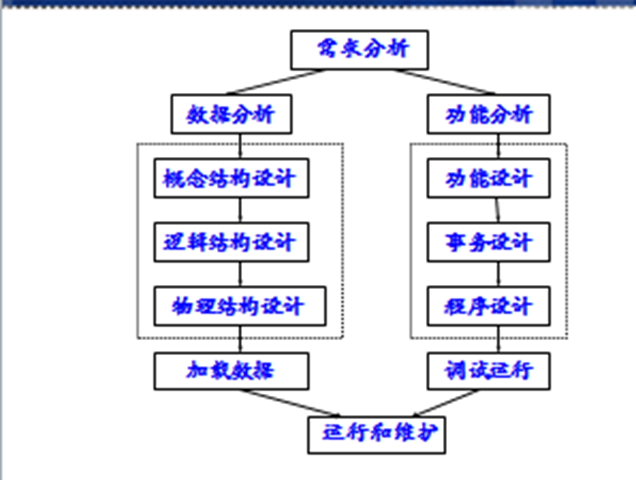
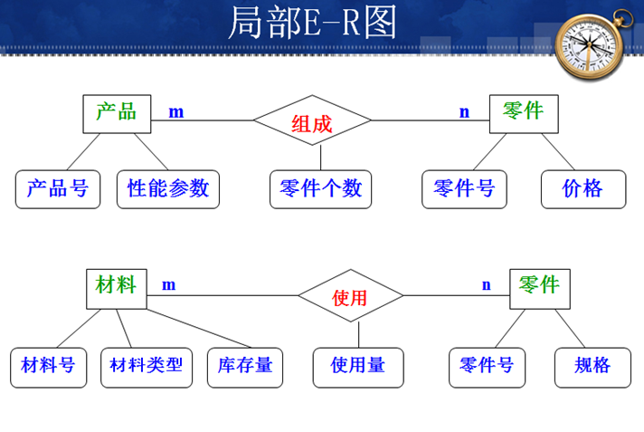
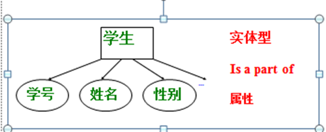
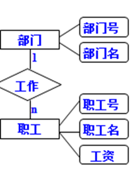
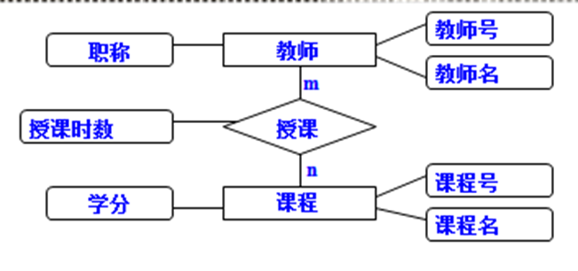
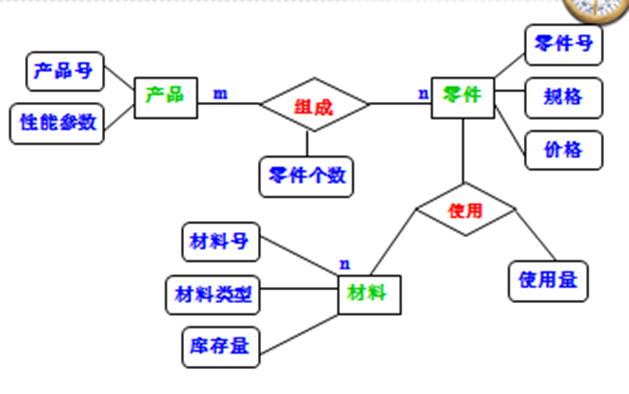
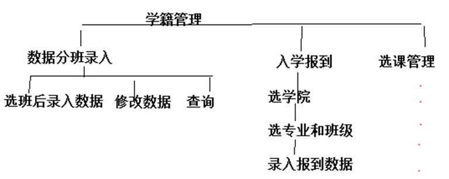

# 概述

数据库设计面对的主要有哪些问题

(1) 懂数据库原理同时懂甲方软件专业知识的人缺少；
(2) 应用的数据库系统的最终目标往往在一开始不能完全明确，与开发者与用户方最初没在要求完全一致有关；
(3) 应用业务系统千差万别的，难以找到一种通用的工具和方法。

## 数据库设计特点

(1) 对人员要求，综合性：成熟的开发人员涉及到的知识面，主要包括计算机专业和业务专业知识，要解决技术问题同时，还要去解决许多非技术方面的问题。

(2) 数据库结构设计与动态功能行为是分离的。

结构设计主要包括语义结构（概念性的），数据结构（逻辑性），存储结构（物理数据库）。动态行为设计：基于数据库的应用程序设计（动作操作，功能实现）

## 数据库设计流程

 一个数据库设计的流程：

需求分析（形成需求分析，得到说明书）→概念结构设计（概念结构）→逻辑结构设计（形成逻辑结构）→物理设计（生成磁盘上的物理数据库）

常用的数据库设计细节步骤：

1.需求分析---结构设计—行为功能设计---数据库实施---数据库运行和维护

2.需求分析：了解用户方的真实需要，纸面化，形成需求说明书

3.结构设计：主要有概念结构，逻辑结构，物理结构的思考

4.行为设计：功能设计，事务设计，APP设计

5.数据库实施：加载数据库，调试运行应用程序

6.运行和维护：即使软件交付后，在保证期内维护

# 数据库需求分析

整个设计过程的起点，详细地明确用户方要求，直接影响后面所有阶段。

 主要难点：真实完整地明确要求；技术上可能存在难点；调查用户需求阶段主要包括：对方业务现状，信息源流，外部的其它要求。

 信息源流：各种数据种类，类型，数据量；各种数据的来源，去向，结点是哪里；各种数据如何产生，修改，查询，更新，使用频率，效率；这些看起来分散的数据在业务如何联系起来？

最后得到需求报告，过程中常用方法：检查用户方工作中的文档；面谈；观察用户方操作的中业务；甚至研究和问卷调查等。

# 数据库结构设计

 数据库设计分：数据库结构设计（静态描述的东西），数据库行为设计（功能行为，程序设计）

- 结构设计：数据库概念结构，逻辑结构，物理存储结构

- 行为设计：数据库的功能组织和流程控制，APP实现

概念结构设计（在人脑和纸上体现）常用E-R（实体—联系）：

 （1）设计局部E-R模型：定义某个功能或小范围内的模型，定义实体，明确实体的联系，各实体的属性（某个或某些表的定义）

（2）设计全局E-R模型：把所有的局部E-R图集成一个全局的E-R

（3）优化全局E-R模型

E-R介绍：

- 矩形框表示实体表，圆角长方或椭圆表示属性列；

- 要描述出不同实体之间的联系：1：1， 1：m, m:n

- 原则：实体个数尽量少，但要满足各范式；一个实体包含 的属性列尽量少，但要保证对实体属性列描述清楚。

- 实体间的联系无冗余。

E-R模型如何向关系模型转换（数据库的逻辑结构设计概念），即根据E-R图如何得到表的结构；根据E-R描述，设计出逻辑表；

 一个实体转换为一个关系模式；实体中的属性就是关系表的列属性，实体中的标识符就是关系表的中的码， 难点在于如何处理实体之间的联系。

(1) 两个实体是1:1关系：可直接把E-R图转换为关系模式.

把上面的E-R实体“学生”转换为关系模式：学生（学号 pk, 姓名,性别…）

(2) 实体间是1:m关系： 如实体“部门”和“职工”是一对多,如何转换为这个E-R到关系模型。

部门（部门号 pk,部门名…）

职工（职工号 pk ,部门号 FK ,职工名，工资…）

(3)实体间是m:n ，多对多关系. 如有实体“教师”，“课程”，一个老师可教多门不同课程；一门课程可被不同的多个老师教。这种情况下如何转换为关系模型。

教师（教师号PK，教师名，职称….）

课程（课程号PK,课程名，学分…）

授课（教师号 FK，课程号FK，授课时数……）

> 说明：在教师表中教师号为主码，在课程表中课程号是主码；在授课表中教师号外键到教师表，课程号外键到课程表；授课表中教师号和课程号组合成主码PK。

例：如下E-R如何写出关系模型？

 产品（产品号pk，性能参数……）

 零件（零件号pk，规格，价格….）

 材料（材料号pk，材料类型，库存量，材料参数….）

 产品零件（产品号fk，零件号fk,零件个数….）

 零件材料（零件号fk，材料号fk，使用量….）

# 物理结构设计 

根据前面已经确定的逻辑的数据结构（分析用的），下面利用DBMS如sqlserver系统提供的方法技术，以较优化的存储结构，数据存取路径，合理的数据存储位置，设计出一个高效的，可以物理实现的数据库结构。----这个数据库根据需求分析，如何实现计算机内数据化，形成物理数据库。

 确定数据的物理结构主要有两步：

(1) 确定物理结构(以目前来说，不管什么数据都是在内存，外存中以线性结构存在)。如果选中一种DBMS，这个问题不需要用户再考虑

(2) 对物理结构进访问时，要有一个较优的时间和空间效率评价（选实时性，空间占相对小较优的）。如果大型系统，建议选大型数据库管理系统sqlserver，小型系统可以选MYSQL（轻量级的DBMS）

具体上面要求，要考虑：查询时响应时间，事务并发处理得好不好，内存和磁盘开销大不大）

# 数据库行为设计

即功能需求和功能设计分析， 结合甲方的软件需求，考虑本DBMS中要实现的功能。数据库行为设计一般步骤：

 功能分析---功能设计----事务设计---应用程序APP设计

## 功能分析：有哪些内容要考虑？

  理清楚有哪些主要的查询，做报表，哪些关键操作需要定义成事务（一个完整的功能，内部的程序哪怕错误执行一条，都要恢复原样）等各种基本的处理。

 哪些常用表操作呢？主要包括基本的数据操纵，增删查改（部分表是允许普通用户操作的，如学院表，不允许一般管理人或用户随意操作它）

 定义各个操作的语意，包括结构上的约束（如完整性控制），操作上的约束（对用户操作权限限制） 

 经常要操作的数据，必须要考虑操作的效率（如学院表不经常性操作，不用考虑效率；但学生选课系统，成绩系统的表必须要考虑效率，时间效率，这些操作要考虑并发性，实时性）

## 功能设计

 根据上一步的功能分析和制定的设计目标，把这些东西继续划分成多个更具体的功能小模块，一层一层分解，直到最后各子功能模块功能单一，很容易实现（方便以后程序实施编码）

 例：根据功能分析设计学籍管理的功能设计:

## 事务设计

 一块完成一个独立功能的程序段，每一句要么全部执行成功，要么一句也不执行；如果中途发生错误，退回到操作数据的原点rollback。

## 程序设计

利用第三方计算机语言（JAVA，C#等）结合数据库接口技术实现APP的开发(编写软件本身)

# 数据库实施

(1) 在DBMS中数据库结构设计（数据定义）完成后，加载数据

(2) 调试和运行应用程序

开始在本数据库内模仿实际使用过程，测试数据库的功能和性能

# 数据库运行和维护

  在数据库运行过程中，对数据库经常性的维护，主要有：

- 数据库的备份和恢复;

- 保证数据库完全性和完整性(根据运行测试，调整用户的操作权限)

- 监视，分析，调整数据库性能（慢慢让数据库更优化，如发现某些数据访问量太量，影响效率，要优化）

# 分析工具

 目前主要流行分析工具：

 1 数据流程图DFD：通用图形符号形象描述数据流程，主要采用结构化分析方法SA，自顶向下，逐层分解，把复杂数据需求分析细化。

 2 数据字典: DD

DD是前期分析数据收集的纸面化说明。对数据流图DFD中各元素（数据项，约束，数据结构，实体表，数据流向等）进行详细的说明和备注，名词解释。-----对需求分析文档中重要元素或重要的步骤加一个说明，方便最低层程序员阅读和理解）

