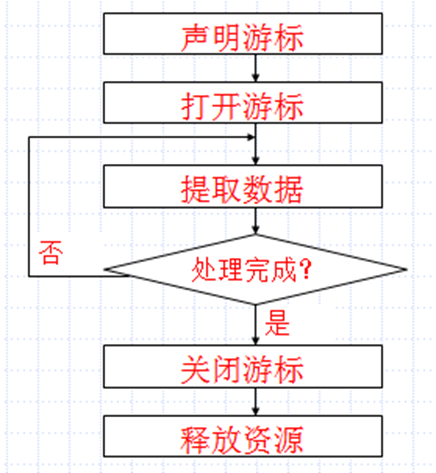

# 概念

游标 cursor是对以前查询结果一条一条记录处理的机制。

查询select的结果是一个视图，也是一条条地从数据库/视图提取出来的，呈现在用户面前时是个二维关系表，用户无法直接再一条一条地处理。

例：要把第一个同学的姓名改为张三四，把三个同学的生日提前3天，把第四个同学的身高减少1厘米。老办法，使用个独立不相干的UPDATE命令实现，如果是前后台的软件，连接操作数据库三次，效率特别低。如果使用游标，一次操作就完成，而且如果再在过程中使用游标，效率是最高的，前后联系，消息传递一次搞定。如果使用游标来解决上面问题，游标是数据库管理系统内部的操作，与第三方其它语言无关，在过程代码中实现，可动态操作数据，保证实时性。

实例：如前台输入姓氏，后台使用C#查询该姓的所有人，再把查询的这些的人的姓名，性别，生日，身高返回给前台展示.

(1) 直接使用C#的服务器控件，通过文本框输入姓氏，c#连接数据库sqlserver实现查询，把查询结果放在dataset中，再从dataset去读取记录行，最后response.write输出到前台的浏览器中.

(2) 前台使用纯html控件文本框，输入姓氏后，把姓氏值以ajax方式提交到后台，使用C#后台程序去连接数据库实现查询，把查询结果放在dataset中，再从dataset中读取记录行，把这些记录行凑成一个以指定字符间隔的字符串或集合JOSN，再以ajax不刷新方式传输给前台。前台ajax接收到数据，再拆开这些数据，显示在浏览器。

(以上两种方法，后者是使用html+jquery+ajax+sqlserver+c#/java方式,整个过程是不刷新，效率比较高。前者使用C#+sqlserver，效率较低，重复加载/显示数据时要刷新，的有服务器控件到达前台时要转换为HTML控件再显示在浏览器中。（后台的文本框控制textbox1，它要显示在用户端浏览器时要转换为html控件``<input type='text'>``

(3) 最理想的方法，目前较流行的方法：前台使用纯html控件文本框，输入姓氏后，把姓氏值以ajax方式提交到后台，使用C#后台程序去连接数据库实现查询.在sqlserver中编写一个过程/函数，接收姓氏值，在过程中使用游标，去访问该姓名的所有人，把这些人的姓名，性别，生日，身高数据连接成一个串，最后把结果串返回给调用处。如果使用datareader,连dataadpater都不要了. 然后C#把这个长的串ajax方式回传给前台，前台再来拆分这些数据和显示出来.

此法目前比较优化的，最麻烦的工作是前台浏览器和sqlserver中，C#/JAVA负担相对轻得多，更适合编写实时效率要求高的软件。此法有一个最大特点：用户端见的东西是纯HTML，不需要控件在C#与HTML相互转换，前台浏览器的内容改变也不会自动刷新，

游标是对查询结果逐条操作，主要包含两个方面的内容：

 (1)游标结果集：它就是对应select命令产生的视图（结果集）[有点类似于早期学的C#中的datareader，也是记录集概念]

(2)游标当前指针：游标指针初始是指向结果集的首行，指向哪一行就可以操作哪一行，而且可以随意拔动指针到指定行，支持对当前行进行数据读和写的。

可见，以前datareader, dataset中很多操作可以使用游标来完成的。

# 游标使用过程



引例：编写一个函数，使用动态游标返回李大方的性别和生日，不允许通过游标修改任何数据。

```sql
create function getbirth1() returns varchar(50)
as 
begin
 declare @birth smalldatetime,@sex nchar(2),@result varchar(50)
 declare mycur1 cursor dynamic read_only for select 性别,生日 from 学生表 where 姓名='李大方'
 open mycur1
 fetch first from mycur1 into @sex,@birth
 set @result=@sex+CONVERT(char(10),@birth,21)
 close mycur1
 deallocate mycur1
 return @result
end

select dbo.getbirth1()
```

可见，上例也是一种实现数据库系统和面向记录集的行记录的程序设计之间桥梁。

# 游标分类

（1）静态游标: 静态的游标的结果集，游标中对应的数据不会改变的，也不能改变原物理数据库表。（用户A使用静态游标，用户B也打开对应的数据，二者相互不体现修改改变结果）

（2）动态游标：滚动游标时，动态游标反应结果集中的所有改变，需要事先定义为全局的游标，用户A对结果集的修改要反应给其它用户---所有用户对结果集作的修改都是实时有效的。

（3）只进游标：不支持滚动，只能从头到尾顺序提取数据。如果多用户对数据执行了修改操作，在当前再向后面的行进行提取数据时有效的，但对当前行前面的修改，只进游标不无滚回去重新提取.

（4）键集驱动游标

# 声明游标格式语法

```sql
Declare 游标名 cursor [local|global]
 [forward_only | scroll ]
 [static | dynamic | fast_forward | keyset]
 [read_only | scroll_locks ]
 For select_statement 
 [for update [of column …….]
```

 参数解释：

- Local :**局部游标，只能在它定义所在的过程/函数/触发器中使用(默认为local的)**

- Global:**全局游标，由连接执行的所有程序都可以使用**

- forward_only ：只进游标，游标指针只能从结果集的第一行滚动到最后一行，只能使用 fetch next 办法提取数据出来**.**

- Scroll:**动态游标，指针随便滚**

- Static: 静态游标**,不反应其它修改**

- Dynamic:**动态游标，多操作相互反应有效**

- Read_only:**不能通过游标对数据进行修改**
- for update [of column ……. 定义游标中可更新的列 

例：定义一个全局的动态游标：

```sql
declare myc2 cursor global scroll for Select 学号,姓名,生日,身高 from 学生表 
```

# 打开游标

运行select命令，把游标指向结果集

# 提取数据

如何提取数据，如何滚动游标指针与游标的类型定义有关。如从指定的游标结果集中，把定位到的行的数据填充到指定变量名中（可一个变量，也可若干个变量：

```sql
 Fetch [ next | prior |first |last | absolute n|relative n] from cursor_name into 变量表
```

- First： 不管当前在哪里，定位到结果集的第一行

- Prior:定位到上一行

- Next 定位到下一行

- Last:定位到尾行

- Absolute n 不管当前在哪一行，定位第n位

- Relative n 从当前行向后跳n行

例：

```sql
/*在mycur1游标指向的结果集中，定位指针到首行，再把当前行数据值填充后面两个变量中*/
fetch first from mycur1 into @sex,@birth
```


例： 

```sql
/*定位当前行的后面第3行，把值填充到a,b,c三个变量*/
fetch relative 3 from mycu2 int @a,@b,@c 
```

例：把第2行数据提取出来

```sql
Fetch absolute 2 from mycu2 int @a,@b,@c
```

# 关闭游标

```sql
close [global] 游标名
```

 如果定义的是静态游标，要看到别人修改结果，要选关，再打开一次，才能看到。

# 删除游标：释放资源

```sql
Deallocate [global] 游标名
```

# 利用游标更新/删除数据

 (1)通过游标修改当前行数据：

```sql
 Update 基本表 set 列名=值[,……] where current of 游标名
```

(2)游标删除当前数据

```sql
 Delete 基本表 where current of 游标名
```

实例：把学生表中的所有指定姓氏的学生的姓名，性别，生日累加起来，通过一个函数返回调用处。

```sql
create function getname(@xs nchar(1)) returns varchar(2000)
as
begin 
 declare @namestr varchar(2000)
 declare @xm nchar(6)
 declare @xb nchar(1)
 declare @sr smalldatetime
 set @namestr=''
 declare mycur cursor for select 姓名,性别,生日 from 学生表 where left(姓名,1)=@xs
 open mycur
 fetch next from mycur into @xm,@xb,@sr
 while @@FETCH_STATUS=0 /*返回上次fetch命令结果,0成功,-1失败,-2被提的行不存在*/
  begin
   set @namestr=@namestr+','+@xm+','+@xb+','+CONVERT(nchar(10),@sr,21) +'|'
  fetch next from mycur into @xm,@xb,@sr
 end
 close mycur
 deallocate mycur 
 return @namestr
end
```

