# 卷积神经网络

## 边缘检测

使用卷积运算实现垂直边缘检测：

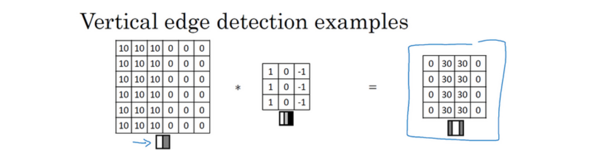

比如这张$6\times6$的图片，左边较亮，而右边较暗，将它与垂直边缘检测过滤器进行卷积，检测结果就显示在了右边这幅图的中间部分。

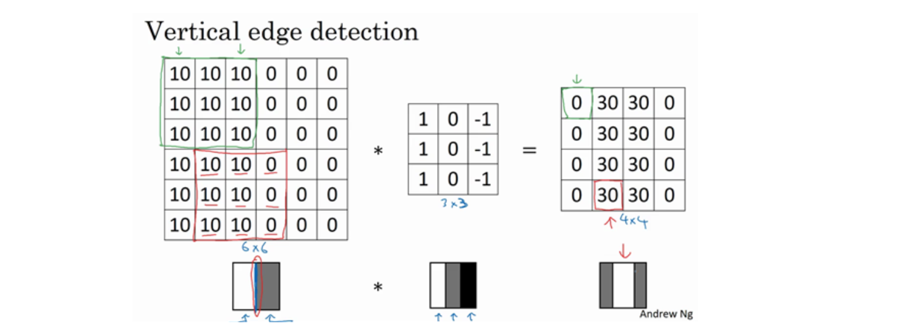

举例来说，最右的结果矩阵最左上角的元素0，就是由这个3×3块（绿色方框标记）经过元素乘积运算再求和得到的$10\times1+10\times1+10\times1+10\times0+10\times0+10\times0+10\times(-1)+10\times(-1)+10\times(-1)=0$；相反这个30是由这个（红色方框标记）得到的。

另外，还有**Sobel**过滤器$\begin{bmatrix}1\quad 0 \quad -1 \\2\quad 0\quad -2\\1\quad 0\quad-1\end{bmatrix}$，**Scharr**过滤器$\begin{bmatrix}3\quad 0 \quad -3 \\10\quad 0\quad -10\\3\quad 0\quad-3\end{bmatrix}$，实际上也是一种垂直边缘检测，如果你将其翻转90度，你就能得到对应水平边缘检测。

还有另一种过滤器，这种过滤器对于数据的捕捉能力甚至可以胜过任何之前这些手写的过滤器。相比这种单纯的垂直边缘和水平边缘，它可以检测出45°或70°或73°，甚至是任何角度的边缘。将矩阵的所有数字都设置为参数，通过数据反馈，让神经网络自动去学习它们，我们会发现神经网络可以学习一些低级的特征，例如这些边缘的特征。不过构成这些计算的基础依然是卷积运算，使得反向传播算法能够让神经网络学习任何它所需要的3×3的过滤器，并在整幅图片上去应用它。这种将这9个数字当成参数的思想，已经成为计算机视觉中最为有效的思想之一。

## Padding

如果你用一个3×3的过滤器卷积一个6×6的图像（上节中的例子），你最后会得到一个4×4的输出，也就是一个4×4矩阵。那是因为你的3×3过滤器在6×6矩阵中，只可能有4×4种可能的位置。这背后的数学解释是，如果我们有一个$n\times n$的图像，用$f\times f$的过滤器做卷积，那么输出的维度就是$(n-f+1)\times(n-f+1)$。在这个例子里是$6-3+1=4$，因此得到了一个4×4的输出。

这样的话会有两个缺点，第一个缺点是每次做卷积操作，你的图像就会缩小，从6×6缩小到4×4，你可能做了几次之后，你的图像就会变得很小了，可能会缩小到只有1×1的大小。你可不想让你的图像在每次识别边缘或其他特征时都缩小，这就是第一个缺点。

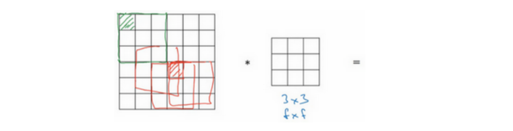

第二个缺点是，如果你注意角落边缘的像素，这个像素点（绿色阴影标记）只被一个输出所触碰或者使用，因为它位于这个3×3的区域的一角。但如果是在中间的像素点，比如这个（红色方框标记），就会有许多3×3的区域与之重叠。所以那些在角落或者边缘区域的像素点在输出中采用较少，意味着你丢掉了图像边缘位置的许多信息。

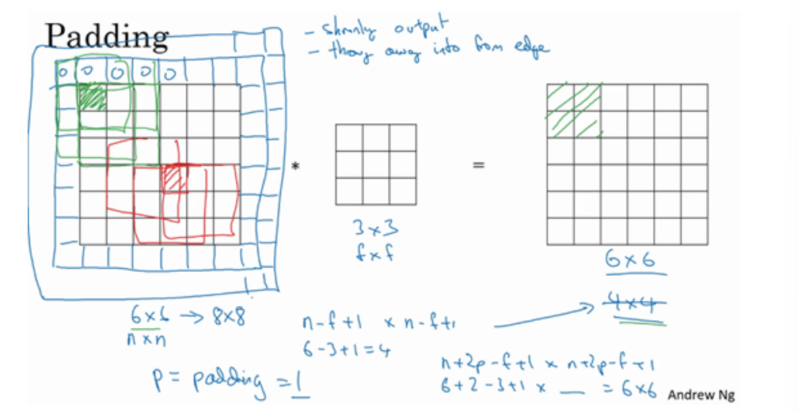

为了解决这些问题，你可以在卷积操作之前填充这幅图像。在这个案例中，你可以沿着图像边缘再填充一层像素。如果你这样操作了，那么6×6的图像就被你填充成了一个8×8的图像。如果你用3×3的图像对这个8×8的图像卷积，你得到的输出就不是4×4的，而是6×6的图像，你就得到了一个尺寸和原始图像6×6的图像。习惯上，可以用0去填充，如果$p$是填充的层数，在这个案例中$p=1$，则输出也就变成了$(n+2p-f+1)\times(n+2p-f+1)=(6+2-3+1)\times(6+2-3+1)=6\times6$，和输入图像一样大。这个涂绿的像素点（左边矩阵）影响了输出中的这些格子（右边矩阵）。这样一来，丢失信息或者更准确来说角落或图像边缘的信息发挥的作用较小的这一缺点就被削弱了。

至于选择填充多少层像素，通常有两个选择，分别叫做**Valid**卷积和**Same**卷积。

**Valid**卷积意味着不填充，这样的话，如果你有一个$n\times n$的图像，用一个$f\times f$的过滤器卷积，它将会给你一个$(n-f+1)\times(n-f+1)$维的输出。这类似于我们在前面的视频中展示的例子，有一个6×6的图像，通过一个3×3的过滤器，得到一个4×4的输出。

**Same**卷积意味填充后，输出大小和输入大小是一样的。如果你有一个$n\times n$的图像，当填充$p$层像素点后，输出大小就为$(n+2p-f+1)\times(n+2p-f+1)$，输入大小与输出大小相等，故$n+2p-f+1=n$，因此$p=(f-1)/2$。所以当$f$是一个奇数的时候，只要选择相应的填充尺寸，你就能确保得到和输入相同尺寸的输出。即，当过滤器是3×3时，为使得输出尺寸等于输入尺寸，所需要的填充是(3-1)/2，也就是1个像素。

为了指定卷积操作中的**padding**，你可以指定$p$的值。也可以使用**Valid**卷积，也就是$p=0$。也可使用**Same**卷积填充像素，使输出和输入大小相同。

## 卷积步长

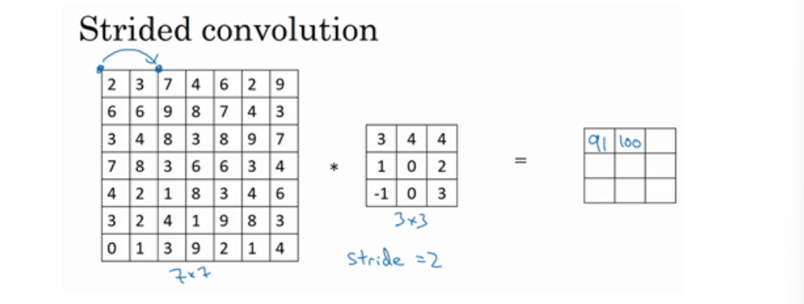

之前我们移动的步长是1，现在移动的步长是2，我们让过滤器跳过2个步长，注意一下左上角，这个点移动到其后两格的点，跳过了一个位置。然后你还是将每个元素相乘并求和，你将会得到的结果是100。

在这个例子中，我们用3×3的矩阵卷积一个7×7的矩阵，得到一个3×3的输出。输入和输出的维度是由下面的公式决定的。

**如果你用一个$f\times f$的过滤器卷积一个$n\times n$的图像，你的padding为$p$，步幅为$s$，现在不是一次移动一个步子，而是一次移动$s$个步子，输出于是变为$(\frac{n+2p-f}{s}+1)\times(\frac{n+2p-f}{s}+1)$。**

在这个例子中，$n=7,p=0,f=3,s=2,\frac{7+0-3}{2}+1=3$，即3×3的输出。

> 若商不是一个整数时，采用向下取整。

总结一下，如果有一个$n\times n$的矩阵或者图像，与一个$f\times f$的矩阵卷积，或者说$f\times f$的过滤器，**Padding**是$p$，步幅为$s$，则输出尺寸为：

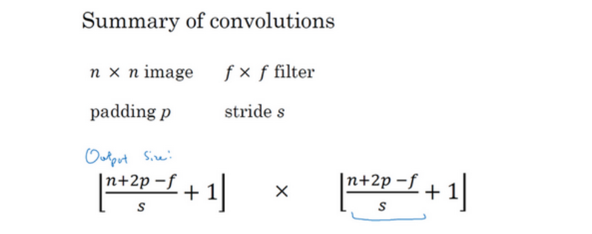

## 三维卷积

从一个例子开始，假如说你不仅想检测灰度图像的特征，也想检测**RGB**彩色图像的特征。彩色图像如果是6×6×3，这里的3指的是三个颜色通道，你可以把它想象成三个6×6图像的堆叠。为了检测图像的边缘或者其他的特征，不是把它跟原来的3×3的过滤器做卷积，而是跟一个三维的过滤器，它的维度是3×3×3，这样这个过滤器也有三层，对应红、绿、蓝三个通道。

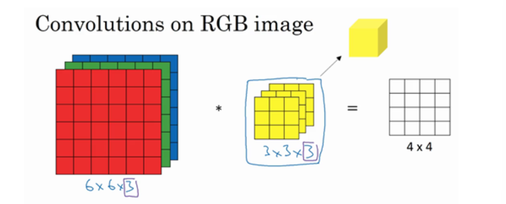

为了计算这个卷积操作的输出，你要做的就是把这个3×3×3的过滤器先放到最左上角的位置，这个3×3×3的过滤器有27个数，27个参数就是3的立方。依次取这27个数，然后乘以相应的红绿蓝通道中的数字。先取红色通道的前9个数字，然后是绿色通道，然后再是蓝色通道，乘以左边黄色立方体覆盖的对应的27个数，然后把这些数都加起来，就得到了输出的第一个数字。

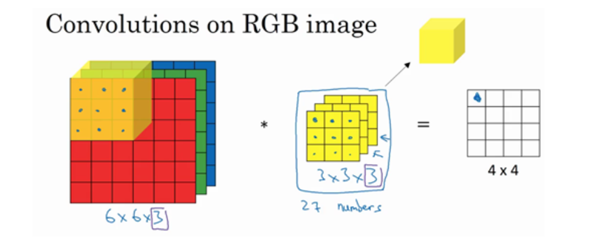

如果要计算下一个输出，你把这个立方体滑动一个单位，再与这27个数相乘，把它们都加起来，就得到了下一个输出，以此类推。最终得到一个4×4的二维输出。

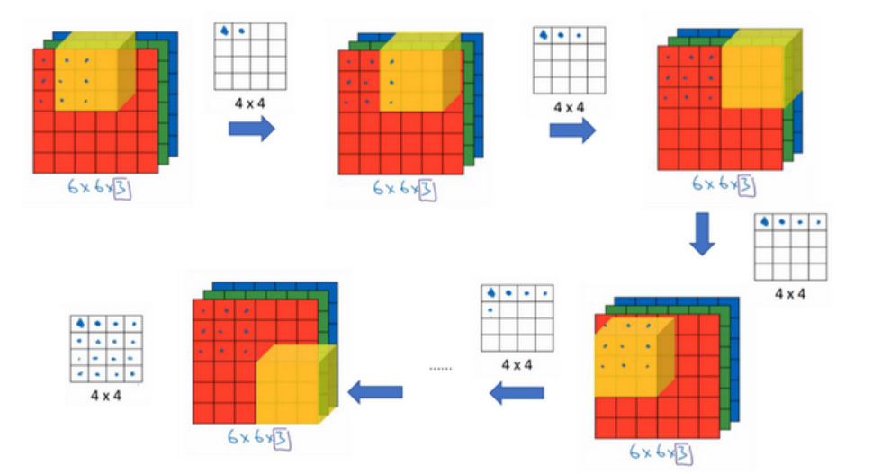

但是，如果我们不仅仅想要检测垂直边缘怎么办？如果我们同时检测垂直边缘和水平边缘，还有45°倾斜的边缘，还有70°倾斜的边缘怎么做？换句话说，如果你想同时用多个过滤器怎么办？

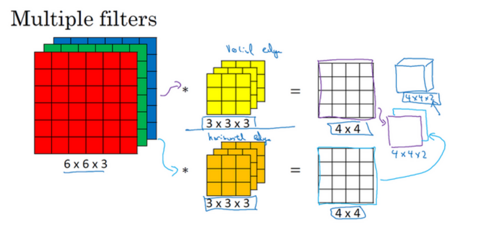

我们让这个6×6×3的图像和这个3×3×3的过滤器卷积，得到4×4的输出。（第一个）这可能是一个垂直边界检测器或者是学习检测其他的特征。第二个过滤器可以用橘色来表示，它可以是一个水平边缘检测器。做完卷积，然后把这两个4×4的输出，取第一个把它放到前面，然后取第二个过滤器输出，我把它画在这，放到后面。所以把这两个输出堆叠在一起，这样你就都得到了一个4×4×2的输出立方体。

总结一下，**如果有一个$n\times n\times n_c$（通道数）的输入图像，其卷积上一个$f\times f\times n_c$的过滤器，然后就得到了$(n-f+1) \times (n-f+1) \times n_{c}'$，这里的$n_c'$是下一层的通道数，也就是用的过滤器的个数。**

上面的例子中，用的步幅为1，并且没有**padding**。如果你用了不同的步幅或者**padding**，那么这个$n-f+1$数值会变化，正如前面的视频演示的那样。

## 单层卷积神经网络

这节课的重点是，学习卷积神经网络的某一卷积层的工作原理，以及如何计算某一卷积层的激活函数，并映射到下一层的激活值。

上一节讲了如何通过两个过滤器卷积处理一个三维图像，并输出两个不同的4×4矩阵。最终各自形成一个卷积神经网络层，然后增加偏差，它是一个实数，通过**Python**的广播机制给这16个元素都加上同一偏差。然后应用一个非线性激活函数**ReLU**，输出结果是两个4×4矩阵。

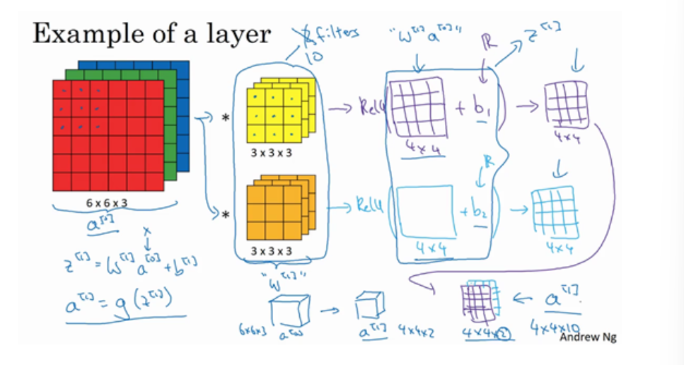

把这两个矩阵堆叠起来，最终得到一个4×4×2的矩阵。我们通过计算，从6×6×3的输入推导出一个4×4×2矩阵，它是卷积神经网络的一层，把它映射到标准神经网络中四个卷积层中的某一层或者一个非卷积神经网络中。

注意前向传播中的一个操作是$z^{[1]}=W^{[1]}a^{[0]}+b^{[1]}$（类似于图中右边蓝色框标记部分），其中输入是$x=a^{[0]}$，图中黄色和橙色的过滤器用变量$W^{[1]}$表示，加上偏差$b^{[1]}$后，执行非线性激活函数**ReLU**得到$a^{[1]}$。最后得到的这个4×4×2矩阵，成为神经网络的下一层，也就是激活层。

这就是$a^{[0]}$到$a^{[1]}$的演变过程，首先执行线性函数，然后所有元素相乘做卷积，具体做法是运用线性函数再加上偏差，然后应用激活函数**ReLU**。这样就通过神经网络的一层把一个6×6×3的维度$a^{[0]}$演化为一个4×4×2维度的$a^{[1]}$，这就是卷积神经网络的一层。

示例中我们有两个过滤器，也就是有两个特征，因此我们才最终得到一个4×4×2的输出。但如果我们用了10个过滤器，而不是2个，我们最后会得到一个4×4×10维度的输出图像。

那么，假设你有10个过滤器，而不是2个，神经网络的一层是3×3×3，那么，这一层有多少个参数呢？

> 来计算一下，每一层都是一个3×3×3的矩阵，因此每个过滤器有27个数，即27个参数，然后加上一个偏差，用参数$b$表示，参数增加到28个，现在有10个过滤器，则共有28×10=280个参数。

请注意一点，不论输入图片有多大，1000×1000也好，5000×5000也好，参数始终都是280个。用这10个过滤器来提取特征，如垂直边缘，水平边缘和其它特征。即使这些图片很大，参数却很少，这就是卷积神经网络的一个特征，叫作“**避免过拟合**”。

下面来总结下用于描述卷积神经网络中的一层（以$l$层为例）：

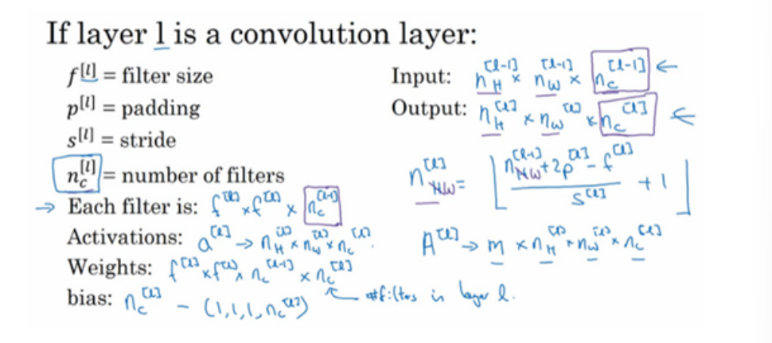

这一层的输入为上一层的激活值，即$n_H^{[l-1]}\times n_W^{[l-1]}\times n_c^{[l-1]}$，$n_c$表示某层上的颜色通道数。

> 在上面的例子中，所用图片的高度和宽度都一样，但它们也可能不同，所以这里用下标$H$和$W$来标记。

在卷积层$l$层中，过滤器大小为$f^{[l]}\times f^{[l]}$，而过滤器中通道的数量必须与本层输入中通道的数量一致。因此，$l-1$层输出通道数量就是$l$层输入通道数量，所以过滤器维度等于$f^{[l]}\times f^{[l]}\times n_c^{[l-1]}$；用$p^{[l]}$来标记**padding**的数量，**padding**数量可指定为一个**valid**卷积（0，即无**padding**），或是**same**卷积（即选定**padding**，这样输出和输入图片的高度和宽度就相同了）；用$s^{[l]}$标记步幅。

计算图像的高度：$n_H^{[l]}=\lfloor \frac{n_H^{[l-1]}+2p^{[l]}-f^{[l]}}{s}+1 \rfloor$；

计算图像的宽度：$n_W^{[l]}=\lfloor \frac{n_W^{[l-1]}+2p^{[l]}-f^{[l]}}{s}+1 \rfloor$；

则神经网络这一层的输出为$n_H^{[l]}\times n_W^{{l}}\times n_c^{[l]}$，这就是输出图像的大小。

### 简单卷积网络示例

假设有一张39×39×3的图片，你想做图片分类或图片识别，把这张图片输入定义为$x$，然后辨别图片中有没有猫，用0或1表示，这是一个分类问题，我们来构建适用于这项任务的卷积神经网络。

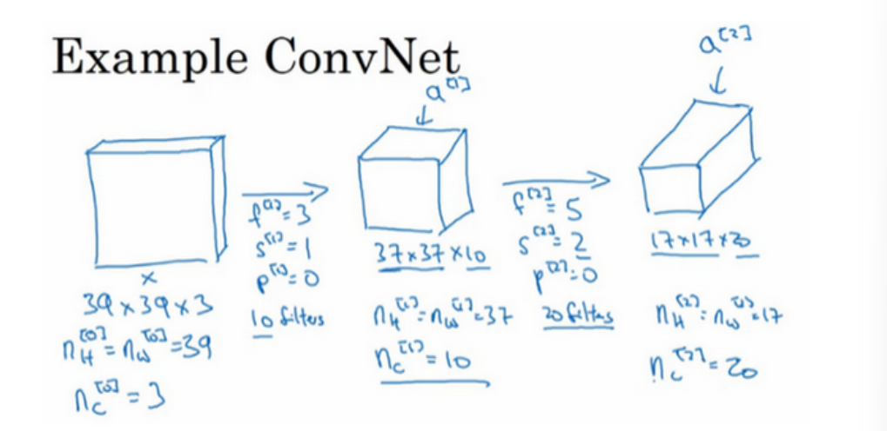

首先，图片的高度和宽度相等$n_H^{[0]}=n_W^{[0]}=39,n_c^{[0]}=3$。

假设第一层我们用10个3×3的过滤器来提取特征，则$f^{[1]}=3$，令$s^{[1]}=1,p^{[1]}=0$（高度和宽度使用**valid**卷积），则$n_H^{[1]}=n_W^{[1]}=\frac{n+2p-f}{s}+1=37,n_c^{[1]}=10$，则第一层激活值的维度为37×37×10。

第二层采用的过滤器是5×5的矩阵，$f^{[2]}=2,s^{[2]}=2,p^{[2]}=0$，且有20个过滤器，则输出结果为17×17×20。

下面来构建最后一个卷积层，假设$f^{[3]}=5,s^{[3]}=2,p^{[3]}=0$，用了40个过滤器，最后结果为7×7×40。

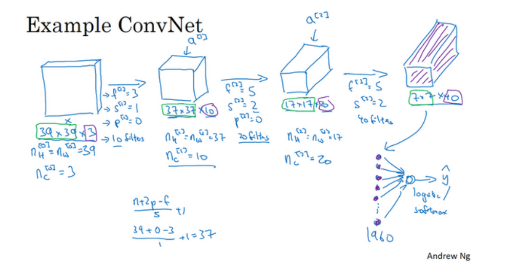

到此，这张39×39×3的输入图像就处理完毕了，为图片提取了7×7×40个特征，计算出来就是1960个特征。然后对该卷积进行处理，可以将其平滑或展开成1960个单元。平滑处理后可以输出一个向量，其填充内容是**logistic**回归单元还是**softmax**回归单元，完全取决于我们是想识图片上有没有猫，还是想识别$K$种不同对象中的一种，用$\hat{y}$表示最终神经网络的预测输出。明确一点，最后这一步是处理所有数字，即全部的1960个数字，把它们展开成一个很长的向量。为了预测最终的输出结果，我们把这个长向量填充到**softmax**回归函数中。

这是卷积神经网络的一个典型范例，设计卷积神经网络时，确定这些超参数比较费工夫。要决定过滤器的大小、步幅、**padding**以及使用多少个过滤器。

一个典型的卷积神经网络通常有三层，一个是卷积层，我们常常用**Conv**来标注；一个是池化层，我们称之为**POOL**；最后一个是全连接层，用**FC**表示。

## 池化层

除了卷积层，卷积网络也经常使用池化层来缩减模型的大小，提高计算速度，同时提高所提取特征的鲁棒性，我们来看一下。

输入是5×5的矩阵，采用最大池化法，过滤器参数为3×3，即$f=3$，步幅为1，即$s=1$，之前讲的计算卷积层输出大小的公式同样适用于最大池化，即$\frac{n+2p-f}{s}+1$，这个公式也可以计算最大池化的输出大小。

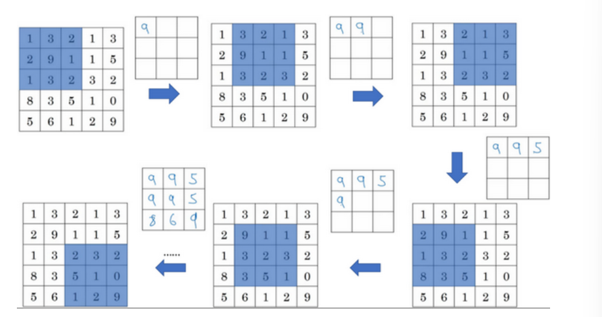

此例是计算3×3输出的每个元素，我们看左上角这些元素，注意这是一个3×3区域，因为有3个过滤器，取最大值9；然后移动一个元素，因为步幅是1，蓝色区域的最大值是9；继续向右移动，蓝色区域的最大值是5；然后移到下一行，因为步幅是1，我们只向下移动一个格，所以该区域的最大值是9。这两个区域的最大值都是5。最后这三个区域的最大值分别为8，6和9。超参数$f=3$，$s=1$，最终输出如图所示。

以上就是一个二维输入的最大池化的演示，如果输入是三维的，那么输出也是三维的。例如，输入是5×5×2，那么输出是3×3×2。计算最大池化的方法就是分别对每个通道执行刚刚的计算过程。

还有一种类型的池化叫平均池化，选取的不是每个过滤器的最大值，而是平均值。下面示例中，紫色区域的平均值是3.75，后面依次是1.25、4和2。这个平均池化的超级参数$f=2,s=2$，我们也可以选择其它超级参数。

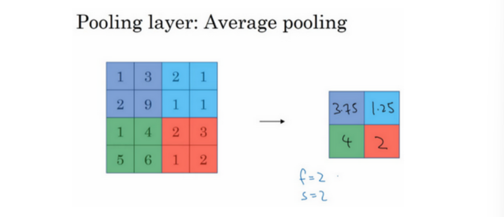

总结一下，池化的超级参数包括过滤器大小$f$和步幅$s$，常用的参数值为$f=2,s=2$，应用频率非常高，其效果相当于高度和宽度缩减一半。也有使用$f=3,s=2$的情况。至于其它超级参数就要看你用的是最大池化还是平均池化了。大部分情况下，最大池化很少用**padding**。目前$p$最常用的值为0，即$p=0$。

最大池化的输入就是$n_H \times n_W \times n_c$，假设没有**padding**，则输出$\lfloor \frac{n_H-f}{s}+1\rfloor \times \lfloor \frac{n_W-f}{s}+1\rfloor \times n_c$。输入通道与输出通道个数相同，因为我们对每个通道都做了池化。需要注意的一点是，池化过程中没有需要学习的参数。执行反向传播时，反向传播没有参数适用于最大池化。只有这些设置过的超参数，可能是手动设置的，也可能是通过交叉验证设置的。

## 卷积神经网络示例

假设，有一张大小为32×32×3的输入图片，这是一张**RGB**模式的图片，你想做手写体数字识别。32×32×3的**RGB**图片中含有某个数字，比如7，你想识别它是从0-9这10个数字中的哪一个，我们构建一个神经网络来实现这个功能。下面的网络模型和经典网络**LeNet-5**非常相似。

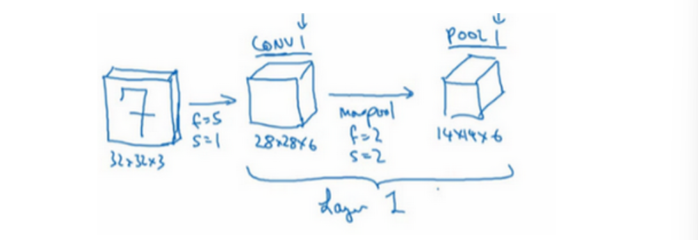

输入是32×32×3的矩阵，假设第一层使用过滤器大小为5×5，步幅是1，**paddin**g是0，过滤器个数为6，那么输出为28×28×6，将这层标记为**CONV1**；现在开始构建池化层，最大池化使用的过滤器为2×2，步幅为2，表示层的高度和宽度会减少一半。因此，28×28变成了14×14，通道数量保持不变，所以最终输出为14×14×6，将该输出标记为**POOL1**。人们在计算神经网络有多少层时，通常只统计具有权重和参数的层。因为池化层没有权重和参数，只有一些超参数。这里，我们把**CONV1**和**POOL1**共同作为一个卷积，并标记为**Layer1**。

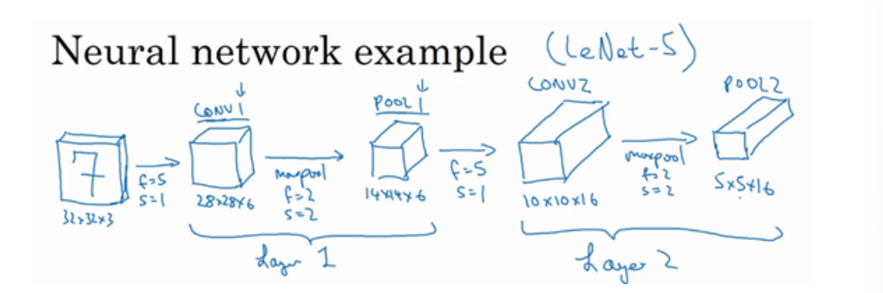

再为它构建一个卷积层，过滤器大小为5×5，步幅为1，这次我们用16个过滤器，最后输出一个10×10×16的矩阵，标记为**CONV2**；继续对10×10×16输入执行最大池化计算，最大池化的参数$f=2,s=2$，输入的高度和宽度会减半，结果为5×5×16，通道数和之前一样，标记为**POOL2**。这是一个卷积，即**Layer2**，因为它只有一个权重集和一个卷积层**CONV2**。

5×5×16矩阵包含400个元素，现在将**POOL2**平整化为一个大小为400的一维向量。我们可以把平整化结果想象成这样的一个神经元集合，然后利用这400个单元构建下一层。下一层含有120个单元，这就是我们第一个全连接层，标记为**FC3**。这400个单元与120个单元紧密相连，这就是全连接层。它很像我们在第一和第二门课中讲过的单神经网络层，这是一个标准的神经网络。它的权重矩阵为$W^{[3]}$，维度为120×400。这就是所谓的“全连接”，因为这400个单元与这120个单元的每一项连接，还有一个偏差参数。最后输出120个维度，因为有120个输出。

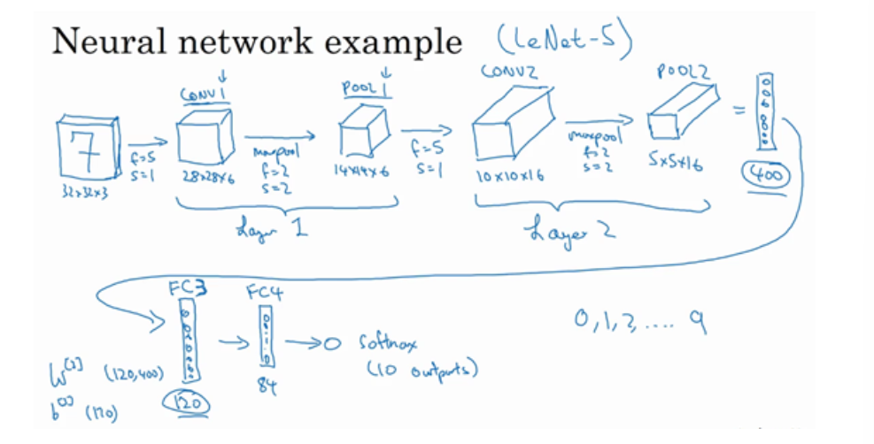

然后我们对这个120个单元再添加一个全连接层，这层更小，假设它含有84个单元，标记为**FC4**。

最后，用这84个单元填充一个**softmax**单元。如果我们想通过手写数字识别来识别手写0-9这10个数字，这个**softmax**就会有10个输出。

> 此例中的卷积神经网络很典型，看上去它有很多超参数，关于如何选定这些参数，常规做法是，尽量不要自己设置超参数，而是查看文献中别人采用了哪些超参数，选一个在别人任务中效果很好的架构，那么它也有可能适用于你自己的应用程序。

需要说明的是，随着神经网络深度的加深，高度和宽度通常都会减少，上面例子中从32×32到28×28，到14×14，到10×10，再到5×5。所以，随着层数增加，高度和宽度都会减小，而通道数量会增加，从3到6到16不断增加，然后得到一个全连接层。

> 在神经网络中，另一种常见模式就是一个或多个卷积后面跟随一个池化层，然后一个或多个卷积层后面再跟一个池化层，然后是几个全连接层，最后是一个**softmax**。这是神经网络的另一种常见模式。

总结一下，一个卷积神经网络包括卷积层、池化层和全连接层，许多计算机视觉研究正在探索如何把这些基本模块整合起来，构建高效的神经网络，整合这些基本模块确实需要深入的理解。根据经验，找到整合基本构造模块最好方法就是大量阅读别人的案例。

# 深度卷积网络：实例探究

## 经典网络

### LeNet-5

首先看看**LeNet-5**的网络结构，假设你有一张32×32×1的图片，**LeNet-5**可以识别图中的手写数字，比如像这样手写数字7。**LeNet-5**是针对灰度图片训练的，所以图片的大小只有32×32×1。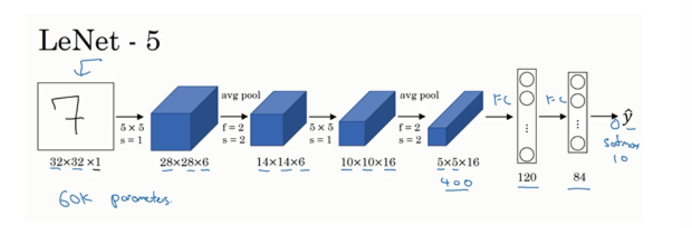

使用了6个过滤器，步幅为1，**padding**为0，输出结果为28×28×6，图像尺寸从32×32缩小到28×28。然后进行池化操作（那个年代更喜欢使用平均池化），过滤器的宽度为2，步幅为2，图像的尺寸，高度和宽度都缩小了2倍，输出结果是一个14×14×6的图像。

接下来是卷积层，用一组16个5×5的过滤器，新的输出结果有16个通道。**LeNet-5**的论文是在1998年撰写的，当时人们并不使用**padding**，或者总是使用**valid**卷积，这就是为什么每进行一次卷积，图像的高度和宽度都会缩小，所以这个图像从14到14缩小到了10×10。然后又是池化层，高度和宽度再缩小一半，输出一个5×5×16的图像。将所有数字相乘，乘积是400。

下一层是全连接层，在全连接层中，有400个节点，每个节点有120个神经元，这里已经有了一个全连接层。但有时还会从这400个节点中抽取一部分节点构建另一个全连接层，就像这样，有2个全连接层。

最后一步就是利用这84个特征得到最后的输出，我们还可以在这里再加一个节点用来预测$\hat{y}$的值，$\hat{y}$有10个可能的值，对应识别0-9这10个数字。在现在的版本中则使用**softmax**函数输出十种分类结果，而在当时，**LeNet-5**网络在输出层使用了另外一种，现在已经很少用到的分类器。

从左往右看，随着网络越来越深，图像的高度和宽度在缩小，从最初的32×32缩小到28×28，再到14×14、10×10，最后只有5×5。与此同时，随着网络层次的加深，通道数量一直在增加，从1增加到6个，再到16个。

> 这个神经网络中还有一种模式至今仍然经常用到，就是一个或多个卷积层后面跟着一个池化层，然后又是若干个卷积层再接一个池化层，然后是全连接层，最后是输出，这种排列方式很常用。

### AlexNet

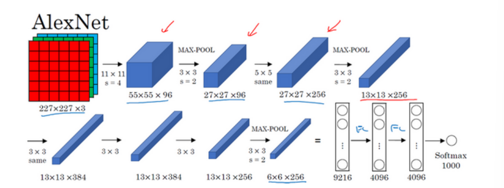

**AlexNet**首先用一张227×227×3的图片作为输入，第一层使用96个11×11的过滤器，步幅为4，由于步幅是4，因此尺寸缩小到55×55，缩小了4倍左右。然后用一个3×3的过滤器构建最大池化层，$f=3$，步幅$s$为2，卷积层尺寸缩小为27×27×96。接着再执行一个5×5的卷积，**padding**之后，输出是27×27×276。然后再次进行最大池化，尺寸缩小到13×13。再执行一次**same**卷积，相同的**padding**，得到的结果是13×13×384，384个过滤器。再做一次**same**卷积，就像这样。再做一次同样的操作，最后再进行一次最大池化，尺寸缩小到6×6×256。6×6×256等于9216，将其展开为9216个单元，然后是一些全连接层。最后使用**softmax**函数输出识别的结果，看它究竟是1000个可能的对象中的哪一个。

前面讲到的**LeNet**或**LeNet-5**大约有6万个参数，而**AlexNet**包含约6000万个参数。当用于训练图像和数据集时，**AlexNet**能够处理非常相似的基本构造模块，这些模块往往包含着大量的隐藏单元或数据，这一点**AlexNet**表现出色。**AlexNet**比**LeNet**表现更为出色的另一个原因是它使用了**ReLu**激活函数。

### VGG-16

这是一种只需要专注于构建卷积层的简单网络。首先用3×3，步幅为1的过滤器构建卷积层，**padding**参数为**same**卷积中的参数。然后用一个2×2，步幅为2的过滤器构建最大池化层。因此**VGG**网络的一大优点是它确实简化了神经网络结构。

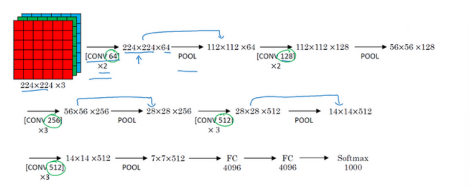

假设要识别这个图像，在最开始的两层用64个3×3的过滤器对输入图像进行卷积，输出结果是224×224×64，因为使用了**same**卷积，通道数量也一样。

接下来创建一个池化层，池化层将输入图像进行压缩，从224×224×64缩小到112×112×64；然后又是若干个卷积层，使用128个过滤器，以及一些**same**卷积，输出结果112×112×128；然后进行池化，可以推导出池化后的结果是这样（56×56×128）；接着再用256个相同的过滤器进行三次卷积操作，然后再池化，然后再卷积三次，再池化。如此进行几轮操作后，将最后得到的7×7×512的特征图进行全连接操作，得到4096个单元，然后进行**softmax**激活，输出从1000个对象中识别的结果。

**VGG-16**的这个数字16，就是指在这个网络中包含16个卷积层和全连接层。确实是个很大的网络，总共包含约1.38亿个参数，即便以现在的标准来看都算是非常大的网络。但**VGG-16**的结构并不复杂，这点非常吸引人，而且这种网络结构很规整，都是几个卷积层后面跟着可以压缩图像大小的池化层，池化层缩小图像的高度和宽度。同时，卷积层的过滤器数量变化存在一定的规律，由64翻倍变成128，再到256和512。

## 残差网络 ResNet

非常非常深的神经网络是很难训练的，因为存在梯度消失和梯度爆炸问题。跳跃连接（**Skip connection**）可以从某一层网络层获取激活，然后迅速反馈给另外一层，甚至是神经网络的更深层。我们可以利用跳跃连接构建能够训练深度网络的**ResNets**（Residual Networks），有时深度能够超过100层。

**ResNets**是由残差块（**Residual block**）构建的，首先解释一下什么是残差块。

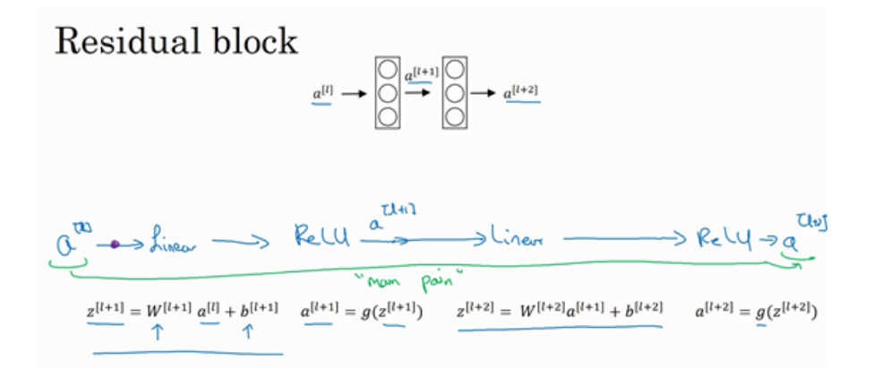

这是一个两层神经网络，在$l$层进行激活得到$a^{[l+1]}$，再次进行激活，两层之后得到$a^{[l+2]}$。计算过程是，首先进行线性激活，通过$a^{[l]}$算出$z^{[l+1]}=W^{[l+1]}a^{[l]}+b^{[l+1]}$，然后通过**ReLU**非线性激活函数得到$a^{[l+1]}=g(z^{[l+1]})$；接着再次进行线性激活，$z^{[l+2]}=W^{[l+2]}a^{[l+1]}+b^{[l+2]}$，最后根据这个等式再次进行**ReLu**非线性激活$a^{[l+2]}=g(z^{[l+2]})$。换句话说，信息流从$a^{[l]}$到$a^{[l+2]}$需要经过以上所有步骤，即这组网络层的主路径。

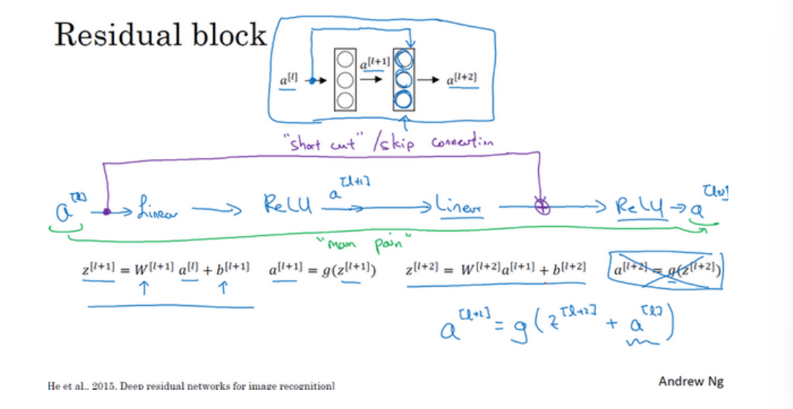

在残差网络中有一点变化，我们将$a^{[l]}$直接拷贝到神经网络的深层，在**ReLU**非线性激活函数中加上$a^{[l]}$，这是一条捷径，意味着$a^{[l]}$的信息直接到达神经网络的深层，不再沿着主路径传递。因此，最后这个等式（$a^{[l+2]}=g(z^{[l+2]})$）去掉了，取而代之的是另一个**ReLU**非线性函数：$a^{[l+2]}=g(z^{[l+2]}+a^{[l]})$，也就是加上的这个$a^{[l]}$产生了一个残差块。

> 在上面这个图中，我们也可以画一条捷径，直达第二层。实际上这条捷径是在进行**ReLU**非线性激活函数之前加上的，而这里的每一个节点都执行了线性函数和**ReLU**激活函数。所以$a^{[l]}$插入的时机是在线性激活之后，**ReLU**激活之前。除了捷径，你还会听到另一个术语“跳跃连接”，就是指$a^{[l]}$跳过一层或者好几层，从而将信息传递到神经网络的更深层。

构建一个**ResNet**网络就是通过将很多这样的残差块堆积在一起，形成一个很深神经网络，下面我们来看看这个网络。

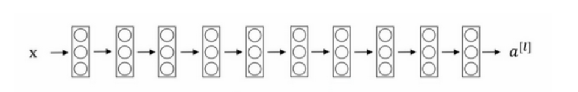

这并不是一个残差网络，而是一个普通网络（**Plain network**），这个术语来自**ResNet**论文。把它变成**ResNet**的方法是加上所有跳跃连接，正如刚刚讲的，每两层增加一个捷径，构成一个残差块。如图所示，5个残差块连接在一起构成一个残差网络。

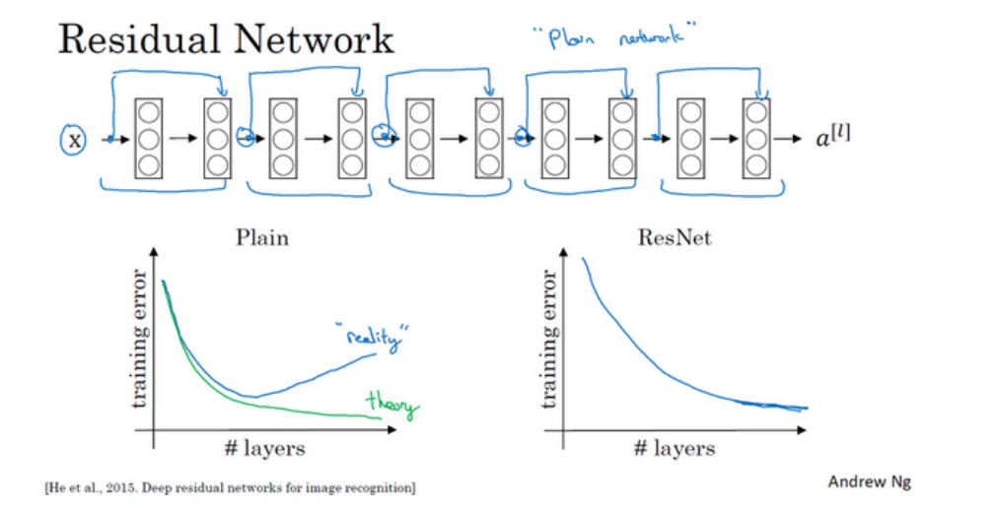

实际上，如果没有残差网络，对于一个普通网络来说，深度越深意味着用优化算法越难训练。实际上，随着网络深度的加深，训练错误会越来越多，左图说明了随着网络深度的加深，训练错误会先减少，然后增多。

但有了**ResNets**就不一样了，即使网络再深，训练的表现却不错，比如说训练误差减少，就算是训练深达100层的网络也不例外。这种方式确实有助于解决梯度消失和梯度爆炸问题，让我们在训练更深网络的同时，又能保证良好的性能。也许从另外一个角度来看，随着网络越来深，网络连接会变得臃肿，但是**ResNet**确实在训练深度网络方面非常有效。

##  Inception网络

构建卷积层时，你要决定过滤器的大小究竟是1×1，3×3还是5×5，或者要不要添加池化层。而**Inception**网络的作用就是代替你来决定，虽然网络架构因此变得更加复杂，但网络表现却非常好。

例如，这是你28×28×192维度的输入层，**Inception**网络或**Inception**层的作用就是代替人工来确定卷积层中的过滤器类型，或者确定是否需要创建卷积层或池化层，我们演示一下。

如果使用1×1卷积，输出结果会是28×28×#（某个值），假设输出为28×28×64，并且这里只有一个层。

如果使用3×3的过滤器，那么输出是28×28×128。然后我们把第二个值堆积到第一个值上，为了匹配维度，我们应用**same**卷积，输出维度依然是28×28，和输入维度相同，即高度和宽度相同。

或许你会说，我希望提升网络的表现，用5×5过滤器或许会更好，我们不妨试一下，输出变成28×28×32，我们再次使用**same**卷积，保持维度不变。

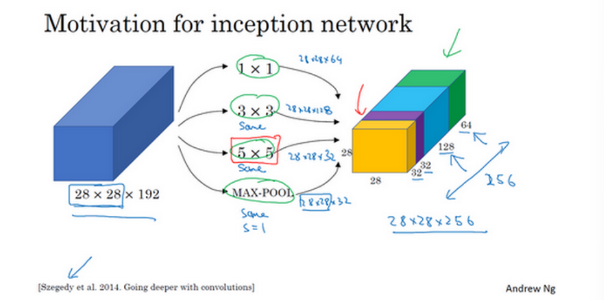

或许你不想要卷积层，那就用池化操作，得到一些不同的输出结果，我们把它也堆积起来，这里的池化输出是28×28×32。为了匹配所有维度，我们需要对最大池化使用**padding**，它是一种特殊的池化形式，因为如果输入的高度和宽度为28×28，则输出的相应维度也是28×28。然后再进行池化，**padding**不变，步幅为1。

**Inception**模块的输入为28×28×192，输出为28×28×256，这就是**Inception**网络的核心内容。基本思想是**Inception**网络不需要人为决定使用哪个过滤器或者是否需要池化，而是由网络自行确定这些参数，你可以给网络添加这些参数的所有可能值，然后把这些输出连接起来，让网络自己学习它需要什么样的参数，采用哪些过滤器组合。

考虑**Inception**层的计算成本，下面来计算这个5×5过滤器在该模块中的计算成本。

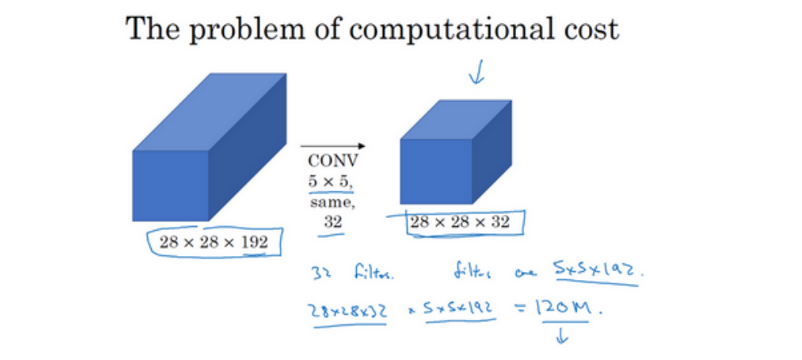

这是一个28×28×192的输入块，执行一个5×5卷积，它有32个过滤器，输出为28×28×32（上图中的紫色块）。因为输出有32个通道（过滤器数量），每个过滤器大小为5×5×192，输出大小为28×28×32，对于输出中的每个数字来说，你都需要执行5×5×192次乘法运算，所以乘法运算的总次数为每个输出值所需要执行的乘法运算次数（5×5×192）乘以输出值个数（28×28×32），把这些数相乘结果等于1.2亿(120422400)。这个计算成本是相当高的。

另一种架构是，通过使用1×1卷积来构建瓶颈层，从而大大降低计算成本，下面来看看如何实现。

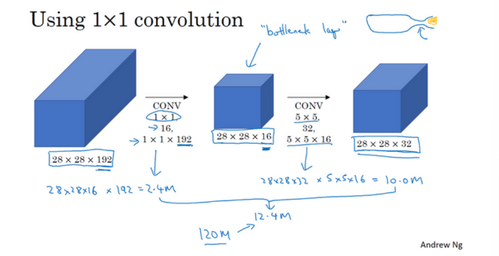

对于输入层，使用1×1卷积把输入值从192个通道减少到16个通道。然后对这个较小层运行5×5卷积，得到最终输出。

> 有时候这被称为瓶颈层，瓶颈通常是某个对象最小的部分，假如你有这样一个玻璃瓶，这是瓶塞位置，瓶颈就是这个瓶子最小的部分。同理，瓶颈层也是网络中最小的部分，我们先缩小网络表示，然后再扩大它。

接下来我们看看这个计算成本，应用1×1卷积，过滤器个数为16，每个过滤器大小为1×1×192，这两个维度相匹配（输入通道数与过滤器通道数），28×28×16这个层的计算成本是，输出28×28×192中每个元素都做192次乘法，用1×1×192来表示，相乘结果约等于240万；第二个卷积层对每个输出值应用一个5×5×16维度的过滤器，计算结果为1000万。

所以所需要乘法运算的总次数是这两层的计算成本之和，也就是1204万，与5×5过滤器的方案中的值做比较，计算成本从1.2亿下降到了原来的十分之一，即1204万。

总结一下，如果你在构建神经网络层的时候，不想决定池化层是使用1×1，3×3还是5×5的过滤器，那么**Inception**模块就是最好的选择。我们可以应用各种类型的过滤器，只需要把输出连接起来。

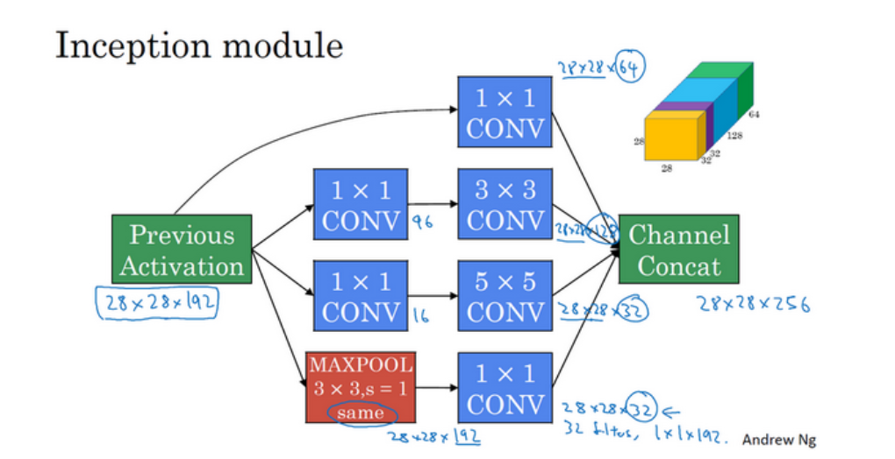

将这些方块全都连接起来。在这过程中，把得到的各个层的通道都加起来，最后得到一个28×28×256的输出。通道连接实际就是之前视频中看到过的，把所有方块连接在一起的操作。这就是一个**Inception**模块，而**Inception**网络所做的就是将这些模块都组合到一起。

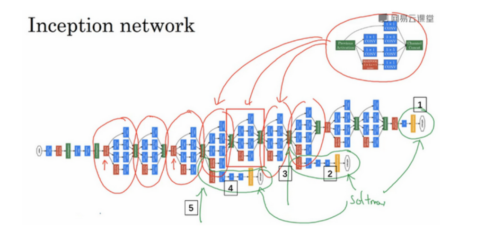

**Inception**网络只是很多这些你学过的模块在不同的位置重复组成的网络。在网络的最后几层，通常称为全连接层，在它之后是一个**softmax**层（编号1）来做出预测，这些分支（编号2）所做的就是通过隐藏层（编号3）来做出预测，所以这其实是一个**softmax**输出（编号2），这（编号1）也是。这是另一条分支（编号4），它也包含了一个隐藏层，通过一些全连接层，然后有一个**softmax**来预测，输出结果的标签。

应该把它看做**Inception**网络的一个细节，它确保了即便是隐藏单元和中间层（编号5）也参与了特征计算，它们也能预测图片的分类。它在**Inception**网络中，起到一种调整的效果，并且能防止网络发生过拟合。

最后总结一下，如果你理解了**Inception**模块，你就能理解**Inception**网络，无非是很多个**Inception**模块一环接一环，最后组成了网络。

## 迁移学习

事实上，网上的公开数据集非常庞大，并且你下载的其他人已经训练好几周的权重，已经从数据中学习了很多了，你会发现，对于很多计算机视觉的应用，如果你下载其他人的开源的权重，并用作你问题的初始化，你会做的更好。在所有不同学科中，在所有深度学习不同的应用中，我认为计算机视觉是一个经常用到迁移学习的领域，除非你有非常非常大的数据集，你可以从头开始训练所有的东西。总之，迁移学习是非常值得你考虑的，除非你有一个极其大的数据集和非常大的计算量预算来从头训练你的网络。

## 数据增强（Data augmentation）

在计算机视觉方面，计算机视觉的主要问题是没有办法得到充足的数据。对大多数机器学习应用，这不是问题，但是对计算机视觉，数据就远远不够。

数据扩充方法有镜像对称、随机裁剪、彩色转换等。

常用的实现数据扩充的方法是使用一个线程或者是多线程，这些可以用来加载数据，实现变形失真，然后传给其他的线程或者其他进程，来训练这个（编号2）和这个（编号1），可以并行实现。

**参考文献：**

- Kaiming He, Xiangyu Zhang, Shaoqing Ren, Jian Sun - [Deep Residual Learning for Image Recognition (2015)](https://arxiv.org/abs/1512.03385)
- Francois Chollet's github repository: https://github.com/fchollet/deep-learning-models/blob/master/resnet50.py
- **ResNets**实现的**GitHub**地址https://github.com/KaimingHe/deep-residual-networks

http://knowyourmeme.com/memes/we-need-to-go-deeper

# 目标检测

## 目标定位与特征点检测

### 目标定位

图片分类任务我们已经熟悉了，就是算法遍历图片，判断其中的对象是不是汽车，这就是图片分类。而定位分类问题是指，我们不仅要用算法判断图片中是不是一辆汽车，还要在图片中标记出它的位置，用边框或红色方框把汽车圈起来，这就是定位分类问题。

例如，输入一张图片到多层卷积神经网络。它会输出一个特征向量，并反馈给**softmax**单元来预测图片类型。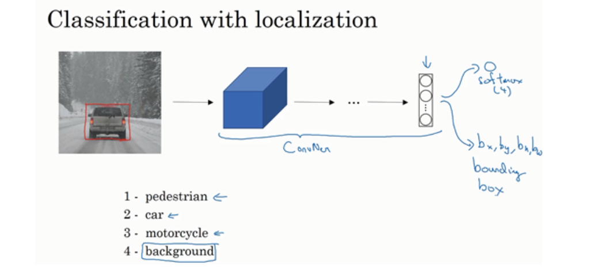

如果你正在构建汽车自动驾驶系统，那么对象可能包括以下几类：行人、汽车、摩托车和背景，这四个分类就是softmax函数可能输出的结果。这就是标准的分类过程，如果你还想定位图片中汽车的位置，该怎么做呢？我们可以让神经网络多输出几个单元，输出一个边界框。具体说就是让神经网络再多输出4个数字，标记为$b_x$,$b_y$,$b_h$和$b_w$，这四个数字是被检测对象的边界框的参数化表示。

我们约定，图片左上角的坐标为$(0,0)$，右下角标记为$(1,1)$。要确定边界框的具体位置，需要指定红色方框的中心点$(b_x,b_y)$，边界框的高度为$b_h$，宽度为$b_w$。采用监督学习算法，输出一个分类标签以及这四个参数值，从而给出检测对象的边框位置。

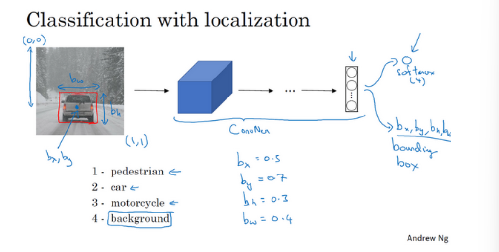

此例中，$b_x$的理想值是0.5，因为它表示汽车位于图片水平方向的中间位置；$b_y$大概是0.7，表示汽车位于距离图片底部$\frac{3}{10}$的位置；$b_h$约为0.3，因为红色方框的高度是图片高度的0.3倍；$b_w$约为0.4，方框的宽度是图片宽度的0.4倍。

监督学习的目标标签$y$的定义如下：$y=\begin{bmatrix}p_c\\ b_x\\ b_y\\ b_h\\ b_w\\ c_1\\ c_2\\ c_3 \end{bmatrix}$，它是一个向量，$p_c$表示是否含有对象，如果对象属于前三类（行人、汽车、摩托车），则$p_c=1$，同时输出$c_1、c_2$和$c_3$，表示该对象属于3类中的哪一类；如果是背景，则图片中没有要检测的对象，则$p_c=0$。如果检测到对象，就输出被检测对象的边界框参数$b_x、b_y、b_h$和$b_w$。

### 特征点检测

神经网络可以通过输出图片上特征点的坐标来实现对目标特征的识别。假设你正在构建一个人脸识别应用，你希望算法可以给出人像眼角的具体位置$(x,y)$，你可以让神经网络的最后一层多输出两个数字$l_x$和$l_y$，作为眼角的坐标值。除此之外，你也可以输出多个特征点。

具体做法是，准备一个卷积网络和一些特征集，将人脸输入卷积网络，输出1（有人脸）或0（无人脸），然后输出$(l_{1x},l_{1y}),(l_{2x},l_{2y}).....(l_{64x},l_{64y})$。这里我用$l$表示一个特征，共有64个特征，则有64×2+1=129个输出单元，由此实现对图片的人脸检测和定位。检测脸部特征也是计算机图形效果的一个关键构造模块，比如实现脸部扭曲，头戴皇冠等等。当然为了构建这样的网络，你需要准备一个标签训练集，也就是图片$x$和标签$y$的集合，这些点都是人为辛苦标注的。

## 目标检测

下面将学习如何通过卷积网络进行对象检测，采用的是基于滑动窗口的目标检测算法。

如果你想构建一个汽车检测算法，首先要创建一个标签训练集，也就是输入$x$和输出$y$。

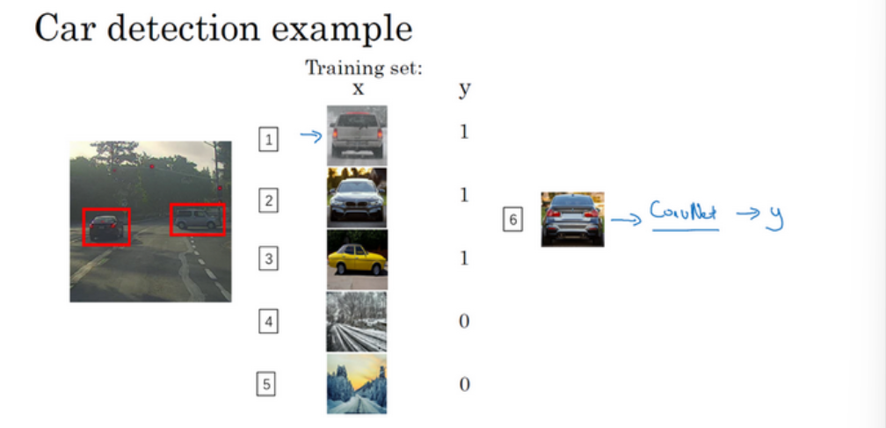

图片1、2、3是汽车图片，图片4、5没有汽车。出于对这个训练集的期望，一开始可以使用适当剪切的图片，就是整张图片几乎都被汽车占据，你可以照张照片，然后剪切，剪掉汽车以外的部分，使汽车居于中间位置，并基本占据整张图片（如图片6）。有了这个标签训练集，你就可以开始训练卷积网络了，卷积网络输出$y$，0或1表示图片中有汽车或没有汽车。训练完这个卷积网络，就可以用它来实现滑动窗口目标检测，具体步骤如下。

假设这是一张测试图片，首先选定一个特定大小的窗口，比如图片左上方这个窗口，将这个红色小方块输入卷积神经网络，卷积网络开始进行预测，即判断红色方框内有没有汽车。滑动窗口目标检测算法接下来会继续处理第二个图像，即红色方框稍向右滑动之后的区域，并输入给卷积网络，因此输入给卷积网络的只有红色方框内的区域，再次运行卷积网络，然后处理第三个图像，依次重复操作，直到这个窗口滑过图像的每一个角落。

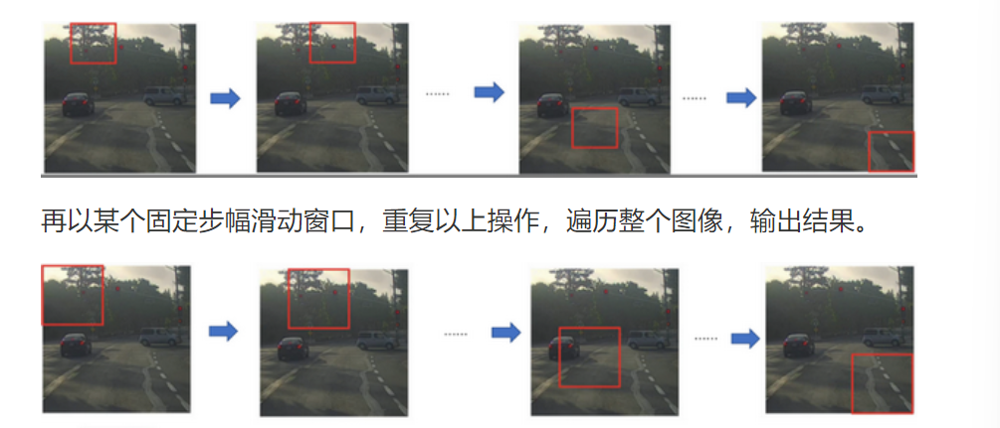

如果这样做，不论汽车在图片的什么位置，总有一个窗口可以检测到它。

滑动窗口目标检测算法也有很明显的缺点，就是计算成本，因为你在图片中剪切出太多小方块，卷积网络要一个个地处理。如果你选用的步幅很大，显然会减少输入卷积网络的窗口个数，但是粗糙间隔尺寸可能会影响性能。反之，如果采用小粒度或小步幅，传递给卷积网络的小窗口会特别多，这意味着超高的计算成本。

## 滑动窗口的卷积实现

这一节我们学习如何在卷积层上应用滑动窗口目标检测算法。

首先，把神经网络的全连接层转化为卷积层。假设目标检测算法输入一个14×14×3的图像，有16个大小为5×5的过滤器，处理之后映射为10×10×16。然后通过参数为2×2的最大池化操作，图像减小到5×5×16。然后添加一个连接400个单元的全连接层，接着再添加一个全连接层，最后通过**softmax**单元输出$y$。$y$中有4个数字，它们分别对应**softmax**单元所输出的4个分类出现的概率。这4个分类可以是行人、汽车、摩托车和背景或其它对象。

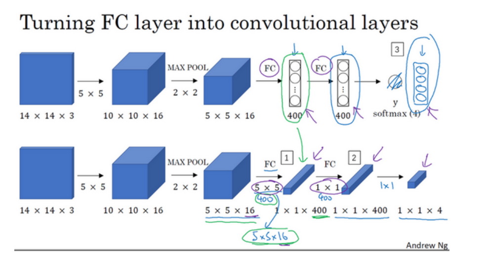

现在把这些全连接层转化为卷积层，画一个这样的卷积网络，它的前几层和之前的一样，而对于这个全连接层，这里用5×5的过滤器来实现，数量是400个（编号1所示），输入图像大小为5×5×16，用5×5的过滤器对它进行卷积操作，过滤器实际上是5×5×16，因为在卷积过程中，过滤器会遍历这16个通道，所以这两处的通道数量必须保持一致，输出结果为1×1。假设应用400个这样的5×5×16过滤器，输出维度就是1×1×400，我们不再把它看作一个含有400个节点的集合，而是一个1×1×400的输出层。从数学角度看，它和全连接层是一样的，因为这400个节点中每个节点都有一个5×5×16维度的过滤器，所以每个值都是上一层这些5×5×16激活值经过某个任意线性函数的输出结果。

我们再添加另外一个卷积层（编号2所示），这里用的是1×1卷积，假设有400个1×1的过滤器，在这400个过滤器的作用下，下一层的维度是1×1×400，它其实就是上个网络中的这一全连接层。最后经由1×1过滤器的处理，得到一个**softmax**激活值，通过卷积网络，我们最终得到这个1×1×4的输出层，而不是这4个数字（编号3所示）。

以上就是用卷积层代替全连接层的过程，结果这几个单元集变成了1×1×400和1×1×4的维度。下面再看看如何通过卷积实现滑动窗口对象检测算法。

假设输入给卷积网络的图片大小是14×14×3，测试集图片是16×16×3，现在给这个输入图片加上黄色条块，在最初的滑动窗口算法中，你会把这片蓝色区域输入卷积网络（红色笔标记）生成0或1分类。接着滑动窗口，步幅为2个像素，向右滑动2个像素，将这个绿框区域输入给卷积网络，运行整个卷积网络，得到另外一个标签0或1。继续将这个橘色区域输入给卷积网络，卷积后得到另一个标签，最后对右下方的紫色区域进行最后一次卷积操作。我们在这个16×16×3的小图像上滑动窗口，卷积网络运行了4次，于是输出了4个标签。

最终，在输出层这4个子方块中，蓝色的是图像左上部分14×14的输出（红色箭头标识），右上角方块是图像右上部分（绿色箭头标识）的对应输出，左下角方块是输入层左下角（橘色箭头标识），同样，右下角这个方块是卷积网络处理输入层右下角14×14区域(紫色箭头标识)的结果。所以该卷积操作的原理是我们不需要把输入图像分割成四个子集，分别执行前向传播，而是把它们作为一张图片输入给卷积网络进行计算，其中的公共区域可以共享很多计算。

下面我们再看一个更大的图片样本，假如对一个28×28×3的图片应用滑动窗口操作，如果以同样的方式运行前向传播，最后得到8×8×4的结果。跟上一个范例一样，以14×14区域滑动窗口，首先在这个区域应用滑动窗口，其结果对应输出层的左上角部分。接着以大小为2的步幅不断地向右移动窗口，直到第8个单元格，得到输出层的第一行。然后向图片下方移动，最终输出这个8×8×4的结果。因为最大池化参数为2，相当于以大小为2的步幅在原始图片上应用神经网络。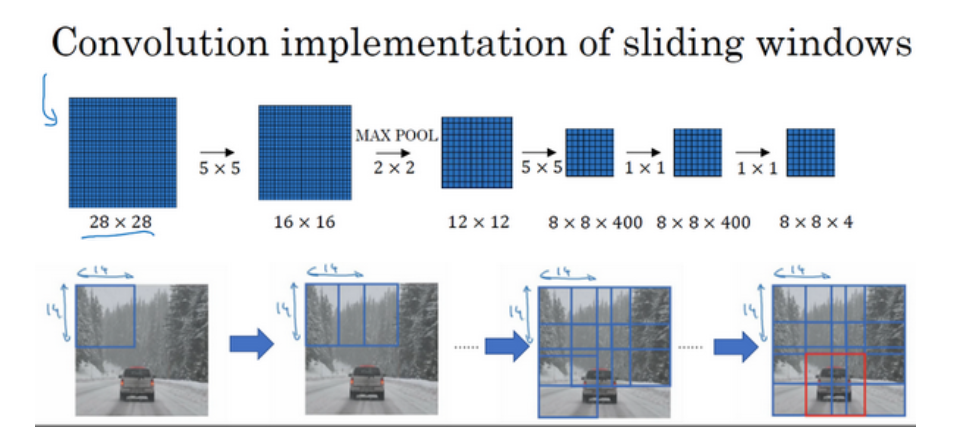

总结一下滑动窗口的实现过程，在图片上剪切出一块区域，假设它的大小是14×14，把它输入到卷积网络。继续输入下一块区域，大小同样是14×14，重复操作，直到某个区域识别到汽车。

## Bounding Box预测

滑动窗口法的卷积实现虽然效率更高，但不能输出最精准的边界框。

其中一个能得到更精准边界框的算法是**YOLO**算法，**YOLO**(**You only look once**)意思是你只看一次。

比如输入图像是100×100的，在图像上放一个网格，为了便于介绍这里用3×3的网格。基本思路是，采用图像分类和定位算法，逐一应用在图像的9个格子中。

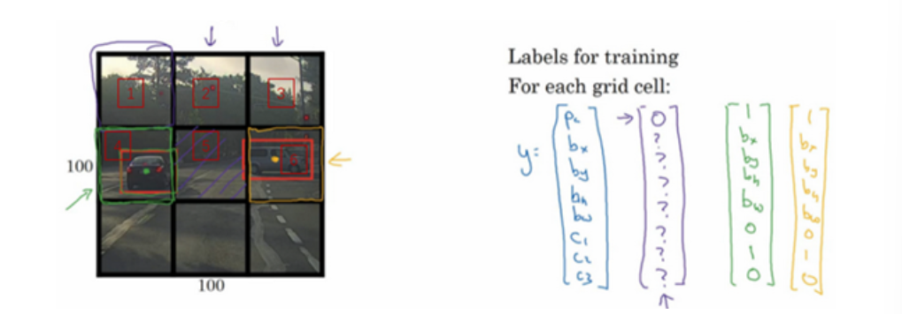

这9个格子中的每一个都有一个标签$y=\begin{bmatrix}p_c\\ b_x\\ b_y\\ b_h\\ b_w\\ c_1\\ c_2\\ c_3 \end{bmatrix}$，$p_c$等于0或1取决于这个绿色格子中是否有图像。然后$b_x$、$b_y$、$b_h$和$b_w$作用就是，如果那个格子里有对象，那么就给出边界框坐标。然后$c_1$、$c_2$和$c_3$就是你想要识别的三个类别（行人、汽车和摩托车）。这张图里有9个格子，所以对于每个格子都有这么一个向量。

这张图片里有两个对象（汽车），**YOLO**算法做的就是，取两个对象的中点，然后将这个对象分配给包含对象中点的格子。所以左边的汽车就分配到这个格子上（编号4），然后这辆**Condor**（车型：神鹰）中点在这里，分配给这个格子（编号6）。所以即使中心格子（编号5）同时有两辆车的一部分，我们就假装中心格子没有任何我们感兴趣的对象。所以编号4和编号6的格子的向量应该是$y=\begin{bmatrix}1\\b_x\\b_y\\b_h\\b_w\\0\\1\\0\end{bmatrix}$。所以对于这里9个格子中任何一个，你都会得到一个8维输出向量，因为这里是3×3的网格，即有9个格子，总的输出尺寸是3×3×8，所以目标输出是3×3×8。

重申一下，把对象分配到一个格子的过程是，你观察对象的中点，然后将这个对象分配到其中点所在的格子，所以即使对象可以横跨多个格子，也只会被分配到9个格子其中之一，就是3×3网络的其中一个格子，或者19×19网络的其中一个格子。在19×19网格中，两个对象的中点处于同一个格子的概率就会更低。

> 事实上**YOLO**算法有一个好处，也是它受欢迎的原因，因为这是一个卷积实现，实际上它的运行速度非常快，可以达到实时识别。

其中有个小细节，就是怎么指定边界框呢？也就是如何编码$b_x、b_y、b_h$和$b_w$，下面来看看。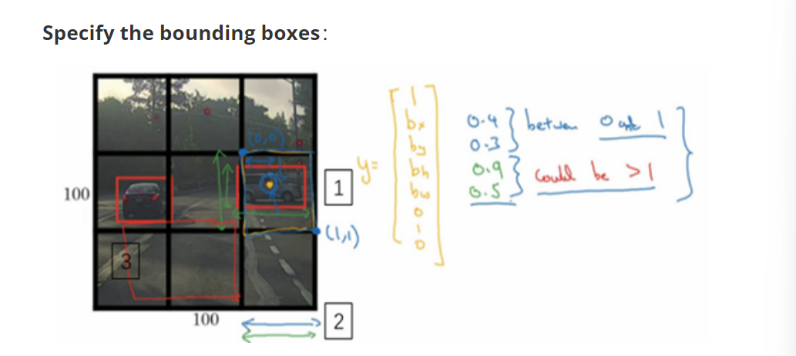

在**YOLO**算法中，对于这个方框（编号1所示），我们约定左上这个点是$(0,0)$，然后右下这个点是$(1,1)$，要指定橙色中点的位置，$b_x$大概是0.4，因为它的位置大概是水平长度的0.4，然后$b_y$大概是0.3，然后边界框的高度用格子总体宽度的比例表示，所以这个红框的宽度可能是蓝线（编号2所示的蓝线）的90%，所以$b_h$是0.9，它的高度也许是格子总体高度的一半，这样的话$b_w$就是0.5。换句话说，$b_x、b_y、b_h$和$b_w$单位是相对于格子尺寸的比例，所以$b_x$和$b_y$必须在0和1之间，因为从定义上看，橙色点位于对象分配到格子的范围内，如果它不在0和1之间，如果它在方块外，那么这个对象就应该分配到另一个格子上。这个值（$b_h$和$b_w$）可能会大于1，特别是如果有一辆汽车的边界框是这样的（编号3红框所示），那么边界框的宽度和高度有可能大于1。

参考文献：

**Redmon, Joseph, et al. "You Only Look Once: Unified, Real-Time Object Detection." (2015):779-788.**

## 交并比

并交比函数可以用来评价对象检测算法。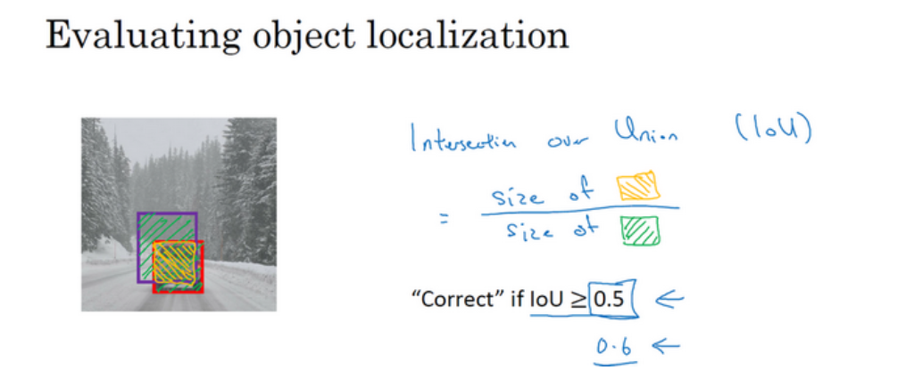

在对象检测任务中，你希望能够同时定位对象，如果实际算法给出这个紫色的边界框，那么这个结果是好还是坏？所以交并比（**loU**）函数做的是计算两个边界框交集和并集之比。两个边界框的并集是这个区域，就是属于包含两个边界框区域（绿色阴影表示区域），而交集就是这个比较小的区域（橙色阴影表示区域），那么交并比就是交集的大小，这个橙色阴影面积，然后除以绿色阴影的并集面积。

一般约定，在计算机检测任务中，如果$loU \geq 0.5$，就说检测正确，如果预测器和实际边界框完美重叠，**loU**就是1，因为交集就等于并集。一般约定，0.5是阈值，用来判断预测的边界框是否正确。但如果你希望更严格一点，你可以将**loU**定得更高，比如说大于0.6或者更大的数字，但**loU**越高，边界框越精确。

## 非极大值抑制

之前学到的目标检测的一个问题是，算法可能对同一个对象做出多次检测，而非极大值抑制这个方法可以确保你的算法对每个对象只检测一次，我们讲一个例子。

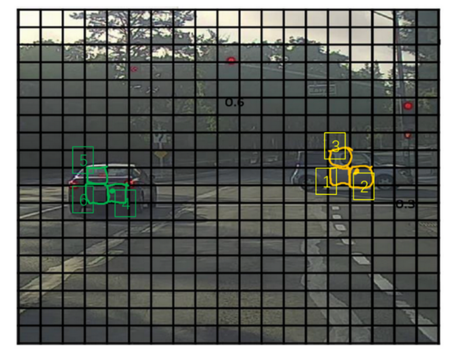

假设你需要在这张图片里检测行人和汽车，你可能会在上面放个19×19网格，理论上这辆车只有一个中点，所以它应该只被分配到一个格子里，左边的车子也只有一个中点，所以理论上应该只有一个格子做出有车的预测。实践中当你运行对象分类和定位算法时，对于每个格子都运行一次，所以这个格子（编号1）可能会认为这辆车中点应该在格子内部，这几个格子（编号2、3）也会这么认为。对于左边的车子也一样，所以不仅仅是这个格子，如果这是你们以前见过的图像，不仅这个格（编号4）子会认为它里面有车，也许这个格子（编号5）和这个格子（编号6）也会，也许其他格子也会这么认为，觉得它们格子内有车。

因为你要在361个格子上都运行一次图像检测和定位算法，那么可能很多格子都会举手说我这个格子里有车的概率很高，而不是361个格子中仅有两个格子会报告它们检测出一个对象。所以当你运行算法的时候，最后可能会对同一个对象做出多次检测，所以非极大值抑制做的就是清理这些检测结果。这样一辆车只检测一次，而不是每辆车都触发多次检测。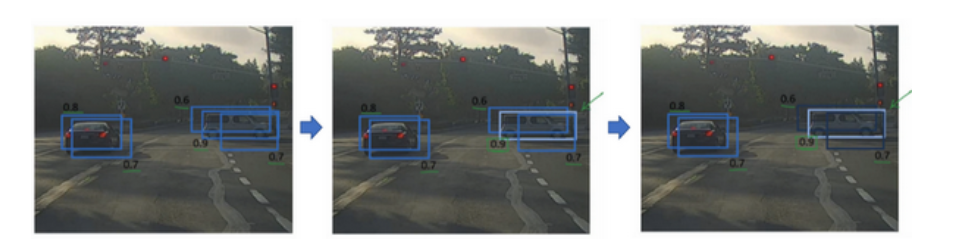

具体上，这个算法做的是，首先看概率$p_c$最大的那个，这个例子（右边车辆）中是0.9，然后就说这是最可靠的检测，所以我们就用高亮标记，就说我这里找到了一辆车。这么做之后，非极大值抑制就会逐一审视剩下的矩形，所有和这个最大的边框有很高交并比，高度重叠的其他边界框，那么这些输出就会被抑制。所以这两个矩形分别是0.6和0.7，这两个矩形和淡蓝色矩形重叠程度很高，所以会被抑制，变暗，表示它们被抑制了。

接下来，逐一审视剩下的矩形，找出概率$p_c$最高的一个，在这种情况下是0.8，我们就认为这里检测出一辆车（左边车辆），然后非极大值抑制算法就会去掉其他**loU**值很高的矩形。所以现在每个矩形都会被高亮显示或者变暗，如果你直接抛弃变暗的矩形，那就剩下高亮显示的那些，这就是最后得到的两个预测结果。

下面来看看算法的细节，首先这个19×19网格上执行一下算法，会得到19×19×8的输出尺寸。

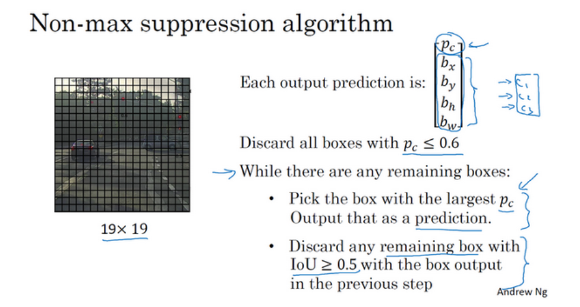

实现非极大值抑制要做的第一件事是去掉所有预测值$p_c$小于或等于某个阈值的结果，比如把$p_c \leq0.6$的边界框去掉。

除非算法认为这里存在对象的概率至少有0.6，否则这就抛弃了所有概率比较低的输出边界框。接下来选择概率$p_c$最高的边界框，把它输出成预测结果，这样你就可以确定输出做出有一辆车的预测。

## Anchor Boxes

到目前为止，对象检测中存在的一个问题是每个格子只能检测出一个对象，如果你想让一个格子检测出多个对象，那就可以使用**anchor box**这个概念。

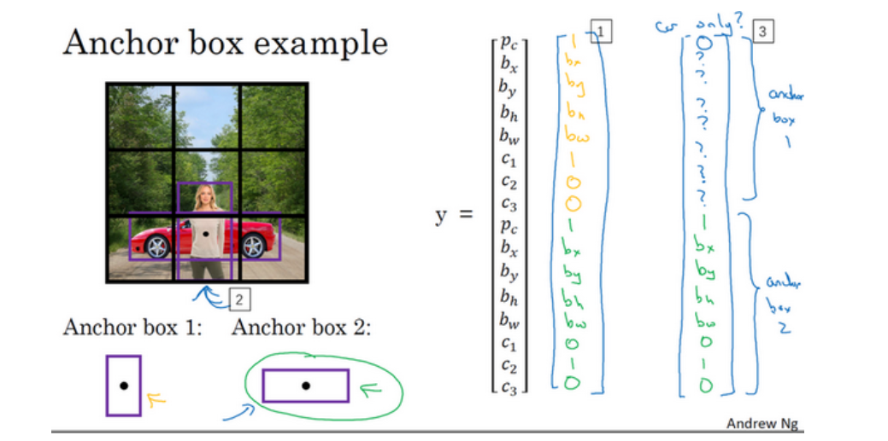

假设你有这样一张图片，对于这个例子，我们继续使用3×3网格，注意行人的中点和汽车的中点几乎在同一个地方，两者都落入到同一个格子中。**anchor box**的思路是，，预先定义两个不同形状的**anchor box**，或者**anchor box**形状，你要做的是把预测结果和这两个**anchor box**关联起来。一般来说，你可能会用更多的**anchor box**，可能要5个甚至更多，但对于这个视频，我们就用两个**anchor box**，这样介绍起来简单一些。

接下来定义类别标签，用的向量是$y=[p_c\quad b_x\quad b_y\quad b_h\quad b_w\quad c_1\quad c_2\quad c_3\quad p_c\quad b_x\quad b_y\quad b_h\quad b_w\quad c_1\quad c_2\quad c_3]^T$，前面是和**anchor box 1**关联的8个参数，后面的8个参数是和**anchor box 2**相关联。

## YOLO 算法

先看看如何构造你的训练集，假设你要训练一个算法去检测三种对象（行人、汽车和摩托车），你还需要显式指定完整的背景类别。这里有3个类别标签，如果你要用两个**anchor box**，那么输出$y$就是3×3×2×8，其中3×3表示3×3个网格，2是**anchor box**的数量，8是向量维度。你可以将它看成是3×3×2×8，或者3×3×16。要构造训练集，你需要遍历9个格子，然后构成对应的目标向量$y$。

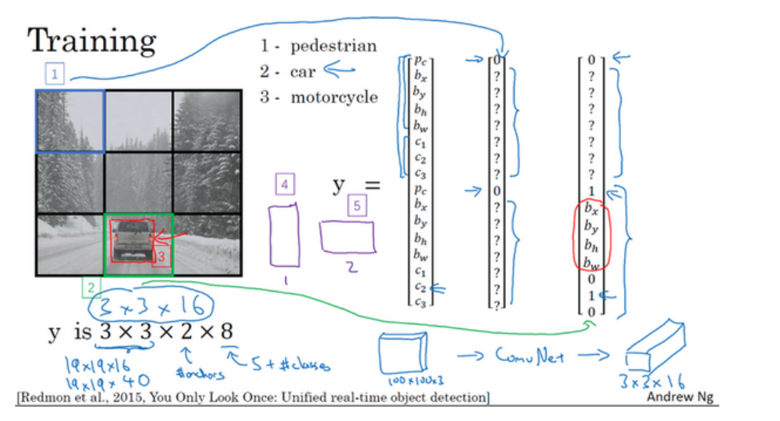

先看看第一个格子（编号1），里面没什么有价值的东西，行人、车子和摩托车，三个类别都没有出现在左上格子中，所以对应的目标$y$就是那样（如图中中间向量所示）。

假设你的训练集中，对于车子有这样一个边界框（编号3），则对于编号2的格子（绿色框），如果这是你的**anchor box**，这是**anchor box 1**（编号4），这是**anchor box 2**（编号5），然后红框和**anchor box 2**的交并比更高，那么车子就和向量的下半部分相关。要注意，这里和**anchor box 1**有关的$p_c$是0，剩下这些分量都是**don’t care-s**，然后你的第二个 $p_c=1$，然后你要用这些（$b_x,b_y,b_h,b_w$）来指定红边界框的位置，然后指定它的正确类别是2($c_1=0,c_2=1,c_3=0$)，对吧，这是一辆汽车。

所以你这样遍历9个格子，遍历3×3网格的所有位置，你会得到这样一个向量，得到一个16维向量，所以最终输出尺寸就是3×3×16。

最后要运行非极大值抑制，为了让内容更有趣一些，我们看看一张新的测试图像，这就是运行非极大值抑制的过程。如果你使用两个**anchor box**，那么对于9个格子中任何一个都会有两个预测的边界框，其中一个的概率$p_c$很低。但9个格子中，每个都有两个预测的边界框，比如说我们得到的边界框是是这样的，注意有一些边界框可以超出所在格子的高度和宽度（编号1所示）。接下来你抛弃概率很低的预测，去掉这些连神经网络都说，这里很可能什么都没有，所以你需要抛弃这些（编号2所示）。

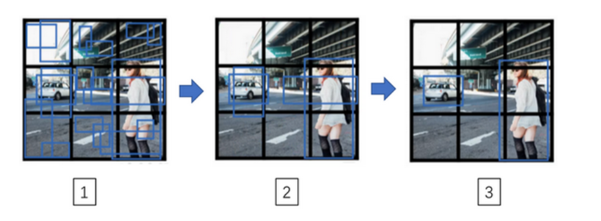

最后，如果你有三个对象检测类别，你希望检测行人，汽车和摩托车，那么你要做的是，对于每个类别单独运行非极大值抑制，处理预测结果所属类别的边界框，用非极大值抑制来处理行人类别，用非极大值抑制处理车子类别，然后对摩托车类别进行非极大值抑制，运行三次来得到最终的预测结果。所以算法的输出最好能够检测出图像里所有的车子，还有所有的行人（编号3所示）。

这就是**YOLO**对象检测算法，这实际上是最有效的对象检测算法之一，包含了整个计算机视觉对象检测领域文献中很多最精妙的思路。

**参考文献：**

- Joseph Redmon, Santosh Divvala, Ross Girshick, Ali Farhadi - [You Only Look Once: Unified, Real-Time Object Detection](https://arxiv.org/abs/1506.02640) (2015)
- Joseph Redmon, Ali Farhadi - [YOLO9000: Better, Faster, Stronger](https://arxiv.org/abs/1612.08242) (2016)
- Allan Zelener - [YAD2K: Yet Another Darknet 2 Keras](https://github.com/allanzelener/YAD2K)
- The official YOLO website (https://pjreddie.com/darknet/yolo/)

# 特殊应用：人脸识别和神经风格转换

## One-Shot学习

在人脸识别的相关文献中，人们经常提到人脸验证（**face verification**）和人脸识别（**face recognition**）。

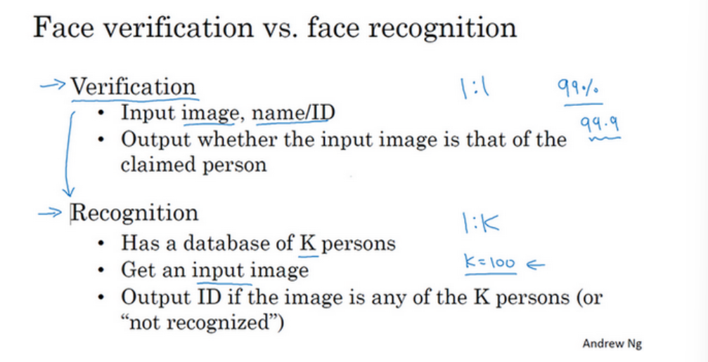

人脸验证问题：如果你有一张输入图片，以及某人的**ID**或者是名字，这个系统要做的是，验证输入图片是否是这个人。有时候也被称作1对1问题，只需要弄明白这个人是否和他声称的身份相符。

而人脸识别问题比人脸验证问题难很多（一对多问题），原因之一在于要解决“一次学习”（**one-shot learning problem**）问题。在一次学习问题中，只能通过一个样本进行学习，以能够认出同一个人。大多数人脸识别系统都需要解决这个问题，因为在你的数据库中每个雇员或者组员可能都只有一张照片。

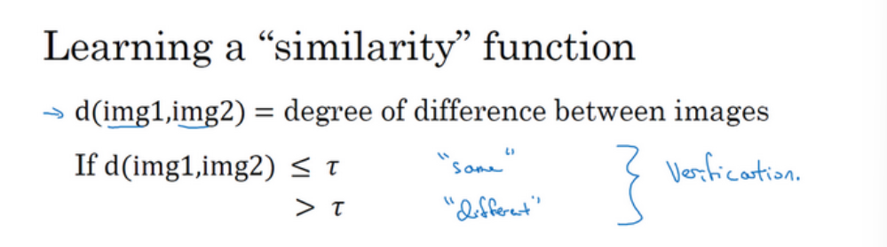

要让人脸识别能够做到一次学习，为了能有更好的效果，你现在要做的应该是学习**Similarity**函数。详细地说，你想要神经网络学习这样一个用$d$表示的函数，$d(img1,img2)=degree\quad of\quad difference\quad between\quad images$，它以两张图片作为输入，然后输出这两张图片的差异值。如果你放进同一个人的两张照片，你希望它能输出一个很小的值，如果放进两个长相差别很大的人的照片，它就输出一个很大的值。所以在识别过程中，如果这两张图片的差异值小于某个阈值$\tau$，它是一个超参数，那么这时就能预测这两张图片是同一个人，如果差异值大于$\tau$，就能预测这是不同的两个人，这就是解决人脸验证问题的一个可行办法。

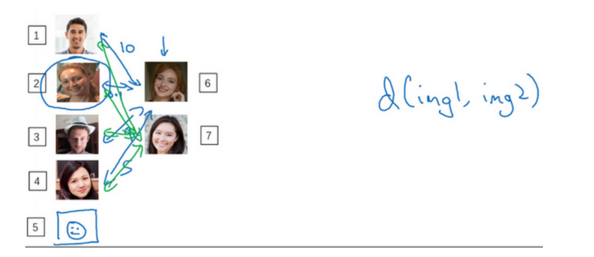

要将它应用于识别任务，你要做的是拿这张新图片（编号6），然后用函数$d$去比较这两张图片（编号1和编号6），这样可能会输出一个非常大的数字，在该例中，比如说这个数字是10。之后你再让它和数据库中第二张图（编号2）片比较，因为这两张照片是同一个人，所以我们希望会输出一个很小的数。然后你再用它与数据库中的其他图片（编号3、4）进行比较，通过这样的计算，最终你能够知道，这个人就是数据库中的2号。

对应的，如果某个人（编号7）不在你的数据库中，你通过函数$d$将他们的照片两两进行比较，最后我们希望$d$会对所有的比较都输出一个很大的值，这就证明这个人并不是数据库中4个人的其中一个。

要注意在这过程中你是如何解决一次学习问题的，只要你能学习这个函数，通过输入一对图片，它将会告诉你这两张图片是否是同一个人。如果之后有新人加入了你的团队（编号5），你只需将他的照片加入你的数据库，系统依然能照常工作。

实现这个功能的一个方式就是用**Siamese**网络，我们看一下。

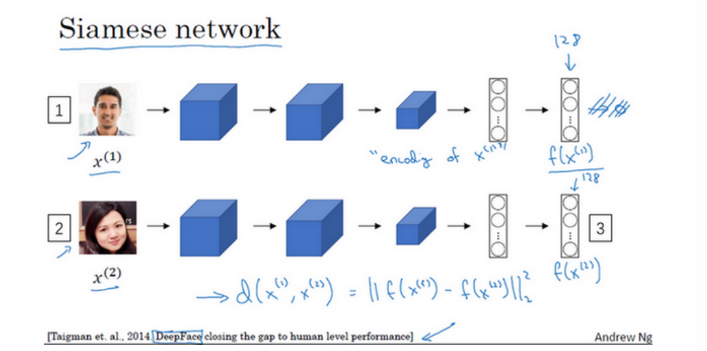

你经常看到这样的卷积网络，输入图片$x^{(1)}$，然后通过一系列卷积，池化和全连接层，最终得到128维的特征向量，这里把它叫做$f(x^{(1)})$。

建立一个人脸识别系统的方法就是，如果你要比较两个图片的话，例如这里的第一张（编号1）和第二张图片（编号2），你要做的就是把第二张图片喂给有同样参数的神经网络，然后得到一个不同的128维的向量$f(x^{(2)})$（编号3）。

现在定义$d$，将$x^{(1)}$和$x^{(2)}$的距离定义为这两幅图片的编码之差的范数，$d(x^{(1)},x^{(2)})=||f(x^{(1)})-f(x^{(2)})||_2^2$。

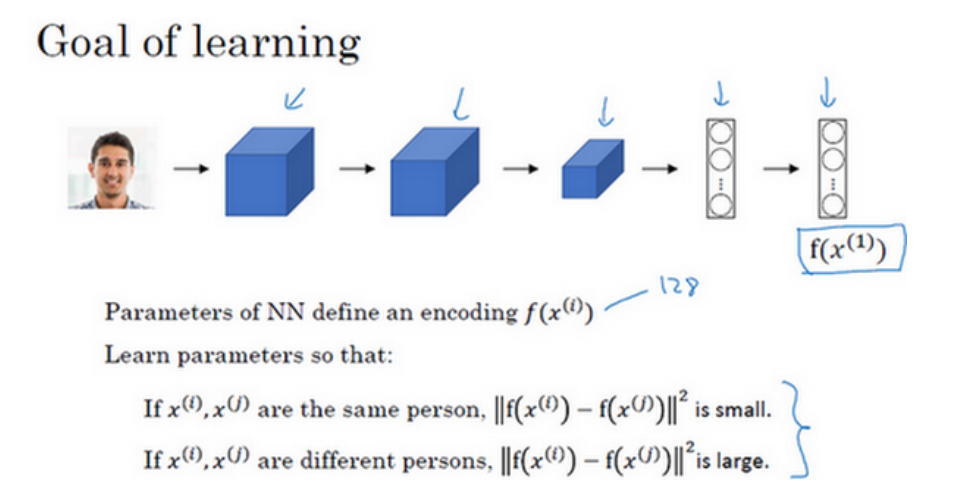

对于两个不同的输入，运行相同的卷积神经网络，然后比较它们，这一般叫做**Siamese**网络架构。

怎么训练这个**Siamese**神经网络呢？不要忘了这两个网络有相同的参数，所以你实际要做的就是训练一个网络，它计算得到的编码可以用于函数$d$，它可以告诉你两张图片是否是同一个人。更准确地说，神经网络的参数定义了一个编码函数$f(x^{(i)})$，如果给定输入图像$x^{(i)}$，这个网络会输出$x^{(i)}$的128维的编码。你要做的就是学习参数，使得如果两个图片$x^{(i)}$和$x^{(j)}$是同一个人，那么你得到的两个编码的距离就小。相反，如果$x^{(i)}$和$x^{(j)}$是不同的人，那么你会想让它们之间的编码距离大一点。

如果你改变这个网络所有层的参数，你会得到不同的编码结果，你要做的就是用反向传播来改变这些所有的参数，以确保满足这些条件。

你已经了解了**Siamese**网络架构，并且知道你想要网络输出什么，即什么是好的编码。但是如何定义实际的目标函数，能够让你的神经网络学习并做到我们刚才讨论的内容呢？在下一个视频里，我们会看到如何用三元组损失函数达到这个目的。

## Triplet 损失

要想通过学习神经网络的参数来得到优质的人脸图片编码，方法之一就是定义三元组损失函数然后应用梯度下降。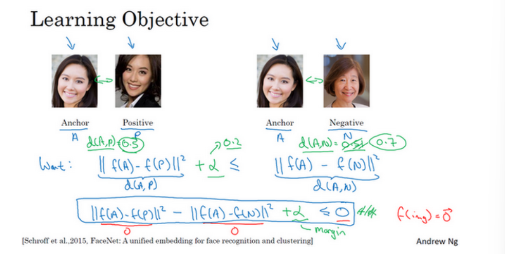

用三元组损失的术语来说，你要做的通常是看一个 **Anchor** 图片，你想让**Anchor**图片和**Positive**图片（**Positive**意味着是同一个人）的距离很接近。然而，当**Anchor**图片与**Negative**图片（**Negative**意味着是非同一个人）对比时，你会想让他们的距离离得更远一点。这里把

**Anchor**图片、**Positive**图片和**Negative**图片简写成$A$、$P$、$N$，你想让$d(A,P)=||f(A)-f(P)||^2$这个数值很小，即，让它小于等于$f(A)$和$f(N)$之间的距离，或者它们的范数的平方$d(A,N)=||f(A)-f(N)||^2$，可以把$d$看作是距离函数。

为了防止网络对于所有的编码不会总是输出0，也为了确保它不会把所有的编码都设成互相相等的，我们增加另一个超参数$a$，它也叫做间隔(margin)。即，$||f(A)-f(P)||^2-||f(A)-f(N)||^2+a \leq 0$。

举个例子，假设将间隔$a$设置为0.2，$d(A,P)=0.5$，如果 **Anchor**和 **Negative**图片的$d(A,N)$只比$d(A,P)$大一点，比如0.51，这样条件就不能满足，因为我们想要$d(A,P)$比$d(A,N)$大很多，想让这个值$d(A,N)$至少是0.7或者更高，所以它们之间间隔至少是0.2，也即超参数$a$至少是0.2，这就是超参数$a$的作用，它拉大了**Anchor**和**Positive** 图片对和**Anchor**与**Negative** 图片对之间的差距。

接下来定义三元组损失函数，这个例子的损失函数的定义基于三元图片组：$L(A,P,N)=max(||f(A)-f(P)||^2-||f(A)-f(N)||^2+a,0)$

这个$max$函数的作用是，只要$d(A,P)-d(A,N)+a\leq0$，那么损失就是0。

训练这个三元组损失你需要取你的训练集，然后把它做成很多三元组$(Anchor,Positive,Negative)$。

> 为了构建一个数据集，你要做的就是尽可能选择难训练的三元组$A、P$和$N$。具体而言，你想要所有的三元组都满足这个条件（$d(A,P)+a\leq d(A,N)$），难训练的三元组就是，你的$A、P$和$N$的选择使得$d(A,P)$很接近$d(A,N)$，即$d(A,P) \approx d(A,N)$，这样你的学习算法会竭尽全力使右边这个式子变大（$d(A,N)$），或者使左边这个式子（$d(A,P)$）变小，这样左右两边至少有一个$a$的间隔。并且选择这样的三元组还可以增加你的学习算法的计算效率，如果随机的选择这些三元组，其中有太多会很简单，梯度算法不会有什么效果，因为网络总是很轻松就能得到正确的结果，只有选择难的三元组梯度下降法才能发挥作用，使得这两边离得尽可能远。

如果你研究一个特定的领域，假如说“某某”领域，通常会将系统命名为“某某”网络或者深度“某某”，我们一直讨论人脸识别，所以这篇论文叫做**FaceNet**(人脸网络)，上节课里你看到过**DeepFace**(深度人脸)。“某某”网络或者深度“某某”，是深度学习领域流行的命名算法的方式。

参考文献：**Florian Schroff, Dmitry Kalenichenko, James Philbin (2015).** [FaceNet: A Unified Embedding forFace Recognition and Clustering](https://arxiv.org/pdf/1503.03832.pdf)

## 人脸识别与二分类

**Triplet loss**是一个学习人脸识别卷积网络参数的好方法，还有其他学习参数的方法，让我们看看如何将人脸识别当成一个二分类问题。

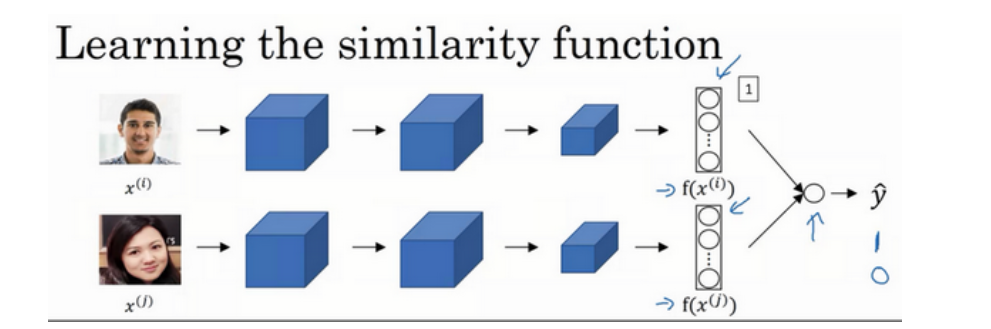

选取一对神经网络（**Siamese**网络），使其同时计算这些嵌入，比如说128维的嵌入，或者更高维，然后将其输入到逻辑回归单元，然后进行预测，如果是相同的人，那么输出是1，若是不同的人，输出是0。这就把人脸识别问题转换为一个二分类问题，训练这种系统时可以替换**Triplet loss**的方法。

利用编码之间的不同，输出$\hat{y}=\sigma(\sum^{128}_{k=1}w_i+b)$。符号$f(x^{(i)})_k$代表图片$x^{(i)}$的编码，下标$k$代表选择这个向量中的第$k$个元素，$|f(x^{(i)})_k-f(x^{(j)})_k|$对这两个编码取元素差的绝对值。把这128个元素当作特征，然后把他们放入逻辑回归中，最后的逻辑回归可以增加参数$w_i$和$b$，就像普通的逻辑回归一样。你将在这128个单元上训练合适的权重，用来预测两张图片是否是一个人，这是一个很合理的方法来学习预测0或者1，即是否是同一个人。

总结一下，把人脸验证当作一个监督学习，创建一个只有成对图片的训练集（不是三个一组），目标标签是1表示一对图片是一个人，目标标签是0表示图片中是不同的人。利用不同的成对图片，使用反向传播算法去训练神经网络，训练**Siamese**神经网络。

参考文献：**Yaniv Taigman, Ming Yang, Marc'Aurelio Ranzato, Lior Wolf (2014).** [DeepFace:Closing the gap to human-level performance in face verification](https://research.fb.com/wp-content/uploads/2016/11/deepface-closing-the-gap-to-human-level-performance-in-face-verification.pdf)

## 神经风格迁移

### What is neural style transfer?

使用$C$表示内容图像，$S$表示风格图像，神经风格迁移就是利用$S$照片的风格来重新创造原本的照片$C$，然后生成图像$G$。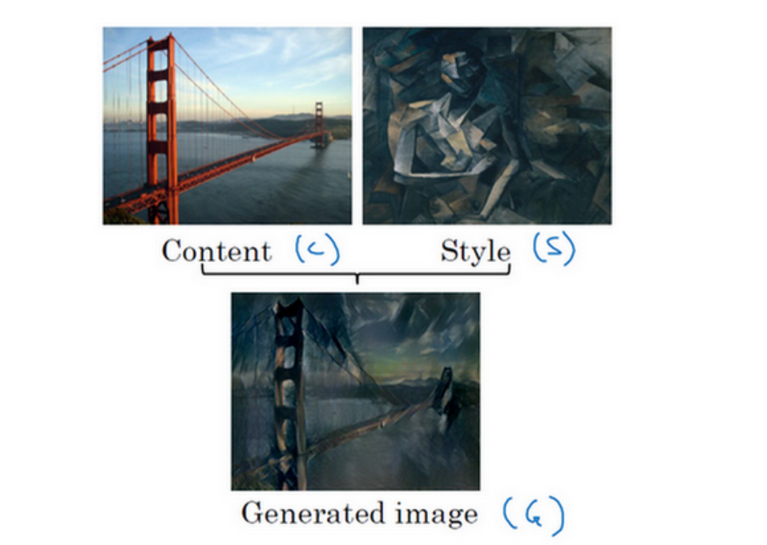

比如，这张图片，$C$代表在旧金山的金门大桥，还有这张风格图片$S$，是毕加索的风格，然后把两张照片结合起来，得到$G$这张毕加索风格的的金门大桥。

### CNN特征可视化

### 代价函数

要构建一个神经风格迁移系统，让我们为生成的图像定义一个代价函数，你接下看到的是，通过最小化代价函数，你可以生成你想要的任何图像。

给你一个内容图像$C$，以及一个风格图片$S$，你的目标是生成一个新图片$G$。为实现神经风格迁移，你要做的是定义一个关于$G$的代价函数$J$，用来评判某个生成图像的好坏。我们将使用梯度下降法去最小化$J(G)$，以便于生成这个图像。

那么如何判断生成图像的好坏呢？我们把这个代价函数定义为：$J(G)=\alpha J_{content}(C,G)+\beta J_{style}(S,G)$。

内容代价函数$J_{content}(C,G)$用来度量生成图片$G$的内容与内容图片$C$的内容有多相似；风格代价函数$J_{style}(S,G)$用来度量图片$G$的风格和图片$S$的风格的相似度。最后我们用两个超参数$\alpha$和$\beta$来来确定内容代价和风格代价，两者之间的权重用两个超参数来确定（一个超参数就够了，但原作者使用了两个）。

算法的运行是这样的，为了生成一个新图像，先随机初始化生成图像$G$，可能是500×500×3，或者100×100×3，或者是任何你想要的尺寸；然后使用代价函数$J(G)$，使用梯度下降法将其最小化，更新$G:=G-\frac{\partial}{\partial{G}}J(G)$，这个步骤中实际上更新的是图像$G$的像素值，也就是500×500×3，比如**RGB**通道的图片。

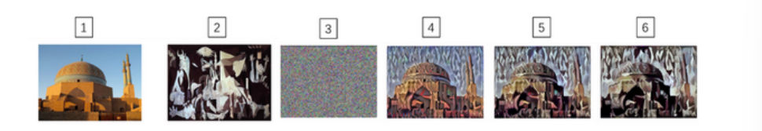

有个例子，假设你从这张内容图片（编号1）和风格（编号2）图片开始，你随机初始化$G$，随机初始化的生成图像就是这张随机选取像素的白噪声图（编号3）。接下来运行梯度下降算法，最小化代价函数$J(G)$，逐步处理像素，这样慢慢得到一个生成图片（编号4、5、6），越来越像用风格图片的风格画出来的内容图片。

#### 内容代价函数

假设用隐藏层$l$来计算内容代价，通常$l$会选择在网络的中间层，既不太浅也不很深，然后用一个预训练的卷积模型，可以是**VGG网络**或者其他的网络也可以。

现在你需要衡量假如有一个内容图片和一个生成图片他们在内容上的相似度，我们令$a^{[l][C]}$代表图片$C$的$l$层的激活函数值，$a^{[l][G]}$代表图片$G$的$l$层的激活函数值，如果这两个激活值相似，那么就意味着两个图片的内容相似。我们定义$J_{content}(C,G)=\frac{1}{2}||a^{[l][C]}-a^{[l][G]}||^2$为两个激活值不同或者相似的程度。

要清楚这里用的符号都是展成向量形式的，这个就变成了$a^{[l][C]}-a^{[l][G]}$的$L2$范数的平方。这就是两个激活值间的差值平方和，这就是两个图片之间$l$层激活值差值的平方和。后面如果对$J(G)$做梯度下降来找$G$的值时，整个代价函数会激励这个算法来找到图像$G$，使得隐含层的激活值和你内容图像的相似。

#### 风格代价函数

$J_{style}^{[l]}(S,G)=\frac{1}{(2n_H^{[l]}n_W^{[l]}n_C^{[l]})^2}\sum_k\sum_{k'}(G_{kk'}^{[l][S]}-G_{kk'}^{[l][G]})$

这是两个矩阵间一个基本的**Frobenius**范数，也就是图像和图像之间的范数再乘上一个归一化常数。

## 一维到三维推广

你已经学习了许多关于卷积神经网络（**ConvNets**）的知识，从卷积神经网络框架，到如何使用它进行图像识别、对象检测、人脸识别与神经网络转换。即使我们大部分讨论的图像数据，某种意义上而言都是**2D**数据，考虑到图像如此普遍，许多你所掌握的思想不仅局限于**2D**图像，甚至可以延伸至**1D**，乃至**3D**数据。

比如你想使用**EKG**信号（心电图），比如医学诊断，那么你将处理1维数据，因为**EKG**数据是由时间序列对应的每个瞬间的电压组成。你可能只有一个14尺寸输入，在这种情况下你可能需要使用一个1维过滤进行卷积，你只需要一个1×5的过滤器，而不是一个5×5的。

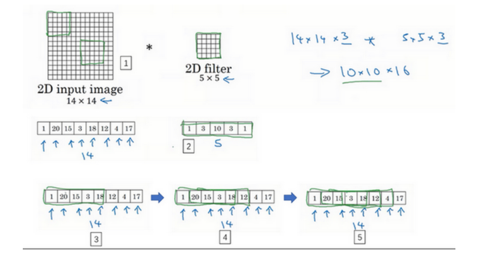

二维数据的卷积是将同一个5×5特征检测器应用于图像中不同的位置（编号1所示），你最后会得到10×10的输出结果。1维过滤器可以取代你的5维过滤器（编号2所示），可在不同的位置中应用类似的方法（编号3，4，5所示）。

处理2D数据的方法也可以应用于1维数据，你可以在不同的位置使用相同的特征检测器，比如说，为了区分**EKG**信号中的心跳的差异，你可以在不同的时间轴位置使用同样的特征来检测心跳。

如果你想要在**3D**扫描或**CT**扫描中应用卷积网络进行特征识别，并将其应用到**3D**卷积中。为了简单起见，如果你有一个**3D**对象，比如说是14×14×14，这也是输入**CT**扫描的宽度与深度（后两个14）。

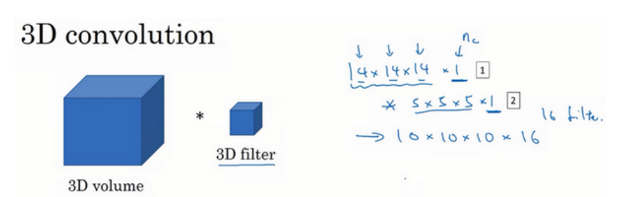

如果你现在使用5×5×5过滤器进行卷积，你的过滤器现在也是**3D**的，这将会给你一个10×10×10的结果输出，技术上来说你也可以再×1（编号1所示），如果这有一个1的通道。这仅仅是一个**3D**模块，但是你的数据可以有不同数目的通道，那种情况下也是乘1（编号2所示），因为通道的数目必须与过滤器匹配。如果你使用16过滤器处理5×5×5×1，接下来的输出将是10×10×10×16，这将成为你**3D**数据卷积网络上的一层。

**参考文献：**

- Florian Schroff, Dmitry Kalenichenko, James Philbin (2015). [FaceNet: A Unified Embedding for Face Recognition and Clustering](https://arxiv.org/pdf/1503.03832.pdf)
- Yaniv Taigman, Ming Yang, Marc'Aurelio Ranzato, Lior Wolf (2014). [DeepFace: Closing the gap to human-level performance in face verification](https://research.fb.com/wp-content/uploads/2016/11/deepface-closing-the-gap-to-human-level-performance-in-face-verification.pdf)
- The pretrained model we use is inspired by Victor Sy Wang's implementation and was loaded using his code: https://github.com/iwantooxxoox/Keras-OpenFace.
- Our implementation also took a lot of inspiration from the official FaceNet github repository: https://github.com/davidsandberg/facenet
- Leon A. Gatys, Alexander S. Ecker, Matthias Bethge, (2015). A Neural Algorithm of Artistic Style (https://arxiv.org/abs/1508.06576)
- Harish Narayanan, Convolutional neural networks for artistic style transfer. https://harishnarayanan.org/writing/artistic-style-transfer/
- Log0, TensorFlow Implementation of "A Neural Algorithm of Artistic Style". http://www.chioka.in/tensorflow-implementation-neural-algorithm-of-artistic-style
- Karen Simonyan and Andrew Zisserman (2015). Very deep convolutional networks for large-scale image recognition (https://arxiv.org/pdf/1409.1556.pdf)
- MatConvNet. http://www.vlfeat.org/matconvnet/pretrained/
