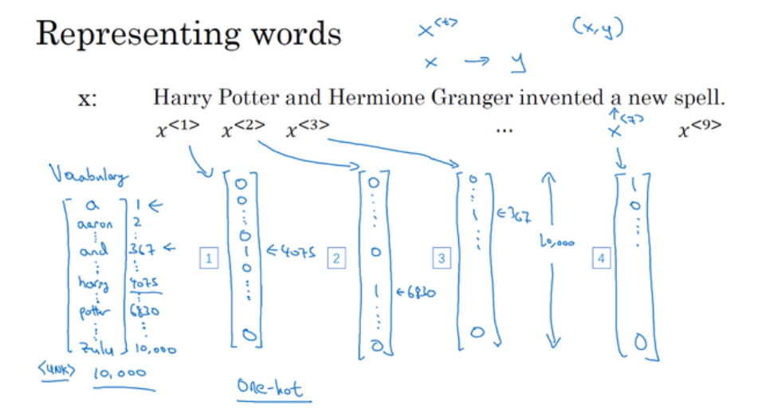
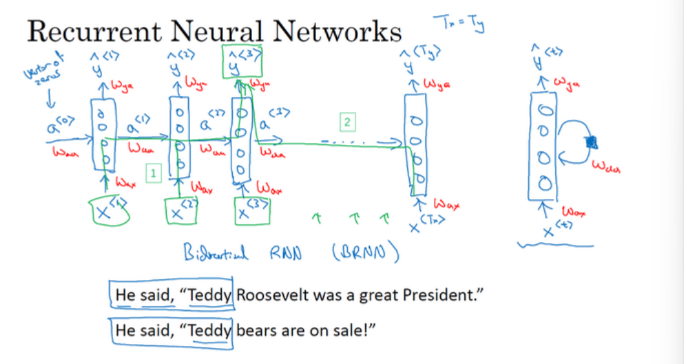
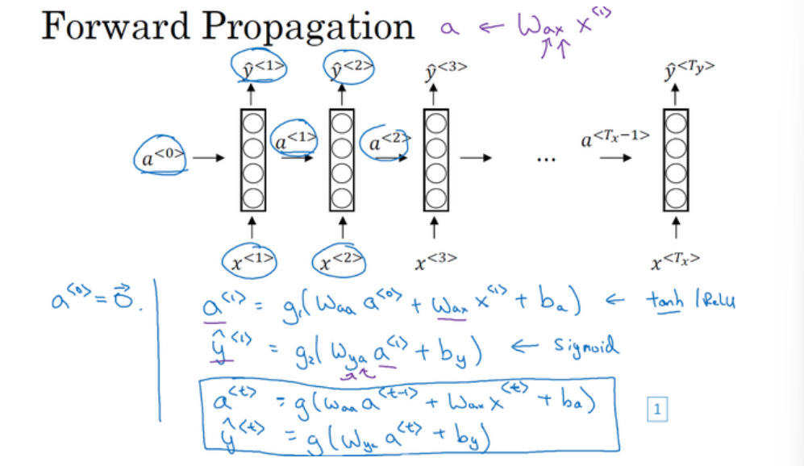
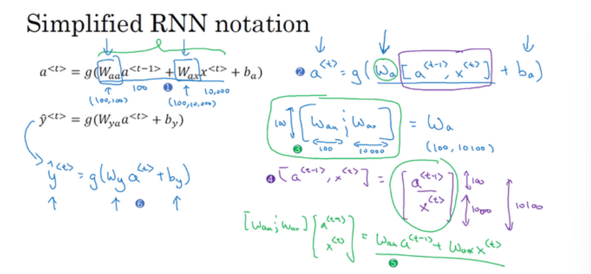
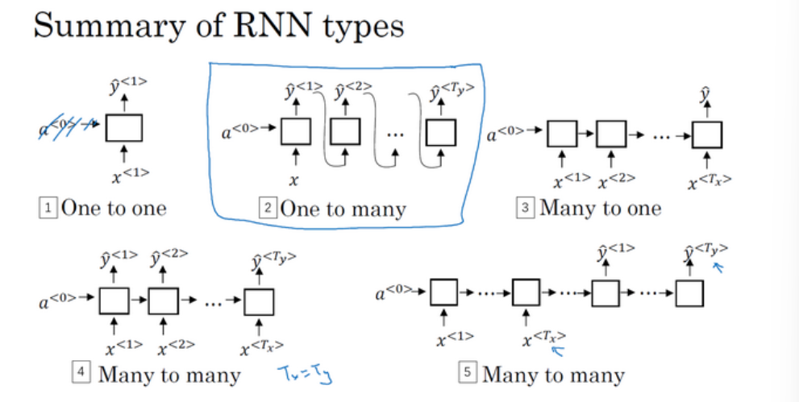
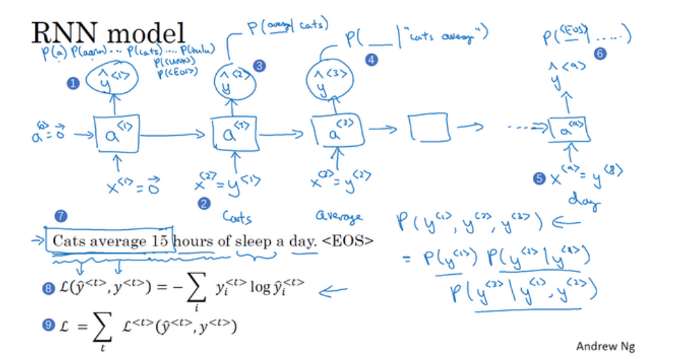
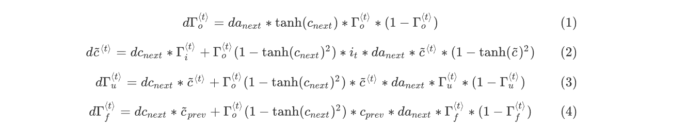
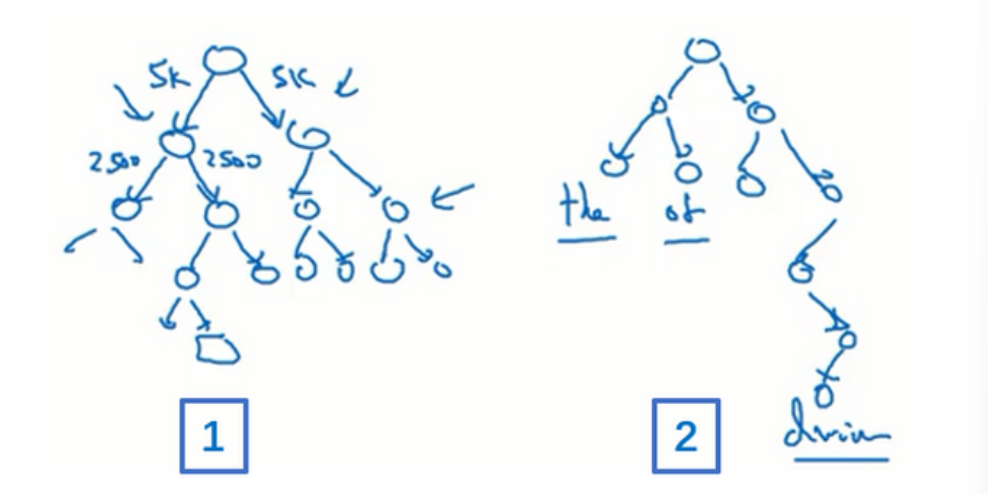

# 循环序列模型

循环神经网络（**RNN**）之类的模型在语音识别、自然语言处理和其他领域中引起变革。使用了序列模型的例子有语音识别、音乐生成、情感分类、DNA序列分析、机器翻译、视频行为识别、命名实体识别等。

## 符号表示

比如你想要建立一个序列模型，它的输入语句是这样的：“**Harry Potter and Herminoe Granger invented a new spell.**”，(这些人名都是出自于**J.K.Rowling**笔下的系列小说**Harry Potter**)。假如你想要建立一个能够自动识别句中人名位置的序列模型，这是一个命名实体识别问题。

这个输入数据是9个单词组成的序列，我们用$x^{<1>},x^{<2>},...,x^{<9>}$来索引不同的位置；输出数据也是一样用$y^{<1>},y^{<2>},...,y^{<9>}$来索引不同位置，同时用$T_x$来表示输入序列的长度，$T_y$表示输出序列的长度，这个例子中$T_x=T_y=9$。

另外，$x^{(i)<t>}$表示训练样本i的序列中第t个元素；$T_x^{(i)}$代表第i个训练样本的输入序列长度；同样$y^{(i)<t>}$代表第i个训练样本中第t个元素；$T_y^{(i)}$是第i个训练样本的输出序列的长度。

想要表示一个句子里的单词，第一件事是做一张词表，有时也称为词典，意思是列一列你的表示方法中用到的单词。这个词表（下图左方所示）中的第一个词是**a**，也就是说词典中的第一个单词是**a**，第二个单词是**Aaron**，然后更下面一些是单词**and**（第367个），再后面你会找到**Harry**（4075），然后找到**Potter**（6830），这样一直到最后，词典里最后一个单词可能是**Zulu**（第10000个单词）。

在这里$x^{<1>}$表示**Harry**这个单词，它就是一个第4075行是1，其余值都是0的向量（上图编号1所示），因为那是**Harry**在这个词典里的位置。

同样$x^{<2>}$是个第6830行是1，其余位置都是0的向量（上图编号2所示）。

**and**在词典里排第367，所以$x^{<3>}$就是第367行是1，其余值都是0的向量（上图编号3所示）。如果你的词典大小是10,000的话，那么这里的每个向量都是10,000维的。

因为**a**是字典第一个单词，$x^{<7>}$对应**a**，那么这个向量的第一个位置为1，其余位置都是0的向量（上图编号4所示）。

所以这种表示方法中，$x^{<t>}$指代句子里的任意词，它就是个**one-hot**向量，因为它只有一个值是1，其余值都是0，所以你会有9个**one-hot**向量来表示这个句中的9个单词，目的是用这样的表示方式表示$X$，用序列模型在$X$和目标输出$Y$之间学习建立一个映射。我会把它当作监督学习的问题，因为我确信会给定带有$(x,y)$标签的数据。

如果你遇到了一个不在你词表中的单词，答案就是创建一个新的标记，也就是一个叫做**Unknow Word**的伪造单词，用<**UNK**>作为标记，来表示不在词表中的单词。

> 这个例子用了10000个单词大小的词典，这对现代自然语言处理应用来说太小了。对于商业应用来说，或者对于一般规模的商业应用来说30,000到50,000词大小的词典比较常见，但是100,000词的也不是没有，而且有些大型互联网公司会用百万词，甚至更大的词典。

## 循环神经网络模型(Recurrent Neural Network Model)

现在我们来建立一个神经网络来学习$X$到$Y$的映射。

要开始整个流程，在零时刻需要构造一个激活值$a^{<0>}$，这通常是零向量。循环神经网络是从左向右扫描数据，同时每个时间步的参数也是共享的。我们用$W_{ax}$来表示管理着从$x^{<1>}$到隐藏层的连接的一系列参数，每个时间步使用的都是相同的参数$W_{ax}$；而激活值也就是水平联系是由参数$W_{aa}$决定的，每一个时间步都使用相同的参数$W_{aa}$；同样的，输出结果由$W_{ya}$决定。

如果以从左到右的顺序读一个句子，第一个单词就是$x^{<1>}$，将其输入一个神经网络层，让神经网络尝试预测输出，判断这是否是人名的一部分。循环神经网络做的是，当它读到句中的第二个单词$x^{<2>}$时，它也会输入一些来自时间步1的信息（激活值）。在每一个时间步中，循环神经网络传递一个激活值到下一个时间步中用于计算。

在这个循环神经网络中，在预测$\hat{y}^{<3>}$时，不仅要使用$x^{<3>}$的信息，还要使用来自$x^{<1>},x^{<2>}$的信息，这些信息通过这样的路径（图中绿色编号1）来帮助预测$\hat{y}^{<3>}$。

这个循环神经网络的一个缺点就是它只使用了这个序列中之前的信息来做出预测，尤其当预测$\hat{y}^{<3>}$时，它没有用到$x^{<4>},x^{<5>},x^{<6>}$等等的信息。所以这就有一个问题，因为如果给定了这个句子，“**Teddy Roosevelt was a great President.**”，为了判断**Teddy**是否是人名的一部分，仅仅知道句中前两个词是完全不够的，还需要知道句中后部分的信息，因为句子也可能是这样的，“**Teddy bears are on sale!**”。因此如果只给定前三个单词，是不可能确切地知道**Teddy**是否是人名的一部分，第一个例子是人名，第二个例子就不是，所以你不可能只看前三个单词就能分辨出其中的区别。

> 这样特定的神经网络结构的一个限制是它在某一时刻的预测仅使用了从序列之前的输入信息并没有使用序列中后部分的信息，之后的双向循环神经网络（**BRNN**）可以处理这个问题。

下面来讲解这个神经网络的计算过程。

一般开始先输入$a^{<0>}$，它是一个零向量，接着就是前向传播过程，先计算激活值$a^{<1>}$，然后计算$\hat{y}^{<1>}$：

$a^{<1>}=g_1(W_{aa}a^{<0>}+W_{ax}x^{<1>}+b_a)$

$\hat{y}^{<1>}=g_2(W_{ya}a^{<1>}+b_y)$

对于矩阵下标的符号约定，举个例子$W_{ax}$，第一个下标$a$表示它是用来计算某个$a$类型的变量，第二个下标$x$意味着$W_{ax}$要乘以某个$x$类型的量。同样的，$W_{ya}$乘上了某个$a$类型的量，用来计算某个$\hat{y}$类型的量。

循环神经网络用的激活函数经常是**tanh**，不过有时候也会用**ReLU**，但是**tanh**是更通常的选择。选用哪个激活函数是取决于你的输出$y$，如果它是一个二分问题，则会用**sigmoid**函数作为激活函数；如果是$k$类别分类问题的话，那么可以选用**softmax**作为激活函数。对于命名实体识别来说$y$只可能是0或者1，那这里第二个激活函数$g$可以是**sigmoid**激活函数。

更一般的情形下，在$t$时刻，
$$
\begin{align*}
&a^{<t>}=g_1(W_{aa}a^{<t-1>}+W_{ax}x^{<t>}+b_a) \\
&\hat{y}^{<t>}=g_2(W_{ya}a^{<t>}+b_y)
\end{align*}
$$
这些等式就定义了神经网络的前向传播。为了建立更复杂的神经网络，实际要将这里的符号简化。

为了简化这些符号，将这部分（$W_{aa}a^{<t-1>}+W_{ax}x^{<t>}$）（上图左上编号1所示）写为更简单的形式：$a^{<t>}=g(W_a[a^{<t-1>},x^{<t>}]+b_a)$（上图编号2所示），那么左右两边划线部分应该是等价的。所以我们定义$W_a$的方式是将矩阵$W_{aa}$和矩阵$W_{ax}$水平并列放置，$W_a=[W_{aa}\vdots W_{ax}]$（上图编号3所示）。举个例子，如果a是100维的，$x$是10000维的，那么$W_{aa}$就是（100,100）维的矩阵，$W_{ax}$就是（100,10000）维的矩阵，因此，如果将这两矩阵堆起来，$W_a$就会是个（100,10100）维的矩阵；

这个符号$[a^{<t-1>},x^{<t>}]$的意思是将这两个向量堆在一起，用$\begin{bmatrix}a^{<t-1>} \\ x^{<t>} \end{bmatrix}$（上图编号4所示），最终这就是个10100维的向量。现在矩阵$[W_{aa}\vdots W_{ax}]$乘以$\begin{bmatrix}a^{<t-1>} \\ x^{<t>} \end{bmatrix}$，刚好就等于之前的结论$W_{aa}a^{<t-1>}+W_{ax}x^{<t>}$（上图编号5所示）。这种记法的好处是现在我们可以不使用两个参数矩阵$W_{aa},W_{ax}$，而是将其压缩成一个参数矩阵$W_a$。
$$
\begin{align*}
&a^{<t>}=g_1(W_a[a^{<t-1>},x^{<t>}]+b_a \\
&\hat{y}^{<t>}=g_2(W_ya^{<t>}+b_y)
\end{align*}
$$
同样的，上图编号6所示，现在$W_y,b_y$符号仅有一个下标，它表示在计算时会输出什么类型的量，即，$W_y$表明它是计算$y$类型的量的权重矩阵。而上面的$W_a,b_a$则表示这些参数是用来计算$a$类型或者说是激活值的。

## 通过时间的反向传播(Backpropagation through time)

定义一个元素的损失函数：$L^{<t>}(\hat{y}^{<t>},y^{<t>})=-y^{<t>}log\hat{y}^{<t>}-(1-y^{<t>})log(1-\hat{y}^{<t>})$

它对应的是序列中一个具体的词，如果它是某个人的名字，那么$y^{<t>}$的值就是1，然后神经网络将输出这个词是名字的概率值，比如0.1。我将它定义为标准逻辑回归损失函数，也叫交叉熵损失函数（**Cross Entropy Loss**），它和之前我们在二分类问题中看到的公式很像。所以这是关于单个位置上或者说某个时间步$t$上某个单词的预测值的损失函数。

现在来定义整个序列的损失函数：

$L(\hat{y},y)=\sum^{T_x}_{t=1}L^{<t>}(\hat{y}^{<t>},y^{<t>})$

**RNN**反向传播示意图：

不同类型的循环神经网络：

这（上图编号1所示）是“**一对一**”的结构，当去掉$a^{<0>}$时它就是一种标准类型的神经网络。还有一种“**一对多**”的结构（上图编号2所示），比如音乐生成或者序列生成。还有“**多对一**”，这（上图编号3所示）是情感分类的例子，首先读取输入，比如一个电影评论的文本，然后判断他们是否喜欢电影还是不喜欢。还有“**多对多**”的结构（上图编号4所示），命名实体识别就是“**多对多**”的例子，其中$T_x=T_y$。最后还有一种“**多对多**”结构的其他版本（上图编号5所示），对于像机器翻译这样的应用，$T_x$和$T_y$就可以不同了。

## 语言模型和序列生成

本节将学习用RNN构建一个语言模型。

假如你在训练集中得到这么一句话，“**Cats average 15 hours of sleep a day.**”(猫一天睡15小时)，你要做的第一件事就是将这个句子标记化，建立一个字典，然后将每个单词都转换成对应的**one-hot**向量，也就是字典中的索引。可能还有一件事就是你要定义句子的结尾，一般的做法就是增加一个额外的标记，叫做**EOS**。如果训练集中有一些词不在你的字典中时，可以把该词替换为代表未知词的标志**UNK**。完成标识化的过程后，这意味着输入的句子都映射到了各个标志上，或者说字典中的各个词上。下一步我们要构建一个**RNN**来构建这些序列的概率模型。本例中，这句话有9个输入（忽略了标点符号，加了EOS）：$y^{<1>},y^{<2>},...,y^{<9>}$。

在第0个时间步，计算激活项$a^{<1>}$，它是以$a^{<0>},x^{<1>}$（这里被设置为零向量）作为输入的函数，通过**softmax**进行一些预测来计算出第一个词可能会是什么，其结果就是$\hat{y}^{<1>}$（上图编号1所示），这一步其实就是通过一个**softmax**层来预测字典中的任意单词会是第一个词的概率。比如第一个词是a的概率是多少，第一个词是cats的概率又是多少，所以**softmax**层输出10,000种结果，因为你的字典中有10,000个词，或者会有10,002个结果，因为你可能加上了未知词，还有句子结尾这两个额外的标志。

然后**RNN**进入下个时间步，现在告诉它正确的第一个词是${y}^{<1>}$（也就是**Cats**），即$x^{<2>}=y^{<1>}$（上图编号2所示）。这个时间步中仍然使用激活项$a^{<1>}$，并计算出第二个词会是什么，输出结果同样经过**softmax**层进行预测，**RNN**的职责就是预测这些词的概率（上图编号3所示），而不会去管结果是什么。

然后再进行**RNN**的下个时间步，现在要计算$a^{<3>}$。为了预测第三个词，也就是15，我们现在给它之前两个词，告诉它**Cats average**是句子的前两个词，所以这是下一个输入，$x^{<3>}=y^{<2>}$，输入**average**以后，现在要计算出序列中下一个词是什么，或者说计算出字典中每一个词的概率（上图编号4所示），通过之前得到的**Cats**和**average**，在这种情况下，正确结果会是15，以此类推。

最后会停在第9个时间步，然后把$x^{<9>}=y^{<8>}$传给它（上图编号5），它会输出$\hat{y}^{<9>}$，最后得到会是**EOS**标志。在这一步中，通过前面这些得到的单词，不管它们是什么，我们希望能预测出**EOS**句子结尾标志的概率会很高（上图编号6所示）。

接下来为了训练这个网络，我们要定义代价函数。在某个时间步$t$，如果真正的词是$y^{<t>}$，而神经网络的**softmax**层预测结果值是$\hat{y}^{<t>}$，那么**softmax**层损失函数（上图编号8）：$L(\hat{y}^{<t>},y^{<t>})=-\sum_iy_i^{<t>}log\hat{y}_i^{<t>}$；而把所有单个预测的损失函数都相加起来，得总体损失函数（上图编号9）：$L=\sum_tL^{<t>}(\hat{y}^{<t>},y^{<t>})$。

现在有一个新句子，为了简单起见，它只包含3个词（如上图右下角所示），它是$y^{<1>},y^{<2>},y^{<3>}$。现在要计算出整个句子中各个单词的概率，方法就是第一个**softmax**层会告诉你$y^{<1>}$的概率，这也是第一个输出；然后第二个**softmax**层会告诉你在考虑$y^{<1>}$的情况下$y^{<2>}$的概率；然后第三个**softmax**层告诉你在考虑$y^{<1>}$和$y^{<2>}$的情况下$y^{<3>}$的概率，把这三个概率相乘，最后得到这个含3个词的整个句子的概率。

以上就是用**RNN**训练一个语言模型的基础结构。

## 循环神经网络的梯度消失

你已经知道了**RNN**的样子，现在我们举个语言模型的例子，假如看到这个句子（上图编号1所示），“**The cat, which already ate ……, was full.**”，前后应该保持一致，因为**cat**是单数，所以应该用**was**。“**The cats, which ate ……, were full.**”（上图编号2所示），**cats**是复数，所以用**were**。这个例子中的句子有长期的依赖，最前面的单词对句子后面的单词有影响。但是我们目前见到的基本的**RNN**模型（上图编号3所示的网络模型），不擅长捕获这种长期依赖效应，解释一下为什么。

因为反向传播会很困难，因为梯度消失的问题，后面层的输出误差（上图编号6所示）很难影响前面层（上图编号7所示的层）的计算。这就意味着，实际上很难让一个神经网络能够意识到它要记住看到的是单数名词还是复数名词，然后在序列后面生成依赖单复数形式的**was**或者**were**。后面的区域都很难反向传播到序列的前面部分，也因此网络很难调整序列前面的计算，这是基本的**RNN**算法的一个缺点。

注意在讨论很深的神经网络时，也要注意梯度爆炸。在反向传播的时候，随着层数的增多，梯度不仅可能指数型的下降，也可能指数型的上升。事实上梯度消失在训练**RNN**时是首要的问题，尽管梯度爆炸也是会出现，但是梯度爆炸很明显，因为指数级大的梯度会让你的参数变得极其大（比如**NaN**），这意味着你的网络计算出现了数值溢出。解决梯度爆炸的一个方法是用梯度修剪，其意思是观察你的梯度向量，如果它大于某个阈值，就缩放梯度向量，以此保证它不会太大，这就是通过一些最大值来修剪的方法。

## **GRU**（Gated Recurrent Unit）单元

本节将会学习门控循环单元，它改变了**RNN**的隐藏层，使其可以更好地捕捉深层连接，并改善了梯度消失问题。

下面是**RNN**隐藏层的单元的可视化呈现：

在**RNN**的时间$t$处，计算激活值$a^{<t>}=g(W_a[a^{<t-1>},x^{<t>}]+b_a)$。输入上一个时间步的激活值$a^{<t-1>}$（上图编号1所示），再输入$x^{<t>}$（上图编号2所示），把这两项并起来乘上权重项$W_a$，在线性计算之后（上图编号3所示），若$g$是一个**tanh**激活函数，再经过**tanh**计算之后，它会计算出激活值$a^{<t>}$。然后激活值$a^{<t>}$将会传**softmax**单元（上图编号4所示），或者其他用于产生输出$y^{<t>}$的东西。

对于句子“**The cat, which already ate……, was full.**”，当我们从左到右读这个句子时，**GRU**单元将会有个新的变量称为$c$（**cell**），即记忆细胞（下图编号1所示）。于是，在时间$t$处有记忆细胞$c^{<t>}$，**GRU**实际上输出了激活值$a^{<t>}$，$c^{<t>}=a^{<t>}$（下图编号2所示）。

> 在这里使用不同的符号$c$和$a$来表示记忆细胞的值和输出的激活值，即使它们的值是一样的。我现在使用这个标记是因为当我们等会说到**LSTM**的时候，这两个会是不同的值，但是现在对于**GRU**，$c^{<t>}$的值等于$a^{<t>}$的激活值。

在每个时间步，我们将用一个候选值$\hat{c}^{<t>}=tanh(W_c[c^{<t-1>},x^{<t>}]+b_c)$重写（候选值，是否用到取决于$\Gamma_u$）记忆细胞$c^{<t>}$的值（下图编号3所示）。

重点是，在**GRU**中真正重要的思想是我们有一个门$\Gamma_u=\sigma(W_u[c^{<t-1>},x^{<t>}]+b_u)$（上图编号4），下标$u$代表“**update**”更新门，这是一个0到1之间的值。**sigmoid**函数是上图编号5所示这样的，它的输出值总是在0到1之间，对于大多数可能的输入，**sigmoid**函数的输出总是非常接近0或者非常接近1。在这样的直觉下，可以想到$\Gamma_u$在大多数的情况下非常接近0或1。

然后**GRU**的关键部分就是上图编号3所示的等式，这是用$\hat{c}$更新$c$的等式，门$\Gamma_u$决定是否要真的更新它。

记忆细胞$c^{<t>}$被设定为0或1，这取决于你考虑的单词在句子中是单数还是复数，因为这里是单数情况，所以先假定它被设为1，或者如果是复数的情况我们就把它设为0。然后**GRU**单元将会一直记住$c^{<t>}$的值，直到上图编号7所示的位置，$c^{<t>}$的值还是1，这就告诉它，噢，这是单数，所以我们应该用**was**。而门$\Gamma_u$的作用就是决定什么时候会更新这个$c^{<t>}$，特别是当你看到词组**the cat**，即句子的主语猫，这就是一个好时机去更新这个值。然后当你使用完它的时候，“**The cat, which already ate……, was full.**”，然后你就知道，我不需要记住它了，我可以忘记它了。

接下来**GRU**用的式子就是$c^{<t>}=\Gamma_u*\hat{c}^{<t>}+(1-\Gamma_u)*c^{<t-1>}$。如果这个更新值$\Gamma_u=1$，则将$c^{<t>}$设为候选值$\hat{c}^{<t>}$；对于这（下图编号14划线部分）中间的值，$\Gamma_u$应该为0，意思就是说不更新它，就用旧的值。

再来总结下这个过程。**GRU**单元输入$c^{<t-1>}$（下图编号1所示），对于上一个时间步，先假设它正好等于$a^{<t-1>}$。然后$x^{<t>}$也作为输入（下图编号2所示），然后把这两个用合适权重结合在一起，再用**tanh**计算，算出候选值$\hat{c}^{<t>}=tanh(W_c[c^{<t-1>},x^{<t>}]+b_c)$，即$c^{<t>}$的替代值。

再用一个不同的参数集，通过**sigmoid**激活函数算出更新门$\Gamma_u=\sigma(W_u[c^{<t-1>},x^{<t>}]+b_u)$。最后产生记忆细胞的新值$c^{<t>}=\Gamma_u*\hat{c}^{}+(1-\Gamma_u)*c^{}$，上图用紫色阴影标注的这个方框（编号5所示，其所代表的运算过程即上图编号13所示的等式）代表了这个式子。

这就是**GRU**单元或者说是一个简化过的**GRU**单元，它的优点就是通过门决定，当从左到右扫描一个句子的时候，某个时间点要更新某个记忆细胞（上图编号10所示），还是不更新（上图编号11所示，$\Gamma_u$一直为0，表示一直不更新），直到真的需要使用记忆细胞的时候（上图编号12所示）。因为sigmoid的值，现在因为门很容易取到0值，只要这个值是一个很大的负数，再由于数值上的四舍五入，上面这些门大体上就是0，或者说非常非常接近0，即$\Gamma_u$很接近0，这就是说$c^{<t>}$几乎就等于$c^{<t-1>}$，它的值就很好的被保持了，即使中间经过很多时间步（上图编号14所示）。这就是缓解梯度消失问题的关键，因此允许神经网络运行在非常庞大的依赖词上，比如说**cat**和**was**单词即使被中间的很多单词分割开。

上面展示的实际上只是简化过的**GRU**单元（也是**GRU**最重要的思想），现在来描述一下完整的**GRU**单元。

对于完整的**GRU**单元，要做的一个改变就是在计算的第一个式子中给记忆细胞的新候选值加上一个新的项$\Gamma_r$（下图编号1所示），可以认为$r$代表相关性（**relevance**）。这个$\Gamma_r$门告诉你计算出的下一个$c^{<t>}$的候选值$\hat{c}^{<t>}$跟$c^{<t-1>}$有多大的相关性。计算这个$\Gamma_r$需要一个新的参数矩阵$W_r$，$\Gamma_r=\sigma(W_r[c^{<t-1>},x^{<t>}]+b_r)$。

这就是**GRU**，即门控循环单元，这是**RNN**的其中之一。这个结构可以更好捕捉非常长范围的依赖，让**RNN**更加有效。然后简单提一下其他常用的神经网络，比较经典的是这个叫做**LSTM**，即长短时记忆网络。

参考文献：

**Chung J, Gulcehre C, Cho K H, et al. Empirical Evaluation of Gated Recurrent Neural Networks on Sequence Modeling[J]. Eprint Arxiv, 2014.**

**Cho K, Merrienboer B V, Bahdanau D, et al. On the Properties of Neural Machine Translation: Encoder-Decoder Approaches[J]. Computer Science, 2014.**

## 长短期记忆 LSTM

之前学习了**GRU**（门控循环单元），它能够让你可以在序列中学习非常深的连接。其他类型的单元也可以让你做到这个，比如**LSTM**即长短时记忆网络，甚至比**GRU**更加有效，现在来看看。

对于**GRU**，我们有$a^{<t>}=c^{<t>}$；还有两个门：更新门$\Gamma_u$、相关门$\Gamma_r$；候选值$\hat{c}^{<t>}$，我们使用更新门$\Gamma_u$来决定是否要用它更新$c^{<t>}$。

**LSTM**是一个比**GRU**更加强大和通用的版本，它有三个门：更新门$\Gamma_u$、遗忘门$\Gamma_f$和输出门$\Gamma_o$，主要式子有：
$$
\begin{align*}
&\hat{c}^{<t>}=tanh(W_c[a^{<t-1>},x^{<t>}]+b_c) \\
&\Gamma_u=\sigma(W_u[a^{<t-1>},x^{<t>}]+b_u) \\
&\Gamma_f=\sigma(W_f[a^{<t-1>},x^{<t>}]+b_f) \\
&\Gamma_o=\sigma(W_o[a^{<t-1>},x^{<t>}]+b_o) \\
&c^{<t>}=\Gamma_u*\hat{c}^{<t>}+\Gamma_f*c^{<t-1>} \\
&a^{<t>}=\Gamma_o*c^{<t>}
\end{align*}
$$
最常用的LSTM版本可能是门值不仅取决于$a^{<t-1>}$和$x^{<t>}$，有时候也可以偷窥一下$c^{<t-1>}$，这叫做“窥视孔连接”（**peephole connection**）。虽然名字不好听，但是你想，“**偷窥孔连接**”其实意思就是门值不仅取决于$a^{<t-1>}$和$x^{<t>}$，也取决于上一个记忆细胞的值（$c^{<t-1>}$），然后“偷窥孔连接”就可以结合这三个门（$\Gamma_u$、$\Gamma_f$、$\Gamma_o$）来计算了。

**LSTM**前向传播图：

**LSTM**反向传播计算：

**门求偏导：**

**参数求偏导 ：**
$$
\begin{align*}
& dW_f=d\Gamma_f^{<t>}*\begin{pmatrix}a_{prev} \\ x_t \end{pmatrix}^T \\
& dW_u=d\Gamma_u^{<t>}*\begin{pmatrix}a_{prev} \\ x_t \end{pmatrix}^T \\
& dW_c=d\hat{c}^{<t>}*\begin{pmatrix}a_{prev} \\ x_t \end{pmatrix}^T \\
& dW_o=d\Gamma_o^{<t>}*\begin{pmatrix}a_{prev} \\ x_t \end{pmatrix}^T \\
\end{align*}
$$
为了计算$db_f,db_u,db_c,db_o$，需要各自对$d\Gamma_f^{<t>},d\Gamma_u^{<t>},d\hat{c}^{<t>},d\Gamma_o^{<t>}$求和。

最后，计算隐藏状态、记忆状态和输入的偏导数：
$$
\begin{align*}
&da_{prev}=W_f^T*d\Gamma_f^{<t>}+W_u^T*d\Gamma_u^{<t>}+W_c^T*d\hat{c}^{<t>}+W_o^T*d\Gamma_o^{<t>} \\
&dc_{prev}=dc_{next}\Gamma_f^{<t>}+\Gamma_o^{<t>}*(1-tanh(c_{next})^2)*\Gamma_f^{<t>}*da_{next} \\
&dx^{<t>}=W_f^T*d\Gamma_f^{<t>}+W_u^T*d\Gamma_u^T+W_c^T*d\hat{c}^{<t>}+W_o^T*d\Gamma_o^{<t>}
\end{align*}
$$
这就是**LSTM**，我们什么时候应该用**GRU**？什么时候用**LSTM**？下面来对比二者。

**GRU**的优点是这是个更加简单的模型，所以更容易创建一个更大的网络，而且它只有两个门，在计算性上也运行得更快，然后它可以扩大模型的规模。

但是**LSTM**更加强大和灵活，因为它有三个门而不是两个。如果你想选一个使用，我认为**LSTM**在历史进程上是个更优先的选择，所以如果你必须选一个，我感觉今天大部分的人还是会把**LSTM**作为默认的选择来尝试。虽然我认为最近几年**GRU**获得了很多支持，而且我感觉越来越多的团队也正在使用**GRU**，因为它更加简单，而且还效果还不错，它更容易适应规模更加大的问题。

所以这就是**LSTM**，无论是**GRU**还是**LSTM**，你都可以用它们来构建捕获更加深层连接的神经网络。

## 双向循环神经网络

双向**RNN**模型可以让你在序列的某点处不仅可以获取之前的信息，还可以获取未来的信息。

这个网络有一个问题，在判断第三个词**Teddy**（上图编号1所示）是不是人名的一部分时，光看句子前面部分是不够的，为了判断（上图编号2所示）是0还是1，除了前3个单词，你还需要更多的信息，因为根据前3个单词无法判断他们说的是**Teddy熊**，还是前美国总统**Teddy Roosevelt**，所以这是一个非双向的或者说只有前向的**RNN**。不管这些单元（上图编号3所示）是标准的**RNN**块，还是**GRU**单元或者是**LSTM**单元，只要这些构件都是只有前向的，那就无法判断**Teddy**是否是人名。

那么一个双向的**RNN**是如何解决这个问题的？下面解释双向RNN的工作原理，为了简单，这里用四个输入或者说一个只有四个单词的句子，输入为$\overrightarrow{a}^{<1>}$到$\overrightarrow{a}^{<4>}$。在这上面加个向右的箭头来表示前向的循环单元，并且他们这样连接（下图编号1所示）。这四个循环单元都有一个相应的$x$输入进去，得到预测的$\hat{y}^{<1>},\hat{y}^{<2>},\hat{y}^{<3>}$和$\hat{y}^{<4>}$。

对应的，增加一个反向循环层，左箭头代表反向连接（如编号2所示），这里有$\overleftarrow{a}^{<4>},\overleftarrow{a}^{<3>},\overleftarrow{a}^{<2>},\overleftarrow{a}^{<1>}$。

这样，这个网络就构成了一个无环图。网络的计算过程是，给定一个输入序列$\overrightarrow{x}^{<1>}$到$\overrightarrow{x}^{<4>}$，这个序列首先计算前向的$\overrightarrow{a}^{<1>}$，然后计算$\overrightarrow{a}^{<2>},\overrightarrow{a}^{<3>},\overrightarrow{a}^{<4>}$；而反向序列从计算$\overleftarrow{a}^{<4>}$，然后反向计算$\overleftarrow{a}^{<3>},\overleftarrow{a}^{<2>},\overleftarrow{a}^{<1>}$。注意，你计算的是网络激活值，这不是反向而是前向的传播，而图中这个前向传播一部分计算是从左到右，一部分计算是从右到左，把所有这些激活值都计算完了就可以计算预测结果了。

计算公式$\hat{y}^{<t>}=g(W_g[\overrightarrow{a}^{<t>},\overleftarrow{a}^{<t>}]+b_y)$。

这就是双向循环神经网络，并且这些基本单元不仅仅是标准**RNN**单元，也可以是**GRU**单元或者**LSTM**单元。事实上，很多的**NLP**问题，对于大量有自然语言处理问题的文本，有**LSTM**单元的双向**RNN**模型是用的最多的。所以如果有**NLP**问题，并且文本句子都是完整的，首先需要标定这些句子，一个有**LSTM**单元的双向**RNN**模型，有前向和反向过程是一个不错的首选。

> 这个双向**RNN**网络模型的缺点就是你需要完整的数据的序列，你才能预测任意位置。比如说你要构建一个语音识别系统，那么双向**RNN**模型需要你考虑整个语音表达，但是如果直接用这个去实现的话，你需要等待这个人说完，然后获取整个语音表达才能处理这段语音，并进一步做语音识别。对于实际的语音识别的应用通常会有更加复杂的模块，而不是仅仅用我们见过的标准的双向**RNN**模型。但是对于很多自然语言处理的应用，如果你总是可以获取整个句子，这个标准的双向**RNN**算法实际上很高效。

## 深层循环神经网络

当要学习非常复杂的函数时，通常我们会把**RNN**的多个层堆叠在一起构建更深的模型。

一个标准的神经网络（下图编号1所示），首先是输入$x$，然后堆叠上隐含层，比如第一层的激活值$a^{[1]}$，接着堆叠上下一层，激活值$a^{[2]}$，可以再加一层$a^{[3]}$，最后得到预测值$\hat{y}$。深层的**RNN**网络跟这个很像，然后把它按时间展开就是了，下面来看看。

上图编号3所示方框内的**RNN**是标准的**RNN**。现在用$a^{[l]<t>}$来表示第$l$层的激活值，这个$<t>$表示第$t$个时间点，这样就可以表示，第一层第一个时间点的激活值$a^{[1]<1>}$，第一层第二个时间点的激活值$a^{[1]<2>}$等等。然后把这些（上图编号4方框内所示的部分）堆叠在上面，这就是一个有三个隐层的新的网络。

看个具体的例子，值$a^{[2]<3>}$（上图编号5所示）是怎么算的。该值有两个输入（编号6、7），计算方法为$a^{[2]<3>}=g(W_a^{[2]}[a^{[2]<2>},a^{[1]<3>}]+b_a^{[2]})$。参数$W_a^{[2]},b_a^{[2]}$在这一层的计算里都一样，相应的第一层也有自己的参数$W_a^{[1]},b_a^{[1]}$。

对于像左边这样标准的神经网络，你可能见过很深的网络，甚至于100层深，而对于**RNN**来说，有三层就已经不少了。由于时间的维度，**RNN**网络会变得相当大，即使只有很少的几层，很少会看到这种网络堆叠到100层。或者有更深的深层网络，但没有水平方向上的连接，只是一个深层的网络。

# 自然语言处理与词嵌入

## 词嵌入（Word Embeddings）

词嵌入是语言表示的一种方式，可以让算法自动的理解一些类似的词，比如man对woman，king对queen等等。

### 词汇表征(Word Representation)

之前我们一直都使用词汇表（**one-hot**向量）来表示词，例如**man**在词典里是第5391个，那么就可以表示成一个向量，这个向量中只有第5391处为1，我们用$O_{5391}$代表这个量，这里的$O$代表**one-hot**。这种表示方法的一大缺点就是它把每个词孤立起来，这样使得算法对相关词的泛化能力不强。

换一种表示方式会更好，如果我们不用**one-hot**表示，而是用特征化的表示来表示每个词，**man**，**woman**，**king**，**queen**，**apple**，**orange**或者词典里的任何一个单词，我们学习这些词的特征或者数值。

举个例子，比如我们想知道这些词与**Gender**（**性别**）的关系。假定男性的性别为-1，女性的性别为+1，那么**man**的性别值可能就是-1，而**woman**就是-1。最终根据经验**king**就是-0.95，**queen**是+0.97，**apple**和**orange**没有性别可言。

另一个特征可以是这些词有多**Royal**（**高贵**），所以这些词，**man**，**woman**和高贵没太关系，所以它们的特征值接近0。而**king**和**queen**很高贵，**apple**和**orange**跟高贵也没太大关系。

同样的，对于年龄，通常**king**和**queen**都是成年人，其他的跟年龄关系不大；对于是否是**Food**，很明显，**apple**和**orange**是食物。当然还可以有很多的其他特征，从**Size**（**尺寸大小**），**Cost**（**花费多少**），这个东西是不是**alive**（**活的**），是不是一个**Action**（**动作**），或者是不是**Noun**（**名词**）或者是不是**Verb**（**动词**），还是其他的等等。

所以可以有很多特征，假设这个例子中有300个不同的特征，这样就组成了一个300维的向量来表示**man**这个词，用$e_{5391}$表示（上图编号2所示），同理用这个300维的向量$e_{9853}$表示**woman**这个词（上图编号3所示），这些其他的例子也一样。如果用这种方法来表示这些词，那么**apple**和**orange**的这种表示肯定会非常相似，可能有些特征不太一样，因为**orange**的颜色口味，**apple**的颜色口味，或者其他的一些特征会不太一样，但总的来说**apple**和**orange**的大部分特征实际上都一样，或者说都有相似的值。

常用的词嵌入的可视化算法是**t-SNE算法**，它可以让你很容易的看到特征相似的词聚集在一起。

### 使用词嵌入

如果你看到一个新的输入：“**Robert Lin is an apple farmer.**”（**Robert Lin是一个种苹果的农民**），因为知道**orange**和**apple**很相近，那么你的算法很容易就知道**Robert Lin**也是一个人，也是一个人的名字。一个有意思的情况是，要是测试集里这句话包含了不太常见的词，比如：“**Robert Lin is a durian cultivator.**”（**Robert Lin是一个榴莲培育家**）这该怎么办？如果对于一个命名实体识别任务，你只有一个很小的标记的训练集，你的训练集里甚至可能没有**durian**（**榴莲**）或者**cultivator**（**培育家**）这两个词。但是如果你有一个已经学好的词嵌入，它会告诉你**durian**（**榴莲**）是水果，就像**orange**（**橙子**）一样，并且**cultivator**（**培育家**），做培育工作的人其实跟**farmer**（**农民**）差不多，那么你就有可能从你的训练集里的“**an orange farmer**”（**种橙子的农民**）归纳出“**a durian cultivator**”（**榴莲培育家**）也是一个人。

词嵌入能够达到这种效果，其中一个原因就是学习词嵌入的算法会考察非常大的文本集。通过独缺大量的无标签文本（很多都是可以免费下载的），学习这种词嵌入表达，把它们都聚集在一块，你可以发现**orange**（**橙子**）和**durian**（**榴莲**）相近，**farmer**（**农民**）和**cultivator**（**培育家**）相近。接下来你可以使用迁移学习，把你从互联网上免费获得的大量的无标签文本中学习到的知识（词嵌入，比如能够分辨**orange**（**橙子**）、**apple**（**苹果**）和**durian**（**榴莲**）），然后把这些知识迁移到一个任务中，比如你只有少量标记的训练数据集的命名实体识别任务中。

总结一下，这是如何使用词嵌入做迁移学习的步骤：

第一步，先从大量的文本集中学习词嵌入。一个非常大的文本集，或者可以下载网上预训练好的词嵌入模型，网上你可以找到不少，词嵌入模型并且都有许可。

第二步，你可以用这些词嵌入模型把它迁移到你的新的只有少量标注训练集的任务中，比如说用这个300维的词嵌入来表示你的单词。这样做的一个好处就是你可以用更低维度的特征向量代替原来的10000维的**one-hot**向量，现在你可以用一个300维更加紧凑的向量。

第三步，当你在你新的任务上训练模型时，在你的命名实体识别任务上，只有少量的标记数据集上，你可以自己选择要不要继续微调，用新的数据调整词嵌入。实际中，只有这个第二步中有很大的数据集你才会这样做，如果你标记的数据集不是很大，通常我不会在微调词嵌入上费力气。

> 如果你从某一任务**A**迁移到某个任务**B**，只有**A**中有大量数据，而**B**中数据少时，迁移的过程才有用。所以对于很多**NLP**任务这些都是对的，而对于一些语言模型和机器翻译（这些任务有大量数据）则不然。

### 词嵌入的特性

词嵌入还有一个迷人的特性就是它还能帮助实现类比推理，它能帮助人们理解词嵌入做了什么，以及词嵌入能够做什么，让我们来一探究竟。

这是一系列你希望词嵌入可以捕捉的单词的特征表示，假如我提出一个问题，**man**如果对应**woman**，那么**king**应该对应什么？你们应该都能猜到**king**应该对应**queen**。能否有一种算法来自动推导出这种关系，下面就是实现的方法。

我们用一个四维向量$e_{5391}$来表示**man**，为了方便，这里把它称为$e_{man}$（上图编号1所示），旁边的表示**woman**的嵌入向量$e_{woman}$，对**king**和**queen**也是用一样的表示方法。加入对$e_{man}$和$e_{woman}$进行减法运算：

$e_{man}-e_{woman}=\begin{bmatrix}-1\\0.01\\0.03\\0.09\end{bmatrix}-\begin{bmatrix}1\\0.02\\0.02\\0.01\end{bmatrix}=\begin{bmatrix}-2\\-0.01\\0.01\\0.08\end{bmatrix}\approx \begin{bmatrix}-2\\0\\0\\0\end{bmatrix}$

类似的，如果用$e_{king}$减去$e_{queen}$，最后会得到一样的结果：

$e_{king}-e_{queen}=\begin{bmatrix}-0.95\\0.93\\0.70\\0.02\end{bmatrix}-\begin{bmatrix}0.97\\0.95\\0.69\\0.01\end{bmatrix}=\begin{bmatrix}-1.92\\-0.02\\0.01\\0.01\end{bmatrix}\approx \begin{bmatrix}-2\\0\\0\\0\end{bmatrix}$

这个结果表明，**man**和**woman**主要的差异是**gender**（**性别**）上的差异，而**king**和**queen**之间的主要差异也是**gender**（**性别**），这就是为什么$e_{man}-e_{woman}$和$e_{king}-e_{queen}$结果是相同的。所以得出这种类比推理的结论的方法就是，当算法被问及**man**对**woman**相当于**king**对什么时，算法所做的就是计算$e_{man}-e_{woman}$，然后找出一个向量（也就是找出一个词），使得$e_{man}-e_{woman}\approx e_{king}-e_{?}$，也就是说，当这个新词是**queen**时，式子的左边会近似地等于右边。这个思想是词嵌入领域影响力最为惊人和显著的成果之一，这种思想帮助了研究者们对词嵌入领域建立了更深刻的理解。

让我们来正式地探讨一下应该如何把这种思想写成算法。

为了计算当**man**对于**woman**，那么**king**对于什么，你能做的就是找到单词**w**来使得$e_{man}-e_{woman}\approx e_{king}-e_{w}$这个等式成立，也就是找到单词**w**来最大化$e_w$与$e_{king}-e_{man}+e_{woman}$，即$Find word w: argmax \quad Sim(e_w,e_{king}-e_{man}+e_{woman})$

存在一些用于测算$e_w$与$e_{king}-e_{man}+e_{woman}$之间相似度的函数，然后通过方程找到一个使得相似度最大的单词，如果结果理想的话会得到单词**queen**。

为了测量两个词的相似程度，最常用的相似度函数叫做余弦相似度：假如在向量$u$和$v$之间定义相似度$CosineSimilarity(u,v)=\frac{u^Tv}{||u||_2||v||_2}=cos(\theta)$。这其实就是两个向量的夹角$\theta$的余弦值，分子是两个向量的点积（或内积），$||u||_2$是向量$u$的范数（或长度）。这种相似性取决于角度在向量$u$和$v$之间。如果它们非常相似，则它们的余弦相似性将接近1; 如果它们不相似，则余弦相似性将取较小的值。

从学术上来说，比起测量相似度，这个函数更容易测量的是相异度，所以我们需要对其取负，这个函数才能正常工作，不过我还是觉得余弦相似度用得更多一点，这两者的主要区别是它们对$u$和$v$之间的距离标准化的方式不同。

词嵌入的一个显著成果就是，可学习的类比关系的一般性。举个例子，它能学会**man**对于**woman**相当于**boy**对于**girl**，因为**man**和**woman**之间和**king**和**queen**之间，还有**boy**和**girl**之间的向量差在**gender**（**性别**）这一维都是一样的。它还能学习**Canada**（**加拿大**）的首都是**Ottawa**（**渥太华**），而渥太华对于加拿大相当于**Nairobi**（**内罗毕**）对于**Kenya**（**肯尼亚**），这些都是国家中首都城市名字。它还能学习**big**对于**bigger**相当于**tall**对于**taller**，还能学习**Yen**（**円**）对于**Janpan**（**日本**），**円**是日本的货币单位，相当于**Ruble**（**卢比**）对于**Russia**（**俄罗斯**）。这些东西都能够学习，只要你在大型的文本语料库上实现一个词嵌入学习算法，只要从足够大的语料库中进行学习，它就能自主地发现这些模式。

### 嵌入矩阵

接下来我们要将学习词嵌入这一问题具体化，当你应用算法来学习词嵌入时，实际上是学习一个嵌入矩阵，该嵌入矩阵包含了词汇表中所有单词的嵌入向量。

假设词汇表含有10000个单词，现在要学习一个嵌入矩阵$E$，它将是一个300×10,000的矩阵。假设**orange**的单词编号是6257，并用符号$O_{6527}$来表示这个**one-hot**向量，这个向量除了第6527个位置上是1，其余各处都为0，显然它是一个10,000维的列向量。现在用$E$去乘以这个**one-hot**向量，就会得到一个300维的向量$e_{6257}$，它表示的单词是**orange**。

更广泛来说，假如说有某个单词**w**，那么$e_w$就代表单词**w**的嵌入向量。同样，$O_j$就是只有第$j$个位置是1的**one-hot**向量，$E\cdot O_j$得到的结果就是$e_j$，它表示的是字典中单词**j**的嵌入向量。

在下节中你将会随机地初始化矩阵$E$，然后使用梯度下降法来学习这个300×10,000的矩阵中的各个参数，然后用$E$乘以这个**one-hot**向量会得到嵌入向量。

那么，用什么算法来学习词嵌入呢？实践证明，建立一个语言模型是学习词嵌入的好方法。假如你在构建一个语言模型，可能想要你的神经网络能够做到比如输入：“**I want a glass of orange ___.**”，然后预测这句话的下一个词。在每个单词下面，我都写上了这些单词对应词汇表中的索引。

从第一个词$I$开始，先建立一个**one-hot**向量$O_{4343}$表示它，这个10000维的向量中第4343个位置是1；接着生成一个参数矩阵$E$，然后用$E$乘以$O_{4343}$，得到嵌入向量$e_{4343}$，即$e_{4343}=E\cdot O_{4343}$（上图编号2所示）；然后对其他的词做同样的操作。

于是现在你有许多300维的嵌入向量，现在把它们全部放进神经网络中（上图编号3所示），经过神经网络以后再通过**softmax**层（上图编号4所示），然后这个**softmax**分类器会在10,000个可能的输出中预测结尾这个单词。假如说在训练集中有**juice**这个词，训练过程中**softmax**的目标就是预测出单词**juice**。这个隐藏层（上图编号3所示）有自己的参数（$W^{[1]},b^{[1]}$），这个**softmax**层（上图编号4所示）也有自己的参数（$W^{[2]},b^{[2]}$）。如果它们用的是300维大小的嵌入向量，而这里有6个词，所以用6×300，所以这个输入会是一个1800维的向量，这是通过将这6个嵌入向量堆在一起得到的。

## Word2Vec

**Word2Vec**算法是一种简单而且计算时以更加高效的方式来学习这种类型的嵌入，让我们来看看。

### Skip-Gram 模型

假设在训练集中给定了一个这样的句子：“**I want a glass of orange juice to go along with my cereal.**”，在**Skip-Gram**模型中，我们要做的是抽取上下文和目标词配对，来构造一个监督学习问题。上下文不一定总是目标单词之前离得最近的四个单词，或最近的$n$个单词。随机选一个词作为上下文词，比如选**orange**这个词，然后随机在一定词距内选另一个目标词（比如在上下文词前后5个词内或者前后10个词内），可能选到了**juice**作为目标词，或者**glass**等等。

于是我们将构造一个监督学习问题，它给定上下文词，要求预测在这个词正负10个词距或者正负5个词距内随机选择的某个目标词。显然，这不是个非常简单的学习问题，因为在单词**orange**的正负10个词距之间，可能会有很多不同的单词。但是构造这个监督学习问题的目标并不是想要解决这个监督学习问题本身，而是想要使用这个学习问题来学到一个好的词嵌入模型。

我们要解决的基本的监督学习问题是学习一种映射关系，从上下文**c**，比如单词**orange**，到某个目标词，记为**t**，可能是单词**juice**或者单词**glass**或者单词**my**。

输入为单词**orange**，即上下文词的**one-hot**向量$O_c$（上图编号1所示）。拿嵌入矩阵$E$乘以向量$O_c$，然后得到了输入的上下文词的嵌入向量$e_c=E\cdot O_c$。在这个神经网络中（上图编号2所示），我们将把向量$e_c$喂入一个**softmax**单元（上图编号3所示），**softmax**单元要做的就是输出$\hat{y}$。**softmax**模型（上图编号4所示），用来预测不同目标词的概率：$Softmax: p(t|c)=\frac{e^{\theta_t^Te_c}}{\sum^{10,000}_{j=1}e^{\theta_j^Te_c}}$，其中$\theta_t$是一个与输出$t$有关的参数，即某个词$t$和标签相符的概率是多少。这里省略了**softmax**中的偏差项，想要加上的话也可以加上。

用$y$表示目标词（是只有一个1其他都是0的**one-hot**向量），它和$\hat{y}$都是用**one-hot**表示的，于是损失函数就会是：$L(\hat{y},y)=-\sum^{10,000}_{i=1}y_ilog\hat{y}_i$。其中$\hat{y}$是一个从**softmax**单元输出的10,000维的向量，这个向量是所有可能目标词的概率。

总结一下，这大体上就是一个可以找到词嵌入的简化模型和神经网络（上图编号2所示），其实就是个**softmax**单元。矩阵$E$将会有很多参数，所以矩阵$E$有对应所有嵌入向量$e_c$的参数（上图编号6所示），**softmax**单元也有$\theta_t$的参数（上图编号3所示）。如果优化这个关于所有这些参数的损失函数，你就会得到一个较好的嵌入向量集，这个就叫做**Skip-Gram**模型。它把一个像**orange**这样的词作为输入，并预测这个输入词，从左数或从右数的某个词，预测上下文词的前面一些或者后面一些是什么词。

实际上使用这个算法会相当的慢，尤其是在**softmax**模型中，每次你想要计算这个概率，这个分母的求和操作是相当慢的，实际上10,000已经是相当慢的了，所以扩大词汇表就更加困难了。有一些解决方案，如分级（**hierarchical**）的**softmax**分类器和**负采样**（**Negative Sampling**）。

使用分级（**hierarchical**）的**softmax**分类器，意思就是说不是一下子就确定到底是属于10,000类中的哪一类，要一级一级的去搜索词汇表。实际上用这样的分类树，计算成本与词汇表大小的对数成正比（下图编号1所示），而不是词汇表大小的线性函数，这个就叫做分级**softmax**分类器。

在实践中分级**softmax**分类器不会使用一棵完美平衡的分类树或者说一棵左边和右边分支的词数相同的对称树（上图编号1所示的分类树）。实际上，分级的**softmax**分类器会被构造成常用词在顶部，然而不常用的词像**durian**会在树的更深处（上图编号2所示的分类树），因为你想更常见的词会更频繁，所以你可能只需要少量检索就可以获得常用单词像**the**和**of**。

这就是**Word2Vec**的**Skip-Gram**模型，如果你读过我之前提到的论文原文，你会发现那篇论文实际上有两个不同版本的**Word2Vec**模型，**Skip-Gram**只是其中的一个，另一个叫做**CBOW**，即连续词袋模型（**Continuous** **Bag-Of-Words Model**），它获得中间词两边的的上下文，然后用周围的词去预测中间的词，这个模型也很有效，也有一些优点和缺点。

总结下：**CBOW**是从原始语句推测目标字词；而**Skip-Gram**正好相反，是从目标字词推测出原始语句。**CBOW**对小型数据库比较合适，而**Skip-Gram**在大型语料中表现更好。

### 负采样（Negative Sampling）

上一节学习了**Skip-Gram**模型如何帮助你构造一个监督学习任务，把上下文映射到了目标词上，让你学到一个实用的词嵌入。但是它的缺点就在于**softmax**计算起来很慢。在本视频中，你会看到一个改善过的学习问题叫做负采样，它能做到与你刚才看到的**Skip-Gram**模型相似的事情，但是用了一个更加有效的学习算法，让我们来看看这是怎么做到的。

我们在这个算法中要做的是构造一个新的监督学习问题，那么问题就是给定一对单词，比如**orange**和**juice**，我们要去预测这是否是一对上下文词-目标词（**context-target**）。

在这个例子中**orange**和**juice**就是个正样本，那么**orange**和**king**就是个负样本，我们把它标为0。我们要做的就是采样得到一个上下文词和一个目标词，在这个例子中就是**orange** 和**juice**，我们用1作为标记，我把中间这列（下图编号1所示）叫做词（**word**）。

生成这些数据的方式是我们选择一个上下文词（上图编号2所示），再选一个目标词（上图编号3所示），这（上图编号4所示）就是表的第一行，它给了一个正样本，上下文，目标词，并给定标签为1。然后我们要做的是给定几次，比如$K$次（上图编号5所示），我们将用相同的上下文词，再从字典中选取随机的词，**king**、**book**、**the**、**of**等，从词典中任意选取的词，并标记0，这些就会成为负样本（上图编号6所示）。

接下来我们将构造一个监督学习问题，其中学习算法输入$x$，输入这对词（上图编号7所示），要去预测目标的标签（上图编号8所示），即预测输出$y$。因此问题就是给定一对词，像**orange**和**juice**，你觉得它们会一起出现么？你觉得这两个词是通过对靠近的两个词采样获得的吗？或者你觉得我是分别在文本和字典中随机选取得到的？这个算法就是要分辨这两种不同的采样方式，这就是如何生成训练集的方法。

那么如何选取$K$？如果是小数据集的话，$K$从5到20比较好。如果你的数据集很大，$K$就选的小一点。对于更大的数据集$K$就等于2到5，数据集越小$K$就越大。那么在这个例子中，我们就用$K=4$。

从$x$到$y$的监督学习模型为：$Softmax: p(t|c)=\frac{e^{\theta_t^Te_c}}{\sum^{10,000}_{j=1}e^{\theta_j^Te_c}}$。

这是得到的训练集，这个（上图编号2所示）将是新的输入$x$，这个（上图编号3所示）将是你要预测的值$y$（表示是否是一对上下文-目标词，0或者1）。为了定义模型，我们将使用记号$c$表示上下文词，记号$t$表示可能的目标词。我们要做的就是定义一个逻辑回归模型，给定输入的$c,t$的条件下$y=1$的概率，即：$P(y=1|c,t)=\sigma(\theta_t^Te_c)$。

> 如果你有$K$个样本，你可以把这个看作$\frac{1}{K}$的正负样本比例，即每一个正样本你都有$K$个对应的负样本来训练一个类似逻辑回归的模型。

把这个画成一个神经网络，如果输入词是**orange**，即词6257，你要做的就是输入**one-hot**向量，再传递给$E$，通过两者相乘获得嵌入向量$e_{6257}$，你就得到了10,000个可能的逻辑回归分类问题，其中一个（上图编号4所示）将会是用来判断目标词是否是**juice**的分类器，还有其他的词，比如说可能下面的某个分类器（上图编号5所示）是用来预测**king**是否是目标词，诸如此类，预测词汇表中这些可能的单词。把这些看作10,000个二分类逻辑回归分类器，但并不是每次迭代都训练全部10,000个，我们只训练其中的5个，我们要训练对应真正目标词那一个分类器，再训练4个随机选取的负样本，这就是$K=4$的情况。所以不使用一个巨大的10,000维度的**softmax**，因为计算成本很高，而是把它转变为10,000个二分类问题，每个都很容易计算，每次迭代我们要做的只是训练它们其中的5个，一般而言就是$K+1$个，其中$K$个负样本和1个正样本。这也是为什么这个算法计算成本更低，因为只需更新$K+1$个逻辑单元，$K+1$个二分类问题，相对而言每次迭代的成本比更新10,000维的**softmax**分类器成本低。

这个技巧就叫负采样。因为你做的是，你有一个正样本词**orange**和**juice**，然后你会特意生成一系列负样本，这些（上图编号6所示）是负样本，所以叫负采样，即用这4个负样本训练，4个额外的二分类器，在每次迭代中你选择4个不同的随机的负样本词去训练你的算法。

这个算法有一个重要的细节就是如何选取负样本，即在选取了上下文词**orange**之后，你如何对这些词进行采样生成负样本？一个比较好的方式是根据其在语料中的经验频率进行采样，就是通过词出现的频率对其进行采样。其中：$P(W_i)=\frac{f(w_i)^{\frac{3}{4}}}{\sum^{10,000}_{j=1}f(w_j)^{\frac{3}{4}}}$，通过这个方式进行采样，如果$f(w_i)$是观测到的在语料库中的某个英文词的词频，通过$\frac{3}{4}$次方的计算，使其处于完全独立的分布和训练集的观测分布两个极端之间。

> 如果你使用这个算法，你将可以学到相当好的词向量。当然和深度学习的其他领域一样，有很多开源的实现，当然也有预训练过的词向量，就是其他人训练过的然后授权许可发布在网上的，所以如果你想要在**NLP**问题上取得进展，去下载其他人的词向量是很好的方法，在此基础上改进。

## 情感分类（Sentiment Classification）

情感分类任务就是看一段文本，然后分辨这个人是否喜欢他们在讨论的这个东西，这是**NLP**中最重要的模块之一，经常用在许多应用中。

比如有人说，"**The dessert is excellent.**"（甜点很棒），并给出了四星的评价；

"**Service was quite slow**"（服务太慢），两星评价；

"**Good for a quick meal but nothing special**"（适合吃快餐但没什么亮点），三星评价；

还有比较刁钻的评论，"**Completely lacking in good taste, good service and good ambiance.**"（完全没有好的味道，好的服务，好的氛围），给出一星评价。

情感分类一个最大的挑战就是可能标记的训练集没有那么多。对于情感分类任务来说，训练集大小从10,000到100,000个单词都很常见，甚至有时会小于10,000个单词，采用了词嵌入能够带来更好的效果，尤其是只有很小的训练集时。

这是一个简单的情感分类的模型，假设有一个句子"**The dessert is excellent**"，然后在10,000个词的词典中找到这些词。现在要构建一个分类器能够把它映射成输出四个星，首先找到这4个词相应的**one-hot**向量，比如$O_{8928}$（上图编号1），然后乘以嵌入矩阵$E$得到嵌入向量（上图编号2）；可以这样构建一个分类器，取这些向量（上图编号2所示），比如是300维度的向量。然后把它们求和或者求平均，这里是一个大点的平均值计算单元（上图编号3所示），这个单元会得到一个300维的特征向量，并把这个特征向量送进**softmax**分类器，然后输出$\hat{y}$（从一星到五星5个可能结果的概率值）。

这个算法有一个问题就是没考虑词序，尤其是这样一个负面的评价，"**Completely lacking in good taste, good service, and good ambiance.**"，但是**good**这个词出现了很多次，有3个**good**，如果用上面的算法忽略了词序，仅仅把所有单词的词嵌入加起来或者平均下来，你最后的特征向量会有很多**good**的表示，因此你的分类器很可能认为这是一个好的评论，然而事实上这是一个差评，只有一星的评价。

所以不能简单的把所有词都加起来，这里有一个更加复杂的模型，用一个**RNN**来做情感分类。

首先取这条评论，"**Completely lacking in good taste, good service, and good ambiance.**"，找出每一个**one-hot**向量，并乘以词嵌入矩阵$E$，得到词嵌入向量$e$，然后把它们送进**RNN**里。**RNN**的工作就是在最后一步（上图编号1所示）计算一个特征表示，用来预测$\hat{y}$，这是一个多对一的网络结构的例子，我们之前已经见过了。有了这样的算法，考虑词的顺序效果就更好了，它就能意识到"**things are lacking in good taste**"，这是个负面的评价，“**not good**”也是一个负面的评价。而不像原来的算法一样，只是把所有的加在一起得到一个大的向量，根本意识不到“**not good**”和 “**good**”不是一个意思，"**lacking in good taste**"也是如此，等等。

**参考文献：**

- The debiasing algorithm is from Bolukbasi et al., 2016, [Man is to Computer Programmer as Woman is to Homemaker? Debiasing Word Embeddings](https://papers.nips.cc/paper/6228-man-is-to-computer-programmer-as-woman-is-to-homemaker-debiasing-word-embeddings.pdf)
- The GloVe word embeddings were due to Jeffrey Pennington, Richard Socher, and Christopher D. Manning. (https://nlp.stanford.edu/projects/glove/
