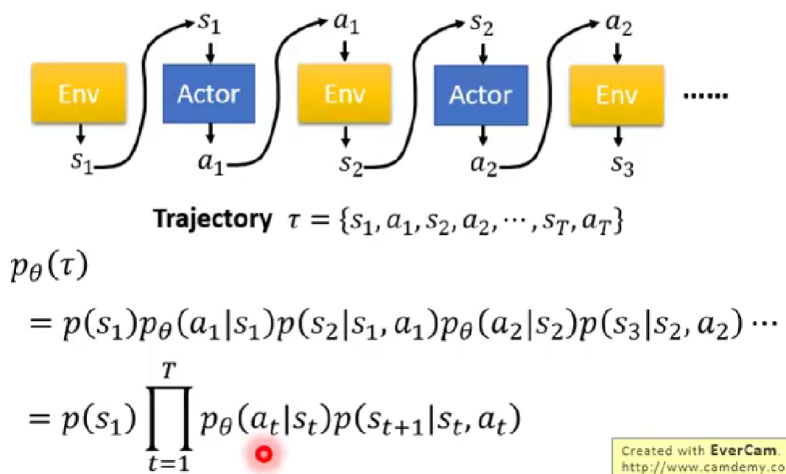
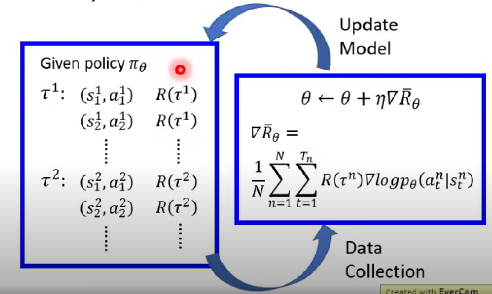
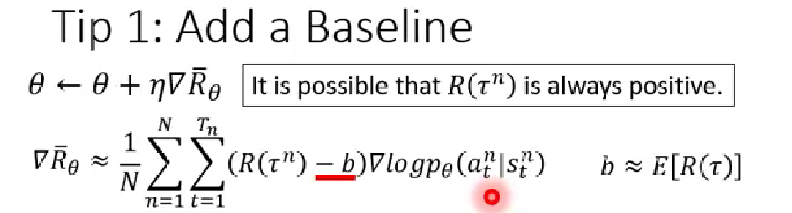
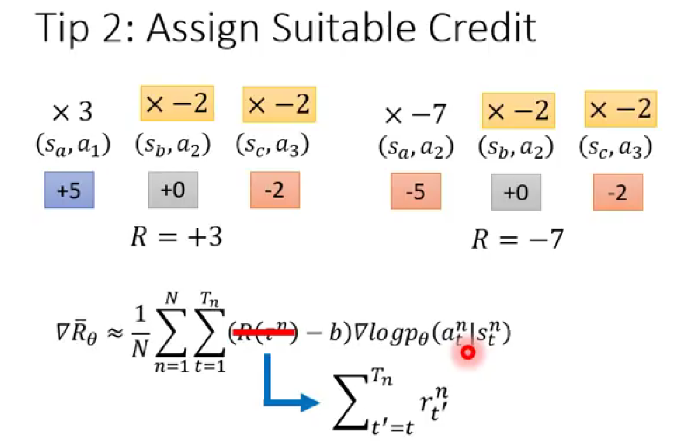
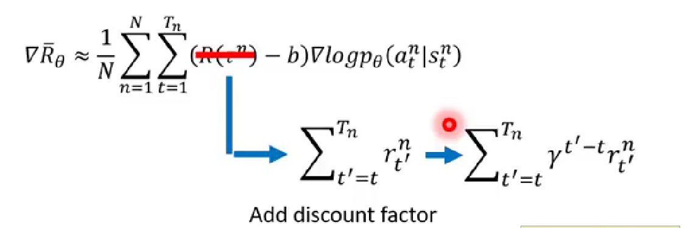

在RL中有三个组件，分别是Actor、Environment、Reward Function，后两者是在开始学习之前就事先给定的，所以你唯一要做的就是调整你的actor，调整actor里面的policy，使得它得到最大的reward。

Policy π 是带有参数 $\theta$ 的一个网络：输入是actor的一个observation，通常是一个向量或者矩阵，输出actor现在应该要执行的动作action。

比如，输入是当前帧的图片，输出是每个动作执行的机率，然后actor根据这个机率的分布选择要采取的行为，70%选择向左，20%选择向右，10%选择开火。

在$s_t$采取动作$a_t$后，会得到一个奖励$r_t$。一个episode表示进行一局游戏，其得到的全部奖励$R=\sum^T_{t=1}r_t$。

Actor, Environment, Reward 关系如下：

一个轨迹trajectory代表一个episode的路径，一个trajectory出现的机率可以表示为上图所示，其中$p(s_{t+1}|s_t,a_t)$是环境决定的，你能决定的是$p_{\theta}(a_t|s_t)$，即在 $s_t$ 要采取什么样的行为，这取决于actor的参数$\theta$。

一个trajectory的全部奖励 $R(\tau) $是一个随机变量，可以得到一个**期望**的全部奖励值$\bar{R_{\theta}}=\sum_{\tau}R(\tau)p_{\theta}(\tau)$，即根据$\theta$算出某个$\tau$出现的机率，然后乘以$(\tau)$的全部奖励，再求和得到全部奖励的期望值。 

现在要做的就是使得期望奖励最大化，这可以使用Gradient ascend。

使用gradient ascend方法来更新参数：用参数$\theta$加上gradient这一项，当然，这一项前面有学习率$\eta$（使用adam等来调）。在训练之前，需要先收集资料，也就是拿agent，其参数是$\theta$ ，去跟环境做互动，得到游戏的记录，把这些数据带入到gradient那一项中，去更新参数，然后又去收集数据，更新参数......

注意，sample的数据只能用一次。

在上面的式子中，如果在某个$s_t$采取了$a_t$得到的奖励是正的，则就要增加在$s_t$采取$a_t$的机率，反之就减小。但是在某些游戏中，奖励总是正的，这样不管什么action，都要把它的机率提升，但对于没有被sample到的action，其机率就要下降，这显然是有问题的。所以，我们希望reward不要总是正的，即让$R(\tau^n)$减去一个baseline，这样就有正有负了。这个baseline可以是$R(\tau)$的平均值。

注意的是，$R(\tau^n )$代表的是一整局游戏的全部奖励，在下图左边的流程中的reward是3分，那么在训练的时候，每个state和action的pair都会乘上3分；而在右边另一局中的reward是-7分。如果sample了很多次，对于在$s_b$采取$a_2$，在左边的情况会乘上3，而在右边的情况会乘上-7，但是$(s_b,a_2)$可能只对后面的process产生了影响，那如何很好的去描述$(s_b,a_2)$的贡献呢？我们只需计算从当前action执行以后得到的reward，而与执行这个action之前得到的reward无关，这才是当前执行这个action可能得到的贡献。在这个例子中，在$s_b$执行$a_2$，得到的reward应该是-2分而不是+3分或者-7分，因为在$s_a$执行$a_1$得到的5分并不是$a_2$的功劳。

对于未来的reward，还要添加一个折扣因子$\gamma(\gamma<1)$，这是因为时间越长，当前的$a_t$影响力越小。

把reward这一项拿出来，得Advantage Function:

$A^{\theta}(s_t,a_t)=\sum^{T_n}_{t'=t}\gamma^{t'-t}r^n_{t'} ,\quad \gamma<1$

所以，最终参数更新的公式为：

$$
\begin{align*}
&\theta=\theta + \eta\nabla\bar{R}_\theta \\
&\nabla\bar{R}_{\theta}=\frac{1}{N}\sum^N_{n=1} \sum^{T_n}_{t=1}(A^\theta(s_t,a_t)-b)\nabla \log p_\theta(a^n_t|s^n_t) \\
\end{align*}
$$