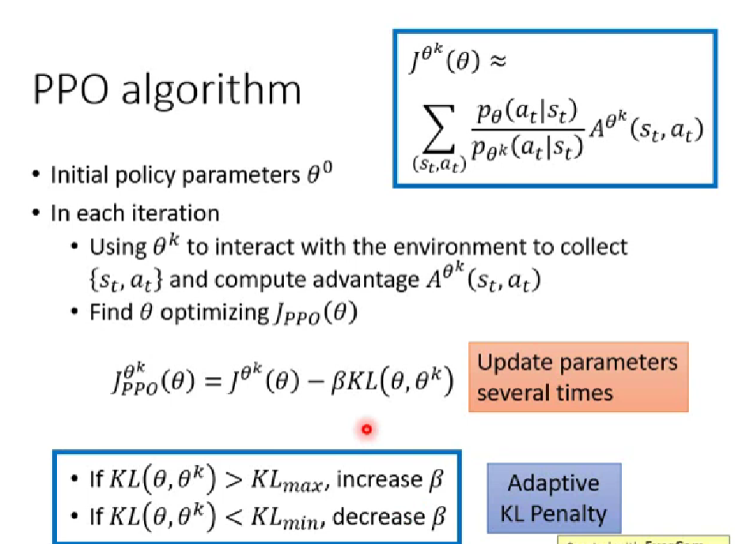

PPO是Policy Gradient 的一种变形。

On-policy：学习和与环境互动的agent是同一个。

Off-policy：学习和与环境互动的agent不是同一个，即通过看别人玩来学习。

在Policy Gradient中，$\nabla \bar{R}_\theta=E_{\tau\sim p_\theta(\tau)}[R(\tau)\nabla logp_{\theta}(\tau)]$，使用$\pi_\theta$去收集数据，当$\theta$ 被更新后，$p_\theta(\tau)$也会随之改变，所以我们必须重新去采样训练数据，这显然是非常耗费时间的。所以，将On-policy方法变为Off-policy方法的好处就是，使用$\pi_{\theta'}$采样得到的数据去训练$\theta$ ，而$\theta'$是固定的，所以可以多次使用数据（换句话说，可以使用采样的数据去多次更新参数）。这将用到重要性采样原理，继而$\nabla \bar{R}_\theta=E_{\tau\sim p_\theta'(\tau)}[\frac{p_\theta(\tau)}{p_\theta'(\tau)}R(\tau)\nabla logp_{\theta}(\tau)]$。

> Importance Sampling： $E_{x\sim p}[f(x)]=E_{x\sim q}[f(x)\frac{p(x)}{q(x)}]$

因此，原先用于更新参数的梯度计算式：
$$
\begin{align*}
& \nabla \bar{R}_\theta=E_{(s_t,a_t)\sim \pi_\theta}[A^{\theta}(s_t,a_t)\nabla logp_{\theta}(a_t^n|s_t^n)] \\
& \qquad \ =E_{(s_t,a_t)\sim \pi_\theta'}[{\frac{p_{\theta}(s_t,a_t)}{p_{\theta'}(s_t,a_t)}A^{\theta'}}(s_t,a_t)\nabla logp_{\theta}(a_t^n|s_t^n)] \\
& \qquad \ =E_{(s_t,a_t)\sim \pi_\theta'}[{\frac{p_{\theta}(a_t|s_t)}{p_{\theta'}(a_t|s_t)}A^{\theta'}}(s_t,a_t)\nabla logp_{\theta}(a_t^n|s_t^n)] \\
\end{align*}
$$
又$\nabla f(x)=f(x)\nabla logf(x)$，反推得新的目标函数：

$J^{\theta'}(\theta)=E_{(s_t,a_t)\sim \pi_{\theta'}}[\frac{p_{\theta}(a_t|s_t)}{p_{\theta'}(a_t|s_t)}A^{\theta'}(s_t,a_t)]$

其中，$\theta$ 代表需要优化的参数，$\theta'$ 用于跟环境做互动。

注意的是，如果$\theta$ 和 $\theta'$ 的分布差太多的话，重要性采样的结果就会不好，这就是PPO要做的。在做训练的时候，加一个约束（类比ML中的正则化）：

$J^{\theta^k}_{PPO}(\theta)=J^{\theta^k}(\theta)-\beta KL(\theta,\theta^k)，J^{\theta^k}(\theta)\approx \sum_{(s_t,a_t)}[\frac{p_{\theta}(a_t|s_t)}{p_{\theta^k}(a_t|s_t)}A^{\theta^k}(s_t,a_t)]$

PPO的前身TRPO(Trust Region Policy Optimization)，把KL散度作为额外的约束条件，虽然效果与PPO差不多，但实作难度大。

> PPO的前身TRPO(Trust Region Policy Optimization)：
>
> $J^{\theta'}_{TRPO}(\theta)=E_{(s_t,a_t)\sim \pi_{\theta'}}[\frac{p_{\theta}(a_t|s_t)}{p_{\theta'}(a_t|s_t)}A^{\theta'}(s_t,a_t)]\qquad KL(\theta,\theta')<\delta$

注意，这个距离（两个机率分布的KL散度）不是参数上的距离，而是行为上的距离。

训练过程中，动态调整权重$\beta$。先设一个KL散度的最大值和最小值，如果发现KL散度太大，说明约束没有起作用，那么就将$\beta$ 调大；如果KL散度太小，说明后面那一项的效果太强了，那么就减小$\beta$。

然而，计算两个分布的KL散度仍然需要很大的开销，这就有了PPO2算法：

$$J^{\theta^k}_{PPO2}(\theta)\approx \sum_{(s_t,a_t)} min(
\frac{p_{\theta}(a_t|s_t)}{p_{\theta^k}(a_t|s_t)}A^{\theta^k}(s_t,a_t),\\ \qquad\qquad\qquad\qquad\qquad\qquad\qquad\qquad\qquad
clip(\frac{p_{\theta}(a_t|s_t)}{p_{\theta^k}(a_t|s_t)}A^{\theta^k}(s_t,a_t),1-\varepsilon,1+\varepsilon)A^{\theta^k}(s_t,a_t))$$

这个式子看起来复杂，但实现起来很简单。其中$clip$函数中，若第一项小于第二项就输出第二项，若第一项大于第三项就输出第三项，否则输出第一项。这个式子的目的就是能够保持$\theta$ 与 $\theta^k$之间的差距不至于过大。
