# 介绍

Q-Learning是基于价值的方法，学习的不是策略，而是一个critic。critic并不直接采取行为，其评价现在这个actor的行为有多好或者有多不好。

比如有种critic叫状态值函数$V^{\pi}(s)$，也就是拿现在的actor $\pi$ 跟环境去做互动，在某一状态$s$ 玩到游戏结束时的累积期望奖励值有多大。

如何去估计$V^{\pi}(s)$呢？

- 基于蒙托卡洛（Monte-Carlo, MC）的方法：critic观察 $\pi$ 玩游戏，在状态 $s_a$ ， $G_a$ 就是直到游戏结束时的累计奖励，那么$V^{\pi}(s_a)$ 输出的值跟$G_a$ 越接近就越好。（玩到游戏结束才更新网络，方差更大）
- 基于时序差分（Temporal-difference, TD）的方法： $V^{\pi}(s_t)=V^{\pi}(s_{t+1})+r_t$。也就是输入$s_t$ 得到$V^{\pi}(s_t)$，输入$s_{t+1}$ 得到$V^{\pi}(s_{t+1})$，它们两个相减$V^{\pi}(s_t)-V^{\pi}(s_{t+1})$的结果跟$r_t$ 越接近越好。（更小的方差，可能不准确）

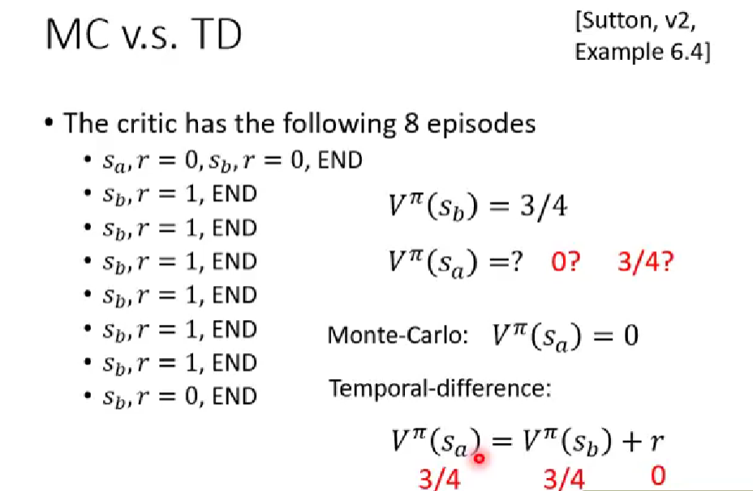

选择不同的方法会得到不同的运算结果。比如上图中，critic有8局游戏的记录，$V^{\pi}(s_b)$ 的期望值很好算就是3/4，但是$V^{\pi}(s_a)$ 会随着选择算法的不同而不同，使用MC方法，其结果为0；使用TD，则为3/4。

> TD比较稳，MC比较精确。

另外一种critic叫状态行为值函数$Q^{\pi}(s,a)$，它的输入是状态和行为的pair。假设在状态$s$，（强制）采取动作$a$，接下来都用actor $\pi$ 继续玩下去，得到的期望值就是$Q^{\pi}(s,a)$。

虽然Q函数用来评估一个actor的好坏，但实际上，只要有了这个Q函数，我们就可以做强化学习，决定采取哪个actor。假设有一个初始的actor $\pi$，去跟环境做互动收集数据，接下来去学习$\pi$ 这个actor的Q函数（在某个状态，强制采取某个动作，继续采用$\pi$会得到的期望值，使用MC或TD）。只要学习出一个$\pi$ 的Q函数，那么就保证可以找到一个新的策略$\pi'$，它比原来的$\pi$ 还要好，再替换原来的$\pi$，以此反复。

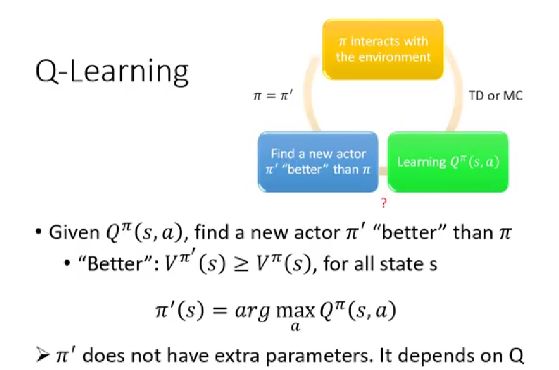

那什么叫做‘好’呢？对所有的状态$s$ 而言，$V^{\pi}(s)$ 一定会小于等于$V^{\pi'}(s)$。证明过程如下：

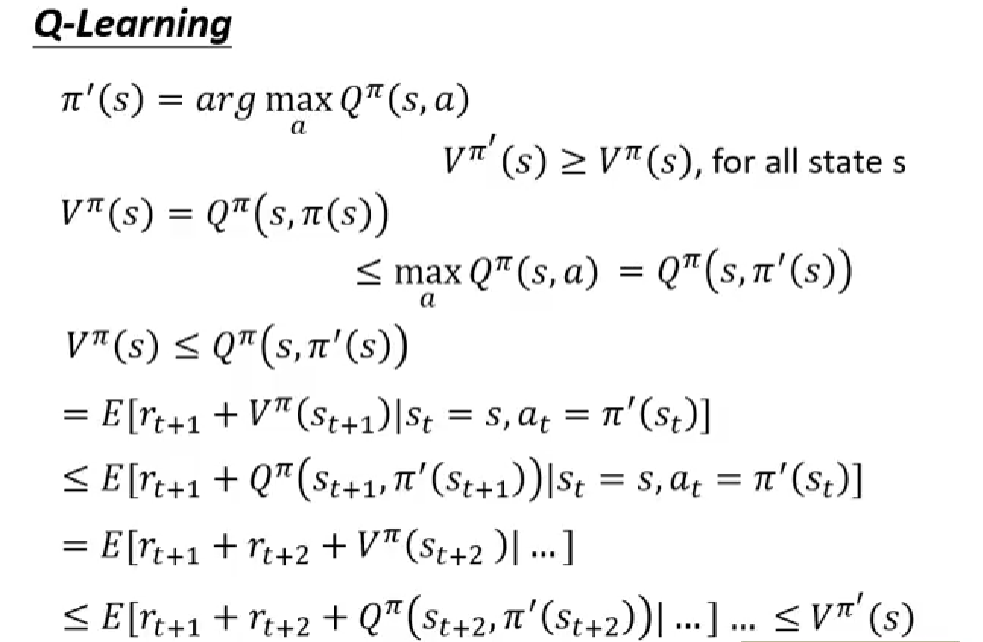

如何找$\pi'$ 呢？假如已经学习到$\pi$ 的Q函数，你把所有可能得动作都一一带入其中，看哪一个动作使得Q函数最大，那这一个动作就是$\pi'$ 会采取的动作。所以，这个$\pi'$ 就是用Q函数推出来的。注意的是，如果动作是连续空间的，那么就有问题了，这就要用到神经网络。

tip 1：初始时两个网络一样，将一个网络固定作为目标网络，其产生固定的输出$Q^{\pi}(s_{t+1},\pi(s_{t+1}))$，另一个网络输出$Q^{\pi}(s_t,a_t)$，它们之间差一个$r_t$，然后做回归更新参数，在更新了N次后，将学习的网络更新到目标网络。

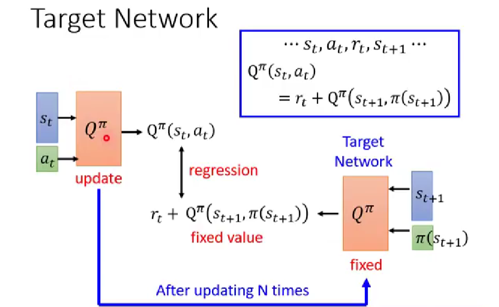

tip 2：Exploration。基于Q函数的策略，可能会只采用已经采样过的数据，而对于未知的action可能从来不会去做，这就有问题了，需要采用探索的机制。

**Epsilon Greedy**：
$$
a=\begin{cases}
arg\ max\ Q(s,a), & with \ probability \ 1-\varepsilon \\
random, & \ otherwise
\end{cases}
$$
其中，$\varepsilon$ 的值会随时间递减。因为随着训练的次数越来越多，你就大概知道哪个action是好的，这就会减少exploration。

另一个方法是**Boltzmann Exploration**：$P(a|s)=\frac{exp(Q(s,a))}{\sum_aexp(Q(s,a))}$，即根据概率分布去做采样。

tip 3：Replay Buffer。缓冲池中的记录可能不是来自同一个policy的，其实记录越多样，训练效果越好。

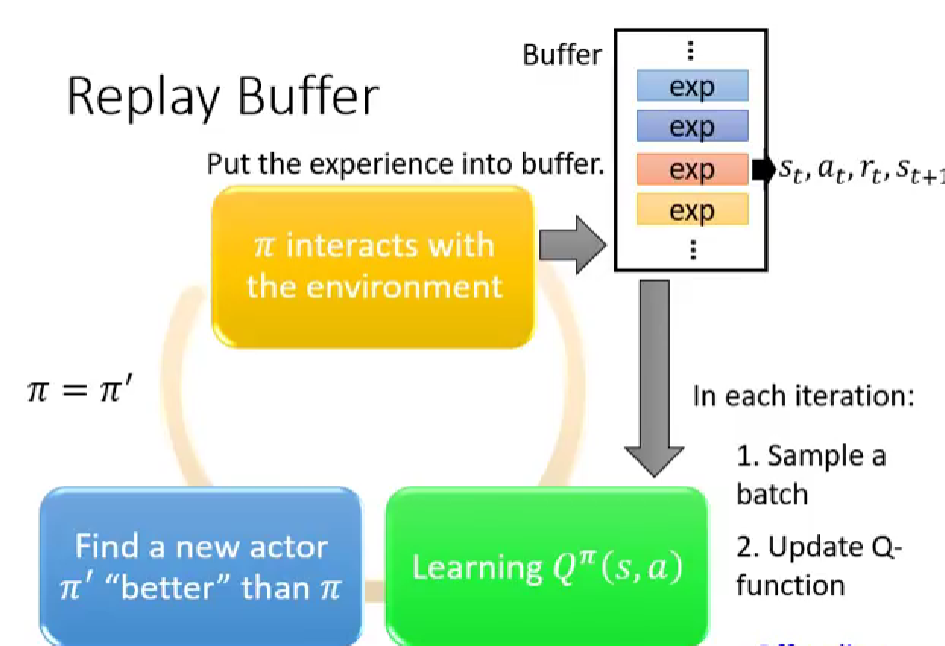

最后，总结下典型的Q-Learning算法：

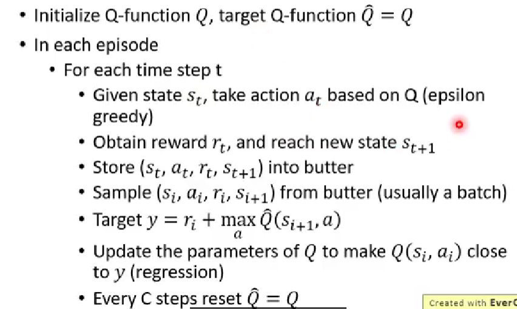

# 技巧

在实作上，Q值往往是被高估的，这是因为网络存在误差，而网络又趋向于选择被高估的动作，所以导致最终的Q值很高。

那么如何解决这个问题呢？**Double DQN**的估测值和实际值就比较接近。使用两个Q网络，选action的Q函数不同于计算value的Q函数，前者决定哪一个action的Q值最大，决定action后，实际上你的Q值是由$Q'$算出来的。

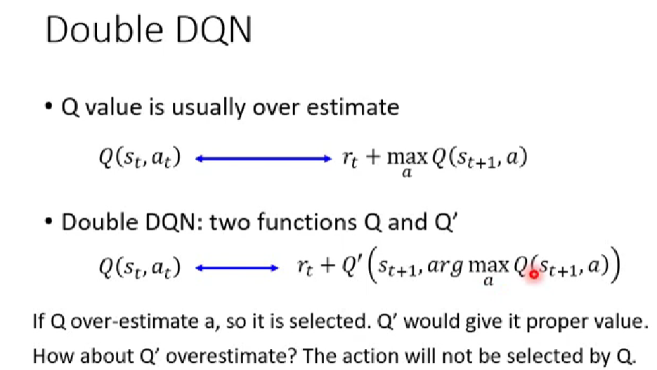

**Dueling DQN**唯一做的就是改变了网络的架构：

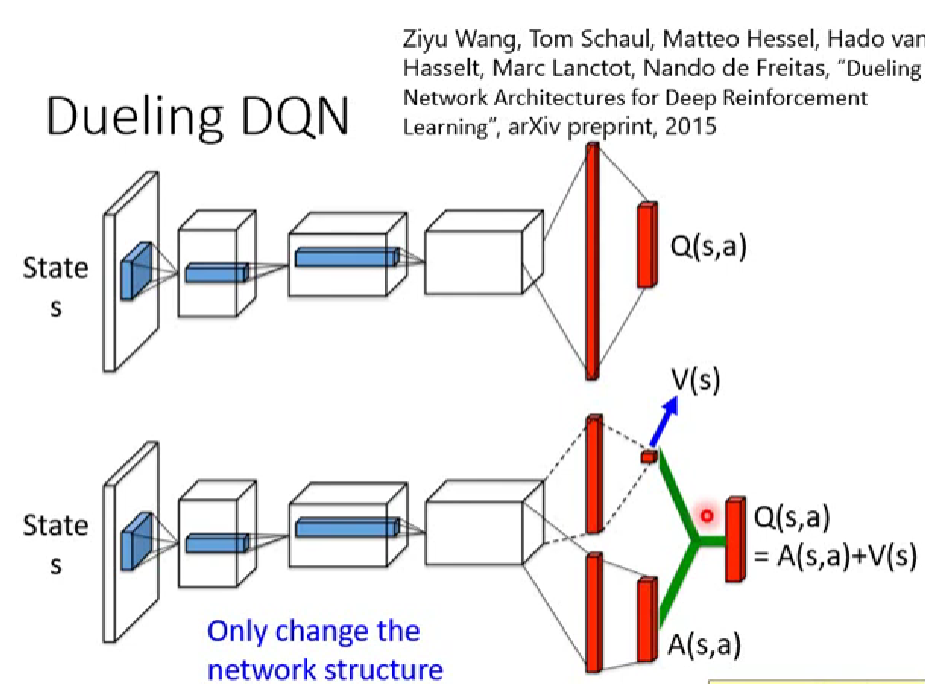

Dueling DQN将输出的$Q(s,a)$分为两条路径$V(s)$和$A(s,a)$。

MC与TD间的平衡（结合）：multi-step。引入超参数N：

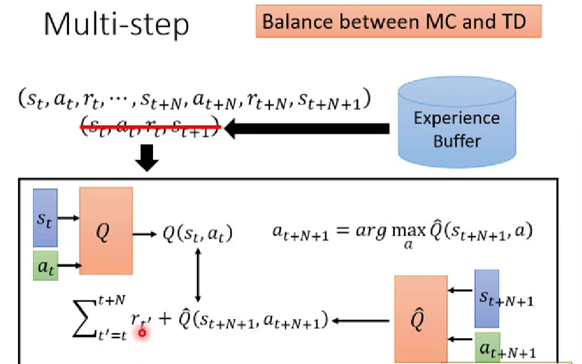

Epsilon Greedy是在动作上添加噪音，而**Noisy Net**是在参数上添加噪音：在每轮游戏开始之前，对Q网络（Q函数）的参数添加噪音（Gaussian noise），sample一个新的网络$\widetilde{Q}(s,a)$，这个网络在本局中固定，直到结束才被重新sample。

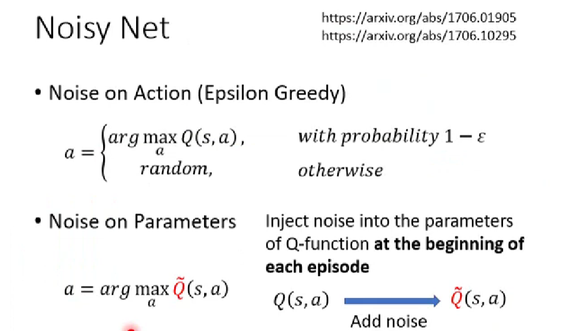

如果采用在动作上添加噪音，那么给定同样的状态，agent可能采取不同的动作，也就是”随机乱试“；如果在参数上添加噪音，那么给定同样的（相似的）状态，agent会采取一样的动作（依赖于状态的探索），也就是“有系统的试”。

**Distributional Q-function**：直接输出action的分布，选择mean最大的action去执行，如果两个mean都差不多大，选择风险比较小（方差小）的来执行。

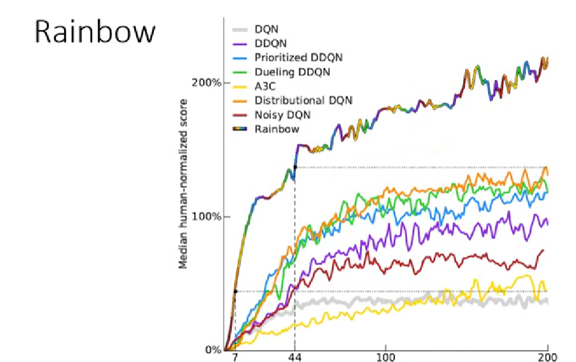

Rainbow的技术就是综合以上所有的技术，上图横轴是训练过程，纵轴是玩了十几个Atari小游戏的平均分数的和，取中位数。下图是拿掉某个技术的表现情况。

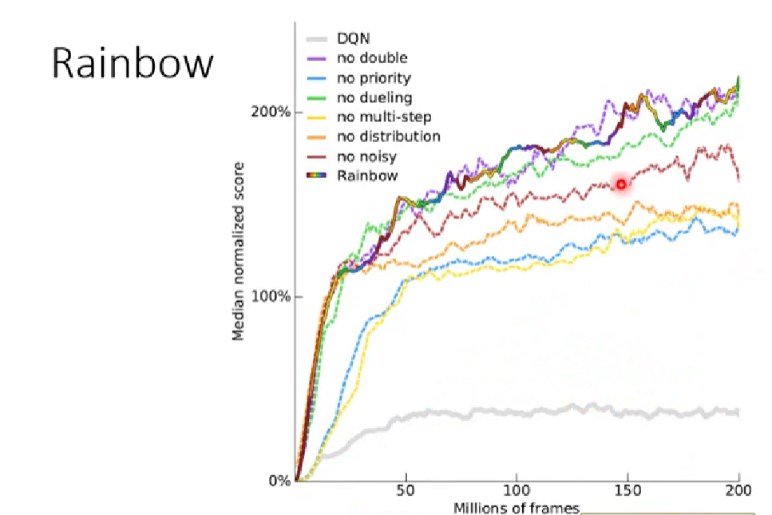

# 连续动作空间的Q-Learning

Q-Learning不太容易处理连续动作空间的问题，比如驾驶转向、机器人运动时关节转动角度问题。Q-Learning就是去找到一个动作$a=arg\ max\ Q(s,a)$，如果$a$是离散的，那也就是说$a$ 的可能性是有限的；如果动作$a$ 是一个连续型的向量，无法穷举所有的动作，要找到哪一个$a$ 使得Q值最大，那么怎么解决这个问题呢？

方法一：采样动作集合：$\{a_1, a_2,...,a_N\}$，找到哪一个$a$ 可以得到最大的Q值（可能不是很精确）；

方法二：使用梯度上升来解决这个优化问题（运算量很大，非常耗费时间）；

方法三：特别设计一个网络结构，使得找到这个最大的Q值很容易。

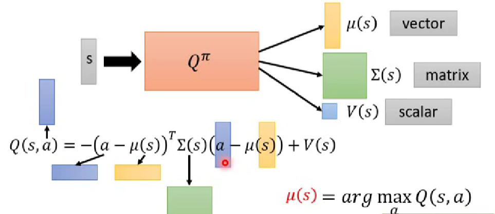

这个网络的输入是一个$s$，输出有三个：向量$\mu(s)$、正定矩阵$\sum(s)$以及标量$V(s)$。得到这三个结果后，$a$ 是一个连续向量，比如是机器人的动作，这个向量包括50个值，每个值代表对应关节的角度，将a带入上图下面的公式。因为前面带了一个负号，而$\sum(s)$是一个正定矩阵，所以当$a-\mu(s)=0$ 时，Q值最大，即$\mu(s)=arg\ max\ Q(s,a)$。 

方法四：不要用Q-Learning。

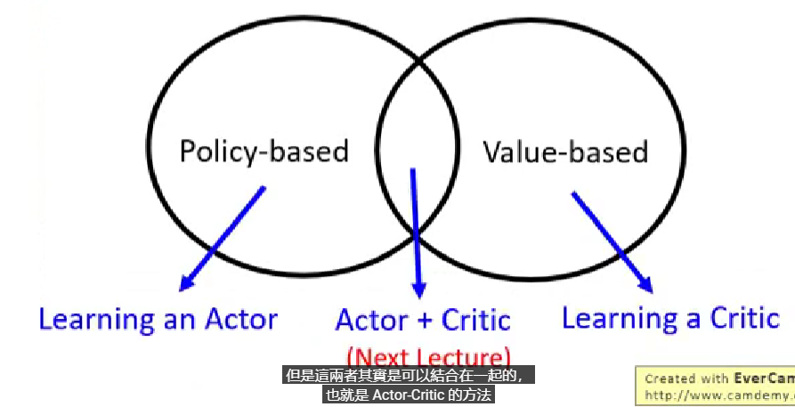

基于策略的方法学习一个演员如PPO，基于价值的方法学习一个评论家如Q-Learning，将这两者结合起来就是演员-评论家算法。
