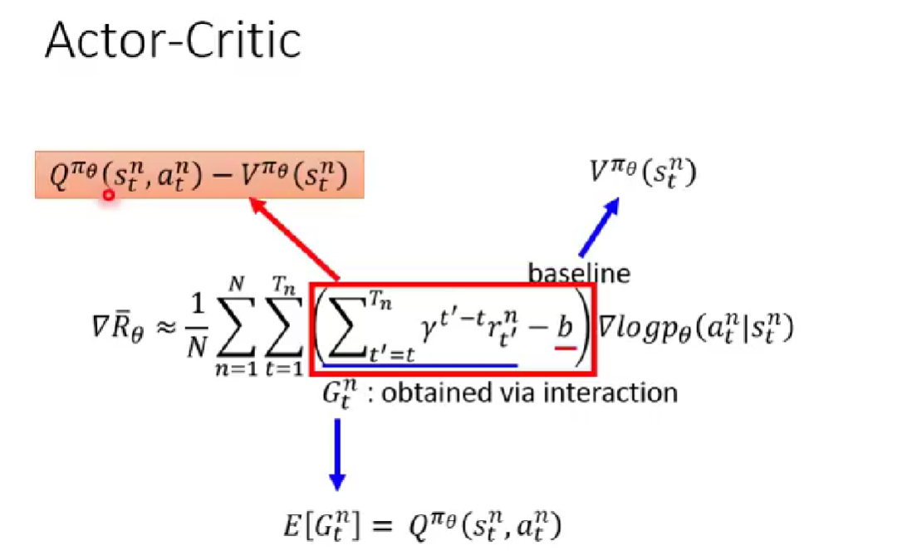
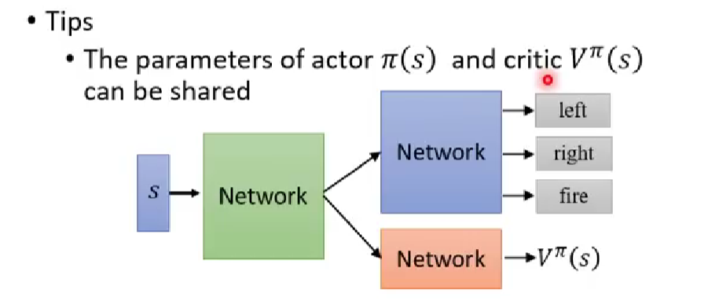
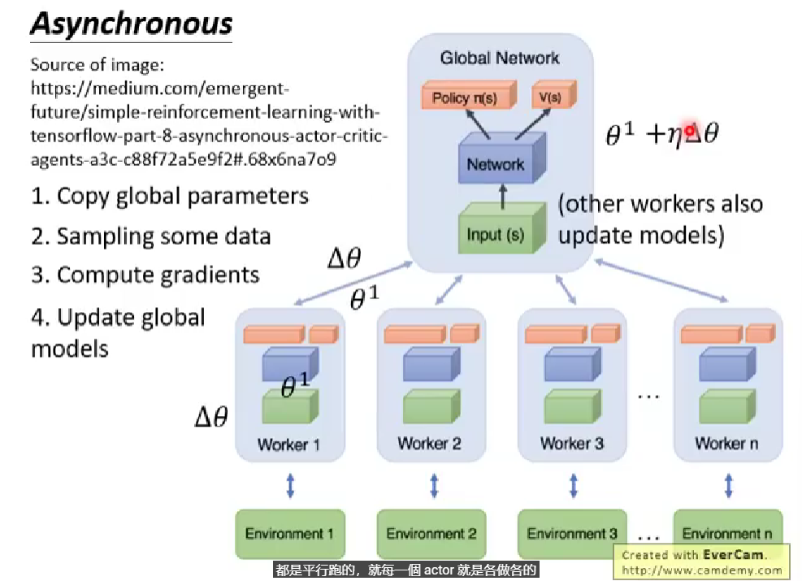
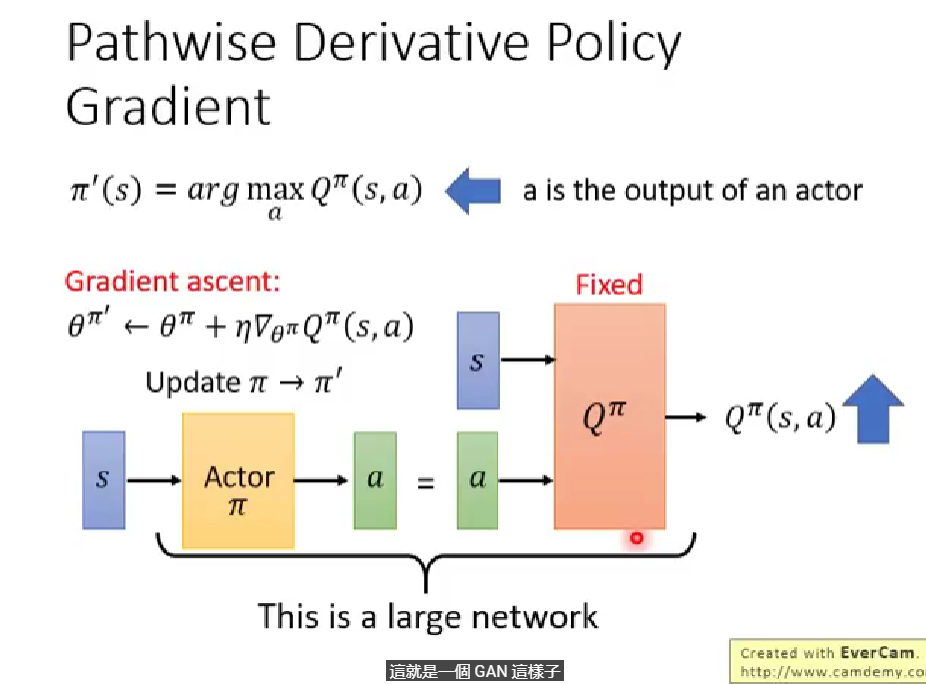
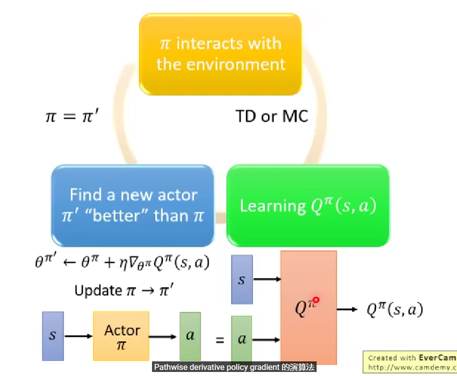
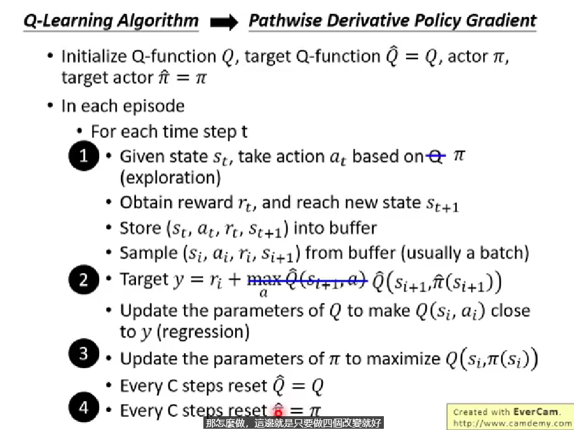
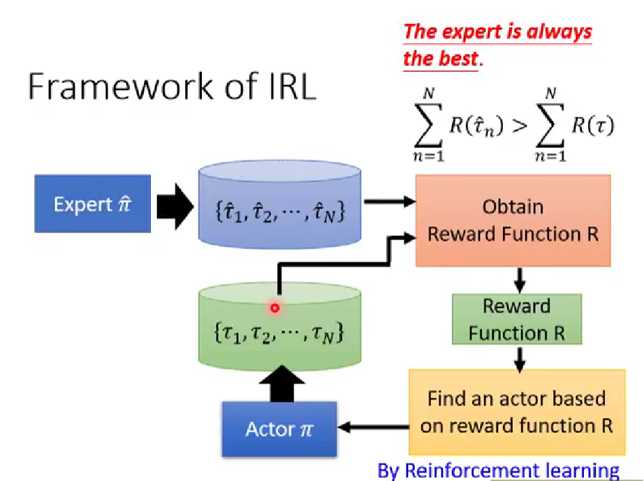
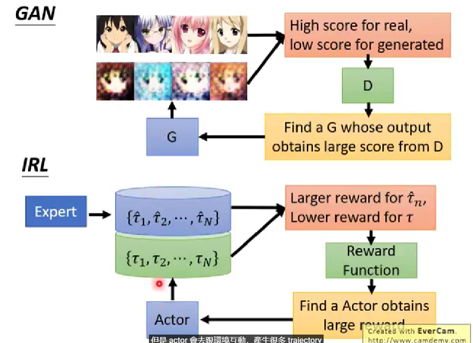

# Asynchronous Advantage Actor-Critic(A3C)

回顾一下，在策略梯度中，计算梯度的式子$\nabla \bar{R_{\theta}}\approx \frac{1}{N}\sum^{N}_{n=1}\sum^{T_n}_{t=1}(\sum^{T_n}_{t'=t}\gamma^{t'-t}r^n_{t'}-b)\nabla logp_{\theta}(a^n_t | s^n_t)$。

用$G^n_t=\sum^{T_n}_{t'=t}\gamma^{t'-t}r^n_{t'}$ 来表示从$t$ 开始获得的累积奖励，用$b$ 表示基准（通常是期望奖励的平均值）。明显$G$是一个随机变量，其值具有随机性，可能导致方差很大，那如何让它具有稳定的值呢？可以使用一个网络，估测在状态$s$ 的时候采取动作$a$ 时的$G$ 的期望值，之后在训练的时候，用这个期望的值代替采样的值，这样会让训练得比较稳定。

那怎么拿期望值代替采样的值呢？引入基于价值的方法Q-Learning：

- 状态值函数$V^{\pi}(s)$：使用actor $\pi$ ，在状态$s$ 之后期望的累积奖励；
- 状态-动作值函数$Q^{\pi}(s,a)$：使用actor  $\pi$，在状态$s$ 采取动作$a$ 后的期望累积奖励。

根据Q函数的定义，$G^n_t$ 的期望值$E[G^n_t]=Q^{\pi_{\theta}}(s^n_t,a^n_t)$；对于baseline，可以使用值函数$V^{\pi_{\theta}}(s^n_t)$来表示（可以是，G的期望值），那么原式就变为

$\nabla \bar{R_{\theta}}\approx \frac{1}{N}\sum^{N}_{n=1}\sum^{T_n}_{t=1}(Q^{\pi_{\theta}}(s^n_t,a^n_t)-V^{\pi_{\theta}}(s^n_t))\nabla logp_{\theta}(a^n_t | s^n_t)$

可是实作的话，这样需要去估计两个网络Q和V，估测不准的风险也就扩大了两倍。事实上，可以只估测V值，这是因为：

$Q^{\pi}(s^n_t,a^n_t)=r^n_t+V^{\pi}(s^n_{t+1})$

这样做的好处就是只需估测一个V，同时引入了随机的变量$a$，但是相较于之前的$G$，它是某一个step会得到的奖励，而$G$ 是所有未来的step会得到的奖励总和，所以$G$ 的方差较大。

所以现在的流程是，我们先有一个初始的$\pi$，跟环境做互动得到许多的资料，然后拿这些资料去估测出$V^{\pi}(s)$，这个估测的过程可以用TD或者MC。估测出V值后，套用上图下面的公式去更新$\pi$ 得到$\pi'$，然后以此重复。

tip 1：actor $\pi$ 和critic $V^{\pi}(s)$的参数可以共享。

actor输出的是一个向量，表示执行的动作，critic输出的是V值，它们的输入都是状态$s$，所以网络前面几个层可以是一样的。

tip 2：希望有探索的机制。对$\pi(s)$ 的输出使用entropy，因为大的entropy更利于探索，也就是希望对每个action被采用的机率平均一点。这就是Advantage Actor-Critic（A2C）。

Asynchronous Advantage Actor-Critic（A3C）的思想就是同时开多个worker（这就需要多个CPU支持），然后把每个worker的经验集合在一起。

# Pathwise Derivative Policy Gradient

路径导数策略梯度可以写成Q-Learning解连续动作空间的一种特别的方法，也可以看为一种特别的Actor-Critic方法。

原来的AC算法会告诉你这个动作好不好，而PDPG会直接引导actor去做什么样的动作。

假设学习一个Q函数，输入是$s$和$a$，输出是$Q^{\pi}(s,a)$。另外学习一个actor，它的工作是解决$argmax$的问题，这个网络的输入是状态$s$，输出是$a$，这个$a$ 丢入Q以后，它可以让$Q^{\pi}(s,a)$的值越大越好。实作的时候，把actor和Q接起来变成一个比较大的网络，然后固定住Q的参数，只去调actor的参数，然后用梯度下降的方法去最大化Q的输出，这类似于GAN。

这个算法整个流程是，首先有一个$\pi$ 去跟环境做互动，估测完Q值以后，就把Q值固定，只去学习actor，假设Q值估的很准，那这个actor就知道在哪个状态$s$采取哪个动作$a$，可以让Q函数算出来的值越大越好，然后去更新$\pi$，以此反复。

在Q-Learning中使用的方法都可以应用到这里面。

①：Q-Learning中的$(s_t,a_t)$是Q决定的，而在PDPG中，这是$\pi$决定的；

②：第二个改变是，原来是在$s_{t+1}$看采取哪个action使得Q最大，而现在因为不好解这个argmax问题，将这个问题改为由$\pi$ 来解，也就是把$s_{t+1}$代到$\pi$ 里面，现在就知道给定$s_{t+1}$哪一个action会给我们最大的Q值，那就采取这个action；

③：之前只用学习Q，现在多了$\pi$，学习$\pi$的目的就是最大化Q函数的输出；

④：把目标Q和目标$\pi$更新掉。

其实，Actor-Critic和GAN是很相似的。

# Sparse reward

Reward Shaping：为了达到目的，刻意的额外的设计一些奖励；

Curiosity：给机器加上好奇心；

Curriculum Learning：为机器规划它学习的顺序。像课程一样的学习，从易到难，先简单的数据后复杂的数据；

Hierarchical Reinforcement Learning：有阶层式的强化学习，将不同的agent分为不同的层次，类似于老板-项目经理-程序员。

# Imitation Learning

模仿学习也叫演示学习、学徒学习，也就是一个expert演示如何去解决问题的。包括两种方法：Behavior Cloning、Inverse Reinforcement Learning(inverse optimal control)。

行为克隆就是完全模仿expert的行为。

逆强化学习（逆最优控制）：

假设expert永远是最好的，训练一个网络$R$，它的输入就是一个trajectory，输出是对应的奖励，这个网络要使得expert的samples奖励更大、actor的samples的奖励更小。

这与GAN非常类似：

