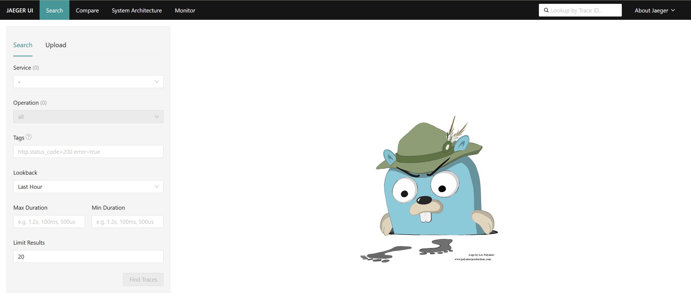
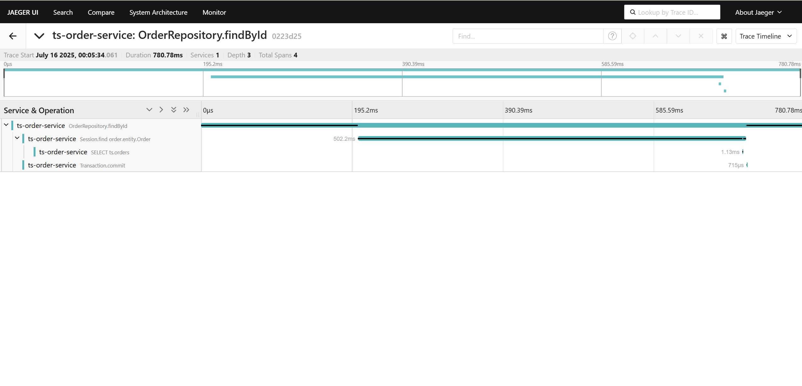

# 分布式系统的运维挑战

容器、Serverless 编程方式的诞生极大提升了软件交付与部署的效率。在架构的演化过程中，可以看到两个变化： 应用架构开始从单体系统逐步转变为微服务，其中的业务逻辑随之而来就会变成微服务之间的调用与请求。


这种弹性、标准化的架构背后，原先运维与诊断的需求也变得越来越复杂。为了应对这种变化趋势，诞生一系列面向 DevOps 的诊断与分析系统，包括集中式日志系统（Logging），集中式度量系统（Metrics）和分布式追踪系统（Tracing）。

## **Logging，Metrics 和 Tracing**

Logging，Metrics 和 Tracing 有各自专注的部分。

- Logging - 用于记录离散的事件。例如，应用程序的调试信息或错误信息。它是我们诊断问题的依据。
- Metrics - 用于记录可聚合的数据。例如，队列的当前深度可被定义为一个度量值，在元素入队或出队时被更新；HTTP 请求个数可被定义为一个计数器，新请求到来时进行累加。
- Tracing - 用于记录请求范围内的信息。例如，一次远程方法调用的执行过程和耗时。它是我们排查系统性能问题的利器。

这三者也有相互重叠的部分，如下图所示。


通过上述信息，我们可以对已有系统进行分类。例如，Zipkin 专注于 tracing 领域；Prometheus 开始专注于 metrics，随着时间推移可能会集成更多的 tracing 功能，但不太可能深入 logging 领域； ELK，阿里云日志服务这样的系统开始专注于 logging 领域，但同时也不断地集成其他领域的特性到系统中来，正向上图中的圆心靠近。

关于三者关系的更详细信息可参考 [Metrics, tracing, and logging](https://link.zhihu.com/?target=http%3A//peter.bourgon.org/blog/2017/02/21/metrics-tracing-and-logging.html)。下面来重点介绍下Tracing。

# Tracing

Tracing 是在90年代就已出现的技术。但真正让该领域流行起来的还是源于 Google 的一篇论文"[Dapper, a Large-Scale Distributed Systems Tracing Infrastructure](https://link.zhihu.com/?target=https%3A//research.google.com/pubs/pub36356.html)"，而另一篇论文"[Uncertainty in Aggregate Estimates from Sampled Distributed Traces](https://link.zhihu.com/?target=https%3A//research.google.com/pubs/pub40378.html)"中则包含关于采样的更详细分析。论文发表后一批优秀的 Tracing 软件孕育而生，比较流行的有：

- Dapper(Google) : 各 tracer 的基础
- [StackDriver Trace](https://zhida.zhihu.com/search?content_id=5917288&content_type=Article&match_order=1&q=StackDriver+Trace&zhida_source=entity) (Google)
- Zipkin(twitter)
- [Appdash](https://zhida.zhihu.com/search?content_id=5917288&content_type=Article&match_order=1&q=Appdash&zhida_source=entity)(golang)
- [鹰眼](https://zhida.zhihu.com/search?content_id=5917288&content_type=Article&match_order=1&q=鹰眼&zhida_source=entity)(taobao)
- [谛听](https://zhida.zhihu.com/search?content_id=5917288&content_type=Article&match_order=1&q=谛听&zhida_source=entity)(盘古，阿里云云产品使用的Trace系统)
- [云图](https://zhida.zhihu.com/search?content_id=5917288&content_type=Article&match_order=1&q=云图&zhida_source=entity)(蚂蚁Trace系统)
- sTrace(神马)
- [X-ray](https://zhida.zhihu.com/search?content_id=5917288&content_type=Article&match_order=1&q=X-ray&zhida_source=entity)(aws)

分布式追踪系统发展很快，种类繁多，但核心步骤一般有三个：代码埋点，数据存储、查询展示。

下图是一个分布式调用的例子，客户端发起请求，请求首先到达负载均衡器，接着经过认证服务，计费服务，然后请求资源，最后返回结果。


数据被采集存储后，分布式追踪系统一般会选择使用包含时间轴的时序图来呈现这个 Trace。


但在数据采集过程中，由于需要侵入用户代码，并且不同系统的 API 并不兼容，这就导致了如果您希望切换追踪系统，往往会带来较大改动。

## OpenTracing

为了解决不同的分布式追踪系统 API 不兼容的问题，诞生了 [OpenTracing](https://link.zhihu.com/?target=http%3A//opentracing.io/) 规范。

OpenTracing 是一个轻量级的标准化层，它位于**应用程序/类库**和**追踪或日志分析程序**之间。


OpenTracing 的优势

- OpenTracing 已进入 CNCF，正在为全球的分布式追踪，提供统一的概念和数据标准。
- OpenTracing 通过提供平台无关、厂商无关的 API，使得开发人员能够方便的添加（或更换）追踪系统的实现。

**OpenTracing 数据模型**

OpenTracing 中的 **Trace**（调用链）通过归属于此调用链的 **Span** 来隐性的定义。特别说明，一条 **Trace**（调用链）可以被认为是一个由多个 **Span** 组成的有向无环图（DAG图），**Span** 与 **Span** 的关系被命名为 **References**。

例如：下面的示例 **Trace** 就是由8个 **Span** 组成：


有些时候，使用下面这种，基于时间轴的时序图可以更好的展现 **Trace**（调用链）：


每个 **Span** 包含以下的状态:（译者注：由于这些状态会反映在 OpenTracing API 中，所以会保留部分英文说明）

- An operation name，操作名称
- A start timestamp，起始时间
- A finish timestamp，结束时间
- **Span Tag**，一组键值对构成的 Span 标签集合。键值对中，键必须为 string，值可以是字符串，布尔，或者数字类型。
- **Span Log**，一组 span 的日志集合。每次 log 操作包含一个键值对，以及一个时间戳。键值对中，键必须为 string，值可以是任意类型。但是需要注意，不是所有的支持 OpenTracing 的 Tracer，都需要支持所有的值类型。

- **SpanContext**，Span 上下文对象 (下面会详细说明)，每一个 **SpanContext** 包含以下状态：任何一个 OpenTracing 的实现，都需要将当前调用链的状态（例如：trace 和 span 的 id），依赖一个独特的 Span 去跨进程边界传输
- **References**(Span间关系)，相关的零个或者多个 Span（**Span** 间通过 **SpanContext** 建立这种关系）

- **Baggage Items**，Trace 的随行数据，是一个键值对集合，它存在于 trace 中，也需要跨进程边界传输

更多关于 OpenTracing 数据模型的知识，请参考 [OpenTracing语义标准](https://link.zhihu.com/?target=https%3A//github.com/opentracing-contrib/opentracing-specification-zh/blob/master/specification.md)。

这篇[文档](https://link.zhihu.com/?target=http%3A//opentracing.io/documentation/pages/supported-tracers.html)列出了所有 OpenTracing 实现。在这些实现中，比较流行的为 [Jaeger](https://link.zhihu.com/?target=http%3A//jaeger.readthedocs.io/en/latest/) 和 [Zipkin](https://link.zhihu.com/?target=https%3A//zipkin.io/)。

# Jaeger

## 基础知识

### 什么是Jaeger

Jaeger 是 Uber Technologies 于 2016 年发布的**开源分布式跟踪平台**，并捐赠给了云原生计算基金会（Cloud Native Computing Foundation），其主要功能包括：

- 监控分布式工作流并排除故障
- 找出性能瓶颈
- 定位追踪本质问题
- 分析服务依赖性

(2024-11-12)作为领先的开源分布式跟踪平台，Jaeger已经成功地与OpenTracing和OpenTelemetry等行业标准化工作紧密结合了9年。Jaeger 是云原生计算基金会（CNCF）的首批毕业项目之一。在发布了 60 多个版本之后，Jaeger 迎来了一个重要的里程碑--Jaeger v2 版本的发布。这是一个以 OpenTelemetry Collector 框架为基础的新架构，并对其进行了扩展，以实现 Jaeger 的独特功能。它带来了重大改进和变化，使Jaeger更加灵活、可扩展，并与OpenTelemetry项目更加一致。

> [Jaeger](http://jaeger.readthedocs.io/en/latest/) 是 Uber 推出的一款开源分布式追踪系统，为微服务场景而生。它主要用于分析多个服务的调用过程，图形化服务调用轨迹，是诊断性能问题、分析系统故障的利器。


如上图所示，Jaeger 主要由以下几部分组成。

- Jaeger Client - 为不同语言实现了符合 OpenTracing 标准的 SDK。应用程序通过 API 写入数据，client library 把 trace 信息按照应用程序指定的采样策略传递给 jaeger-agent。

- Agent - 它是一个监听在 UDP 端口上接收 span 数据的网络守护进程，它会将数据批量发送给 collector。它被设计成一个基础组件，部署到所有的宿主机上。Agent 将 client library 和 collector 解耦，为 client library 屏蔽了路由和发现 collector 的细节。

- Collector - 接收 jaeger-agent 发送来的数据，然后将数据写入后端存储。Collector 被设计成无状态的组件，因此您可以同时运行任意数量的 jaeger-collector。

- Data Store - 后端存储被设计成一个可插拔的组件，支持将数据写入 cassandra、elasticSearch。

- Query - 接收查询请求，然后从后端存储系统中检索 trace 并通过 UI 进行展示。Query 是无状态的，您可以启动多个实例，把它们部署在 nginx 这样的负载均衡器后面。

### 两个术语

1、Trace ID

Trace ID是一个16字节的标识符，通常表示为32个字符的十六进制字符串。它在跟踪开始时自动生成，并在由特定请求创建的所有跨度中保持不变。这样可以很容易地看到请求是如何通过系统中的不同服务或组件传递的。

2、Span ID

跟踪中的每个单独操作都有自己的Span ID，它通常是一个随机生成的64位值。Span共享相同的Trace ID，但是每个Span都有一个唯一的Span ID，因此可以确定每个Span代表工作流的哪个部分（如数据库查询或对另一个微服务的调用）。

**Trace ID**和**Span ID**是相辅相成的。当发起请求时，会生成一个Trace ID，并将其传递给所有相关服务。每个服务又会创建一个与Trace ID关联的、具有唯一Span ID的Span，从而能够可视化请求从开始到结束的完整生命周期。

## Jaeger 的安装与使用

### 安装

参考：https://github.com/jaegertracing/jaeger-operator?tab=readme-ov-file

#### 1. 首先安装 cert-manager

```bash
# 添加 cert-manager Helm 仓库
helm repo add jetstack https://charts.jetstack.io
# 添加Jaeger Helm仓库
helm repo add jaegertracing https://jaegertracing.github.io/helm-charts
helm repo update

# 安装 cert-manager CRDs
kubectl apply -f https://github.com/cert-manager/cert-manager/releases/download/v1.14.4/cert-manager.crds.yaml

# 安装 cert-manager
helm install cert-manager jetstack/cert-manager \
  --namespace cert-manager \
  --create-namespace \
  --version v1.14.4
```

#### 2. 验证 cert-manager 安装

```bash
kubectl get pods -n cert-manager --watch
# 等待所有 Pod 变为 Running 状态
NAME                                      READY   STATUS      RESTARTS   AGE
cert-manager-6dc66985d4-j4jbf             1/1     Running     0          18m
cert-manager-cainjector-c7d4dbdd9-chljm   1/1     Running     0          18m
cert-manager-startupapicheck-hvk7f        0/1     Completed   0          18m
cert-manager-webhook-847d7676c9-wn9xs     1/1     Running     0          18m
```

#### 3. 安装 Jaeger Operator（跳过 TLS 依赖）

```bash
helm install jaeger-operator jaegertracing/jaeger-operator \
  --namespace observability \
  --create-namespace \
  --set rbac.clusterRole=true \
  --set rbac.clusterRoleBinding=true \
  --set certManager.enabled=false  # 关键：禁用证书管理
```

等待对应的Pod就绪：
```bash
root@k8s-master:~/work# kubectl get pods -n observability -w
NAME                               READY   STATUS    RESTARTS   AGE
jaeger-operator-6d4c95967d-42z4f   1/1     Running   0          61s
```

#### 4. 创建 TrainTicket 专用的 Jaeger 实例

```bash
kubectl apply -f - <<EOF
apiVersion: jaegertracing.io/v1
kind: Jaeger
metadata:
  name: train-ticket-jaeger
  namespace: train-ticket
spec:
  strategy: allInOne
  storage:
    type: memory
    options:
      memory:
        max-traces: 100000
  agent:
    strategy: DaemonSet
  resources:
    limits:
      cpu: 500m
      memory: 512Mi
    requests:
      cpu: 100m
      memory: 256Mi
EOF
```

#### 5. 配置验证

```bash
# 检查 Jaeger 组件状态
kubectl get pods -n train-ticket -l app.kubernetes.io/instance=train-ticket-jaeger

# 等待Pods就绪
kubectl get pods -n train-ticket -l app.kubernetes.io/instance=train-ticket-jaeger
NAME                                        READY   STATUS    RESTARTS   AGE
train-ticket-jaeger-agent-daemonset-8n4mh   1/1     Running   0          38s
train-ticket-jaeger-agent-daemonset-bft7k   1/1     Running   0          38s
train-ticket-jaeger-dc495b975-dpjjl         1/1     Running   0          69s

# 查看服务
kubectl get svc -n train-ticket | grep jaeger
train-ticket-jaeger-agent                ClusterIP   None             <none>        5775/UDP,5778/TCP,6831/UDP,6832/UDP,14271/TCP                        2m24s
train-ticket-jaeger-collector            ClusterIP   10.108.248.234   <none>        9411/TCP,14250/TCP,14267/TCP,14268/TCP,14269/TCP,4317/TCP,4318/TCP   2m24s
train-ticket-jaeger-collector-headless   ClusterIP   None             <none>        9411/TCP,14250/TCP,14267/TCP,14268/TCP,14269/TCP,4317/TCP,4318/TCP   2m24s
train-ticket-jaeger-query                ClusterIP   10.96.123.223    <none>        16686/TCP,16685/TCP,16687/TCP                                        2m24s
```

#### 6. 获取Jaeger访问地址

获取 Jaeger UI 访问地址

```bash
# 获取 NodePort 端口号
JAEGER_PORT=$(kubectl get svc train-ticket-jaeger-query -n train-ticket -o jsonpath='{.spec.ports[?(@.name=="http-query")].nodePort}')

# 获取节点 IP
NODE_IP=$(kubectl get nodes -o jsonpath='{.items[0].status.addresses[?(@.type=="InternalIP")].address}')

echo "Jaeger UI 访问地址: http://$NODE_IP:$JAEGER_PORT"
```

如果 NodePort 未分配（显示为空），需要修改服务类

```bash
# 将查询服务改为 NodePort 类型
kubectl patch svc train-ticket-jaeger-query -n train-ticket -p '{"spec": {"type": "NodePort"}}'

# 重新获取端口
JAEGER_PORT=$(kubectl get svc train-ticket-jaeger-query -n train-ticket -o jsonpath='{.spec.ports[0].nodePort}')
echo "Jaeger UI 访问地址: http://$NODE_IP:$JAEGER_PORT"
```

预期输出：

```bash
Jaeger UI 访问地址: http://192.168.31.102:31804
```

在浏览器访问地址http://192.168.31.102:31804：



### 使用Jaeger进行 Trace 数据采集

确保 Helm 已正确添加 Jaeger 官方仓库并更新本地缓存。以下是完整步骤：

#### 1. **添加 Jaeger Helm 仓库**

```bash
helm repo add jaegertracing https://jaegertracing.github.io/helm-charts
```

- 验证仓库是否添加成功：

```bash
  helm repo list | grep jaegertracing
  # 预期输出：jaegertracing https://jaegertracing.github.io/helm-charts
```

#### 2. **更新 Helm 仓库缓存**

```bash
helm repo update
```

- 确保更新后能搜索到 Jaeger Chart：

```bash
helm search repo jaegertracing/jaeger

# 预期输出：jaegertracing/jaeger <版本号>
```

#### 3. **重新执行升级命令**

```bash
helm upgrade jaeger-inmemory-instance jaegertracing/jaeger -n default \
  --set collector.otlp.enabled=true
```

首先，为所有微服务添加 Jaeger 配置

```bash
# 批量添加 Jaeger 环境变量
kubectl get deploy -n train-ticket -o name | while read deployment; do
  kubectl set env -n train-ticket $deployment \
    JAEGER_SERVICE_NAME=$(echo $deployment | sed 's/deployment.apps\///') \
    JAEGER_AGENT_HOST=train-ticket-jaeger-agent.train-ticket.svc \
    JAEGER_AGENT_PORT=6831 \
    JAEGER_SAMPLER_TYPE=const \
    JAEGER_SAMPLER_PARAM=1
done

# 重启所有微服务使配置生效
kubectl rollout restart deploy -n train-ticket
```

等待所有Pods重启就绪。

使用端口转发确保连接：

```bash
kubectl port-forward -n default svc/jaeger-inmemory-instance-collector 16686:16686 &
sleep 2
[1] 316209
Forwarding from 127.0.0.1:16686 -> 16686
Forwarding from [::1]:16686 -> 16686
```

使用以下命令将指定微服务`jaeger`的traces数据导出为`spans.json`：

```bash
curl -s "http://localhost:16686/api/traces?service=jaeger" |   jq '.data[] | {traceID: .traceID, spans: .spans}' | jq -s '.' > spans.json
Handling connection for 16686
```

通过以上方法虽然能够运行jaeger，但是我导出的 `json`文件没有数据，于是采用`grpc`协议的方式：

**步骤 1：设置环境变量**

```bash
# 设置完整的 gRPC 端点配置
kubectl set env deployment/ts-order-service -n train-ticket \
  OTEL_EXPORTER_OTLP_PROTOCOL=grpc \
  OTEL_EXPORTER_OTLP_ENDPOINT=jaeger-inmemory-instance-collector.default.svc.cluster.local:4317 \
  OTEL_METRICS_EXPORTER=none \
  OTEL_LOGS_EXPORTER=none
```

**步骤 2：重启 Deployment**

```bash
# 强制重启 Deployment
kubectl rollout restart deployment/ts-order-service -n train-ticket

# 等待新 Pod 启动
watch kubectl get pods -l app=ts-order-service -n train-ticket
```

在启动日志中可以看到 agent 添加成功：

```bash
Picked up JAVA_TOOL_OPTIONS: -javaagent:/otel-java-agent/opentelemetry-javaagent.jar
[otel.javaagent 2025-07-16 01:23:33:300 +0800] [main] INFO io.opentelemetry.javaagent.tooling.VersionLogger - opentelemetry-javaagent - version: 2.17.1
  .   ____          _            __ _ _
 /\\ / ___'_ __ _ _(_)_ __  __ _ \ \ \ \
( ( )\___ | '_ | '_| | '_ \/ _` | \ \ \ \
 \\/  ___)| |_)| | | | | || (_| |  ) ) ) )
  '  |____| .__|_| |_|_| |_\__, | / / / /
 =========|_|==============|___/=/_/_/_/
 :: Spring Boot ::       (v2.3.12.RELEASE)
2025-07-16 01:24:57.098  INFO 1 --- [           main] waitorder.WaitOrderApplication           : No active profile set, falling back to default profiles: default
2025-07-16 01:25:25.590  INFO 1 --- [           main] .s.d.r.c.RepositoryConfigurationDelegate : Bootstrapping Spring Data JPA repositories in DEFAULT mode.
2025-07-16 01:25:27.792  INFO 1 --- [           main] .s.d.r.c.RepositoryConfigurationDelegate : Finished Spring Data repository scanning in 2102ms. Found 1 JPA repository interfaces.
```

等待pod就绪，就能在Jaeger UI中看到对应的traces信息：



#  参考资料

[开放分布式追踪（OpenTracing）入门与 Jaeger 实现](https://zhuanlan.zhihu.com/p/34318538)

[Jaeger 导出器（通过 OTLP）](https://apollo.graphql.net.cn/docs/router/configuration/telemetry/exporters/tracing/jaeger/)
