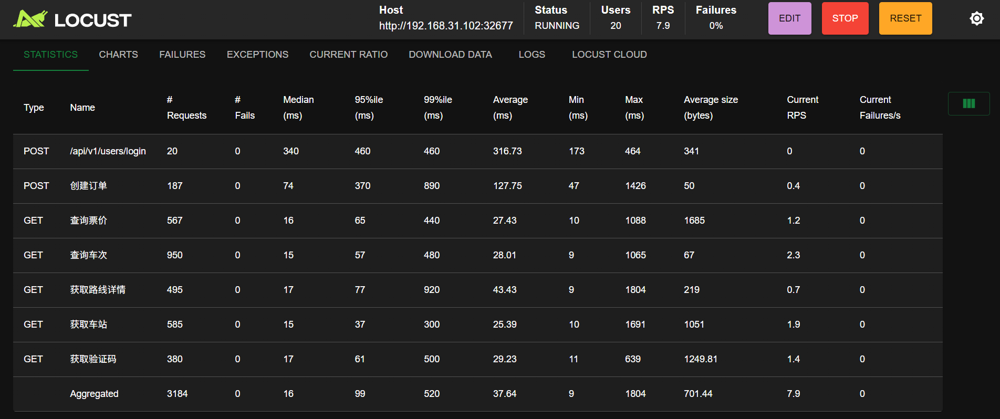

Locust是一款开源的HTTP及其他协议**性能/负载测试工具**。其设计理念对开发者极为友好，允许使用常规Python代码编写测试脚本。测试任务既可通过命令行启动，亦可在其网页界面中执行。吞吐量、响应时间和错误率等指标均可实时查看，亦可导出供后续分析。测试脚本中可直接导入标准Python库，配合Locust的可插拔架构设计，其扩展能力近乎无限。

## 安装

1. [Install Python](https://docs.python-guide.org/starting/installation/) (if you dont already have it)
2. Install Locust

```bash
$ pip3 install locust
```

1. Validate your installation

```bash
$ locust -V
locust 2.37.12 from /usr/local/lib/python3.12/site-packages/locust (Python 3.12.5)
```

## 应用 locust 测试 trainticket 系统

在trainticket基准系统中，常见的用户行为包括：

1. 用户注册、登录（ts-auth-service, ts-user-service）

2. 查询车次、站点、路线（ts-basic-service, ts-route-service, ts-train-service, ts-station-service）

3. 预订车票（ts-preserve-service, ts-order-service, ts-seat-service等）

4. 支付（ts-payment-service, ts-inside-payment-service）

5. 订单管理（查看订单、退票等）（ts-order-service, ts-cancel-service）

6. 其他服务如食物订单、通知等（ts-food-service, ts-notification-service等）

为了覆盖主要的用户操作（登录、查询、下单、支付等），根据[Service Guide and API Reference](https://github.com/FudanSELab/train-ticket/wiki/Service-Guide-and-API-Reference)编写以下Locust负载压力测试脚本，生成对应的系统运行监控数据。

`locustfile.py`文件：

```py
from locust import HttpUser, task, between
import random

class TrainTicketUser(HttpUser):
    wait_time = between(1, 3)  # 用户等待时间1-3秒
    
    def on_start(self):
        """用户启动时执行，模拟登录"""
        login_response = self.client.post(
            "/api/v1/users/login",
            json={
                "username": "fdse_microservice",
                "password": "111111"
            }
        )
        if login_response.status_code == 200:
            self.token = login_response.json()["data"]["token"]
        else:
            self.token = None
    
    @task(3)  # 权重较高，更频繁执行
    def get_all_stations(self):
        """测试获取所有车站信息API"""
        headers = {"Authorization": f"Bearer {self.token}"} if self.token else {}
        self.client.get(
            "/api/v1/stationservice/stations",
            headers=headers,
            name="获取所有车站信息"
        )
    
    @task(1)  # 权重较低
    def create_order(self):
        """测试创建订单API"""
        if not self.token:
            return
            
        # 准备测试数据
        stations = ["Shang Hai", "Su Zhou", "Wu Xi", "Nan Jing"]
        from_station = random.choice(stations)
        to_station = random.choice([s for s in stations if s != from_station])
        
        headers = {
            "Authorization": f"Bearer {self.token}",
            "Content-Type": "application/json"
        }
        
        order_data = {
            "accountId": "4d2a46c7-71cb-4cf1-b5bb-b68406d9da6f",
            "contactsId": "4d2a46c7-71cb-4cf1-b5bb-b68406d9da6f",
            "tripId": "D1345",
            "seatType": "2",
            "date": "2025-07-15",
            "from": from_station,
            "to": to_station,
            "assurance": "0",
            "foodType": 0,
            "stationName": "",
            "storeName": "",
            "consigneeName": "",
            "consigneePhone": "",
            "consigneeWeight": "",
            "handlePrice": "",
            "type": 1
        }
        
        self.client.post(
            "/api/v1/orderservice/order",
            headers=headers,
            json=order_data,
            name="创建订单"
        )
```

运行命令: ``locust -f locustfile.py``

打开浏览器访问 `http://localhost:8089`



结束程序，查看测试结果：

```bash
Type     Name                                                                          # reqs      # fails |    Avg     Min     Max    Med |   req/s  failures/s
--------|----------------------------------------------------------------------------|-------|-------------|-------|-------|-------|-------|--------|-----------
POST     /api/v1/users/login                                                               20     0(0.00%) |    316     172     463    340 |    0.04        0.00
POST     创建订单                                                                             211     0(0.00%) |    121      46    1425     72 |    0.43        0.00
GET      查询票价                                                                             627     0(0.00%) |     26       9    1087     16 |    1.27        0.00
GET      查询车次                                                                            1071     0(0.00%) |     27       8    1064     15 |    2.18        0.00
GET      获取路线详情                                                                           571     0(0.00%) |     40       8    1803     17 |    1.16        0.00
GET      获取车站                                                                             642     0(0.00%) |     26       9    1691     15 |    1.31        0.00
GET      获取验证码                                                                            416     0(0.00%) |     33      11    1439     17 |    0.85        0.00
--------|----------------------------------------------------------------------------|-------|-------------|-------|-------|-------|-------|--------|-----------
         Aggregated                                                                      3558     0(0.00%) |     37       8    1803     16 |    7.23        0.00

Response time percentiles (approximated)
Type     Name                                                                                  50%    66%    75%    80%    90%    95%    98%    99%  99.9% 99.99%   100% # reqs
--------|--------------------------------------------------------------------------------|--------|------|------|------|------|------|------|------|------|------|------|------
POST     /api/v1/users/login                                                                   340    360    360    440    460    460    460    460    460    460    460     20
POST     创建订单                                                                                   72     84    120    140    200    350    600    860   1400   1400   1400    211
GET      查询票价                                                                                   16     16     16     17     25     64     97    390   1100   1100   1100    627
GET      查询车次                                                                                   15     16     16     16     23     59    180    470    950   1100   1100   1071
GET      获取路线详情                                                                                 17     18     19     19     35     71    450    810   1800   1800   1800    571
GET      获取车站                                                                                   15     16     16     16     18     42     96    300   1700   1700   1700    642
GET      获取验证码                                                                                  17     18     19     20     36     68    150    510   1400   1400   1400    416
--------|--------------------------------------------------------------------------------|--------|------|------|------|------|------|------|------|------|------|------|------
         Aggregated                                                                             16     17     18     19     61     96    270    510   1400   1800   1800   3558
```

## 测试结果分析

在 Locust 负载测试报告中，各个字段参数的含义如下：

|         **字段**         |                    **含义**                     |
| :----------------------: | :---------------------------------------------: |
|         **Type**         |       请求类型（GET/POST/PUT/DELETE 等）        |
|         **Name**         |  请求的名称（由 `name=`参数定义，或自动生成）   |
|      **# Requests**      |               该请求的总请求次数                |
|       **# Fails**        |  该请求的失败次数（HTTP 状态码 ≥ 400 或超时）   |
|     **Median (ms)**      |     响应时间的中位数（50% 的请求快于该值）      |
|     **95%ile (ms)**      |    95% 的请求响应时间 ≤ 该值（P95 性能指标）    |
|     **99%ile (ms)**      |    99% 的请求响应时间 ≤ 该值（P99 性能指标）    |
|     **Average (ms)**     | 平均响应时间（所有请求的响应时间总和 ÷ 请求数） |
|       **Min (ms)**       |         最短响应时间（最快的请求耗时）          |
|       **Max (ms)**       |         最长响应时间（最慢的请求耗时）          |
| **Average size (bytes)** |              平均响应大小（字节）               |
|     **Current RPS**      |      当前每秒请求数（Requests Per Second）      |
|  **Current Failures/s**  |               当前每秒失败请求数                |

测试结果显示所有接口成功率100%，查询类接口响应较快（中位数16-17ms），订单创建和登录接口延迟较高（中位数72-340ms），极端情况下部分请求延迟（如创建订单的Max=1425ms）较高。

极端情况下，创建订单（P99=860ms）、获取路线详情（P99=810ms）和车站信息（P99=300ms）在高百分位（如99%）响应时间显著升高，表明这些接口在高压下可能出现性能瓶颈。

