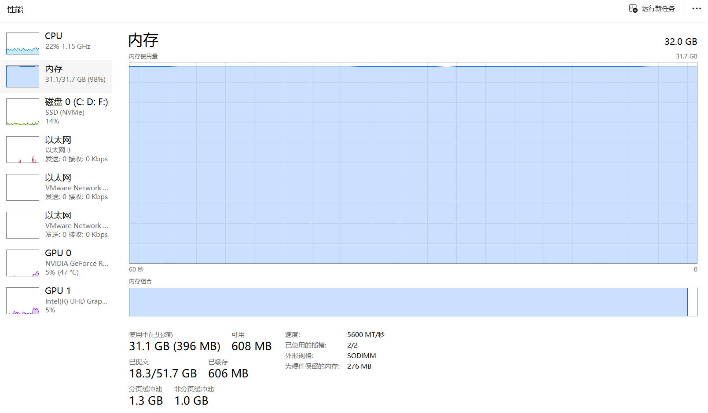
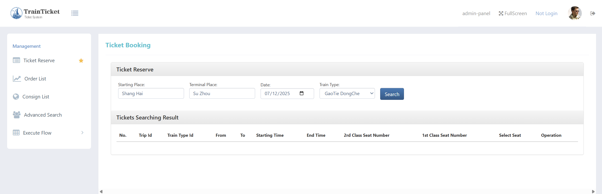

已有k8s集群规格如下：

| 主机名称    | 设备规格（内存/核数/硬盘） | ip地址            | 操作系统     | k8s集群角色 |
| ----------- | -------------------------- | ----------------- | ------------ | ----------- |
| k8s-master  | 8GB/4/40GB                 | 192.168.31.102/24 | Ubuntu 24.04 | master      |
| k8s-node-01 | 8GB/8/80GB                 | 192.168.31.101/24 | Ubuntu 24.04 | worker node |
| ubuntu      | 64GB/40/80GB               | 192.168.31.100/24 | Ubuntu 24.04 | worker node |

[TrainTicket](https://github.com/FudanSELab/train-ticket) 是复旦大学 CodeWisdom 团队按照工业界微服务实践所开发的一个开源微服务基准系统，是基于微服务架构的一个火车订票系统，包含了 **41 种微服务**。项目使用开源函数计算框架 OpenFaaS、基于 Serverless 架构提取并改造开源微服务系统 TrainTicket 中高并发的订票业务，部署并运行在 Kubernetes 集群中。

## 快速部署TrainTicket

#### **1. 安装 Helm**

```bash
# 下载并安装 Helm
wget https://get.helm.sh/helm-v3.10.3-linux-amd64.tar.gz
tar -zxvf helm-v3.10.3-linux-amd64.tar.gz
mv linux-amd64/helm /usr/local/bin/

# 验证安装
helm version
```

#### **2. 处理 Master 节点污点（Taint）**

```bash
# 检查 Master 节点污点
kubectl describe node k8s-master | grep Taint

# 移除污点（允许调度 Pod）
kubectl taint nodes k8s-master node-role.kubernetes.io/control-plane:NoSchedule-
```

#### **3. 安装 OpenEBS（提供 PVC 支持）**

```bash
# 添加 Helm 仓库并更新
helm repo add openebs https://openebs.github.io/charts
helm repo update

# 安装 OpenEBS
helm install openebs --namespace openebs openebs/openebs --create-namespace

# 验证 OpenEBS Pod 状态
kubectl get pods -n openebs -w  # 等待所有 Pod 变为 Running
```

#### **4. 设置默认 StorageClass**

```bash
# 将 openebs-hostpath 设为默认 StorageClass
kubectl patch storageclass openebs-hostpath -p '{"metadata": {"annotations":{"storageclass.kubernetes.io/is-default-class":"true"}}}'

# 验证默认 StorageClass
kubectl get sc
```

#### **5. 克隆 Train Ticket 仓库**

```bash
git clone --depth=1 https://github.com/FudanSELab/train-ticket.git
cd train-ticket
```

#### **6. 部署 Train Ticket 系统**

```bash
# 使用 Helm 部署（自动创建命名空间）
make deploy DeployArgs="--all" Namespace=train-ticket # 或手动命令：helm install train-ticket . --namespace train-ticket --create-namespace

# 监控部署状态
kubectl get pods -n train-ticket -w  # 等待所有 Pod 就绪（可能需 5-10 分钟）
```

#### 7. 卸载Train Ticket系统

```bash
helm uninstall train-ticket -n train-ticket
kubectl delete namespace train-ticket
```

# 问题1 镜像拉取失败

## 一、镜像离线导入方案（针对Containerd环境）

###  1. 在外部机器拉取镜像

```bash
# 在可联网的外部机器执行
docker pull jacksonarthurclark/train-ticket-deploy:latest
docker save -o train-ticket-deploy.tar jacksonarthurclark/train-ticket-deploy:latest
```

###  2. 导入镜像到K8s集群所有节点

```bash
# 将tar包复制到各节点（以master节点为例）
scp train-ticket-deploy.tar root@k8s-master:/root/

# 在所有节点执行导入（关键：指定k8s.io命名空间）
ctr -n=k8s.io ../assets/img/sysCapacity import train-ticket-deploy.tar
```

**验证导入成功**：

```bash
ctr -n=k8s.io ../assets/img/sysCapacity list | grep train-ticket-deploy
```

>  **注意**：必须使用`-n=k8s.io`参数，否则Kubernetes无法识别镜像

------

##  二、节点调度优化配置

### 1. 标记高内存节点

```bash
kubectl label node ubuntu mem-class=high  # 为64GB节点添加标签
```

### 2. 修改values.yaml实现定向调度

```bash
# values.yaml关键修改
namespace: train-ticket
job:
  image: jacksonarthurclark/train-ticket-deploy:latest
  imagePullPolicy: IfNotPresent  # 优先使用本地镜像

# 新增节点选择规则
nodeSelector:
  mem-class: high  # 只调度到标记节点

# 可选：资源限制（防止大内存Pod挤占资源）
resources:
  limits:
    memory: 56Gi  # 预留8GB给系统进程
```

# 问题2 nacos-0始终初始化失败

```bash
root@k8s-master:~/work/train-ticket-master# kubectl get pods -n train-ticket -w
NAME                        READY   STATUS                  RESTARTS         AGE
flagd-856fdbfb88-8zkzt      1/1     Running                 0                5h1m
nacos-0                     0/1     Init:CrashLoopBackOff   19 (4m14s ago)   76m
nacosdb-mysql-0             3/3     Running                 0                24m
nacosdb-mysql-1             3/3     Running                 0                26m
nacosdb-mysql-2             3/3     Running                 0                26m
train-ticket-deploy-8nbtq   1/1     Running                 0                5h1m
```

`nacos-0` Pod 长时间处于 `Init:CrashLoopBackOff`，init 容器 `initmysql` 日志反复报错：

```bash
ERROR 2002 (HY000): Can't connect to MySQL server on 'nacosdb-mysql-leader' (115)
nacosdb-mysql` 集群各 Pod 均处于 `role=follower`，没有任何 Pod 被标记为 `role=leader
```

`nacosdb-mysql-leader` Endpoints 为空，导致依赖该 service 的 nacos 等服务无法连接数据库

> 这个问题的原因是，MySQL StatefulSet 集群的选主机制未生效，所有 MySQL Pod 均为 follower，未有 Pod 被打上 `role=leader` 标签，导致 `nacosdb-mysql-leader` Service 无法找到后端 Endpoints，nacos 等依赖服务无法连接数据库主节点，导致启动失败。

解决办法是**手动将一个 MySQL Pod 标记为 leader**：

```bash
kubectl label pod nacosdb-mysql-0 -n train-ticket role=leader --overwrite
```

**此后 `nacosdb-mysql-leader` Service 能正确指向该 Pod，nacos-0 正常通过 init，系统恢复工作。**

# 使用 Train Ticket

首先尝试在个人电脑上部署，等待所有的pods的状态为running：

```bash
[root@k8s-master work]# kubectl get pods -n train-ticket
NAME                                            READY   STATUS    RESTARTS         AGE
flagd-856fdbfb88-vmzvb                          1/1     Running   5 (5m51s ago)    4d3h
nacos-0                                         1/1     Running   1 (3d20h ago)    4d2h
nacos-1                                         1/1     Running   1 (3d20h ago)    4d2h
nacos-2                                         1/1     Running   1 (21m ago)      4d1h
nacosdb-mysql-0                                 3/3     Running   4 (3d20h ago)    4d2h
nacosdb-mysql-1                                 3/3     Running   6 (17m ago)      4d2h
nacosdb-mysql-2                                 3/3     Running   4 (21m ago)      4d2h
rabbitmq-78677c9c5f-qqfbs                       1/1     Running   1 (3d20h ago)    4d
ts-admin-basic-info-service-d8d4b4ff9-st4fh     1/1     Running   3 (18m ago)      4d
ts-admin-order-service-787856598f-k5drl         1/1     Running   1 (3d20h ago)    4d
ts-admin-route-service-5d486755c-7vfp5          1/1     Running   2 (18m ago)      4d
ts-admin-travel-service-7d4d447494-wfkll        1/1     Running   1 (3d20h ago)    4d
ts-admin-user-service-c544d7b74-mkwps           1/1     Running   1 (3d20h ago)    4d
ts-assurance-service-569ffd759f-gpwxl           1/1     Running   1 (3d20h ago)    4d
ts-auth-service-5cd94cf4c9-5wt8k                1/1     Running   2 (18m ago)      4d
ts-avatar-service-ff8977c96-tfkhp               1/1     Running   3 (17m ago)      4d
ts-basic-service-c57455994-tvkwj                1/1     Running   1 (3d20h ago)    4d
ts-cancel-service-55b6778574-s2cvk              1/1     Running   2 (17m ago)      4d
ts-config-service-55f74d8b79-lxc8t              1/1     Running   1 (3d20h ago)    4d
ts-consign-price-service-764c676495-4xcvt       1/1     Running   1 (3d20h ago)    4d
ts-consign-service-69fdbff744-jkfb6             1/1     Running   1 (3d20h ago)    4d
ts-contacts-service-69864b9cd7-7b6zh            0/1     Running   5 (4m3s ago)     4d
ts-delivery-service-857d89f589-4b42g            1/1     Running   1 (3d20h ago)    4d
ts-execute-service-667756b4bf-kz5k8             1/1     Running   1 (3d20h ago)    4d
ts-food-delivery-service-85c449576c-rbsff       1/1     Running   1 (3d20h ago)    4d
ts-food-service-85b5445f7-csf4q                 1/1     Running   1 (3d20h ago)    4d
ts-gateway-service-8585c745cd-xl75z             1/1     Running   1 (3d20h ago)    4d
ts-inside-payment-service-7f87878d9f-w9wlq      1/1     Running   1 (3d20h ago)    4d
ts-news-service-7665fdf4c-29q4k                 1/1     Running   1 (3d20h ago)    4d
ts-notification-service-66777dd945-rgrd4        1/1     Running   1 (3d20h ago)    4d
ts-order-other-service-6666b4d4d-kg4jr          0/1     Running   5 (4m ago)       4d
ts-order-service-69885cc6c8-kb72w               1/1     Running   1 (3d20h ago)    4d
ts-payment-service-7fc4c49d89-gw4g8             1/1     Running   1 (3d20h ago)    4d
ts-preserve-other-service-5b9bbf9cf-9pct8       1/1     Running   1 (3d20h ago)    4d
ts-preserve-service-56dfc8d6d-hg2wj             1/1     Running   1 (3d20h ago)    4d
ts-price-service-55c8646c4c-j6wqd               1/1     Running   1 (3d20h ago)    4d
ts-rebook-service-79586f4dbc-5vpjm              1/1     Running   2                4d
ts-route-plan-service-6594877d59-k9cn4          1/1     Running   1 (3d20h ago)    4d
ts-route-service-6f5855dc47-75kmc               1/1     Running   1 (3d20h ago)    4d
ts-seat-service-54f7bb8465-m2xsd                1/1     Running   1 (3d20h ago)    4d
ts-security-service-7fd5f9ff9c-9k2pv            1/1     Running   1 (3d20h ago)    4d
ts-station-food-service-bbffbd779-r66ck         1/1     Running   1 (3d20h ago)    4d
ts-station-service-798774f5d-fbt9b              1/1     Running   10 (3d20h ago)   4d
ts-ticket-office-service-9979b76f9-9fd5l        1/1     Running   3 (17m ago)      4d
ts-train-food-service-f544897f-fjzkp            1/1     Running   1 (3d20h ago)    4d
ts-train-service-c7fc88877-z5bch                1/1     Running   5 (3d20h ago)    4d
ts-travel-plan-service-57865655f6-nxf86         1/1     Running   1 (3d20h ago)    4d
ts-travel-service-699599cdf5-5v2zd              1/1     Running   1 (3d20h ago)    4d
ts-travel2-service-5db558f8d9-mg2ft             1/1     Running   3 (3d20h ago)    4d
ts-ui-dashboard-7b5d44c888-7gn8m                1/1     Running   1 (3d20h ago)    4d
ts-user-service-77988d68d8-clsbz                1/1     Running   1 (3d20h ago)    4d
ts-verification-code-service-58d4c7b777-xpwfp   1/1     Running   1 (3d20h ago)    4d
ts-voucher-service-7545b4fb7c-7rnf7             1/1     Running   5 (18m ago)      4d
ts-wait-order-service-6f7f78bb5d-8f64q          0/1     Running   7 (89s ago)      4d
tsdb-mysql-0                                    3/3     Running   6 (18m ago)      4d
tsdb-mysql-1                                    3/3     Running   5 (17m ago)      4d
tsdb-mysql-2                                    3/3     Running   4 (21m ago)      4d
```

部署完整版的基准测试系统后，系统内存使用率高达98%。



借助其他服务器重新搭建：

```bash
root@k8s-master:~/work/train-ticket-fd# kubectl get pods -n train-ticket
NAME                                            READY   STATUS      RESTARTS        AGE
flagd-856fdbfb88-hdttg                          1/1     Running     0               7h7m
nacos-0                                         1/1     Running     0               7h2m
nacos-1                                         1/1     Running     0               7h2m
nacos-2                                         1/1     Running     0               7h
nacosdb-mysql-0                                 3/3     Running     1 (7h2m ago)    7h7m
nacosdb-mysql-1                                 3/3     Running     1 (7h2m ago)    7h5m
nacosdb-mysql-2                                 3/3     Running     1 (7h2m ago)    7h4m
rabbitmq-78677c9c5f-7gzdr                       1/1     Running     0               7h
train-ticket-deploy-xnxzm                       0/1     Completed   0               7h7m
ts-admin-basic-info-service-d8d4b4ff9-w4q56     1/1     Running     0               6h56m
ts-admin-order-service-787856598f-jz9fl         1/1     Running     0               6h56m
ts-admin-route-service-5d486755c-rzbv9          1/1     Running     0               6h56m
ts-admin-travel-service-7d4d447494-r7lw4        1/1     Running     0               6h56m
ts-admin-user-service-c544d7b74-fgjrl           1/1     Running     0               6h56m
ts-assurance-service-569ffd759f-7tcmc           1/1     Running     0               6h56m
ts-auth-service-5cd94cf4c9-828c8                1/1     Running     0               6h56m
ts-avatar-service-ff8977c96-42xdh               1/1     Running     0               6h56m
ts-basic-service-c57455994-qdzkd                1/1     Running     0               6h56m
ts-cancel-service-55b6778574-wlfsh              1/1     Running     0               6h56m
ts-config-service-55f74d8b79-qcg4s              1/1     Running     0               6h56m
ts-consign-price-service-764c676495-wk2ms       1/1     Running     0               6h56m
ts-consign-service-69fdbff744-mfdbc             1/1     Running     0               6h56m
ts-contacts-service-69864b9cd7-6gqs6            1/1     Running     0               6h56m
ts-delivery-service-857d89f589-tcxc9            1/1     Running     0               6h56m
ts-execute-service-667756b4bf-6kr6w             1/1     Running     0               6h56m
ts-food-delivery-service-85c449576c-s5w6g       1/1     Running     0               6h56m
ts-food-service-85b5445f7-c8bdm                 1/1     Running     0               6h56m
ts-gateway-service-8585c745cd-zvs62             1/1     Running     0               6h56m
ts-inside-payment-service-7f87878d9f-2nv4w      1/1     Running     0               6h56m
ts-news-service-7665fdf4c-krwk8                 1/1     Running     0               6h56m
ts-notification-service-66777dd945-gw2s6        1/1     Running     0               6h56m
ts-order-other-service-6666b4d4d-zbp4l          1/1     Running     0               5h39m
ts-order-service-69885cc6c8-fk88g               1/1     Running     0               6h56m
ts-payment-service-7fc4c49d89-jg6k2             1/1     Running     0               6h56m
ts-preserve-other-service-5b9bbf9cf-tqczq       1/1     Running     0               6h56m
ts-preserve-service-56dfc8d6d-qlb7x             1/1     Running     0               6h56m
ts-price-service-55c8646c4c-fzml8               1/1     Running     0               6h56m
ts-rebook-service-79586f4dbc-k7zsv              1/1     Running     0               6h56m
ts-route-plan-service-6594877d59-ql4vn          1/1     Running     0               6h56m
ts-route-service-6f5855dc47-ss7zt               1/1     Running     0               6h56m
ts-seat-service-54f7bb8465-7xz9c                1/1     Running     0               6h56m
ts-security-service-7fd5f9ff9c-55ln8            1/1     Running     0               6h56m
ts-station-food-service-bbffbd779-dwdl8         1/1     Running     0               6h56m
ts-station-service-798774f5d-27xg4              1/1     Running     0               6h56m
ts-ticket-office-service-9979b76f9-kvctv        1/1     Running     0               5m25s
ts-train-food-service-f544897f-dtrfl            1/1     Running     0               6h56m
ts-train-service-c7fc88877-2qkjb                1/1     Running     0               6h56m
ts-travel-plan-service-57865655f6-vbfrq         1/1     Running     0               6h56m
ts-travel-service-699599cdf5-zjwtn              1/1     Running     0               6h56m
ts-travel2-service-5db558f8d9-54v7x             1/1     Running     0               6h56m
ts-ui-dashboard-7b5d44c888-wvvgj                1/1     Running     0               6h56m
ts-user-service-77988d68d8-728m8                1/1     Running     0               6h56m
ts-verification-code-service-58d4c7b777-k5222   1/1     Running     0               6h56m
ts-voucher-service-7545b4fb7c-6bbbh             1/1     Running     0               6h56m
ts-wait-order-service-6f7f78bb5d-v7858          1/1     Running     0               6h56m
tsdb-mysql-0                                    3/3     Running     1 (6h57m ago)   7h
tsdb-mysql-1                                    3/3     Running     1 (6h57m ago)   6h59m
tsdb-mysql-2                                    3/3     Running     1 (6h57m ago)   6h58m
```

待所有的pods都为running后，访问train ticket页面： **http://[node-ip]:32677/**



已存在账号如下：

- User:
  `name:`fdse_microservice ，`password:`111111
- Administrator:
  `name:`admin ， `password:` 222222

系统使用说明：https://github.com/FudanSELab/train-ticket/wiki/User-Guide

微服务以及API说明：https://github.com/FudanSELab/train-ticket/wiki/Service-Guide-and-API-Reference
